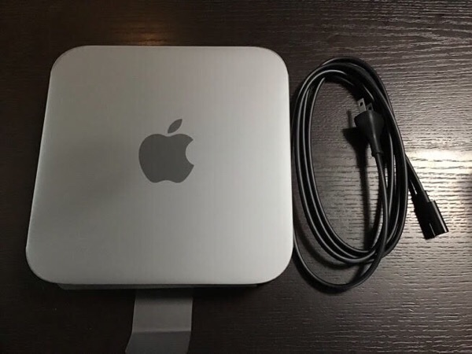
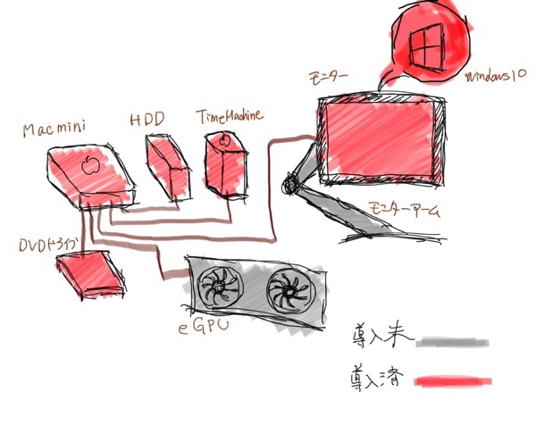

---
categories:
- Mac
date: Mon, 28 Jan 2019 23:00:00 +0000
slug: post-12389
tags:
- mac
title: Mac mini 2018レビュー。1番安いけど特別な意図なしでの購入はやめておけ
---

2010年製のiMacを手放し、PayPayで手に入れたのは最新のMac mini。わかっていたけどストレージ少ないー！が、それでもぼくはこいつを10年使うんだああああ！！！

ということで本日はMac miniのレビューです。

<!--more-->
<h2>Mac mini</h2>
Macの中で最も安価なシリーズです。本体のみで、モニターやキーボード、マウスなども付いていません。最低限の装備と機能です。

しかしながら、最新版(記事公開時点)でのスペックは中々高くカスタマイズすればプロ仕様にまで対応できるものになっています。

<h3>なんでMac miniを買ったのか</h3>
こちらに詳しく書いてますが、お金をかけたくなかったのが１つ。ゲームやるために外付けのグラフィックボードをいずれ買うかもと思って初期投資は安くしたかった。
[st-card id= 12299]

あとは利用頻度が低いのもあります。

設備投資にかけられるお金を抑えたかった。
<h3>いいところ「安い」</h3>
最近のMacはメモリ、バッテリー、モニターに金を払っているようなものです。モニターもバッテリーもないこのMacはとにかく安いのがいいところ。

MacBook Airが134800円に対して、89800円です。
<h3>わるいところ「高い」</h3>
矛盾しますが高い。なにが高いってモニターとキーボードとマウスを買い揃えると結局はMacBook Air買った方がいいよねとなります。持ち運びできるし。

あと、用途によっては絶対WindowsPCの方が安い。同じスペックならWindowsの方が圧倒的に安い。

ということで、本体は安いけど色々考えると割高となります。
<h3>こんな人におすすめ</h3>
ノートPCやiPadをメインに使ってて、iPhoneとかの同期などにしか使わない。

メインは他にあってもう一台欲しい。

お金をかけたくない。

そういう人はMac miniでよいかと思います。
<h3>こんな人は買っちゃダメ</h3>
はじめてMac買う人。
<strong>→MacBook Airにしなさい。</strong>

ゲームやりたい人。
<strong>→Windowsにしなさい。</strong>
<h2>現状の環境</h2>

ただし、以前MacBook Proが盗難されたぼくはそれ以来iPadをメインで使用しています。家でもiPadがメインです。

また、じぶんプロじゃなくて素人なんでヘビーな作業もしません。

だからスペックは最低限でいいし、モニターもマウスもキーボードも全部家にあるもので済ませました。ストレージも最低限にしたので外付けHDDもあったものをつけて終わり。

トータルで想定してたよりも安くできました。

<h3>Boot Campしてゲーム</h3>
ゲームをやるためにBoot CampしてWindowsを入れました！

全く問題なし！！普通に動く！！

がそうなると今度はゲーミング用マウスとキーボードもほしくなる。ちなみにプレステのコントローラーも接続できるらしい。
※PS4コントローラー問題なく接続できた！

<h3>レティーナディスプレイがほしい</h3>
これが問題。いつも見てるiPadやiPhoneはずっとレティーナなのでいきなり低スペックのモニターが目に入ると違和感しかない。見づらいし。

ただしレティーナのモニターとかめちゃくちゃ高いし、4kのゲーミング用モニターとかも高い。
<h2><a href="https://twitter.com/s_s_p_y">しんぺー</a>はこう思った。</h2>
ようやく色々終わった！あとはTime Machineの設定をし直して色々とやり直す作業がある。

これが終われば本当に現時点の目標達成。
ゲームはリーグオブレジェンドやりたい！METRO EXODUSやりたい(けど、プレステで買う)

ただ資金投入は一旦ストップで半年は追加投資はなし予定です！！

といったところで本日は以上になります。
おやすみなさい。

[itemlink post_id="12237"]