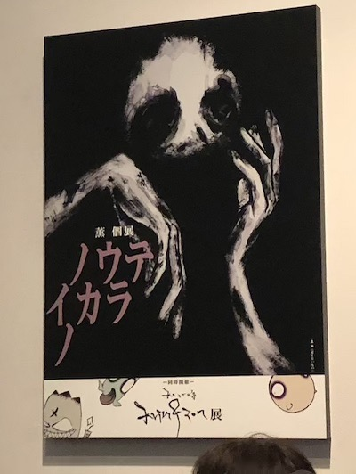
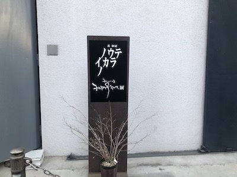
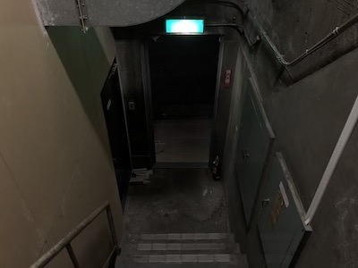
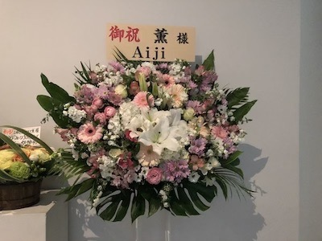
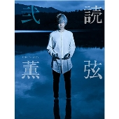

---
categories:
- 各メンバーの個人イベントレポなど
date: Sun, 03 Feb 2019 09:30:01 +0000
slug: post-12409
tags:
- DIR EN GREY
title: 【個展レポ】DIR EN GREY薫個展「ノウテイカラノ」「krim&zon展」@TEMPORARY CONTEMPORARY
---

DIR EN GREYのギターにしてリーダーの薫の初めての個展「ノウテイカラノ」と同時開催「krim&zon展」に行ってきました。多分に個人的感想を含んでいますので悪しからず。レポートというよりも感想です。

<!--more-->
<h2>ノウテイカラノ</h2>
薫が右腕を痛めた数年前から書き始めた絵などが中心となり、過去の作品や個展のために書き下ろした作品が展示されています。

<blockquote>幼少期に《暗闇に襲われる》夢をよく見たんです
その暗闇の夢は
真っ白な場所に自分が居て、遠くから現れる黒い闇に覆われた所でいつも目が覚めていた

何故そんな夢をよく見ていたのだろうか？
もしその夢に続きがあったなら？

という発想から、その暗闇に潜んでいたであろうモノをイメージして、それぞれの絵を描き始めました

自分の〝脳の奥底″からの世界を

―――――薫</blockquote>
開催場所は月島のギャラリー「TEMPORARY CONTEMPORARY」

薄暗いコンクリートむき出しの階段をあがると内部は以外と広く、そして声が響くような無機質な部屋でした。

ちなみにAiji（PIERROT/LM.C/TTT）からも華が届いていました。

整番順に中に通されました。内部構造はこんな感じ。

1時間だと全然時間が足りないということだったので、とりあえず物販に突撃しました。が、ふと横を見ると薫がすでにいて絵を描いていました。（後述）
<h2>krim&amp;zon展</h2>
こちら時間がなくじっくり見ることができませんでした。
LINEスタンプでもおなじみのkrimとzonのイラストや3D、アニメーション、少し大きめのフィギュアが展示されていました。その他に、メイキングやアニメーションのアイデアが書かれた様なノートもありました。

勝手な予想ではありますが、krim&amp;zonのキャラクターたちはメンバーや他の短な誰かなのではないでしょうか。すごい勝手な妄想ですがkrimが京でzonがToshiyaもしくは愛児では•••

羽が生えてるキャラ（名前なんだっけ）はShinya？？あと三つ編みキャラってBooちゃん？？昔あんな髪型してたよな。

あと、なんとなくですが、ノウテイカラノの方の作品のデフォルメとしてこっちのキャラがいるのかなと思いました。表裏一体で、あっちをもっとさらに記号化するとこっちの世界になるのではと感じました。
<h2>ノテイカラノ感想</h2>
※完全なる個人的感想です。メモです。

闇、神、自分それらが等価の世界、それが脳底なのかなと感じた。

とにかく時間がないからと1番奥の物販列に並びふと横を見るとすでに薫が絵を描いていた。ひたすら背中を向けて一心不乱に描くそれは、多分薫のはず。でも正直、この場でそれが薫本人かはこの個展上ではどちらでもいいのだろうと思った。

もはや記号として機能していて、その空気感をつくることがこの一角にこれから描かれる作品の役割なんだろうと思った。

作品について入り口入って左回り順で。

「最後の顔」

「奏」

「刻」

「餌食になるのは」
→サーカスのような絵だと思った。1番多くのものが描かれている絵。象

「魂と燃ゆ」

「廻り」

「消えそうな手」
→右手。ギターを弾けなくなった手なのか、その時に描いたものなのか。

「見えないもの」
→表題ともいえる例の絵。自画像なのではと解説に描かれていた。それとも神なのかとも描かれてた。多分<strong>目に見えないものを見えるように表現したのが今回の個展で、目に見えないものイコール神という記号</strong>なのかなと思った。一般的な神という概念ではなく、見えない抽象的なものを指す記号で、自分とは見える具体的なもの、闇はその中間にあるもの。

心の中のナニカが神で、曲が闇、ライブで具現化されたものが自分。そんな感じ。

「世界」
→真っ黒。買いた後に黒く塗りつぶしたのか、最初から黒く塗っただけなのか。質感のある黒。重苦しい感じ

「底にいる」
→白で表現された闇という印象。腕4本に目？

「タイトル未詳」
→なんらかの集合体？おそらく薫自身の頭の中にはすでに完成図があって、それを表現していってるんだと思うけどそれ自体がつまり闇、神、自分の体現なのではと感じました。

素人目にはそこもう塗らなくても良くない？という所にまで執拗に黒を塗りぼかす。そして全体像は外からは伺えない。きっとこのこだわりこそがDIR EN GREYの楽曲を構成する重要なものなんだろうとなんとかくすっごい納得した。

参加したのが（多分参加って言葉使いが正しい気がする）2日目だったので最終的にどうなっているのか不明。いや、あの速度で終わるのだろうか・・・

<h3>来場者の感想</h3>
<blockquote class="instagram-media" data-instgrm-captioned data-instgrm-permalink="https://www.instagram.com/p/BtSUNVFF2K-/?utm_source=ig_embed&amp;utm_medium=loading" data-instgrm-version="12" style=" background:#FFF; border:0; border-radius:3px; box-shadow:0 0 1px 0 rgba(0,0,0,0.5),0 1px 10px 0 rgba(0,0,0,0.15); margin: 1px; max-width:540px; min-width:326px; padding:0; width:99.375%; width:-webkit-calc(100% - 2px); width:calc(100% - 2px);">
 <a href="https://www.instagram.com/p/BtSUNVFF2K-/?utm_source=ig_embed&amp;utm_medium=loading" style=" background:#FFFFFF; line-height:0; padding:0 0; text-align:center; text-decoration:none; width:100%;" target="_blank" rel="noopener noreferrer"> 
 

 
 

 

<svg width="50px" height="50px" viewBox="0 0 60 60" version="1.1" xmlns="https://www.w3.org/2000/svg" xmlns:xlink="https://www.w3.org/1999/xlink"><g stroke="none" stroke-width="1" fill="none" fill-rule="evenodd"><g transform="translate(-511.000000, -20.000000)" fill="#000000"><g><path d="M556.869,30.41 C554.814,30.41 553.148,32.076 553.148,34.131 C553.148,36.186 554.814,37.852 556.869,37.852 C558.924,37.852 560.59,36.186 560.59,34.131 C560.59,32.076 558.924,30.41 556.869,30.41 M541,60.657 C535.114,60.657 530.342,55.887 530.342,50 C530.342,44.114 535.114,39.342 541,39.342 C546.887,39.342 551.658,44.114 551.658,50 C551.658,55.887 546.887,60.657 541,60.657 M541,33.886 C532.1,33.886 524.886,41.1 524.886,50 C524.886,58.899 532.1,66.113 541,66.113 C549.9,66.113 557.115,58.899 557.115,50 C557.115,41.1 549.9,33.886 541,33.886 M565.378,62.101 C565.244,65.022 564.756,66.606 564.346,67.663 C563.803,69.06 563.154,70.057 562.106,71.106 C561.058,72.155 560.06,72.803 558.662,73.347 C557.607,73.757 556.021,74.244 553.102,74.378 C549.944,74.521 548.997,74.552 541,74.552 C533.003,74.552 532.056,74.521 528.898,74.378 C525.979,74.244 524.393,73.757 523.338,73.347 C521.94,72.803 520.942,72.155 519.894,71.106 C518.846,70.057 518.197,69.06 517.654,67.663 C517.244,66.606 516.755,65.022 516.623,62.101 C516.479,58.943 516.448,57.996 516.448,50 C516.448,42.003 516.479,41.056 516.623,37.899 C516.755,34.978 517.244,33.391 517.654,32.338 C518.197,30.938 518.846,29.942 519.894,28.894 C520.942,27.846 521.94,27.196 523.338,26.654 C524.393,26.244 525.979,25.756 528.898,25.623 C532.057,25.479 533.004,25.448 541,25.448 C548.997,25.448 549.943,25.479 553.102,25.623 C556.021,25.756 557.607,26.244 558.662,26.654 C560.06,27.196 561.058,27.846 562.106,28.894 C563.154,29.942 563.803,30.938 564.346,32.338 C564.756,33.391 565.244,34.978 565.378,37.899 C565.522,41.056 565.552,42.003 565.552,50 C565.552,57.996 565.522,58.943 565.378,62.101 M570.82,37.631 C570.674,34.438 570.167,32.258 569.425,30.349 C568.659,28.377 567.633,26.702 565.965,25.035 C564.297,23.368 562.623,22.342 560.652,21.575 C558.743,20.834 556.562,20.326 553.369,20.18 C550.169,20.033 549.148,20 541,20 C532.853,20 531.831,20.033 528.631,20.18 C525.438,20.326 523.257,20.834 521.349,21.575 C519.376,22.342 517.703,23.368 516.035,25.035 C514.368,26.702 513.342,28.377 512.574,30.349 C511.834,32.258 511.326,34.438 511.181,37.631 C511.035,40.831 511,41.851 511,50 C511,58.147 511.035,59.17 511.181,62.369 C511.326,65.562 511.834,67.743 512.574,69.651 C513.342,71.625 514.368,73.296 516.035,74.965 C517.703,76.634 519.376,77.658 521.349,78.425 C523.257,79.167 525.438,79.673 528.631,79.82 C531.831,79.965 532.853,80.001 541,80.001 C549.148,80.001 550.169,79.965 553.369,79.82 C556.562,79.673 558.743,79.167 560.652,78.425 C562.623,77.658 564.297,76.634 565.965,74.965 C567.633,73.296 568.659,71.625 569.425,69.651 C570.167,67.743 570.674,65.562 570.82,62.369 C570.966,59.17 571,58.147 571,50 C571,41.851 570.966,40.831 570.82,37.631"></path></g></g></g></svg>

 
 View this post on Instagram

 

 

 

 

 

 

 

 

 

</a> 
 <a href="https://www.instagram.com/p/BtSUNVFF2K-/?utm_source=ig_embed&amp;utm_medium=loading" style=" color:#000; font-family:Arial,sans-serif; font-size:14px; font-style:normal; font-weight:normal; line-height:17px; text-decoration:none; word-wrap:break-word;" target="_blank" rel="noopener noreferrer">行ってきました、ノウテイカラノ。闇の向こうに何かが見えた……気がする。良い刺激と気分転換になりました。</a>
 
<a href="https://www.instagram.com/you_masuda.610219/?utm_source=ig_embed&amp;utm_medium=loading" style=" color:#c9c8cd; font-family:Arial,sans-serif; font-size:14px; font-style:normal; font-weight:normal; line-height:17px;" target="_blank" rel="noopener noreferrer"> 増田勇一</a>さん(@you_masuda.610219)がシェアした投稿 - <time style=" font-family:Arial,sans-serif; font-size:14px; line-height:17px;" datetime="2019-01-31T04:51:54+00:00">2019年 1月月30日午後8時51分PST</time>

</blockquote> 

<blockquote class="twitter-tweet" data-lang="ja">
今日は昼からDir en greyの薫くんの個展にTTTメンツで行ってきたよ 俺とは真逆の世界観だったな だからこそ面白かった 思ってるだけと、行動してカタチにするって大違いなんだよね 薫くん刺激をサンキュー <a href="https://t.co/Oe2nQRHAd6">pic.twitter.com/Oe2nQRHAd6</a>
&mdash; T$UYO$HI_BONEZ/PTP (@TSUYOSHI_PTP) <a href="https://twitter.com/TSUYOSHI_PTP/status/1091696512436846597?ref_src=twsrc%5Etfw">2019年2月2日</a></blockquote>

<blockquote class="twitter-tweet" data-lang="ja">
今日は薫くんの個展 「ノウテイカラノ」 を観てきた。  本業以外でも表現できる才能とパワーとバイタリティーを持ってるって本当に凄い事。  刺激を受けました。<a href="https://twitter.com/hashtag/%E3%83%8E%E3%82%A6%E3%83%86%E3%82%A4%E3%82%AB%E3%83%A9%E3%83%8E?src=hash&amp;ref_src=twsrc%5Etfw">#ノウテイカラノ</a> <a href="https://t.co/sPdaSei4W0">pic.twitter.com/sPdaSei4W0</a>
&mdash; LM.C Aiji (@Aiji_LMC) <a href="https://twitter.com/Aiji_LMC/status/1091684868373733376?ref_src=twsrc%5Etfw">2019年2月2日</a></blockquote>

ちなみにぼくが参加した回にはジョーさんもいらっしゃっていました。あと樋口さんもいました。

<h2><a href="https://twitter.com/s_s_p_y">しんぺー</a>はこう思った。</h2>
パンフレットの中身確認できなかったけど手元に置いておきたかった。

DIR EN GREYというバンドやってるんだから当然こういう世界観なんだろうけど、京しか個展での表現てしてこなかったから、目の当たりにして改めて納得した。

次回あるのであれば、もっと長い時間でもっと広い場所でもっと多くの作品を見たい。薫という人物をほんの少しだけ垣間見えた気がするけど、もっと見たい。

そう思いました。

といったところで本日は以上になります。
おやすみなさい。

<a href="//ck.jp.ap.valuecommerce.com/servlet/referral?sid=3041033&amp;pid=885617420&amp;vc_url=https%3A%2F%2Ftower.jp%2Fitem%2F4837915%2FDIR-EN-GREY%25E8%2596%25AB-%25E3%2580%258C%25E8%25AA%25AD%25E5%25BC%25A6-%25E5%25BC%2590%25E3%2580%258D%25EF%25BC%259C%25E3%2582%25BF%25E3%2583%25AF%25E3%2583%25BC%25E3%2583%25AC%25E3%2582%25B3%25E3%2583%25BC%25E3%2583%2589%25E9%2599%2590%25E5%25AE%259A%25EF%25BC%259E%3Fkid%3Dpafvc" target="_blank" rel="nofollow noopener noreferrer">価格￥2,916</a>
