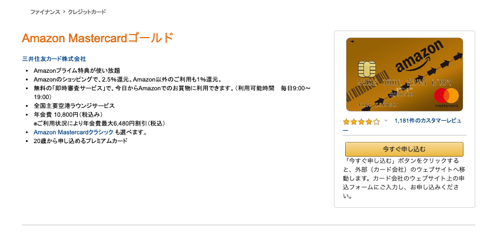
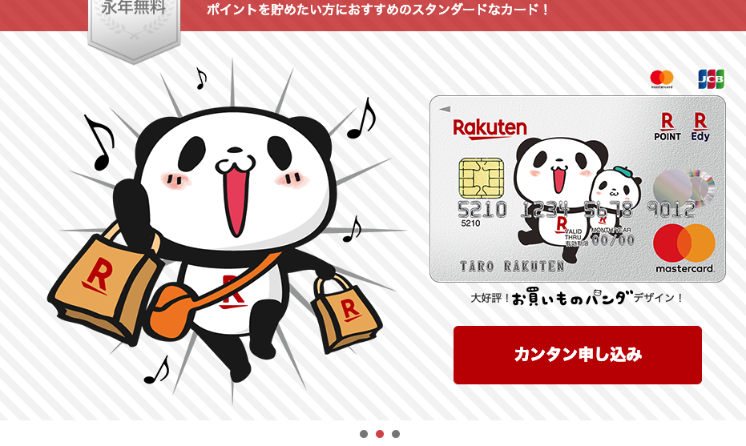
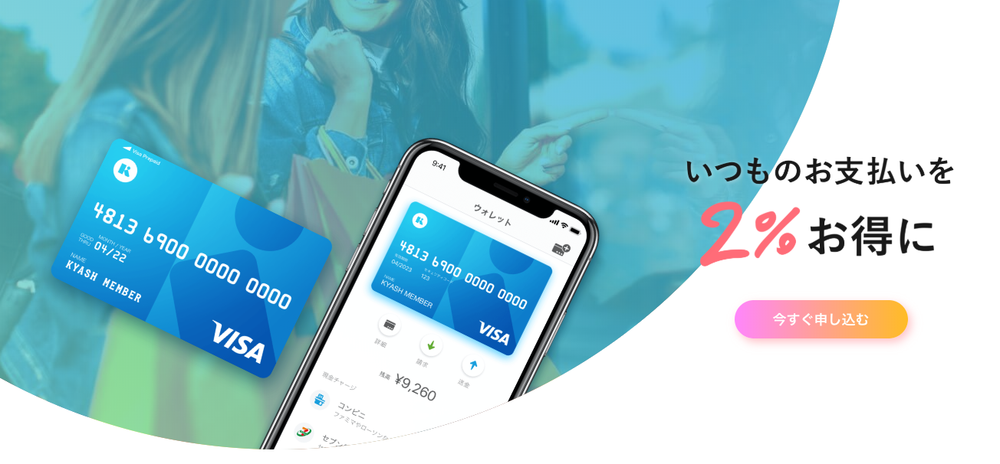
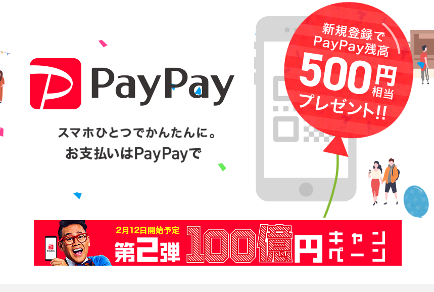
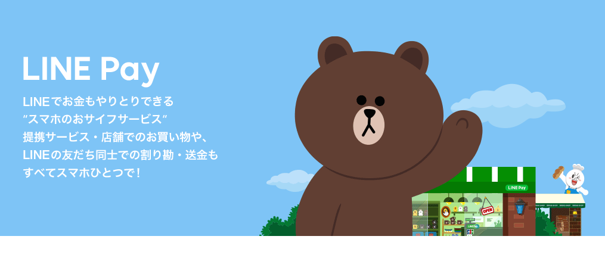
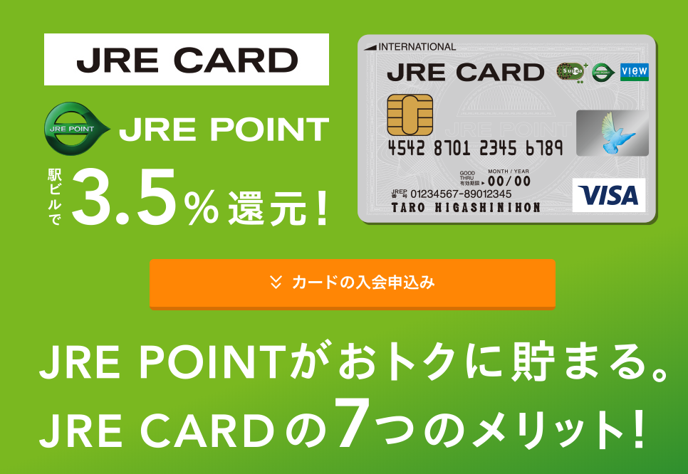
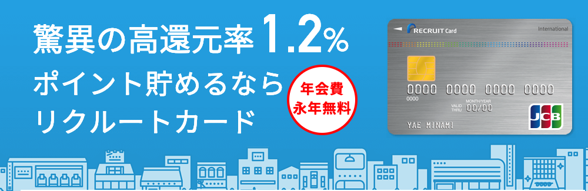

---
categories:
- ブログ
date: Sun, 10 Feb 2019 01:28:57 +0000
slug: post-12431
tags:
- クレジットカード
title: 当方初心者ですが目覚めました。1円でも得をしたいぼくが使ってるクレジットカードたち
---

1円でも得をしたいと願う様になってからクレジットカードの還元率なんかも気にするようになりました。それまでは何の気なしに楽天カードをひたすら使っていたのですが、今は色々使い分けたり経由させたりする様になりました。

本日はぼくが使ってるクレジットカードについてご紹介します。

<!--more-->
<h2>今使ってるカード</h2>
基本的に現金はあんまり使いません。最近はほとんどクレジットカードかキャッシュレス決済を使っています。手軽さもそうですが、ポイント還元と割引などを目当てにしています。手間ですがポイントカードも必ず提示するようにしています。
<h3>Amazonゴールドカード</h3>

会社の経費を立て替えする為に作りました。(ようやく経理でカード作って払ってくれることになったけど)
年会費年会費 は10,800円
還元率はAmazonのショッピングで2.5％、Amazon以外で1％還元です。

ゴールドなので年会費が割と高いですが、色々すると安くなります。リボ払いにして、明細を電子明細に切り替えると年会費が6,480円引きになります。また、プライム会員特典がついていますので、プライム会員を実質4,320円で利用できちゃうのです。

Amazonヘビーユーザーはこれを使わないとポイントの貯まりが2倍近く違ってくるわけです。

<h3>楽天スーパーカード</h3>

言わずと知れた大人気カードです。還元率もさることながら無職でも作れる審査の甘さが人気の秘密でしょうか。

年会費無料
還元率1%

どこで使ってもなんでも大体1%なので、何も感がずに使っても割と貯まります。ただし、貯まったポイントの使い所が難しい。そのまま楽天で使えばいいのですが楽天使わないって人もいると思いますので、そうなると前までサンクスで使えたのですが、ファミマと統合して消滅？しました。そのため、ぼくはリアル店舗で楽天のポイントを消費することがなくなってしましました。

で、今はどうしているかというと楽天証券で投資信託を買っています。
なんと楽天証券はポイントの現金化ができるのです。

楽天証券は楽天ポイントで投資信託が買えたり、クレカ払いができたりします。そのまま持っていてもいいですし、ある程度の額になったら売って現金化してもいいわけです。

<h3>kyash</h3>

以前ご紹介しましたが、クレカチャージができる2%還元の魔法のプリペイドカードです。クレカのポイント1%+kyashのポイント2%、さらにコンビニとかならポイントカード提示によるポイント1%が貯まるので合計4%近くが手に入ります。

ただし、色々と問題はあります。例えば、使えないところが少なからずある（プリカ不可の店舗など）ことや、問い合わせがメールのみでしかもタイムラグがあること。
また個人的に最近発生したのは登録してあるクレジットカード側が決済を拒否してるっぽくて、リアルタイムでの決済ができなくなってしまったこと。チャージの方は問題なかったので、チャージして使っていますが。

<a href="https://kyash.co/">https://kyash.co/</a>
<h3>PayPay</h3>

言わずと知れたPaypayです。100億円あげちゃうキャンペーンではぼくも恩恵にあずかりました。100億円おかわりキャンペーン中ですが、還元上限が厳しく設定されたので以前ほどの盛り上がりはありません。使わないと損から、使うなら使った方がいいよくらいに落ち着きました。コンビニではこれを利用するのがよいでしょう。

ただし銀行口座との連携をしないと20%還元がアンロックされません。クレカチャージはYahoo!カードのみ。そんなカード持ってないし！ということで作ろうか思案中です。でも作ってもPayPayチャージ用になるだろうなー

PayPay-QRコード・バーコードで支払うスマホアプリ

開発元:PayPay Corporation

無料

posted with<a title="アプリーチ" href="http://mama-hack.com/app-reach/" target="_blank" rel="nofollow noopener noreferrer">アプリーチ</a>

<h3>LINE Pay</h3>

チャージについては、今のところコンビニや銀行でできますがkyashと違ってクレカチャージができないので還元率はあんまりよくありません。しかも前月の利用金額に合わせて変動するポイント姓になっていて、ほとんど使わないと1番下位ランクの0.5%になります。

多分ふつうの人は使ってないのでは？

ぼくはLINEスタンプの売上をLINE Payにチャージして受け取っています。が、それが貯まって何かに使えるまではずっと眠らせています。この前ようやくLINEデリマでピザが注文できるくらいになったので、使いました。

なお、2019年中にVISAブランドでクレジットカードを発行するらしいです。還元率は3%で、そうなるとかなり期待できるようになるのではないでしょうか。たぶんLINE Payへのクレカチャージはこのカードからしかできないという縛りになりそうだし、kyashの代替としてもこの組み合わせが使えそうな気がします。

しかもPaypasy対抗で20%還元キャンペーンなどもやっているので、もしかしたら化ける可能性があります。
<h2>気になるカード</h2>
多分クレカ上級者から見たら、上記のカードよりもお得なカードいくらでもあるぜっという感じだと思います。ぼく自身もまだまだ取りこぼしているポイントがあると思っています。
今気になっているカードはこんなところです。
<h3>LINEクレジットカード</h3>
上述の通り。

化ける可能性が大。楽しみなカードです。

LINE Payが使いにくい要因の一つがポイントプログラムのランクわけです。クレカのリリースに備えてt今からランクがあがるような運用をしておいてもいいかもしれません。
チャージ3%＋還元率MAXの2%まで行けたら5%という最強カードのできあがりだし、さらにキャンペーンで20%還元とかやってたらもっとすごいことになるわけです。
LINE Payを育てておいて損はなさそうです。
<h3>JREカード</h3>

JRの駅でポイントが貯まるカードです。還元率は3.5％らしい。
Suicaへのチャージで1.5%

これわかっているけど完全にスルーしてます。モバイルSuicaへのオートチャージもできます。
定期購入時のポイントもほかのカードよりも貯まります。

スルーするわけにはいかない気がします。

<a href="https://www.jreast.co.jp/card/first/jrecard.html">https://www.jreast.co.jp/card/first/jrecard.html</a>
<h3>リクルートカード</h3>

これも以前から気になっていたカードです。1.2%還元で、貯まったポイントはPointaポイントに交換ができます。
kyashに連携するのに今のところもっとも良さそうなカードではあります。

が、これまたなんとなく作ってません。まーLINEクレジットカードができれば明らかに見劣りするものになる気がします。
ただ、現時点でじゃらんやらホットペッパービューティーやらだと還元率があがるようなので、使い方によってはかなりお得な気がします。

<a href="https://recruit-card.jp/">https://recruit-card.jp/</a>
<h2><a href="https://twitter.com/s_s_p_y">しんぺー</a>はこう思った。</h2>
ざっと調べただけでも、身の回りにお得は落ちてる！拾わないと損だわ！

前まではそんな1円2円相当を考える方がテマ＝コストと思っていました。でも、そんなことはない。1000円買い物して10円返ってくる、10000円買い物して100円返ってくる。これって結構大きいよなと考えると拾わないのは損というかアホなのでは自分と考え方が変わりました。

これからも、1円2円を拾うべく精進したいと思います。

といったところで本日は以上です。
おやすみなさい。