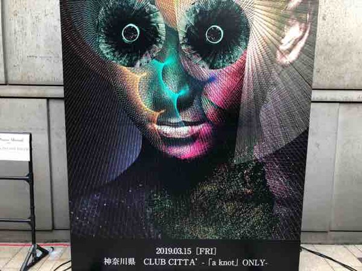
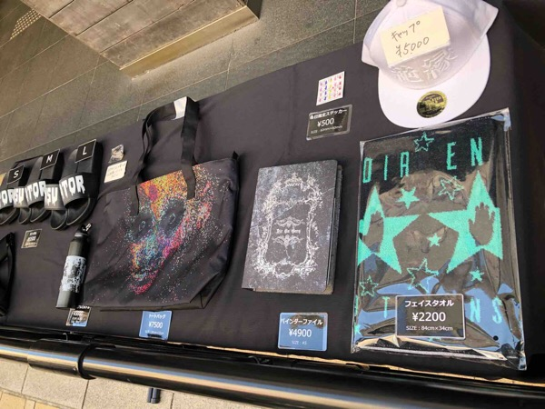
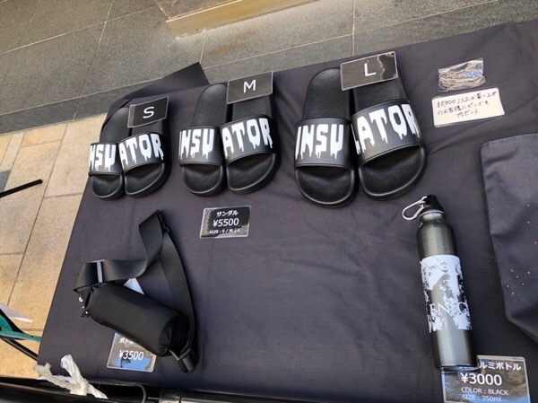

---
categories:
- DIR EN GREYのLIVEレポ
- TOUR19 The Insulated World
date: Fri, 15 Mar 2019 18:04:46 +0000
slug: post-12491
tags:
- DIR EN GREY
- LIVEレポ
title: 【ライブレポ】DIR EN GREY TOUR19 The Insulated World -「a knot」only-2019_3_15@CLUB
  CITTA’
---

ぼくにとって今年初めてのDIR EN GREYでした。そしてとてつもなく素晴らしいライブでした。個人的には悟ることがとても多く、参戦前あと後で世界を見る目がまた新たに変わりました。今回参加できた全てにありがとうございますという感じです。それでは「The Insulated World」ツアーの初日のライブレポです。

<!--more-->
<h2>TOUR19 The Insulated World</h2>

喜怒哀楽の感情すべてを辿って行き着いた先、それが絶縁世界なのだと思った。誰の為に生きるのか、誰のルールで生きるのか、何が正しいかそんなことも関係なく、自分は自分のために生きる。そう提唱されるその状態こそが人間として独立した個の状態なんだと思う。

そして、そこに辿り着くことはあらゆる痛みを伴い、容易には到達できない。そういうものだと思います。
<h3>物販</h3>
この日限定のカワイイイラストTシャツは無事ゲットできました。あれって誰が描いたやつでしたっけ。薫？？

<h3>メンバー衣装</h3>
記憶が曖昧というかは情報量が少なかった。要は見えなかった！

薫は、ジャケットなのか眺めのコート的なものなのかわからなかったけど、編み込んであるようなデザインのものを着ていました。片方の胸はバッチの様なものがいくつか付いていて装飾されていました。髪の毛は黒というか痛んだ感じの風合いでリチリチのパーマでした。ヒゲも若干生えていたかも。

Toshiyaはひらひらした軽そうな素材の長いものをきていました。途中で脱いでたかもですがあまり見えず。

京はBar Boo出演時と同じ様なグレーのスーツ。髪型も金髪ツーブロック。ヒゲも生えてて、この時とほぼ一緒。タバコも吸っておりました。
<blockquote class="twitter-tweet" data-lang="ja">

barBoo!
俺はメディア出て喋るのとか苦手なんで生出演とか全て断ってきてるんですが、
大好きな京くん(DIR EN GREY.sukekiyo)と
呑みトーク出来て超楽しかった！しかも京くん超意外にも鍋二郎しちゃうくらいのラーメン二郎好きだった。この人好き！というアンテナ間違いじゃなかった！byりょっぽー <a href="https://t.co/4adasDZ3rC">pic.twitter.com/4adasDZ3rC</a>

— ミミカジル (@mth_33cjl) <a href="https://twitter.com/mth_33cjl/status/1098610374713196544?ref_src=twsrc%5Etfw">2019年2月21日</a></blockquote>

Shinyaは見えず。
Dieも同じく。
<h3>ステージ演出</h3>
三面鏡の様なLEDモニターが3枚並んでいました。両サイドは角度がついており、そこに歌詩が表示されることもありました。

また、映像への歌詩の入れ方もだいぶかっこよく、違和感がなくて良いかと！数年前のUn duexのカラオケ字幕は本当・・・。今はかなりよい！
<h3>セトリ</h3>
赫
Downfall
Ash
Rubbish Heap
人間を被る
Revelation of Mankind
Followers
Ranunculus
DOZING GREEN
谿壑の欲
Celebrate Empty Howls
軽蔑と始まり
Devote My Life
獣慾
詩踏み

EN1
THE PLEDGE(アコースティックver)

EN2
undecided
鬼眼
Values of Madness
THE DEEPER VILENESS
冷血なりせば

本編終わりにはけるのがめちゃく早かったので告知くる？もしかして武道館？それか大阪城ホール？とか思ったけど違ってたわ。薫が追加があるーとか言ってたので勘ぐってしまった。

で、アンコール一発目でギター隊と京のみがでてきて、まさかのアコースティック
椅子が２つ据えられて、薫がアコギを構えるとちょっとした悲鳴が。

いや、なんというかセクシーすぎませんか？なお薫はストライプのシャツを着ていてかなり爽やかでした。
<h3>ライブレポ</h3>
感想としてはとてつもなく楽しく素晴らしいライブでした。さすがファンクラブ「a knot」限定のライブということもあり一体感のある特別な感じでした。

すでに書きましたが、アコースティックでの演奏もありました。が、前奏おわったくらいで薫がそでを見ながら下手方面を指差して「あかんわ」みたいな反応。途中で弾くのやめて席を立ったのでギョッとしました。

にも関わらず京は歌ったまんま。Dieも途中までいたのは確認した。
そのまま最後まで歌いきって再びはけていきました。

そして、困ったのはここからです。沈黙が続く我々。これはアンコールもっかいやっちゃっていいんすか？？そして誰かがアンコールを開始し、全体的に少し笑いが起こりつつアンコール再開。

メンバーが全員出てくると京から「機材トラブルがあったので、もう一曲やります。」今度は全員でアコースティックバージョンでundecided
Toshiya見えなかったけど、ウッドベース？だった？

終わるといつも通りのアンコールでした。
<h2>追加公演</h2>
広島CLUB QUATTROにて4月11日に「a knot」&amp; ONLINE onlyでのライブが発表されました。キャパシティは700人ということですが、いきなり決まった地方公演。しかも次の日もライブだから参戦される予定だった方々は今から宿と足の変更が大変そう。

あと、ゼメキスカフェも大阪開催が決まったらしい。薫個展も大阪開催なのでライブ以外も東京以外での開催が徐々に定例化されるようになってくるかもですな。
<h2><a href="https://twitter.com/s_s_p_y">しんぺー</a>はこう思った。</h2>
とてもつもない悟りがあったんですが、それはまた別のネタとして近日中に公開いたします。
次回の参戦予定は4月の新木場です。次のツアーでは遠征したいけど今回は東京まわりのみ！いや本当はZeppも行きたかったんだが！
とにかく、新年一発目のDIR EN GREYはとても素晴らしかったです！！！

と言ったところで本日は以上です。
おやすみなさい。

<iframe style="width: 100%; max-width: 660px; overflow: hidden; background: transparent;" src="https://embed.music.apple.com/jp/album/the-insulated-world-radio-edit-ver/1436680435" height="450" frameborder="0" sandbox="allow-forms allow-popups allow-same-origin allow-scripts allow-storage-access-by-user-activation allow-top-navigation-by-user-activation"></iframe>

[itemlink post_id="12239"]