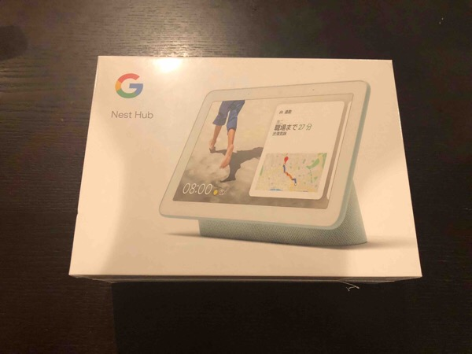
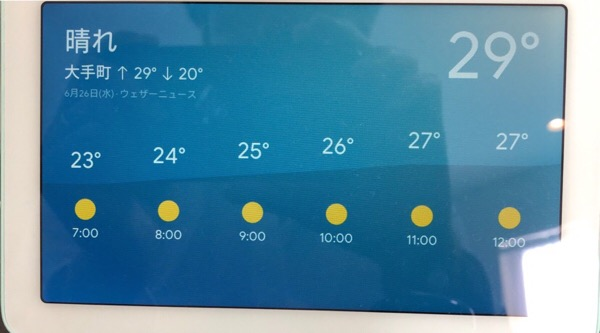
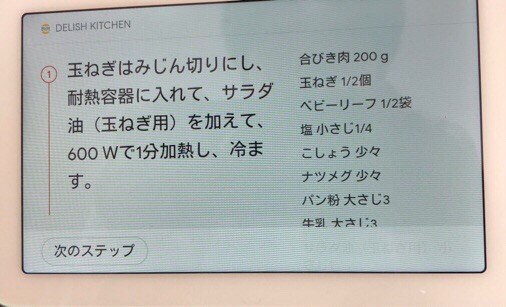
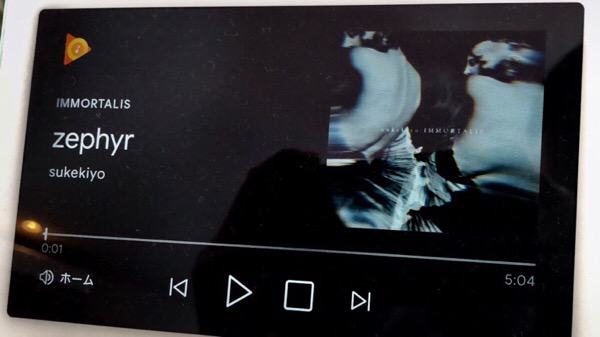
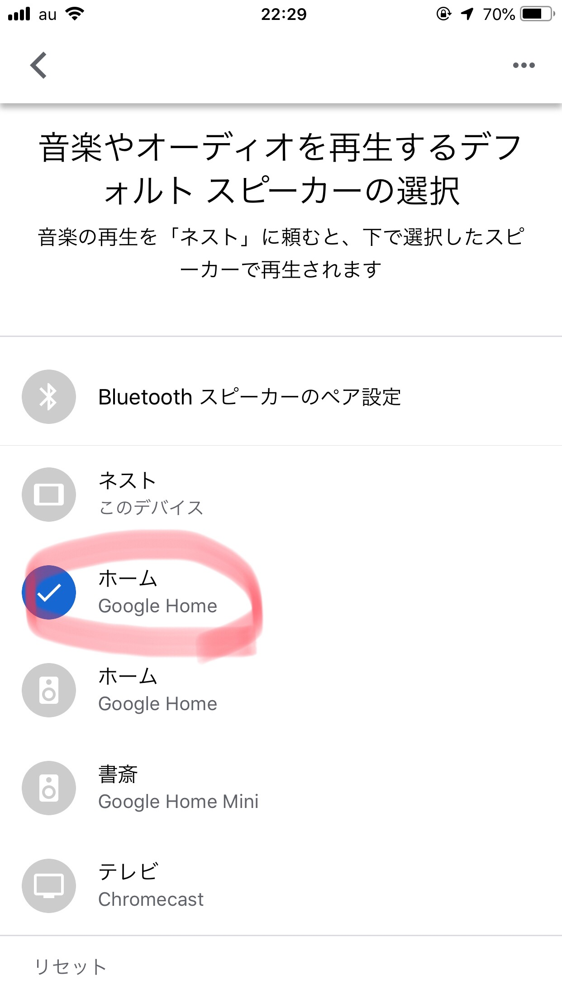
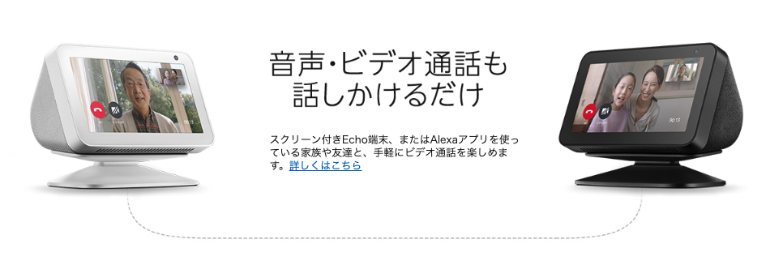
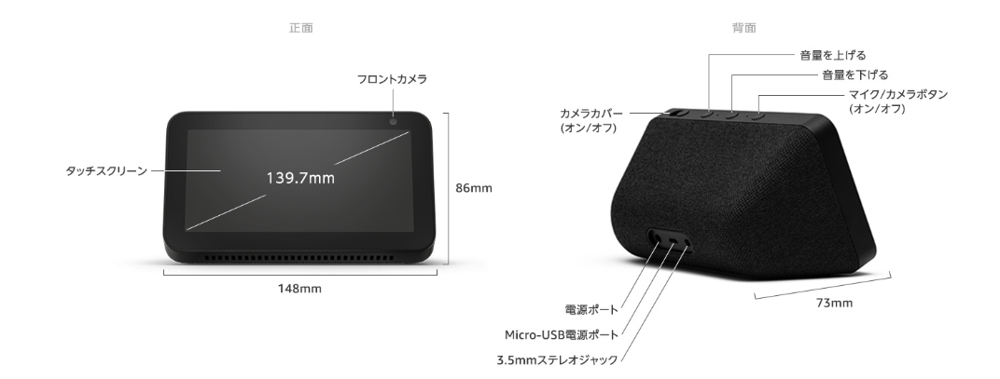

---
categories:
- レビュー
date: Sat, 15 Jun 2019 12:05:00 +0000
slug: post-12585
tags:
- google
- Google Home
- Google nest hub
title: 【レビュー】Google Nest Hubは買うまでもないけど面白いガジェットです
---

<h2>Google Nest Hubとは</h2>
[caption id="" align="aligncenter" width="659"] Google Nest Hub[/caption]

Googleアシスタントを搭載したスマートディスプレイです。

Googleアシスタントとは「OK Google」と呼びかけることで起動し、その後に指示をすることで様々な挙動をしてくれます。例えば、「OK Google 今日の天気は？」と聞くと天気予報を教えてくれたりします。そのほかにも、今日のニュースや近くの飲食店の情報など様々な情報を教えてくれます。

それ以外にもスマート家電の操作や、自分のGoogleアカウントと同期してスケジュールの登録やアラームのセットなども行うことができます。

日本では今までスマートスピーカーと呼ばれるGoogleアシスタント搭載のモデルしか販売されていませんでしたが、この度ディスプレイモデルが発売されました。

それがGoogle Nest Hubです。なおセットアップにはスマートフォンのアプリが必要となっています。
<h3>Google Nest Hubでできること</h3>
Googleアシスタントを使って様々な質問に答えてくれます。

「今日の天気は？」

「◯◯を英語で言うと？」

「クジラの鳴き声」

などです。

ただし、このあたりの音声による案内はGoogle Homeでもできました。しかし、Nest Hubはディスプレイがついていますので、画面を使った案内もすることができます。

天気については、その日の時間経過で予報を教えてくれます。

レシピについては作り方もアシストしてくれます。

音楽の再生はタイトルを表示してくれます。

Youtubeにいたっては、画面で再生もしてくれます。
スマホからのキャストにも対応してます。

<h3>Google Nest Hubで家電操作をする方法</h3>
Google Nest Hub単独で家電を操作するには、対応の家電でなければ動きません。
例えばwifiにつながるライトやルンバなど。

&nbsp;

対応している家電以外を操作しようとするとこういったガジェットが必要になります。ぼくが使っているのはehomeというガジェットです。赤外線リモコンを登録することで、リモートで家電を操作できるようになります。これをGoogle Homeアプリにセットすることで、音声操作が可能となるのです。

我が家ではエアコン、換気扇を接続していて音声で操作することができます。
特にエアコンの温度操作を声でできるようになったのはとても便利です。

[itemlink post_id="12593"]
<h3>Google Nest Hubはこんな人におすすめ</h3>
Google Homeを持っていない人は買ってもいいのではと思います。面白いガジェットですし。

ただし、料理のレシピを見るためとかYoutubeを見るためとかで購入するのはおすすめできません。iPadの方が見やすいですし、操作もできるのでそっちの方が便利です。

逆に自分で買うよりも、人にプレゼントするのなら良いのではないでしょうか。タダでもらっても困るものではないですし、面白がって喜んでくれると思います。
<h2>Google Homeとの併用をするために</h2>
ぼくが所有しているスマートスピーカーはGoogle Home mini、Echo dot、Google Homeで今回のGoogle Nest Hubが4つ目になります。（なんならキャンペーンでHome miniも合わせて購入すると無料というかマイナスだったので、さらにもう1台買いました。）

ということでGoogle Homeとの比較ですが、<strong>音質ならGoogle Homeが圧勝</strong>です。
<strong>音楽を聴くためならGoogle Homeを買いましょう。</strong>

ただし、どうしても並べて使いたい。併用したい。その場合の設定はこちら

「OK Google！◯◯の曲を流して」

これでNest Hubで指示を受けて、「はい、◯◯の曲をHomeで再生します。」となってGoogle Homeで流してくれます。

なお、ぼくはPlay Musicで音楽を聴くことが多いのですが、音楽を流すリクエストに対してはなぜかYoutube Musicが優先されてしまいます。そのため、しっかりと指示を出すことでPlay Musicからの選曲をしてもらいます。

「OK Google！◯◯の曲をPlay Musicで流して」
<h2>Amazonからもスマートディスプレイが出る「Echo Show5」</h2>
同じ様な価格感でAmazonからもスマートディスプレイが発売しています。その名もEcho Show5です。
こちらはAlexaを搭載しており、基本的な機能としてはNest Hubとあまりかわりありません。

ただし、電話機能がついており連絡先の人が同様の端末を持っていればテレビ電話ができるようになっています。

 

またNest Hubが定価15,120円なのに対して、9,980円とかなりお安い価格設定となっています。
そういった意味ではこちらを購入するのも選択肢としてはありなのではないでしょうか。

[itemlink post_id="12633"]
<h2><a href="https://twitter.com/s_s_p_y">しんぺー</a>はこう思った。</h2>
せっかくディスプレイが付いていますので、今後はセキュリティカメラと連動させて留守中の自宅監視や玄関外に設置して防犯機能を拡充させたりをしていきたいと思います。

また、照明なども連動させて自宅のIoT化も進めていきます。

と言ったところで本日は以上です。
おやすみなさい。

[itemlink post_id="12643"]