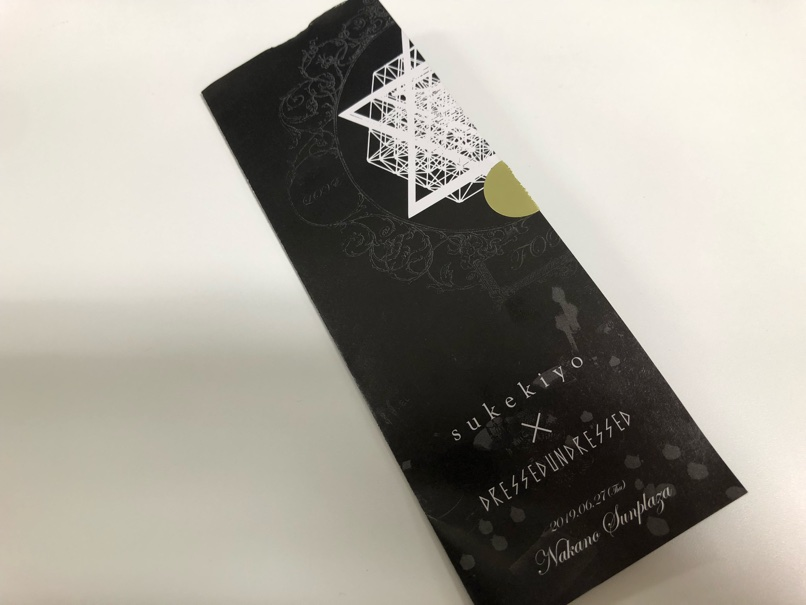
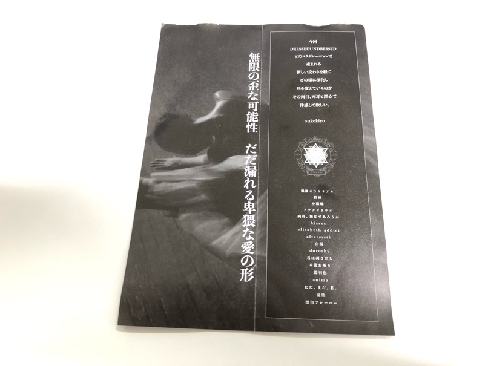

---
categories:
- sukekiyoのLIVEレポ
date: Sun, 30 Jun 2019 14:59:06 +0000
slug: post-12647
title: 【ライブレポ】sukekiyo TOUR2019 FORTY 2019_06_27＠中野サンプラザ
---

始まったのは先日、そして本日が最終日。sukekiyo最新の映像音源集「INFINITUM」の発売に伴うツアー「FORTY」のファイナルです。（上海公演もあるけど）本日はライブレポです。

<!--more--> 

<h2>ライブレポート</h2>

<h3>FORTYに込められた意味</h3>
今回のツアーFORTYはどういう意味なのか。おそらくですが京自身が区切りの年齢としていた40歳（だと思われる）のことを表しているのではないでしょうか。もはや、それは数年前のこと（だと言われていますが）。そして、今回のツアーを通してより進化していこうという気概を込めたタイトルだったのではないでしょうか。

さて、今回のツアーは中野サンプラザ以外のライブハウス公演と、中野サンプラザのホール公演に分かれています。
中野サンプラザでの演出はホール演出となるため、映像やその他の演出がしっかりとされるようなものであることは想像できていましたが、正直ライブハウス公演でもいつもと違った進化したsukekiyoを見ることができました。なんせ京がベースを弾いてたのだから。

<h3>ライブレポ</h3>
ただ、中野サンプラザではさらに異なる楽器を駆使して、その世界観を深く表現しておりました。ぼくの席からは遠くて何をしているのかよく見えませんでした。法螺貝のような重低音が響くことだけがわかりました。のちに吹くタイプのシンセサイザーで演奏していたのではないかという情報を目にしました。おそらくこれではということです。

ロシア製の楽器で、吹くというよりも発生することで、それを電子音に変換するような仕組みのようです。SOMA laboratory PIPEというものらしいです。（間違っていなければ）

https://youtu.be/w2tcoWSsgqY

https://youtu.be/BOcIsrX38-I

それ以外では後述します映像やその他の舞台演出はアパレルブランドとのコラボで、その世界観を表現していたようです。

また、ホールならではの演出として、いつも通りの未架監督の映像がすごかったです。
紗幕とバックのスクリーンの両方に別々の映像が投影され、レイヤーを意識した空間に投影される動画はいつもながら圧巻でした。
また、他にはとくにレーザーによる光の演出もすごかった。空中に物体が彩られるかのような動きがあって、見とれました。

<h3>セトリ</h3>
https://www.instagram.com/p/BzNwt0IlelV/?utm_source=ig_web_copy_link

偶像モラトリアム
猥雑
沙羅螺
アナタヨリウエ
純朴、無垢であろうが
kisses
elisabeth addict
aftermath
白濁
dorothy
君は剥き出し
本能お断り
濡羽色
anima
ただ、まだ、私。
憂染
漂白フレーバー

<h2>Dressedundressedとのコラボについて</h2>
今回のライブはかねてより告知があった通りのアパレルブランドとのコラボレーションとしての興行でした。ただし、終わってみてどの辺がコラボだったのかがわからなかった人も多かったと思われます。かくいうぼくもその1人。
ということでその辺についても少し調べてみまして、個人的な妄想によりまとめてみたいと思います。

今回のコラボは以前より京自身が言及しており、さらに入場時に配布されたリーフレットにも印字がされておりました。さらには開園時に流れた映像にもsukekiyoとの連盟で本日の公演タイトルが映されていました。
こちらがリーフレトです。開園時に開いて見なかったのですが、セットリストが書かれていました。

<h3>Dressedundressedとは？</h3>
2009年に北澤武によって設立されたブランド。
クラシックとモダン、繊細さと大胆さ、男性らしさと女性らしさなどの、矛盾し相反する要素を融合させた破壊的でジェンダーレスなデザインを探求するコレクション。

こちらが最近のコレクションの発表の様子です。これを見ればどこがコラボだったのか一目瞭然でしょう。

https://youtu.be/uwqasxgW1hU

https://youtu.be/IWJFGV5MAic

今までもいたいけな少女が堕落していく様やSMショーやら、様々なコンセプトが散りばめられたライブがなされてきました。映像や演出を使って、本編の前後や間に挿入されてその物語が表現されてきました。

今回は、そのアイデアがブランド側の世界観という点でのコラボだったんだろうと思います。

sukekiyoのホールライブがライブというよりも観劇に近いと改めて感じました。

今後もこういった様々なコンセプトが取り入れられ、さらにそれが京自身やバンド側からの発案ではなくとも、sukekiyoの世界観とともに表現されるということになるのでしょう。

参考：<a href="https://dressedundressed.com/">https://dressedundressed.com/</a>

<h3>映像と演出</h3>
上にあげた動画の世界観と大体同じでした。

開演前から緞帳の前にはテーブルが置かれ、ろうそくのような明かりが灯されていました。（おそらく電気）
開演のブザーとともに両サイドから覆面の男性？2名が現れ、片一方は着席し、もう一方が後ろから絡みつき本編がスタート。
細かな所作があった模様ですが、遠目からは詳細確認できず。

中盤の映像では、覆面の男性2人が衣服をぬぎ、片方よりブラジャーを手渡され、装着しようとするのを、もう1人は手伝うみたいなものでした。
この辺りの倒錯的なイメージは上にあげたコレクションの動画に通じるところです。

また、最後の曲が終わると再びテーブルがステージ中央に設置され、京から順番に着席。
残り未架と匠くらいになったところで、京がスプーンか何かを持ち、待ちきれない行儀がわるい子供のような仕草をしだした。

全員揃うと再び覆面の男性2人が現れてテーブルの上で絡み合う。それに京がワインのような赤い液体を２杯分かけ、終幕。

<h2><a href="https://twitter.com/s_s_p_y">しんぺー</a>はこう思った。</h2>
今回のライブのチケットですが、実は京オンラインで先行のに当選していたにも関わらず、入金を失念しておしまい失効してしまいました。そのため、一般で購入したためか、２階の奥の方という座席でした。
全体感は見えるけど詳細は見えないようなもどかしい距離感でした。

そのためメンバー衣装やら細かな部分がごっそり見えませんでした。

次回予告は特になかったので、しばらく間があいてしまうのかもしれません。
次回のライブを待ちたいと思います。

といったところで本日は以上です。
おやすみなさい。

[itemlink post_id="12652"]