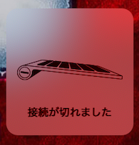
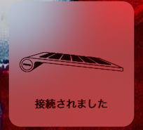
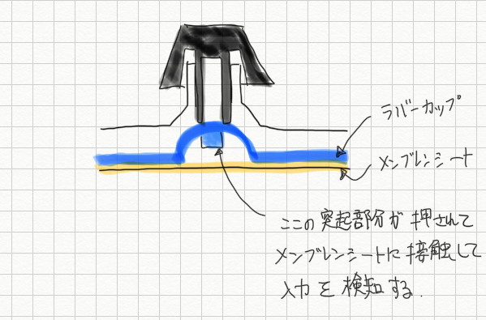
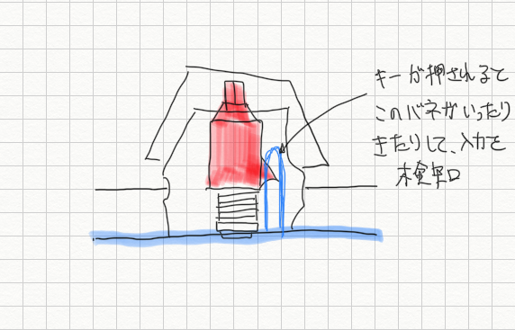
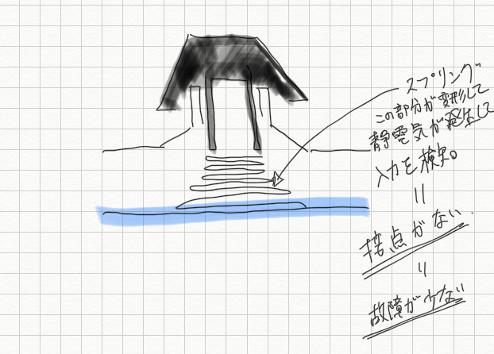

---
categories:
- レビュー
date: Fri, 05 Jul 2019 16:54:47 +0000
slug: post-12678
title: 最高のキーボード買った！東プレREALFORCE for Macレビュー
---

頭にきた。

普段使っているApple純正のMagic KeyboardのBluetoothの接続が不安定なのである。しばらくテキストを打って、ちょっと手を離す。するといつのまにかBluetoothが切れていて、入力ができなくなっているのだ。だましだましで、しばらく使っていた。高級キーボードのサイトを見にいったり、買う予定を押し殺してはYoutubeでキーボードの比較動画を見たり、メルカリで検索してみたり•••

でもついにブチ切れた。と同時にd払いの20%還元のバナーが目に付く。

もはやぼくを止めることは何もない。最寄りの家電量販店に向けて走っていた。そして、並んでいるキーボードから目当ての商品を探し。一呼吸おいて、レジに向かう。

初めて使うd払い。

これで多分20％還元されるはず。

しかし、もはやそんなことは瑣末な問題である。

ついに、ぼくは手に入れてしまったのだ。

東プレのREALFORCEを。

ということで本日は東プレのREALFORCE for Macのレビューです。

<!--more-->
<h2>代表的なキーボードの種類</h2>
今回キーボードについて色々調べていくと、様々な種類があり、それぞれ打鍵感が全くことなるということを知りました。ちらっとご紹介します。
<h3>メンブレン式キーボード</h3>
安価なキーボードの代表格がこのメンブレン式キーボードです。

キーの下にゴムのようなフィルム基盤がしかれており、そこに対してゴムキャップ、その上にキーという構造になっています。押し込むときには、そのゴムキャップがバネの様にグニャっと曲がって押し込まれるわけです。
そのため比較的静音です。
<h3>パンタグラフ式キーボード</h3>
電車の上についている電線との接触部分の金属のことをパンタグラフといいます。
キーの下にあれと同じような交差したものを採用したものがパンタグラフ式キーボードです。

強い力が不要で軽いタッチが特徴です。

こちらは旧式のMagic Keyboard。この頃はバタフライキーボードに比べればまだ打ちやすかった。

<h3>バタフライキーボード</h3>
最近のMac bookなどに採用されているクソキーボードです。ぼくも以前持っていたMac book Proもこの機構が採用されていました。ただし、本当に使いにくく、ミスが非常に多く、クソキーボードといって差し支えないものでした。

それ以外にも様々な不具合があったようで、修理プログラムが施されています。
<blockquote>
<ul>
 	<li style="list-style-type: none;">
<ol>文字が勝手に反復入力される</ol>
</li>
 	<li style="list-style-type: none;">
<ol>文字が表示されない</ol>
</li>
 	<li style="list-style-type: none;">
<ol>押したキーがスムーズに跳ね返ってこない、または、キーを押した時の反応が一定しない</ol>
</li>
</ul>
</blockquote>
<h3>メカニカルキーボード</h3>
各キーが複雑な独立した構造となっています。キータッチはマウスをクリックしているかのように、カチッカチッと音がして確かな打鍵感があります。またキーのタッチの重さにより赤軸・青軸・茶軸というように様々な種類があります。

構造はこんな感じ。それぞれのキーボードが独立したスイッチ構造になっています。

押し込まれた時にバネにスイッチが入り、入力を検知します。

確かな打鍵感がありますが、その分かなりのタイピング音が発生します。
主にゲーム操作のために、この機構を採用したキーボードが販売されていますが大抵が高価なものになっています。
<h3>静電容量無接点方式キーボード</h3>

押し込んだ際にスプリングが変形し、静電気が発生しそれにより入力を検知するという仕組みになっています。
そのため、摩擦や接触がないため故障があまりないそうです。また独特のスコンスコンという落ちるような打ち心地があります。
コンビニのATMなどのキーに使われる機構らしく、試して見たい人はお近くのコンビニまでどうぞ。
<h2>ぼくが求める機能</h2>
メインの用途はテキスト打ちです。つまり、このブログの執筆に主に使います。
そのためには、<strong>確かな打鍵感</strong>と<strong>素早く打てること</strong>というのが必要な機能になります。

このへんを求めて、Youtubeで動画を漁り、そして実際に秋葉原のヨドバシカメラにも行って色々と触ってきました。そこでぼくがいいなと思ったキーボードが3つあります。
<h3>HKKB</h3>
不要なキーを極力廃したシンプルですっきりとしたデザインのキーボードです。なんなら必要なキーもないため、少し慣れが必要そうなきがしました。

あと打鍵感が少しぬちゃっとしていて、個人的にはあまり好きではありませんでした。デスクの上がすっきりしそうなのは良いかなと思いました。

[itemlink post_id="12680"]
<h3>Razer</h3>
ゲーミングガジェットといえばこのメーカーというくらいに有名です。家電量販店もキーボードといえばもはやここというくらいで、メイン商品として扱っています。しかし、どれも大変高級な商品です。

ゲームをするにはRazer製品で統一したりしたらかっこいいと思いますが、若干キーの大きさが小さいのでは？という気がしました。要するにテキストを打つのはあんまり適してないのかなという印象です。

あと、人的には青軸でも赤軸でも茶軸でもとくに大きな違いは感じませんでした。
[itemlink post_id="12681"]
<h3>REALFORCE</h3>
そして、色々触ってみましたが、ここが一番よかったです。確かな打鍵感もあり、それでいて素早く打つことができます。
詳細は下に書きます。
[itemlink post_id="12682"]
<h2>そして、ついに購入「REALFORCE for Mac」</h2>
家をでて家電量販店に走り、売り場で少し触ってからレジへ。その後ソッコーで帰宅。30分もかかってない。

こいつが伝説の高級キーボード！リアルフォースだぁぁあ！

うらがわ

なかを開けると広がる漆黒の光

シルバー部分の素材はMac純正に比べると少し安っぽい質ですが、全く気になりません。

logicoolの無線キーボードとMagic Keyboardと並べてみました。テンキー付きなので結構でかく感じます。また高さがありますので、Logicoolと比べても重厚感があります。

裏側はこんな感じ

キーボードの厚みもこんなに違う。上のがApple純正キーボードのMagic Keyboard

今回購入したのはR2-JPVM-WHという型番です。日本語配列で、変荷重タイプです。変荷重に対して等荷重というタイプもあり、こちらは全てのキーが同じ重さになります。
ぼくが購入した変荷重はキーボード中央部分は重く、外側に行くほど小指で押しやすいように軽くなっています。高速でタイピングすることを目的にしていますので、変荷重を選びました。
慣れないうちは少し指を置いておくだけで、意図しないタイピングがされてしまっていることがありますが、ご愛嬌。そのうち慣れることでしょう。
<h3>感想</h3>
本当に最高にいいものを書いました。

ヒカキンが言ってた。仕事で使うものはその時買える一番いいものを買えと。
正直ぼくはここ1年半ほど節約モードです。ようやく人生で初めて貯金モードに入っており、毎月若干お金が残るようになってきました。

といいますのもMac Book Pro（フルスペック）が盗難にあってから、その損失を埋めようという意識が働いているからです。

今回も、数千円のキーボードを買う予定でした。しかも、メルカリで中古のものを買おうと思っていました。しかし、実際に秋葉原に試し打ちに行ってみて全然よくないってのがわかったり、なんならBluetoothが途切れ途切れだとしても、もう半年くらいは騙しだましで使うかーとか考えていました。

しかしながら、これは買って本当によかったです。

沈黙のWEBライティングという本があります。そこに出てくるキャラクターが自分専用のキーボードを使うのですが、なるほどその描写はあながち間違いではありませんでした。

本当にいいものを使うと、作業効率が本当に高くなる。というかモチベーションがあがりまくる。

文字を打っていて楽しい。本当に楽しい。

テキストを打つ人は絶対にこれを買った方がいいと思います。絶対におすすめです。

もちろん、試し打ちをしてからの判断がいいかと思いますが。人によって合う合わないや好みがありますので。

でも、ぼくはこれを買って本当に満足です。

[itemlink post_id="12682"]
<h2><a href="https://twitter.com/s_s_p_y">しんぺー</a>はこう思った。</h2>
来月のクレカの引き落とし金額を見て驚愕しました。もう今年は1万円以上するものは書いません！買えません！

もう、これで！今年は終わってもいい！！スイッチとポケモン新作を買うんだけど、そのお金の工面はどうにかする！もうそれまでは何も買わない！！

と言ったところで本日は以上です。
おやすみなさい。