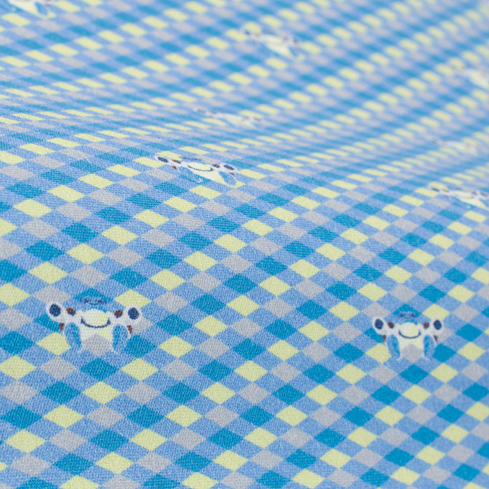
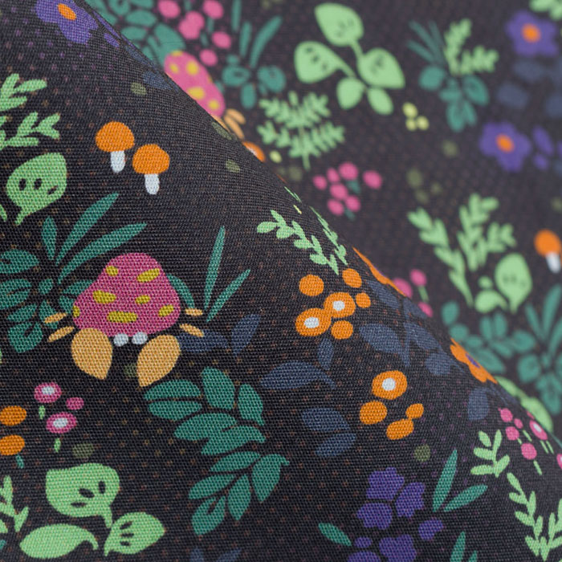
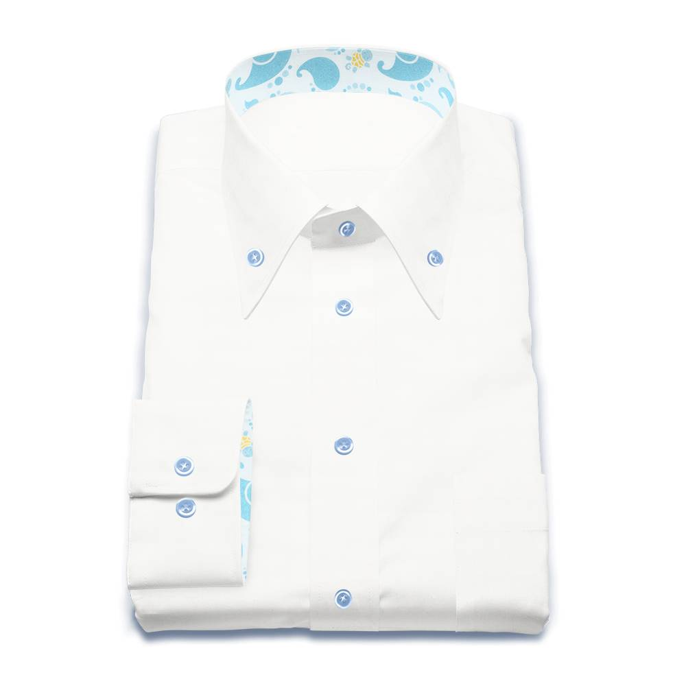
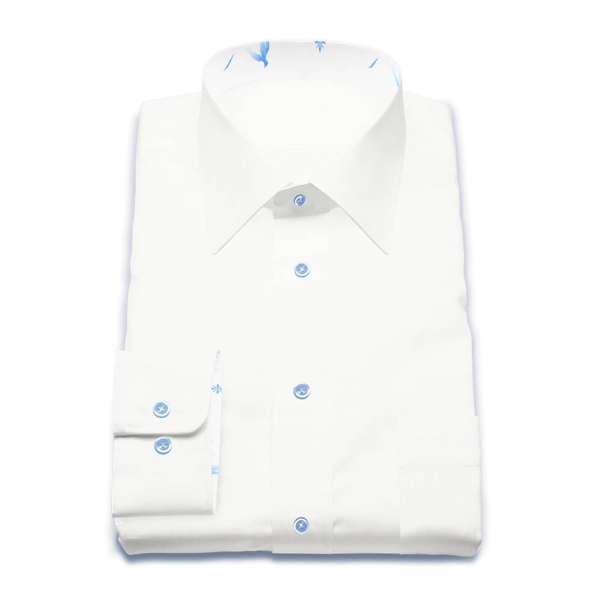

---
categories:
- ポケモン
date: Sun, 28 Jul 2019 02:44:24 +0000
slug: post-12737
tags:
- ポケモン
title: ポケモンシャツ レビュー「自分だけの組み合わせでシャツが作れる！」
---

151種類の初代ポケモンの柄からシャツを仕立ててもらえるポケモンシャツをご存知でしょうか？

ポケモンの種類に応じた柄と、さらにシャツの形も細かくカスタマイズすることができるので、自分だけのシャツを作り出せるといっても過言ではありません。
そんなポケモンシャツを注文して待つこと１ヶ月以上。ようやく到着しましたので、本日はぼくが注文したポケモンシャツをレビューしたいと思います。

<!--more-->
<h2>ポケモンシャツとは？</h2>

<a href="https://www.pokemon.co.jp/ex/shirts/">ポケモンシャツ</a>

（今の所）ポケットモンスター初代151種類の柄から生地を選んで、襟の形や柄の組み合わせを自分でカスタマイズしてシャツを作ることができます。
話題で大変人気のアイテムとなっているため、オーダーから到着まで１〜2ヶ月ほどかかるとのことです。実際ぼくも40日程度かかりました。

シャツの形は、カジュアルシャツ・ドレスシャツ・リラックスシャツの3種類から選べます。
それぞれの形状によりカスタマイズできる範囲が若干異なります。おしゃれから少し固めまで作ることができます。
https://youtu.be/F0UhOhVqZr0

なお、カスタマイズにかかわらず値段は１着1万円です。
<h3>カジュアルシャツ</h3>
カジュアルシャツはXS〜XXLからサイズを選択後に以下のカスタマイズが可能です。
<ol>
 	<li>本体の生地</li>
 	<li>襟の生地</li>
 	<li>襟の裏地</li>
 	<li>袖の生地</li>
 	<li>袖の裏地</li>
 	<li>ポケットの生地</li>
 	<li>表前立ての生地</li>
 	<li>袖＆カフス</li>
 	<li>ボタン</li>
</ol>
<h3>ドレスシャツ</h3>
ドレスシャツとほかのタイプの大きな違いは細かなサイズ指定ができることです。サイズを決めたあとに首回りのサイズ、ゆき丈なども指定できます。
フォーマルな形なので、会社に着ていくワイシャツとして作ることも可能かと思われます。
<ol>
 	<li>本体の生地</li>
 	<li>襟の生地</li>
 	<li>襟の裏地</li>
 	<li>袖の生地</li>
 	<li>袖の裏地</li>
 	<li>ポケットの生地</li>
 	<li>表前立ての生地</li>
 	<li>袖＆カフス</li>
 	<li>ボタン</li>
</ol>
<h3>リラックスシャツ</h3>
リラックスシャツですとサイズを大雑把にXS〜XXLまで選択したのちに以下がカスタマイズできます。他の形状に比べると組み合わせられる生地が少ないです。
<ol>
 	<li>本体の生地</li>
 	<li>ポケットの生地</li>
 	<li>袖＆カフス</li>
 	<li>ボタン</li>
</ol>
<h2>ポケモンシャツレビュー</h2>
黒い箱にシャツのみが入っていました。納品書などの紙などはなし。開けたらすぐにシャツが入っています。複数枚購入した際はどのように梱包されてくるのでしょうか。

[caption id="attachment_12750" align="aligncenter" width="974"] ポケモンシャツの箱[/caption]

ぼくが購入したのはこちら。リラックスシャツのゴース柄です。

sukekiyoのライブに着ていけたらいいかなーと思って暗めのものにしました。が、実際には思った以上に薄めの紫色でした。まぁ、許される範囲でしょうか•••

[caption id="attachment_12748" align="aligncenter" width="974"] ゴース柄[/caption]

生地は割と柔らかくはない、若干固め。ノリが効いてるとも言えます。洗濯したり着ていけば多分馴染むものと思われます。

171cm 68kg（多分）でMサイズでぴったりな感じです。若干そでが長いかな？という気がしますが、そこまで問題ありません。

[caption id="attachment_12746" align="aligncenter" width="974"] カジュアルシャツは首元のボタンはありません。[/caption]

シャツの素材についてですが、値段の割にシャツの質自体はそんなに高くないかなという印象です。1万円するシャツとしては、うーん？という感じです。
<h3>でも実際微妙かも、、、いや、ダサいかもしれない</h3>
また、今回はゴースの柄を選びました。ただ、正直リラックスシャツでシャツ全体が柄のもので、まともに外で着られるようなものは数種類くらいしかありませんでした。

ぼくにとってはどれも突飛なように感じましたので、なかなかこれを外で着るのはできないなと感じました。
例えばこれらの柄は、ぼくにとっては着れない部類です。

[caption id="attachment_12740" align="aligncenter" width="700"] カメックス柄[/caption]

逆にこれは着てもいいかなと思います。

[caption id="attachment_12741" align="aligncenter" width="700"] パラセクト柄[/caption]

この辺はネットで検索しまくったり、Youtubeで検索して着ている人の情報を探しました。

https://youtu.be/1Y0wd6efs9c

https://youtu.be/fNwUF7Xqh68

https://youtu.be/tW880KlFQRw

https://youtu.be/8bwTlECsjiE

サイト上で実際に組み立てたイメージを閲覧することができますので、そこでイメージを掴むのもいいかと思いますが、Youtubeなどで実際の着用イメージを確認するのが重要かなと思います。

今回なんとなくイメージがつかめましたので、改めて会社に着ていけるようなものをオーダーしようかと思っています。

１つはぼくの大好きなゼニガメです。亀が好きなので。当時は好きすぎてゼニガメ、カメール、カメックスでパーティ組んでました。育てまくったカメックスをコピーできると聞いてやった通信ケーブルを途中で外すというやつで、ドードーLv5がコピーされてしまい消滅したためポケモンを引退しましたが。カメックス柄は割と青感が強めですが、ゼニガメ柄は柄部分少なくすればまだ、でも、ちょっと袖の裏地まではやりすぎかも。。。q

[caption id="attachment_12739" align="aligncenter" width="1000"] ゼニガメ柄[/caption]

あともう１つはフリーザーです。

[caption id="attachment_12738" align="aligncenter" width="1000"] フリーザー柄[/caption]

これくらいだと多分ポケモンだってわからないだろうし、着ていてもそこまで違和感はないんじゃないでしょうか。普段ネクタイをしないので、色のアクセントにもなるでしょうし。
<h3>ここを改善してくれ</h3>
これは任天堂の発表会でも言ってましたが、納期がかかること。大変人気があるそうなので、製造がおいついてないみたいです。
注文から1ヶ月ちょっとかかるのがネックかと思いますので、その辺を是非短くしてくれたらなと思います。

あと、第２世代、第３世代と順次拡大していってほしい。個人的にはゲームをプレイしたことがあるのは第１世代までですが、例えばバンギラスとかミミッキュとかレックウザとかの柄が欲しい。
<h2><a href="https://twitter.com/s_s_p_y">しんぺー</a>はこう思った。</h2>
正直、若干賭けではありました。

好きだから買ってみたものの、現実世界では全く着れないようなものなのではという感じがしていたからです。繰り返しになりますが、多分それは柄によるかと思われます。しっかりと吟味した方がいいと思います。ぼくは、身近な人数名に「これダサくない？」「これ着てたらどう思う？」とアンケートもとって確認したくらいです。

その結果、今回選んだものに関してはまーセーフでした。普通に外に着ていくこともできるでしょう。あと、大好きなポケモンの柄が微妙だったりすると萎えますねw

でも、どれも可愛いは可愛いので一度見てみるとよいかと思います！

<a href="https://www.pokemon.co.jp/ex/shirts/">ポケモンシャツ</a>

といったところで本日は以上になります。
おやすみなさい。