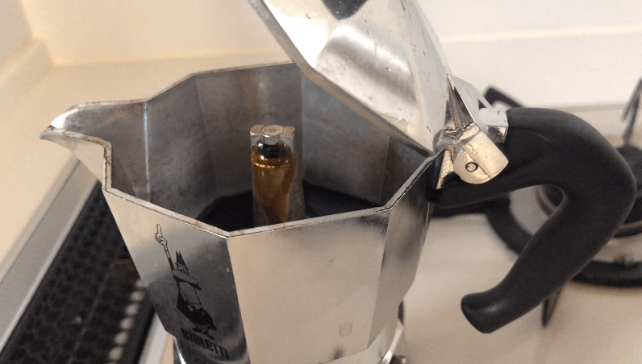

---
categories:
- ブログ
- ライフハック
date: Fri, 23 Aug 2019 03:00:52 +0000
slug: post-12775
title: ＃スタバ 店員が知らない!自宅で簡単にエスプレッソをいれる方法「マキネッタ」
---

スタバ店員が知らない家庭で簡単にエスプレッソを入れるための器具
エスプレッソ、カフェラテ、アフォガートを自宅で簡単に作ることができる器具「マキネッタ」をご存知でしょうか？日本でエスプレッソというと、エスプレッソマシンが主流です。現にスターバックスなどのコーヒーショップでも、販売されているエスプレッソメーカーといえば、蒸気の力で気圧を調節してエスプレッソを淹れる高級なエスプレッソマシンしかありません。

また、スターバックスの店員も研修などでも特に教わらないため、基本的にはエスプレッソマシン以外にエスプレッソを淹れる術を知りません。しかしながら、欧米では一家に一台は必ずあると言えるくらいにスタンダードな器具として普及しているようです。

ということで、本日はマキネッタのご紹介です。

<!--more-->
<h2>マキネッタとは</h2>
[caption id="attachment_12786" align="aligncenter" width="657"] 本体[/caption]

マキネッタとはガス台に置いて火にかけることでエスプレッソを作ることができる器具です。
聞いた話ですとアメリカやヨーロッパなどの自宅で日常的にエスプレッソを飲むような文化圏では、自宅に1台必ずあるくらいに一般的なものらしいです。

[itemlink post_id="12787"]
<h3>エスプレッソマシンは高い</h3>
ドリップコーヒーを淹れるような器具は安いものもありますし、ハンドドリップでドリッパーだけで淹れることもできます。

が、<strong>エスプレッソを作る器具はそうはいきません。</strong>

じゃあ、どうやってエスプレッソを淹れるのか？日本でも購入できるものでは電気式のエスプレッソマシンが一般的でしょう。

スターバックスなどのコーヒーチェーンでも店頭で販売していることがあります。ただ、<strong>とても高額</strong>です。最低1、2万円以上はします。
[itemlink post_id="12788"]

また、<strong>手入れが非常に面倒</strong>です。スターバックスのエスプレッソマシンを使っていたことがありますが、エスプレッソを淹れるまでが非常に手間で、さらに終わったあとの掃除も大変です。
簡単にいうとスタバのお店に置いてあるエスプレッソマシンのミニバージョンですから、飲もうとするたびにオープン作業とクローズ作業が発生する感じです。本当にめんどくさいです。

さて、そこでマキネッタです。
<h3>マキネッタの仕組み</h3>

直火式マキネッタはエスプレッソマシンと違い本体を直接ガスコンロにかけ、沸騰させた水を豆に通すことでエスプレッソを作り出します。
<h3>マキネッタの使い方</h3>
ぼくが購入したものは本体は3つのパーツで構成されています。

[caption id="attachment_12784" align="aligncenter" width="795"] 真ん中から分離できます。[/caption]

[caption id="attachment_12782" align="aligncenter" width="794"] パーツが3つ[/caption]

水を入れる底部分、豆を入れる部分、最後にエスプレッソが流れこんでくる部分です。

底部分に水を入れます。

[caption id="attachment_12783" align="aligncenter" width="799"] 底部分に水をいれる[/caption]

フィルターを設置して、豆をいれます。

[caption id="attachment_12785" align="aligncenter" width="789"] 豆をいれる[/caption]

[caption id="attachment_12781" align="aligncenter" width="783"] 直接ガスコンロにおきます[/caption]

[caption id="attachment_12780" align="aligncenter" width="796"] エスプレッソがでてきます[/caption]

3分〜4分程度で美味しいエスプレッソができあがります。

サイズも1杯分で作れる小さいものから、数杯分の大きなものまであるようです。ぼくは2杯分のものを購入しました。
<h3>マキネッタにあう豆と挽き方</h3>
電気式のエスプレッソマシンの場合ですと、限りなく細挽きの豆が使われます。
スタバでもエスプレッソは店で一番細かく挽ける細かさに挽かれています。

ただ、マキネッタの場合は必ずしもそれと同じ挽き方が良いとは限りません。
むしろ、自分で自由に淹れられるので細挽き、中挽き、粗挽きで試してみてもいいかもしません。

とりあえずぼくは中挽きくらいで飲んでいますが、美味しく飲めています。

スタバで注文する際には、ドリップ用と同じくらいで挽いてもらっています。（7〜8番くらい）

また、購入した豆はエスプレッソローストです。この豆は<strong>スタバのドリンクで使っているエスプレッソの豆なので、飲み慣れた味という感じ</strong>がします。
それ以外にイタリアンローストという豆でも試してみました。こちらはエスプレッソローストよりもさらに濃く、深煎りの豆のためさらに重いパンチの効いた味になります。正直重すぎ。
ちなみに、スタバの豆では確か一番深煎りがこのイタリアンローストだったと思います。

自分にあった挽き方や味を探すのも楽しみの１つだと思いますので、今後もいろいろ試してみようと思います。
<h2>ぼくがマキネッタで作ったエスプレッソドリンク</h2>
自宅で、簡単に、エスプレッソがいれられることで様々な恩恵があります。スタバやカフェに行かずとも美味しいドリンクが飲めるたり、エスプレッソを使ったスイーツが作れるのは非常に大きなメリットです。
<h3>カフェラテ</h3>
正直これが飲みたくてマキネッタを購入しました。夏なら冷たい牛乳にエスプレッソを淹れるだけで、カフェラテができあがります。
ホットのミルクに入れれば暖かいカフェラテができます。

ただし、カフェラテの場合ですとただのホットミルクだと味気ないので、そのうちミルクフォーマーを買おうかと思っています。これでふわふわの泡のカフェラテやカプチーノが飲めることでしょう。
<h3>エスプレッソ</h3>
本場イタリアでは、普通そのままエスプレッソを飲むような真似はしないそうです。
たっぷりと砂糖を入れて、ちびちびと飲むそうです。

また、お酒を入れたりして楽しむこともあるらしいです。（カフェ・コレット）
<h3>アフォガード</h3>
アイスにエスプレッソをかけて食べるものです。アイスの甘さとエスプレッソの苦味が混ざって美味しくなります。
スタバではもちろん置いていません。おそらくその辺のカフェでも食べられるところは少ないのではないでしょうか？身近なところでいうとタリーズで注文することができます。
タリーズはアイスも売っていますので、好きなものを選んでエスプレッソとセットで出されるらしいです。

また、話題の「たべる牧場ミルク」にかけて食べるのもよいのではないでしょうか。もしくはハーゲンダッツとか。
<h3>マキネッタの困ったところ</h3>
直火式ゆえ本体が熱くなります。ようなやかんと同じ構造です。

続けて2杯のカフェラテとかを作ろうとすると困ります。豆の排出をしないといけないのですが本体がとても熱いのでタオルとかで気をつけて取り外さないとヤケドします。

あと、自宅で手軽にエスプレッソ＝大量なカフェイン摂取できるようになってしまったので、自制がとても大変です。この前調子に乗りすぎて、1日で10杯くらい飲んだら次の日とてつもなくお腹が痛くなりました。
以来、カフェインの摂取量を記録して自制するようにしています。

[itemlink post_id="12787"]
<h2><a href="https://twitter.com/s_s_p_y">しんぺー</a>はこう思った。</h2>
本当は、電気式のマキネッタが欲しかったのですがどうも売っていないようです。
商品としては存在していますが、海外製品のため日本ではそのまま使えなさそうで、楽天もAmazonも欠品もしくはかなり高額な値段になっていました。
それを使って会社のデスクで手軽にエスプレッソを飲みたったのですが•••

ただ自宅で簡単にエスプレッソが飲めるようになったので、いわゆるQOLがかなり上がりました。そして購入から1ヶ月経っていませんが、すでに元を取るくらいには使っています。
おそらく使えば使うほど得するくらいの器具だと思います！おすすめです。

また、マキネッタの購入により次にミルクフォーマーも購入しようと思っています。これでちゃんとしたカフェラテやカプチーノが飲めることでしょう！

あと、カフェインの摂取量が劇的に増えた気がしますので、記録をとって管理するようにしました。iPhoneのショートカットというアプリで簡単に入力ができるようにして、データをヘルスケアアプリに登録するようにしています。
このあたりは、またまとめたいと思います。

といったところで本日は以上です。
おやすみなさい。