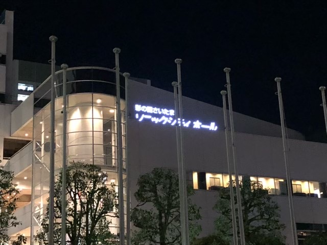

---
categories:
- DIR EN GREYのLIVEレポ
- TOUR19 This Way to Self-Destruction
date: Wed, 09 Oct 2019 16:21:14 +0000
slug: post-12877
tags:
- DIR EN GREY
- LIVEレポ
title: 【ライブレポ】DIR EN GREY TOUR19「This Way to Self-Destruction」2019_10_10@大宮ソニックシティ
---

本日も行ってまいりましたDIR EN GREY TOUR19「This Way to Self-Destruction」の大宮公演。個人的には、大宮ソニックシティは初めての会場になります。なんとなく埼玉って、さいたまスーパーアアリーナとかHEVENS ROCKのイメージがあってちょっと遠いイメージがあって小旅行くらいの感じでいつも埼玉にきていました。が、そんなこともありませんでした。あとNACK5ってのスタジオってここにあるんですね、知りませんでした。

ということで本日は大宮のライブレポです。

<!--more--> 

<h2>This Way to Self-Destruction</h2>

<h3>メンバー衣装と演出</h3>
Toshiyaは前回の装いとは若干異なり、マントというよりも全体的に布なお召し物と、女優の様なハットでした。2曲目くらいで後ろに投げ捨てていました。多分過去にも着ていた衣装だと思います。ハリーポッター感があります。

薫はいつも通りのメイド服ちっくな、ロングなジャケットというかもうドレス。

京は黒いセットアップスーツに左手だけ手袋してた？？鳥肌実の様でした。

Dieはノースリーブの黒シャツに、ボンタンの様なシルエットのたぶん赤っぽいパンツ。シルエットはボンタンぽかったけど多分布が垂れ下がってるタイプの何かかと思われる。よさこい的な。

Shinyaは白い長いもので、下に何を着てたかまで確認できず。

アンコールでは、京は袖を切り落としたツアーTシャツにいつもの黒スキニー。
Dieは、、、わすれた。
Toshiyaは多分黒いノースリーブのシャツ。
ShinyaはおそらくツアーTシャツ。
薫は休日のお父さんみたいなカッコでした。ラストはお母さん味がありました。なんか汚れてもいい格好！って感じがしました。

演出については、だいたい前回の市原市と変わりませんが、演出は違うパターンでした。前回の本編終わりに京の頭に全てが吸い込まれるあの映像で始まりで、ツアータイトルが赤文字で映し出されました。

やはり前回同様すごく恐怖を覚えました。その恐怖とは映像や曲からではなく、なんとなく会場の雰囲気に恐怖しました。オーディエンスの気迫があからさまにホールの雰囲気ではなく、なんというか殺意すら感じるような鬼気迫る気迫を感じました。

<h3>セトリ</h3>
絶縁体
人間を被る
Downfall
Devote My Life
Celebrate Empty Howls
Merciless Cult
赫
谿壑の欲
Rubbish Heap
軽蔑と始まり
Values of Madness
Ranunculus
The World of Mercy

EN.
腐海
Followers
凱歌、沈黙が眠る頃
NEW AGE CULTURE
詩踏み

アンコでToshiyaが多分曲順間違えた？followers飛ばして次の準備とおもってマイクスタンドセットしてたけど前奏始まって、「あ、ちげー」と思ったのか、さっとマイクを後ろに置き直してました。

ちなみにですが、followersの後に凱歌を久しぶりにやったんですが久しぶりすぎて戸惑いましたw
<blockquote class="twitter-tweet">
あと凱歌久しぶりすぎて何て歌うんでしたっけ？って思ったし、なんなら途中までずっとvinushkaかとおもってて人間を辞める準備してましたわ  そして今ツイート入力してて気がついたけどそれさらに別の曲だったわ
&mdash; しんぺー (@s_s_p_y) <a href="https://twitter.com/s_s_p_y/status/1181913613377789952?ref_src=twsrc%5Etfw">October 9, 2019</a></blockquote> 

<h3>ライブの感想</h3>
とにかく凄まじいライでした。楽しいとも違う、圧倒的にすごいライブでした。その理由は、ただ１つ。新曲「The World of Mercy」の世界観のせいでしょう。映像とあいまって圧倒的な何か。

あの曲から今日感じたものは、前回の市原とは違うものでした。

尊厳

今回のMercyから感じたのは尊厳。まさにその言葉を感じました。

「血を流せ」とはすなわち、戦え

お前は生きているとは、尊厳を持っている人間だと認めているということ。

だから、「己の尊厳を守るために戦え」というのを感じた。自分の怒りは尊厳であり、それを守り取り戻すためには方法が間違っていても戦わなければならない。

MVの中の女の子は自ら死を選び、それをきっかけに男の子は加害者を殺害するわけだけど、尊厳を取り戻し守るためには戦う＝殺害を選んだということなのかなと思った。そして、それはもちろん悲しい出来事であり、それ自体が哀れむべき小さな世界なんだろうと思った。

余談だけど、環境活動家のグレタさんが思い返された。方法論や色んなことを差し引いても、あの人の怒りはきっと彼女にとっては正義であり、そしてその踏みにじられた正義を取り戻し尊厳を守るために戦ってるのかなと思いました。

<h2>大宮ソニックシティ</h2>
音響はなんか市原の方がよかった？？とか思っちゃいましたがどうでしょうか。当然綺麗で大きなホールですが、二階席は高くて、実際には階段で3階〜4階くらいまであがらされました。

また、上がった分終わったあとに降りるのですが階段はそんなに広くなくて、ちょっと出るのに時間がかかりました。

<iframe src="https://www.google.com/maps/embed?pb=!1m14!1m8!1m3!1d12926.821169618079!2d139.619688!3d35.9052329!3m2!1i1024!2i768!4f13.1!3m3!1m2!1s0x0%3A0x1f5fecd47f68d7f1!2z5aSn5a6u44K944OL44OD44Kv44K344OG44Kj!5e0!3m2!1sja!2sjp!4v1570637372186!5m2!1sja!2sjp" width="600" height="450" frameborder="0" style="border:0;" allowfullscreen=""></iframe>

<h3>周辺の様子</h3>
大宮なので周辺は発展してて、時間を潰すところなんか無限にあります。
ライブ終わりでもご飯食べるところなんかいくらでもあるし。何なら周辺にホテルもある。

<h2><a href="https://twitter.com/s_s_p_y">しんぺー</a>はこう思った。</h2>

The World of Mercyがアルバムの1ピースだってことがようやく理解できました。

圧倒的なパワーすぎて、アルバムにも収まりきらなかったのかも。とにかく圧巻。

ぼくは次回は11月の新木場2daysに参戦予定です。それまで、間違わないように過去の曲も復習しておかねば。

と言ったところで本日は以上です。
おやすみなさい。

<iframe allow="autoplay *; encrypted-media *;" frameborder="0" height="450" style="width:100%;max-width:660px;overflow:hidden;background:transparent;" sandbox="allow-forms allow-popups allow-same-origin allow-scripts allow-storage-access-by-user-activation allow-top-navigation-by-user-activation" src="https://embed.music.apple.com/jp/album/the-world-of-mercy-radio-edit-ver-single/1479802753"></iframe>

[itemlink post_id="12858"]