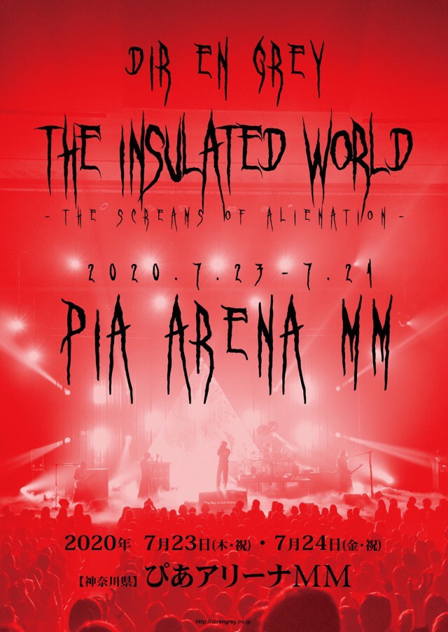

---
categories:
- DIR EN GREYのLIVEレポ
- TOUR19 This Way to Self-Destruction
date: Thu, 21 Nov 2019 17:20:00 +0000
slug: post-12948
tags:
- DIR EN GREY
- LIVEレポ
title: 【ライブレポ】DIR EN GREY TOUR19「This Way to Self-Destruction」FINAL 2019_11_20@新木場スタジオコースト
---

始まった時はまだ暑かったと思いますが寒くなってきた今日この頃、DIR EN GREYのTOUR19「This Way to Self-Destruction」もついにファイナル。セミファイナルの19日とは打って変わって、激しいながらもどの曲も歌い上げ素晴らしいライブでした。

<!--more--> 

<h2> This Way to Self-Destruction</h2>
本ツアーは2018年9月にリリースされたアルバム「The Insulated World 」以降の3本目のツアーにあたります。

TOUR18 FOLLOWERS
TOUR19 The Insulated World
TOUR19 This Way to Self-Destruction

厳密にはアルバム発売前の「TOUR18 WEARING HUMAN SKIN」も「The Insulated World 」の世界観をなす1ツアーではありました。

<h3>メンバー衣装</h3>
薫はいつものドレス
Toshiyaはアー写通り
京は燕尾服に勲章、クラウンメイク
Shinyaは上下黒に白いワンピースくらいの長さのシャツ
Dieは黒地に炎の様な赤が入ったもの

アンコでは薫、Shinya、Dieが袖切りのツアーTシャツ
Toshiyaは黒シャツ、京は目に縦線入ったクラウンメイクに上下黒

Wアンコでは京は私服で上下オーバーサイズのジーンズみたいな奴にショッキングピンクの靴下。
薫はオレンジっぽく見える花柄。もしかしてパンツはMSMLかな？

<h3>セトリ</h3>
The World of Mercy
人間を被る
Rubbish Heap
軽蔑と始まり
Celebrate Empty Howls
Merciless cult
赫
絶縁体
Downfall
Devote of my life
Values of Madness
谿壑の欲
Ranunculus

EN.
腐海
Followers
凱歌、沈黙が眠る頃
THE DEEPER VILENESS
詩踏み

EN.2
SUSTAIN THE UNTRUTH

<h3>ライブレポ</h3>
Mercy始まりで前日は感情のままに歌い散らす印象だったのに対して、全ての曲を歌い上げるかたちでいかにもファイナルっぽかった。

個人的には整理番号がかなりよく、2列目くらいにいた上に柵に押し付けられていたのでかなり色々しんどかったけど、しっかりと見尽くせたライブだった。特に冒頭でToshiyaが前方にせり出してきて、マントを翻す姿は美しすぎて圧倒された。見惚れる、見惚れる。恍惚として立ち尽くしてしまった。あと、Mercyの冒頭のベース弾かない部分では、アンプに腕をかけてもたれているToshiyaはやはり素晴らしかった。

アンコールが終わり、餌まきも終わりメンバーがはける時、薫がバックスクリーンを指さしてから去っていった。
何かしらの告知はあるだろうなとは思っていましたが、案の定次回ツアーの告知。

歓声が上がるものの、新し目の会場が多くそれはどこのことですか？という空気が会場を包みこむ。その後、今までのThe Insulated Worldツアーのタイトルと映像が映し出され、まさかとは思ったけど「The Insulated World FINAL」の文字に歓声が一層大きくなり、日本武道館！！！でどかーん！！！のはずが

ぴあホールMM

ざわざわざわざわ
おそらく、一刻も早くスマホを取り出して調べたかった人が多いはず。どこやねんそれwww
MMってなんだよw

その直後、アンコールの声が発生

Toshiyaがまーたダイヤリーで噛み合わなかったとか言いかねないし、まー延長しちゃうけどいいっすか？いいんすか？みたいな雰囲気から、アンコの声が一層大きくなったところでメンバー再登場。この短時間に京は着替えて、メイク落として生まれたての様な顔になってました。タマゴかな？薫も同じくお着替え。速い

<h2>TOUR20 疎外</h2>
「The Insulated World」最後のツアーです。と思ったけど、もしかしてファンクラブ限定の短いツアーが発生するかもね。

オリンピックに備えて、改修や建設中だった会場が満を侍してオープン。このツアーも聞いたことがない新しい会場での開催がいくつかラインナップされてます。

2020年3月27日（金）神奈川県 KT Zepp Yokohama（※「a knot」「DIR EN GREY ONLINE」会員限定ライブ）
2020年3月28日（土）神奈川県 KT Zepp Yokohama（※「a knot」「DIR EN GREY ONLINE」会員限定ライブ）
2020年4月1日（水）宮城県 SENDAI GIGS
2020年4月4日（土）北海道 カナモトホール（札幌市民ホール）
2020年4月9日（木）大阪府 なんばHatch
2020年4月10日（金）大阪府 なんばHatch
2020年4月16日（木）愛知県 Zepp Nagoya
2020年4月18日（土）静岡市民文化会館 中ホール
2020年4月22日（水）東京都 新木場STUDIO COAST
2020年4月23日（木）東京都 新木場STUDIO COAST

<h3>KT Zepp Yokohama</h3>
今はなき横浜BLITZの近くに建設される予定です。

<blockquote>
建設予定地： 神奈川県横浜市西区みなとみらい四丁目3番2
（みなとみらい線「新高島」駅徒歩2分、JR「横浜」駅徒歩10分）
敷地面積： 約8,670㎡（複合施設全体）
ホール面積： 約3,000㎡
収容人員： 約2,000名（スタンディング時）
開業時期： 2020年春(予定)

引用：<a href="https://www.zepp.co.jp/news/zepp-hall/2078/">https://www.zepp.co.jp/news/zepp-hall/2078/</a>
</blockquote>

キャパは2000人なので、他のZeppより小さめです。ちなみにKTとはゲーム会社のコーエーテクモゲームスのKTです。Zeppと業務提携してこのホールを建設しているようです。

今後のカジノ誘致などによる統合型リゾート化の一環とも言えるのでしょう。

<iframe src="https://www.google.com/maps/embed?pb=!1m18!1m12!1m3!1d3249.8409033499174!2d139.6231756152527!3d35.45873298024671!2m3!1f0!2f0!3f0!3m2!1i1024!2i768!4f13.1!3m3!1m2!1s0x60185c694f3f8c3d%3A0x7a0e04caf3e31aba!2z44CSMjIwLTAwMTIg56We5aWI5bed55yM5qiq5rWc5biC6KW_5Yy644G_44Gq44Go44G_44KJ44GE77yU5LiB55uu77yT4oiS77yS!5e0!3m2!1sja!2sjp!4v1574356556032!5m2!1sja!2sjp" width="600" height="450" frameborder="0" style="border:0;" allowfullscreen=""></iframe>

<h3>仙台GIGS</h3>
最近の仙台と言えばPITでしたがそれよりも新しく2017年にできたのがこのGIGです。

スタンディング：1,560名（1F 1,210名/2F 350名）
全着席：828席（1F 612席/2F 216席）

コインロッカー800（屋内・屋外300/屋外大500）、クロークあり

<a href="https://www.sendaigigs.com/">https://www.sendaigigs.com/</a>
<iframe src="https://www.google.com/maps/embed?pb=!1m18!1m12!1m3!1d3133.571662001987!2d140.94681391574616!3d38.24304567967691!2m3!1f0!2f0!3f0!3m2!1i1024!2i768!4f13.1!3m3!1m2!1s0x5f89883a268ad3af%3A0xe9b96b6c6cf26058!2z5LuZ5Y-w44Ku44Kw44K5IFNFTkRBSSBHSUdT!5e0!3m2!1sja!2sjp!4v1574356638121!5m2!1sja!2sjp" width="600" height="450" frameborder="0" style="border:0;" allowfullscreen=""></iframe>

<h2>THE INSULATED WORLD FINAL at ぴあホールMM</h2>
本来ならアルバムの集大成は日本武道館のはず。が、当日はオリンピックの開会式ということで使えるはずもなく。

新しくKT Zepp Yokohamaの近くにできるホールにて「The Insulated World」の完結を執り行うことになったようです。

2020年7月23日（木・祝）神奈川県 ぴあアリーナMM
2020年7月24日（金・祝）神奈川県 ぴあアリーナMM

<h3>ぴあホールMMとは？</h3>
横浜みなとみらい建設予定で、Zepp Yokohamaのすぐ近くです。
座席は10000人規模ということで、武道館と同クラスのようです。

計画地：神奈川県横浜市西区みなとみらい3-2（38街区）
客数着席時 約10,000人、立見時 約12,000人

また、施設内に飲食店も完備されるようなので割と使い勝手はよさそうな感じです。まぁ、横浜だし時間潰したりするのには困らないでしょう。

<iframe src="https://www.google.com/maps/embed?pb=!1m14!1m8!1m3!1d12999.835749686474!2d139.628191!3d35.455811!3m2!1i1024!2i768!4f13.1!3m3!1m2!1s0x60185c67d9986c7b%3A0xc5af76ce65ce6978!2z44CSMjIwLTAwMTIg56We5aWI5bed55yM5qiq5rWc5biC6KW_5Yy644G_44Gq44Go44G_44KJ44GE77yT5LiB55uu77yS!5e0!3m2!1sja!2sjp!4v1574356158423!5m2!1sja!2sjp" width="600" height="450" frameborder="0" style="border:0;" allowfullscreen=""></iframe>

ちなみに、困ったことにオリンピックの開会式に被るらしい。地方から来る方は、足もさることながら宿がめちゃくちゃ困るかもですな。

<h2><a href="https://twitter.com/s_s_p_y">しんぺー</a>はこう思った。</h2>
始まった時は暑かったのに、もう冬です。寒いです。
ツアー終わりに、また生きる理由をくれるDIR EN GREYイズ最高。
これでまたチケ代稼ぎの仕事に精を出せるわけです。頑張りましょう。

誠にお疲れ様でした！

と言ったところで本日は以上です。
おやすみなさい。

<iframe allow="autoplay *; encrypted-media *;" frameborder="0" height="450" style="width:100%;max-width:660px;overflow:hidden;background:transparent;" sandbox="allow-forms allow-popups allow-same-origin allow-scripts allow-storage-access-by-user-activation allow-top-navigation-by-user-activation" src="https://embed.music.apple.com/jp/album/the-world-of-mercy-radio-edit-ver-single/1479802753"></iframe>

[itemlink post_id="12858"]