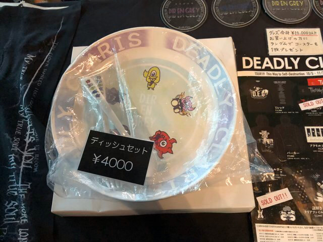

---
categories:
- DIR EN GREYのLIVEレポ
- TOUR19 This Way to Self-Destruction
date: Thu, 21 Nov 2019 10:32:00 +0000
slug: post-12957
tags:
- DIR EN GREY
- LIVEレポ
title: 【ライブレポ】DIR EN GREY TOUR19「This Way to Self-Destruction」2019_11_19@新木場スタジオコースト
---

個人的には久しぶりのスタジオコーストで、4月ぶりでした。また今回のツアーでは前回のホール公演以来で、また違った演出や感じ方が得られるであろうと期待していました。結論、激しすぎて記憶が全くない！なので覚えている、思い出せる範囲でのレポになります。

<!--more--> 

<h2>ライブレポ</h2>
<h3>衣装</h3>
薫はセットアップスーツに首には金属製のチョーカーというか首輪に近いものをしてた。

Toshiyaはスナフキン帽子にふわっとしたいつものネグリジェみたいなの

京は頭ぴっちりでクラウンメイク、袖が広がった白いシャツ。アンコでは袖なしの水玉シャツにクラウンメイク

Shinya、Dieはあまり見えず

<h3>セトリ</h3>
絶縁体
谿壑の欲
Downfall
Devote of my life
Values of Madness
軽蔑と始まり
赫
Merciless Cult
Rubbish Heap
Celebrate Empty Howls
人間を被る
Ranunculus
The World of Mercy

EN.
Hydra-666-
鬼眼
Followers
NEW AGE CULTURE
詩踏み

<h3>感想</h3>
ほとんど記憶が残ってない。けど本編最後の方に演奏されたThe World of Mercyについて

「仲間に入れて」という歌詩があるけど、被害者の男の子は加害者に対して言ってるのでは？と思った。だから加害者たちを刺殺したのではないでしょうか。加害することで他人を虐げる加害者たちの仲間にようやくなれた。緑に照らされる京の怪しい笑みにそう感じました。

この日ひたすら感情のままに激しくただ激しく叩きつけるように歌いまくってた。Ranunculusも最後はひたすら、なんでなんで生きてんだよおおおおなんでえええなんでえええとなってた。

<h2><a href="https://twitter.com/s_s_p_y">しんぺー</a>はこう思った。</h2>
この日は会社の後輩(ライブ童貞)を連れて行きました。はじめてなので色々叩き込んでやろうと前方の方に連れて行きましたw始まって早々に存在を見失ったけど、とても楽しめたようでよかったです。

ちなみに今回のツアーできちんとして物販見たのはじめてかも

と言ったところで本日は以上です。
おやすみなさい。