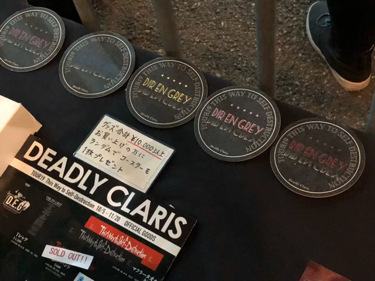

---
categories:
- DIR EN GREYのLIVEレポ
- TOUR19 The Insulated World
date: Sat, 30 Nov 2019 12:00:00 +0000
slug: post-12974
tags:
- DIR EN GREY
- LIVEレポ
title: 【DIR EN GREY】TOUR19 This way to self-destruction
---

DIR EN GREYのツアーが終わりましたので振り返りと感じたことをまとめたいと思います。

今回行われたツアーは2018年9月に発売したアルバム「The Insulated World」の一端であり、アルバムの一部と言っても過言ではないシングル「The World of Mercy」の世界観を知らしめたツアーでした。

<!--more-->
<h2>TOUR19 This way to self-destruction</h2>
3ヶ月のツアー行程は以下の通り。

9月15日 KBSホール ｰ｢a knot｣onlyｰ
9月16日 KBSホール -｢a knot｣ &amp; ONLINE only-
9月19日 Harbor Studio
9月20日 Harbor Studio
9月22日 festhalle
9月23日 festhalle
9月28日 小樽GOLDSTONE
9月29日 小樽GOLDSTONE
10月5日 市原市市民会館･大ホール-｢a knot｣only-
10月9日 大宮ソニックシティ 大ホール
10月11日 金沢市文化ホール
10月16日 Zepp Fukuoka
10月19日 沖縄ミュージックタウン音市場
10月20日 沖縄ミュージックタウン音市場
10月27日 盛岡市民文化ホール
11月5日 なんばHatch
11月6日 なんばHatch
11月13日 Zepp Nagoya
11月15日 NTNシティホール（桑名市民会館）
11月19日 新木場STUDIO COAST
11月20日 新木場STUDIO COAST

9月から始まり、その時はまだ暑く、3ヶ月が経ち終わる頃には寒くなりました。また、今年は大きな台風による被害も各地で起こりました。台風被害によりゴルフ場の鉄塔が倒れて被害をだした市原市でもライブがありましたが、そういった意味で何だか長く感じたツアーでした。
<h3>ツアーグッズ</h3>
今回ツアーグッズ何も買ってない…
前半と後半で販売されているものが違っていましたが、どちらも買ってません。
お皿と謎解きのは欲しかったけど結局買いませんでした。普段着でも着ているツアーTシャツが全部くたびれてきたので、そろそろいい感じのを出してもらわないと着るのなくなるのでお願いします！

<h3>参戦ライブの思い出</h3>
車で行ったライブでしたが、現地はまだブルーシートをかぶった住宅が少しありました。あと、帰りの高速が暗闇すぎてレーシックをした自分の目には全ての光が滲んで非常に怖い思いをしました。久しぶりの長距離運転でさらに死ぬかと思った。
[st-card id=12856 ]

初めて行った大宮ソニックシティでした。前回聴いたMercyと全く違う印象でした。尊厳というキーワードが頭に浮かびました。
[st-card id=12877 ]

個人的にはパンピのライブ童貞後輩マンが行きたいというので連れていきました。そして敢えて前方につっこみましたが楽しかったとのことでよかったです。周りの人もいい人でした！って言ってました。次回のツアーもあたったら行くかな？
[st-card id=12957 ]

ファイナルらしいファイナルでした。整理番号もよかったので下手薫前の方に行きましたが柵でに脇腹えぐられすっごい筋肉痛にもなりました。リングフィットアドベンチャーよりも筋トレ効果絶対あるわ。とてもつもなく楽しいライブでした！
[st-card id=12948 ]
<h3>The World of Mercy</h3>
「The Insulated World」の最後の（？）のピースである「The World of Mercy」がはまりようやくこのツアーが完全なるものになったのではと思っています。

ライブで見る「The World of Mercy」の圧巻たるや表現し難いものがあります。毎回感じることが変わり、バックで流れる映像だけでも違う解釈が毎回脳内を流れ、本当に同じ曲を聴いているのかわからなくなる時があります。おそらく、曲の展開が3回くらい変わるのもこの作用に強く影響を与えてる気がします。

次回のツアーではこの曲がさらに進化し、アルバム曲全体も大きく印象が変わるのではとさらに期待しています。
<h3>今後のバンドの予定</h3>
DIR EN GREYはこの後、12月5日〜12月19日まで北アメリカでのツアーがあり、年明け1月25日〜2月8日まではヨーロッパでのツアーがあります。

NORTH AMERICA TOUR19 This Way to Self-Destruction
2019/12/5(Thu.) USA Los Angeles, CA The Regent Theater
2019/12/6(Fri.) USA Sacramento, CA Ace of Spades
2019/12/8(Sun.) USA Denver, CO Marquis Theater
2019/12/10(Tue.) USA Chicago, IL House of Blues
2019/12/11(Wed.) USA Cleveland, OH House of Blues
2019/12/13(Fri.) USA New York, NY The Gramercy Theatre
2019/12/16(Mon.) USA Dallas, TX House of Blues
2019/12/17(Tue.) USA Houston, TX House of Blues
2019/12/19(Thu.) MEXICO Mexico City, MX EL PLAZA CONDESA

EUROPE TOUR20 This Way to Self-Destruction
2020/1/25(土) Russia Moscow Glavclub
2020/1/26(日) Russia St. Petersburg Aurora Club
2020/1/28(火) Finland Helsinki The Circus
2020/1/29(水) Germany Munich Technikum
2020/1/31(金) Germany Dortmund FZW
2020/2/1(土) Germany Berlin Astra Kulturhaus
2020/2/3(月) Poland Wrocław Concert Center A2
2020/2/5(水) UK London Islington Assembly Hall
2020/2/7(金) France Cenon Le Rocher de Palmer
2020/2/8(土) France Paris Elysée Montmartre

で、発表がありましたが3月27日からはもう次の国内でのツアーが始まります。何気に大忙しです。

TOUR20 疎外
3/27(金)神奈川KT Zepp Yokohama -「a knot」&amp; ONLINE only-
3/28(土)神奈川KT Zepp Yokohama -「a knot」&amp; ONLINE only-
4/1(水)宮城 仙台GIGS
4/4(土)北海道カナモトホール(札幌市民ホール)
4/9(木)大阪なんばHatch
4/10(金)大阪なんばHatch
4/16(木)Zepp Nagoya
4/18(土)静岡市民文化会館　中ホール
4/22(水)東京 新木場STUDIO COAST
4/23(木)東京 新木場STUDIO COAST

<h2><a href="https://twitter.com/s_s_p_y">しんぺー</a>はこう思った。</h2>
たぶん、個人的には今年のDIR EN GREY見納めだったはずです。年内にあるとしたらDieのソロイベント「朱乱れの威」とsukekiyoの年末ライブ『「ソレらを依存症と呼ぶ」-開放の儀-』ですが、ぼくはsukekiyoのみの参列予定です。

来年のツアーとアルバムツアーのファイナルも発表されて、また生きる理由ができたので嬉しい限りです。ライブの費用稼ぎとそれまでの暇つぶしのためにやってる仕事にも精がでるというものです。

ライブまで頑張りましょう。

と言ったところで本日は以上です。
おやすみなさい。

<iframe style="width: 100%; max-width: 660px; overflow: hidden; background: transparent;" src="https://embed.music.apple.com/jp/album/the-world-of-mercy-radio-edit-ver-single/1479802753" height="450" frameborder="0" sandbox="allow-forms allow-popups allow-same-origin allow-scripts allow-storage-access-by-user-activation allow-top-navigation-by-user-activation"></iframe>

[itemlink post_id="12858"]