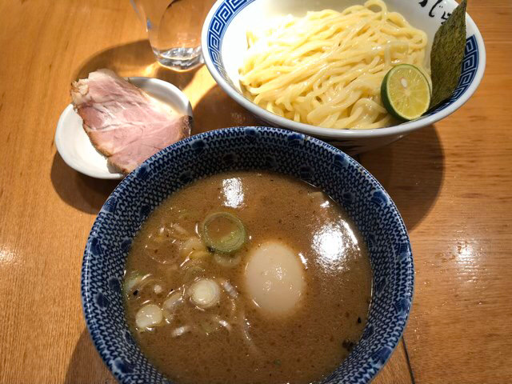

---
categories:
- ゲーム
date: Fri, 06 Dec 2019 12:00:00 +0000
slug: post-12990
tags:
- ゲーム
- ダイエット
title: これは心を詰む戦い。リングフィットアドベンチャーを始めて1ヶ月、その過程と成果
---

いつからだ？筋トレやろうと口にするだけになったのは

いつからだ？眠気に負け筋トレを躊躇なく2日で辞めるようになったのは

いつからだ？筋トレやらなきゃって思い出すだけになったのは

やっと気がついた。これは心をつむ戦い。甘えた己の弱い心をつむ戦い。

リングフィットアドベンチャー1ヶ月プレイ記録です。
<!--more-->
<h2>リングフィットアドベンチャー1ヶ月やってみた結果</h2>
プレイ開始から1ヶ月程度経ちました。プロテインを飲むようになり、プロテインバーを食べるようになりました。
<h3>変わらない体重</h3>
体重はというとほぼ変わりません。微減してるように見えますが、こんなの寝て起きた時にもこれくらい減ってることがあるので、リングフィットアドベンチャーの成果と称するにはいささか性急。

進捗や成長が目に見えないのはつらいです。イラつきます。
<h3>変わったのは心の在り方</h3>
ただ、気がつきました。

このイラつきは「リングフィットアドベンチャー意味ねーじゃん！つらいだけだわこれ！」ではなく

「負荷が足りない。トレーニングが足りない。もっと痛みを」というものでした。

これは心をつむ戦い。己の甘えた弱い心を打ち砕く、自身との戦いだったのです。

最近ではご飯すら食べたくなくなりました。ただひたすら

※食べてるけどね

<h2>心が正しく形を成せば、想いとなり、想いこそが身を結ぶのだ</h2>
そして思いをはせたのは中学時代。部活で強くなるためにひたすら鍛錬した記憶。毎日寝る前に筋トレ、そして木刀の素振り千本。

ただひたすら、ただひたすら
<h3>そんなもんじゃねえだろ俺が求めた武の極みは</h3>
己の限界を超え、吐いても続けた筋トレ。もはや筋肉をつけるためではなく、己をこえる、己に克つ。自分自身を究めるために
<h3>必要なのは痛み</h3>
だから、もっと痛みが必要です。ただひたすら痛みが必要。

負荷を上げ、己の行き着く先すら思い描かず、いまこの瞬間にただ全力を。

もうこれで終わってもいいと思える程の負荷を。
だからこれからもリングフィットアドベンチャーを続けます。

進捗やトレーニング報告は随時こちらで行っております。よかったらフォローお願いします。
<blockquote class="twitter-tweet">

リングフィット買ったけど、チュートリアルから汗かいたし、これはちゃんとやったら本格的に痩せそう。年末くらいまで定期的にレポートしてこ <a href="https://t.co/KlSRn1rXUg">pic.twitter.com/KlSRn1rXUg</a>

— しんぺー (@s_s_p_y) <a href="https://twitter.com/s_s_p_y/status/1191234757310337024?ref_src=twsrc%5Etfw">November 4, 2019</a></blockquote>

<h2><a href="https://twitter.com/s_s_p_y">しんぺー</a>はこう思った。</h2>
と、堅苦しいこと書きましたが年末までなるべく毎日やる予定です。

目標体重は最終的には54-59kgくらいかしら。
頑張ります。

と言ったところで本日は以上です。
おやすみなさい。

[itemlink post_id="12936"]
[itemlink post_id="12937"]