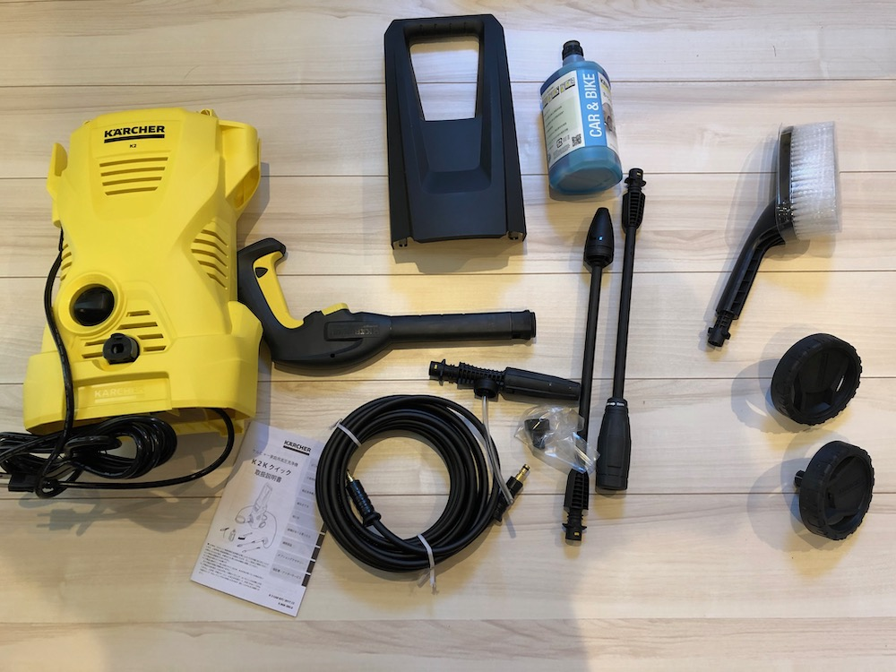
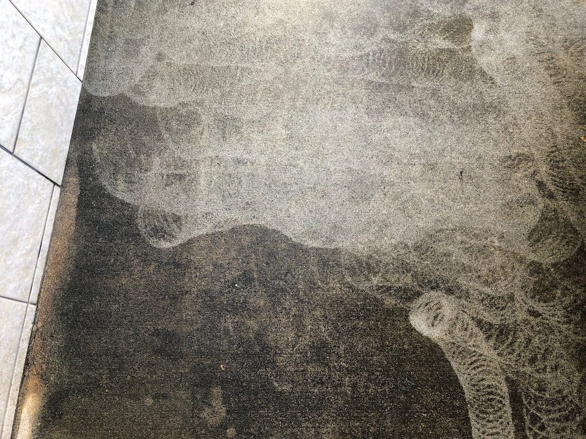

---
categories:
- レビュー
date: Sun, 05 Jan 2020 09:00:00 +0000
slug: post-12997
tags:
- ガジェット
title: 【レビュー】洗車用に買った高圧洗浄機ケルヒャーは人を選ぶと思われる
---

年末に近所のホームセンターに買い物に行った時に安くなっていたので購入しました。洗車に使えばコイン洗車で傷がつくこともないし、ガソリンスタンドの高い手洗い洗車をしなく済むので節約にもなるしと思いました。

結論としては、「洗浄力はスゲーし手間もそこまでかからない！ただし音が大きくて、近所迷惑になってないかが凄く気になる！それ以外はよい！」です。

本日はケルヒャーのレビューです。

<!--more-->
<h2>ケルヒャーとは？</h2>
高圧洗浄機です。かんたんに言うと水をすごい勢いで噴出して汚れを落とすマシンです。洗車以外にも家の外壁の掃除や窓などにも使え、ブラシなどでは落としにくいような頑固な汚れも簡単に落とすことができます。

ぼくが購入したセットは洗車ブラシや洗剤がついたものです。

車輪がついていて持ち運びができます。

ホースの接続部分はかなり厳重にロックがかかります。ただし接続と取外しは簡単です。

<h2>洗車に使ってみた</h2>
購入のきっかけはYouTubeでケルヒャーを使った洗車の動画を見たからです。
<iframe src="https://www.youtube.com/embed/WaeuMGbJRBc" width="560" height="315" frameborder="0" allowfullscreen="allowfullscreen"></iframe>

まず水圧でゴミと汚れを落として、ケルヒャーを使った洗剤でシャンプーしていき、泡でコーティングするというものでした。それに憧れてたんですが、ところがどっこい。付属の洗剤では、泡のコーティングにはならず。なんとなく全体に洗剤がかかった程度でした。動画内でも言われていますが、水が多い感じがしました。多分洗剤の量の調節ができるはず。

そのあと、ブラシヘッドに変えてこすりながら洗い流しました。まぁまぁピカピカになりました。おそらくシャンプーは付属のものよりも、もう少し高級なものとか別に買った方がいいかも。

<h2>地面やタイルに使ってみた</h2>
洗車ではあまり凄さがわかりませんでしたが、地面やタイルに使ってみて凄さを実感。

水圧により汚れをあっという間に落としてくれました。数年の風雨による汚れを落とすにはこういった高圧洗浄機でないと難しいでしょう。モップやタワシなんかで擦ろうものなら労力と時間が膨大にかかります。

ただ、だからといってケルヒャーで一瞬できれいになるかというとそうでもなく、10cm四方くらいに対して水をかけるため、広い面積を綺麗にしようとすると想定よりかは時間がかかりそうです。

でも、驚くほど綺麗になるので1年に1回とかはやってもいい気がします。

コンクリート部分の汚れに対して使用してみました。汚れがかなり綺麗になっているのがわかります。

<h2>騒音と後片付け問題</h2>
思ったよりも騒音が大きいかな？

近所の人々が留守っぽい時間を見計らってやりましたが周辺が静かな環境だとうるさいかもです。また、洗車の時に流れ出た洗剤についても気になりました。そのまま道路の排水溝に洗剤流しちゃう感じだけどいいのかしらね。

洗車に関しては場所と時間を選ぶかも知れません。

<h2>こんな人におすすめ</h2>
自分で洗車したい人にはマジでオススメ。

洗車機でつく傷が特に気にならないよーという人は買う必要なし。ぼくの場合、車体の色が白ですし、傷とかもそこまで気にしません。なので、相当気分が乗らないと使わないとは思います。

あと洗剤とか結局買わないといけないし、タオルを乾かしたり洗ったりしないといけないし。あんまりコスパ変わらないかもですわ。

車以外に使うとしても1年に1回とかだと思うと果たしてコスパ良かったのかどうか、けっこう微妙です。

<h2><a href="https://twitter.com/s_s_p_y">しんぺー</a>はこう思った。</h2>
冒頭に書いた通り、結論は「洗浄力はスゲーし手間もそこまでかからない！ただし音が大きくて、近所迷惑になってないかが凄く気になる！それ以外はよい！」です。めちゃくちゃオススメってわけじゃないけど、性能は良いと思います。

自分で洗車したい人にはマジでオススメです。

と言ったところで本日は以上です。
おやすみなさい。