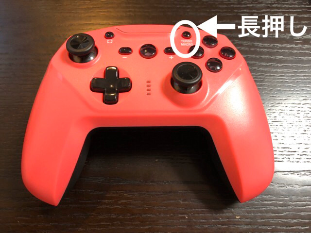
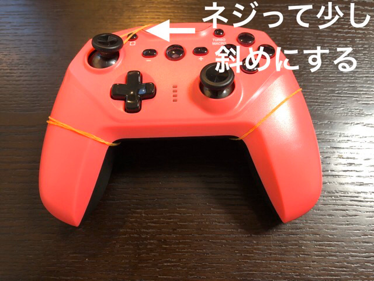
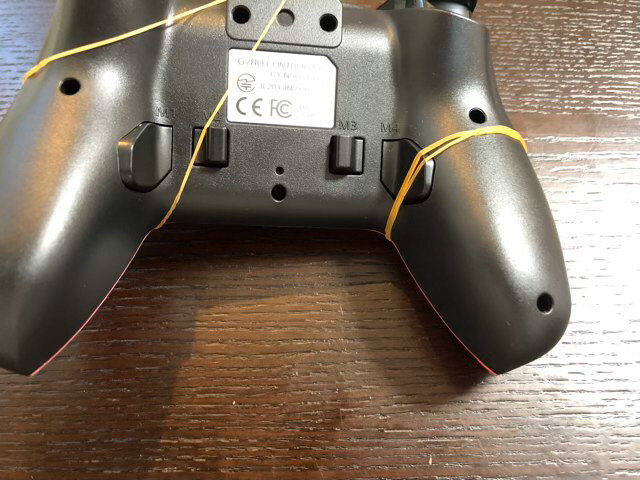

---
categories:
- ポケモン
date: Wed, 08 Jan 2020 15:30:45 +0000
slug: post-13063
title: ポケモンソードシールドでマクロコントローラー使って自動でお金稼ぎする方法
---

絶賛ポケットモンスターソードシールドでランクマッチ対戦中です。

ただ全然勝てない。強いポケモンを育てようと思ったらお金が必要。一体の努力値をマックスまで振ろうとするとだいたい50万円くらい必要。普通にストーリーを進めるだけじゃ絶対にそんなに貯まりません。そこで全クリ後のリーグ戦を周回することになりますが、それでも普通に戦っててもそうそう貯まるもんじゃありません。そこで本日はポケットモンスターソードシールドで自動的にお金稼ぎをする方法をご紹介します。

<!--more--> 
<h2>ポケットモンスターソードシールドでお金稼ぎする方法</h2>
全クリ後のリーグ戦を周回してお金を稼ぎます。ここで少し工夫が必要となります。

<h3>キョダイマックスニャース</h3>
早期購入者特典の特殊なポケモンです。

そのニャースに「おまもりこばん」というどうぐを持たせて、全クリ後のリーグ戦に挑みます。バトル中にキョダイマックスして「キョダイコバン」を使います。この技の効果は「戦闘後に自分のレベル×攻撃回数×100円が手に入る」というもの。さらに持たせた「おまもりこばん」の効果により、レベルが100であれば最終的に10万円程度が手に入ります。この方法が最もまともかつ効率的な手段と言えるでしょう。

ただし、キョダイマックスニャースは今からだと手に入れられない可能性がありますので、全員が出来る方法とは言えません。

<h2>マクロコントローラーでリーグ戦を自動周回</h2>
そこで、この方法です。これならキョダイマックスニャースがいなくても、お金稼ぎをすることができます。しかも自動で。方法は簡単です。マクロコントローラーを使って、普通にリーグ戦を周回するだけです。

[itemlink post_id="13033"]

<h3>マクロとは？</h3>
ボタンを押す動作を覚えてくれる機能です。ポケモンのバトルは基本ボタン操作が中心なので、この機能を使って自動でバトルを進めます。

<h3>マクロコントローラーの使い方</h3>
登録ボタンを長押しし、その後に登録したい動作をします。そして最後に動作を発動させるためのボタンを割り当てて終わりです。
発動ボタンをコントローラー裏の4つのボタンのいずれかになります。それを押せば、登録した挙動が開始されます。
　

ぼくはAボタン8回、Bボタン1回を記憶させています。

<h3>自動化のためのセッティング</h3>
ただし、これだけでは不完全です。自動でリーグを周回しお金を稼がせるには、スティックとボタンを固定する必要があります。

輪ゴムなどでボタンを押し続けるように固定します。バトルが終了したあとに次のバトルを始めるための移動を行う必要がありますので、スティックも輪ゴムで固定します。

スティックの固定は若干斜めになるようにするのがコツです。これで位置のズレを防げ、自動で次のバトルに行ってくれます。またリーグ戦が終わった際も次のリーグに移るために受付まで歩いてくれます。

裏から見るとこんな感じ。マクロを割り当てたボタンを輪ゴムで押さえます。

また、使うポケモンですが、ぼくはムゲンダイナを使用しています。本当はザシアンを使い、技も1つだけ残して全部忘れさせるなどをするのが良いようです。ドラゴンタイプのムゲンダイナですとフェアリータイプの敵が出てきた時に詰んでしまうことがよくあります。

<h3>レイドバトルにも使える</h3>
レイドバトルにももちろん使えます。レイドバトルはターン数がかかる割にはやることは一緒で、ボタン押してるだけ。

なので、こっちもひたすらボタンを押させるだけです。

<h2><a href="https://twitter.com/s_s_p_y">しんぺー</a>はこう思った。</h2>
ガチでポケモンやろうと思う人は買った方がいいと思います。ぼくはこれを使いながら年末に大掃除をしていました。そして、そこで育てたポケモンたちを使ってモンスターボール級からマスターボール級にあがることができました。(初心者なのでかなり大変だったけども)

Amazonだと値段の上がり下がりが結構激しい上に、到着も翌日じゃないことがあるので余裕を持って安いのを買いましょう。

といったところで本日は以上です。
おやすみなさい。
[itemlink post_id="12986"][itemlink post_id="12987"]