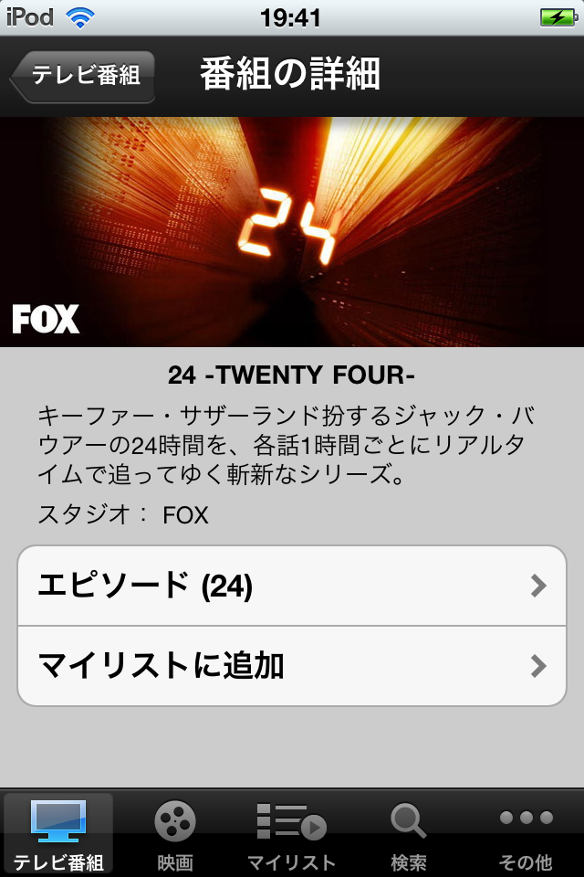

---
categories:
- アプリ
date: Sun, 21 Apr 2013 08:59:02 +0000
slug: post-1307
title: 海外ドラマがネットで見れる。家でもスマホでもゲーム機でも、どこでも「Hulu」
---

さんざん海外連ドラ紹介してきておいてHuluのアプリ紹介すらしていなかったことに今きがつきました。

<!--more-->

&nbsp;
どうも、社会人6年目異動8回笑われ男です。
一週間ブログ100本投稿42本目です。今回はiphoneアプリの紹介です。

Huluはアメリカからきたサービスです。アメリカの大手放送局が合同で作った合弁会社がHuluです。アメリカの動画配信サービスではYoutubeの次に見られているそうです。

すでに登録が済んでいればこのアプリからドラマや映画を見る事が可能です。3G回線であっても概ね問題なく見られると思います。

そして神懸かり的なのが一端登録しさえすれば、家でパソコンだろうがMacだろうが、タブレットだろうが、スマホだろうが、ゲーム機だろうがIDとパスワード入れれば見れちゃうんです。
ちなみに同一アカウントはどっかで使われている場合、他ではアクセスできないようになってます。

アプリ自体はiponeのミュージックアプリと同じ様な使い勝手になっていて迷うことなく簡単に利用できるでしょう。

 

&nbsp;

<b>こんな人におすすめ</b>

海外連ドラを見たい！って人におすすめです。月額１０００円程度で見放題です。
ただし、字幕です。吹き替えはありません。そこがちょっとだけネックです。

ただし、ラインナップはかなり豊富で話題の連ドラは大抵あります。映画もあります。

そして連ドラにあきた方には、ナショナルジオグラフィックなんかの動画も並んでます。こちらは日本語吹替もありますので暇つぶしやBGMに最適です。

Huluは日本に来たばかりの時１５００円かそれよりも高い料金設定をしていました。しかし、それが今では1,000円以内

これがどれほど画期的なことか！ゲオで１００円で借りられる時代です。

それくらいの価格面でのメリットがなければ普及しません。連ドラとかみない人にとってはコストにしかならないでしょうが、見る人にとってのメリットは計り知れません。
お試し期間もありますので利用してみるのもいいかと思います。

<iframe src="http://ad.jp.ap.valuecommerce.com/servlet/htmlbanner?sid=3041033&amp;pid=881853896" height="280" width="336" frameborder="0" marginwidth="0" marginheight="0" scrolling="no"></iframe>

<strong> Hulu 2.7.1（無料）</strong>
カテゴリ: エンターテインメント, ライフスタイル
販売元: Hulu, LLC - Hulu, LLC（サイズ: 51.1 MB）