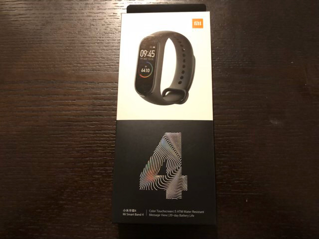
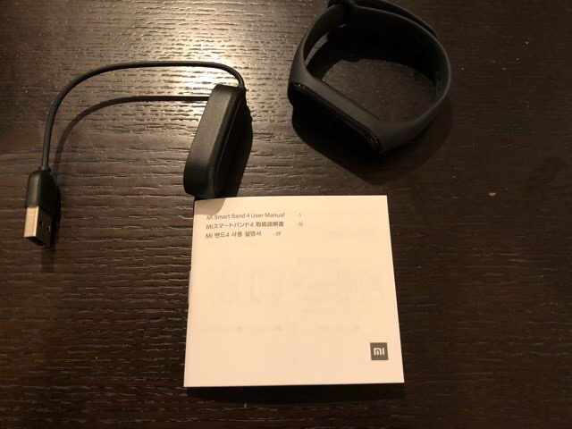
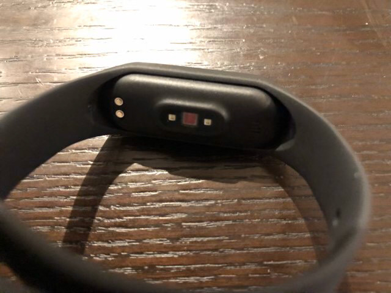
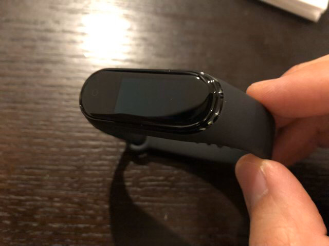
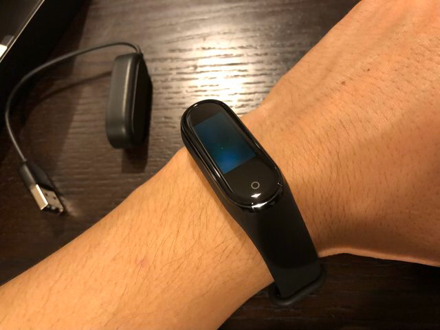
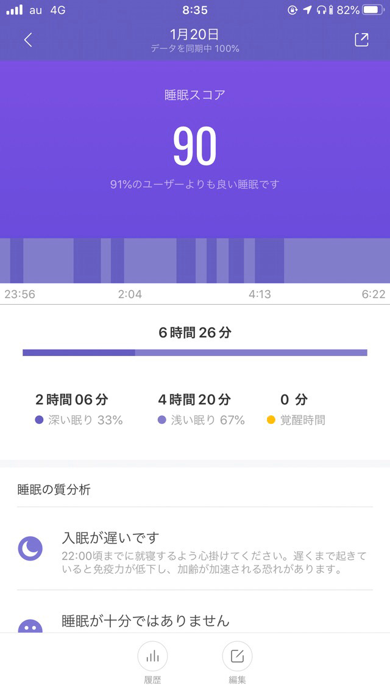
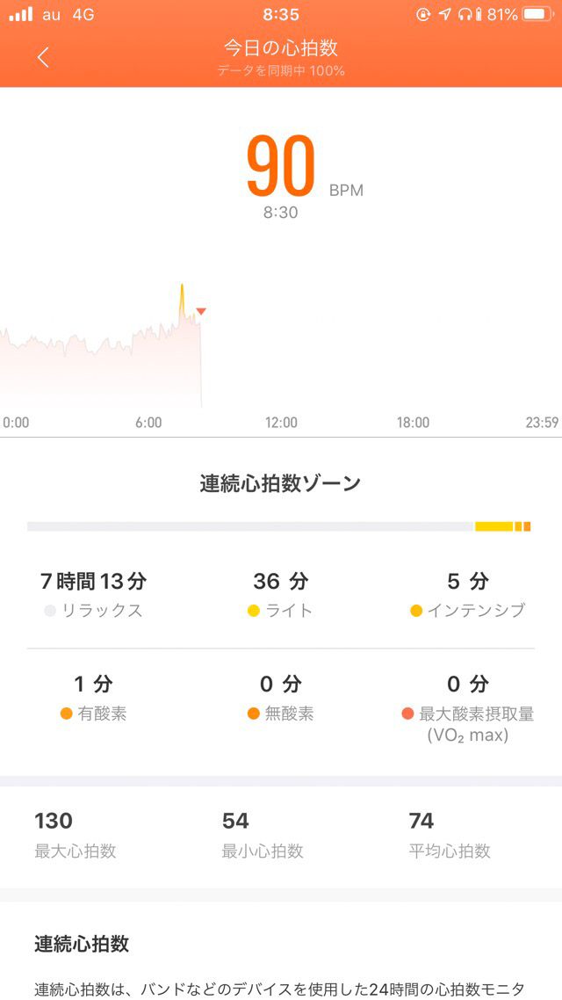
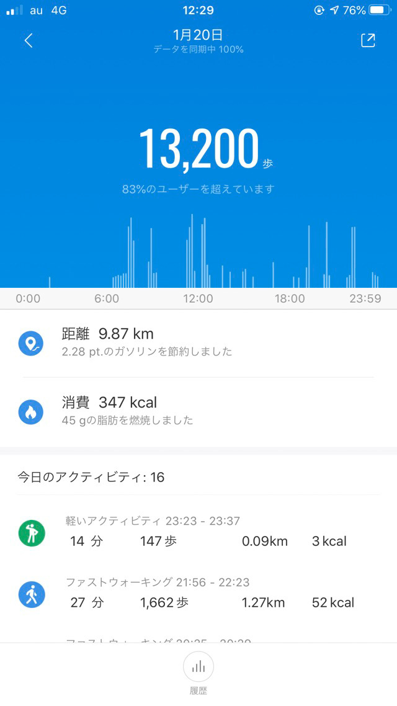
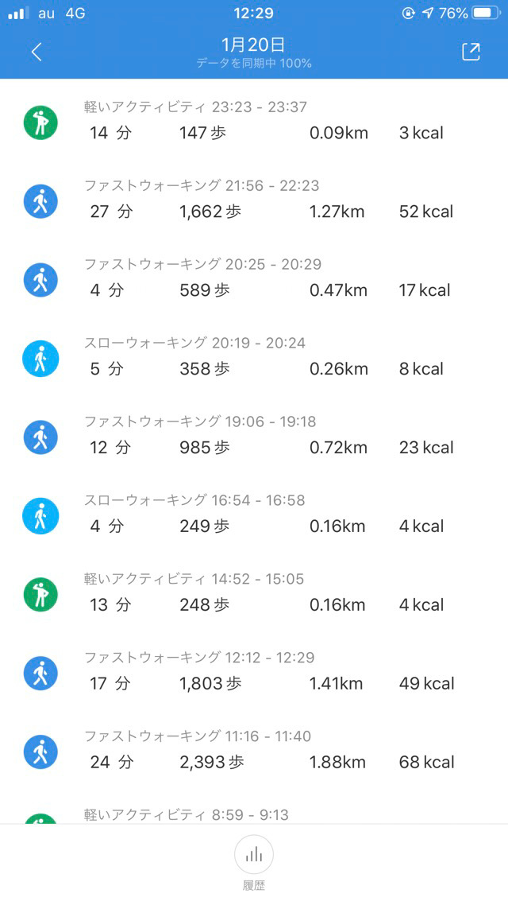
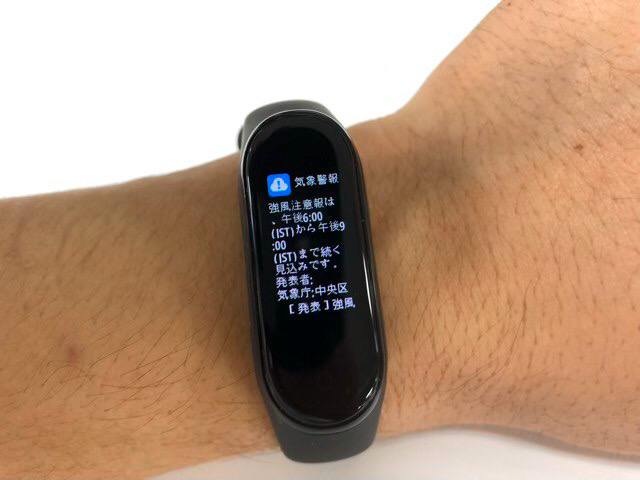

---
categories:
- レビュー
date: Tue, 21 Jan 2020 15:00:00 +0000
slug: post-13075
tags:
- ガジェット
- ダイエット
title: Xiaomi Mi band4レビュー「ちょうどいい活動量計」で気に入った
---

リングフィットアドベンチャーをやるようになって、食べる物に気を使うようになった。プロテインを飲むようになった。プロテインバーを食べるようになった。次に気になり出したのは自分の体の活動自体に関して。きちんと把握したいと思い始めた。そこで、活動量や睡眠を計測できるガジェットの導入を検討しXiaomiのMi band4を購入してみました。本日はそのレビューです。

<!--more-->
<h2>活動量計とは？</h2>
身につけて心拍数や消費カロリーなどの体に関する様々な数字を計測してくれるガジェットのことです。最近ですとAppleWatchのようなスマートウォッチなどが有名でしょう。それとは別に、ディスプレイもなく必要な情報はスマホのアプリに同期させて、そちら側で設定や確認が全てできるようになっているものなどもあります。
<h2>Xiaomi Mi band4レビュー</h2>
今回ぼくが購入したのは、その中でもXiaomiという中国メーカーが販売している「Mi band4」というものです。それ以外にもいくつかの活動量計を検討しましたが、最終的には価格面からMi band4を選択しました。とても安いのです。
[itemlink post_id="13090"]

外箱も非常にコンパクトです。

中身も非常にシンプル。充電ケーブル、バンド、本体

バンドにはめるとこんな感じ。裏側の部分から緑色の光が出て心拍を図ります。このバンドはゴムっぽい質感。本体の嵌め込みがわりとやりづらくて若干面倒。

液晶側。一応iPhoneでいうところのホームボタン部分があります。物理ボタンにはなってませんが。

着け心地は良好です。気にならない細さ。

<h3>防水機能</h3>
お風呂につけて入りましたが、全く問題なし。ただ、よくあるのはシャワーは平気という西洋文化ベースの仕様です。浴槽に浸かるタイプの入浴は世界でも日本とブータンくらいです。

防水自体は大丈夫でも、熱いお湯により段々とダメになっていく可能性があります。そのためお風呂に入る時は外した方が無難かなと思います。
<h3>着け心地</h3>
軽いし気にならない。もともと腕時計などは得意ではありませんが、これは着けてても気にならない。

むしろずっと付けっ放しにしていたので、入浴時に外した際に違和感がありました。
<h3>バッテリー</h3>
バッテリーのもちに関しては、もう驚愕です。5日以上もつらしい。今現在購入からまだ数日ですが、最初の充電をしてから3日くらい経ちますが、90％以上残っています。信じられません。最初の1日で1％くらいしか減りませんでした。
これでこそ活動量計と言えます！
<h3>睡眠</h3>

入眠時間から起床時間までしっかりと計測してくれます。途中で目覚めたところもしっかりと記録されていました。
なお昼寝は計測していくれるのか試してません。

また、それでもやっぱりたまにエラーになってしまうみたいで、つけて寝てもうまく計測できないこともあるみたいです。
<h3>心拍数</h3>

手動と自動での計測が可能です。自動の場合は最短で1分毎の計測が可能となっています。
また、心拍数に異常を検知した場合はお知らせしてくれる機能もあるようです。

ぼくは今のところ1分毎にしています。これによりストレスを感じた時やリラックスしている時なども記録しておいてくれるみたいです。
<h3>活動量</h3>

ワークアウトに関しては、例えばランニングやウォーキングなどはGPS連動してマッピングもしてくれるようです。ただし、これは自動ではなくスタートボタンを押すことで計測が開始します。

それ以外の移動などに伴う消費カロリーの記録は自動で行ってくれます。歩数の計測に関しては少し甘い気もしますが、分数と距離も記録してくれます。

まぁ、これが一番やりたかったことなので今のところ満足しています。
<h3>本体単体でできること</h3>
基本的にはスマホのアプリと同期させて、各種コントロールや設定は全てスマホのアプリ側で行います。
本体側でできることは、時計・ワークアウトのスタート・ステータスの確認・通知の確認・心拍数の計測・天気予報の確認などです。

液晶はカラーなので、各種色がことなっていますので割と見やすくなっています。

注意報？だと思いますが天気のアラートも来ました！これは便利。とくにiPhone側に通知こなかったから、ここだけは本体側の独自機能かも

<h3>アプリでできること</h3>
基本的にバンドのコントロールを初期設定含め全部アプリで行います。また取得した数字やそのグラフ化もアプリから確認できます。

おそらく本体側にGPSはついていないでしょうから、アプリの入ってるスマホと連動しているものと思われます。それを使って移動のトラッキングをしてるのではないかと思いますが、試してないのでどうかわかりませんが。。

バンドとアプリの同期は一瞬で終わります。たぶん頻繁に開いていれば毎回数秒で終わると思われます。
<h2>他の活動量計との検討時の比較</h2>
活動量計の購入するにあたりMi band4以外にもいくつか検討しました。最終的な決定理由は金額ですが、検討した際に調べたことも比較としてご紹介します。
<h3>fitbit</h3>
価格が1万円代から。防水、睡眠、心拍数、活動量が測れるのはMi band4と同じですが、モデルにより若干できることがことなります。

最上位モデルではAmazon Alexaがついていたり、その他のモデルでも24時間心拍数をモニターできたりするようです。

正直迷いましたが、初めて活動量計を買うのだからあまり高いものを買っても仕方ないなと思いMi band4にしました。
<h3>AppleWatch</h3>
価格は4万円〜。言わずと知れたスマートウォッチです。様々なことができます。ただ、1番のネックはバッテリーのもちです。1日つけたら就寝時には外して充電しておかないと次の日に使うことができません。それでは睡眠のモニターがてきません。

Mi band4のAmazonレビューを見ているとAppleWatchの精度には勝てないというのがありました。やはりつけている時の満足感各センサーの精度なんかはこちらの方が上のようです。

ただ、これも高過ぎるのでやめました。AppleWatchの第一世代を使ってましたが、落としてすぐに割れたためそれっきりです。充電もめんどくさいし。
<h3>Mi band4はこんな人におすすめ</h3>
初めて活動量計を買う人、活動量計と睡眠モニターだけしたい人にはおすすめなんじゃないかと思います。

ぼくはここから入って、物足りなくなるようであればfitbitに乗り換えようと思います。
<h2><a href="https://twitter.com/s_s_p_y">しんぺー</a>はこう思った。</h2>
今のところ大満足です。計測したかった数字が目に見えるようになったので、さらに自己研鑽(リングフィットアドベンチャー)に精が出るというものです。

本当に無理矢理言うとするならば所有時の充足感が薄いかなと言う感じです。持ってることで他人との優位性を感じられたり、常に触りたくなっちゃったりはしません。そのあたりはAppleWatchみたいなものの方が優れているんでしょう。

ただ、計測だけをするものなのでこれくらい気にならい方がいいかもしれません。

そういった意味では本当に「ちょうどいい活動量計」と言えるでしょう。検討している方はオススメです。

といったところで本日は以上です。
おやすみなさい。

[itemlink post_id="13090"]