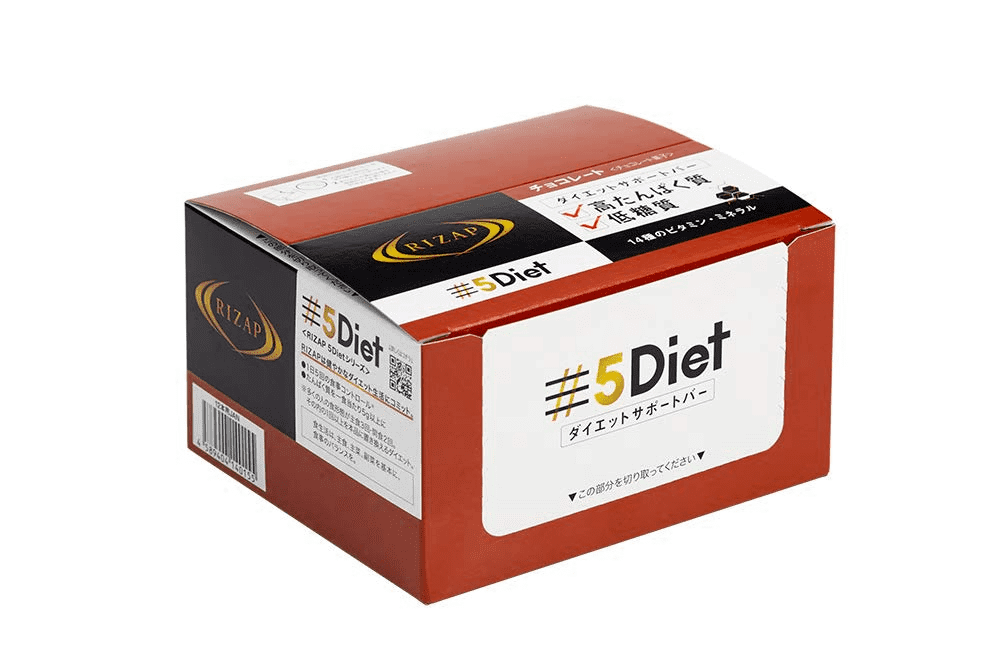
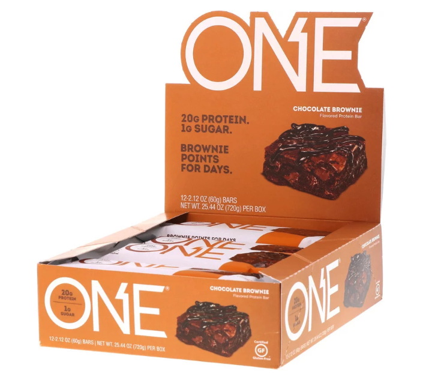
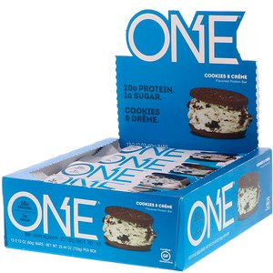
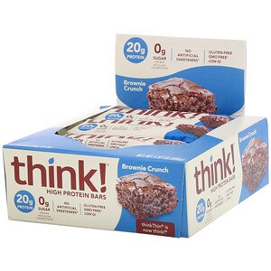
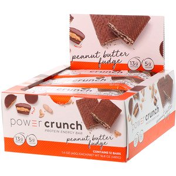
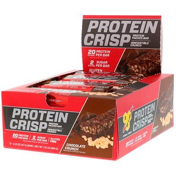

---
categories:
- ブログ
date: Sat, 25 Jan 2020 23:00:27 +0000
slug: post-13100
title: 【レビュー】私を変えた美味しいプロテインバーたち
---

リングフィットアドベンチャーをやるようになってから食べる物にも気をつけてる。炭水化物はなるべく摂らず、甘いお菓子は食べず、プロテインを飲むようになった。そしてさらに会社で朝、口にするのはおにぎりではなく、プロテインバーになった。いくつかの種類のプロテインバーを試してみたので、本日はプロテインバーのレビューです。

<!--more-->

プロテインはザバスの一般的なものを飲んでますが、プロテインバーは海外サイトで注文しています。日本のものだと砂糖が入ってたり、余計なものが入ってたりするものが多いっぽいので。
<h2>マイプロテインのプロテインバー</h2>
マイプロテインというメーカーのもので、始めて買ったプロテインバーがこれでした。どんな味の食べものかわからなかったので、いろいろ吟味しましたが今思うとハズレでした。

食感は粘土のようです。ベトベトはしていませんが、パサパサもしていません。本当に粘土を食べているような感覚です。
チョコレートオレンジ味のものを買ったのですが、チョコレート感はあまりありません。オレンジの風味が若干するだけで、特に酸っぱいとか甘いとかいうものではありませんでした。

粘土のようだった。それが感想です。ちなみに慣れるまで食べるのにかなりの時間がかかりました。半日かけて食べ切りました。

成分は箱捨てちゃったので不明

美味しさ：★★☆☆☆
食べやすさ：★☆☆☆☆

[itemlink post_id="13104"]
<h2>RIZAP 5Diet サポートバー</h2>
RIZAP 5Diet サポートバー チョコレート味 12本入×1箱RIZAP 5Diet サポートバー チョコレート味 12本入×1箱

次に買ったのがRIZAPのプロテインバーです。
正直これが一番美味しかった。ちゃんとチョコレートの味がしてサクサクしてるし、普通のお菓子という感じでした。そのため糖質が結構入っています。

成分：30g　144kcal　タンパク質10.1g　脂質8.0g　炭水化物9.1g　糖質8.3g　食物繊維0.8g

美味しさ：★★★★★
食べやすさ：★★★★★
[itemlink post_id="13106"]
<h2>One Brandsのチョコレートブラウニーフレーバー</h2>
One Brands, ワンバー、チョコレートブラウニーフレーバー、12本、各2.12オンス (60 g)

次に購入したのがiHerbという海外サイトで注文した2種類です。

このブランド名のOneとは、当分が1gというところからきています。比較的食べやすく、まずくなく、なくなるまではひたすら毎朝食べていました。始めて海外サイトで購入したものにしてはあたりと言えるでしょう。これを書いていて成分を始めて気がつきましたが炭水化物結構入ってるんですね。糖質は少ないけど炭水化物が多いんじゃあまり意味がない気がします。

成分：60g　220kcal　タンパク質20g　脂質8g　炭水化物24g　糖質1g　食物繊維9g

美味しさ：★★★☆☆
食べやすさ：★★★☆☆

<a href="https://www.warawareotoko.com/2020/01/22/post-13095/">→ここで購入しました（iHerb）</a>
<h2>One Brandsのクッキー＆クリームフレーバー</h2>
One Brands, ワンバー、クッキー＆クリーム、12本、各2.12 oz (60 g)

こちらも上のものと同じブランドですが、味を変えてみました。その結果大失敗。いかにも海外のお菓子という味でした。クッキー＆クリームということでチョコチップクッキー的な味かと思いきや、クッキー生地の味と表現するのが正しいでしょう。正直まずいです。1つ食べてもうギブアップ。

成分：60g　220kcal　タンパク質20g　脂質8g　炭水化物23g　糖質1g　食物繊維9g

美味しさ：★☆☆☆☆
食べやすさ：★★★☆☆

<a href="https://jp.iherb.com/pr/One-Brands-One-Bar-Cookies-Cream-12-Bars-2-12-oz-60-g-Each/64621">→ここで購入しました（iHerb)</a>
<h2>ThinkThinのブラウニークランチ</h2>
ThinkThin, ハイプロテインバー、ブラウニークランチ、10本、各60 g（2.1 oz）

結論から言いましょう。めちゃくちゃ美味しかった！本当にブラウニーって感じです。ただし、変な甘さはなし。美味しいです。炭水化物は23gですが糖質が0gなのと食物繊維も少ないのもいいです。

成分：60g　230kcal　タンパク質20g　脂質8g　炭水化物23g　糖質0g　食物繊維1g

美味しさ：★☆☆☆☆
食べやすさ：★★★☆☆

<a href="https://jp.iherb.com/pr/ThinkThin-High-Protein-Bars-Brownie-Crunch-10-Bars-2-1-oz-60-g-Each/23398">→ここで購入しました(iHerb)</a>
<h2>BNRGのピーナッツバターファッジ</h2>
BNRG, パワークランチ® プロテインエネルギーバー, ピーナッツバターファッジ, 12 本, 各 1.4 オンス (40 g)

多少塩みが効いてる甘さです。美味しいです。こういうお菓子ある。ピーナッツバナーの味もいい感じです。ただし、歯につくので個人的にはそこが気になる。

成分： 40g　200kcal　タンパク質20g　脂質12g　炭水化物23g　糖質0g　食物繊維1g

美味しさ：★★★★★
食べやすさ：★★★☆☆

<a href="https://jp.iherb.com/pr/BNRG-Power-Crunch-Protein-Energy-Bar-Peanut-Butter-Fudge-12-Bars-1-4-oz-40-g-Each/33110">→ここで購入しました(iHerb)</a>
<h2>BSNのピーナッツバターファッジ</h2>
BSN, Protein Crisp（プロテインクリスプ）、チョコクランチ、12本入り、各57g（2.01oz）

これも美味しいです。甘くなく、アーモンドが入っていて普通に食べられます。

成分： 40g　230kcal　タンパク質20g　脂質7g　炭水化物23g　糖質2g

美味しさ：★★★★☆
食べやすさ：★★★★☆

<a href="https://jp.iherb.com/pr/BSN-Protein-Crisp-Chocolate-Crunch-Flavor-12-Bars-2-01-oz-57-g-Each/72347">→ここで購入しました(iHerb)</a>
<h2>iHerbおすすめ</h2>
安いし日本語対応してるし、何より到着が早い。だいたい1週間かからないくらいで届きました。

<a href="https://jp.iherb.com/">iHerb</a>

中には怪しげなサプリメントとかも販売されているので、吟味が必要ですが、ぼくは次もまたここでプロテインバーを注文するでしょう。
ちなみに海外からの発送ですが3商品注文して合計6000円の代金に、送料は500円くらいでした。安いです。

この紹介コード入力で初回注文の場合10%OFFになります。ぼくの方にも10%還元されるらしい。よろしければどうぞ。

<strong>AZR3877</strong>
<h2><a href="https://twitter.com/s_s_p_y">しんぺー</a>はこう思った。</h2>
今まで仕事中に食べてたお菓子をプロテインバーに完全に変えました。だからと言うわけではないと思いますが、体重は減少傾向にあります。

もちろん運動も継続しつつ、毎日プロテインも飲みつつの結果だと思います。意識が変われば、習慣も変わる。習慣が変われば自分も変わる。

弱い自分を今ここでたたき殺し、強い自分に生まれ変わるのです。

さて、今日もトレーニングあるのみ。

といったところで本日は以上です。
おやすみなさい。