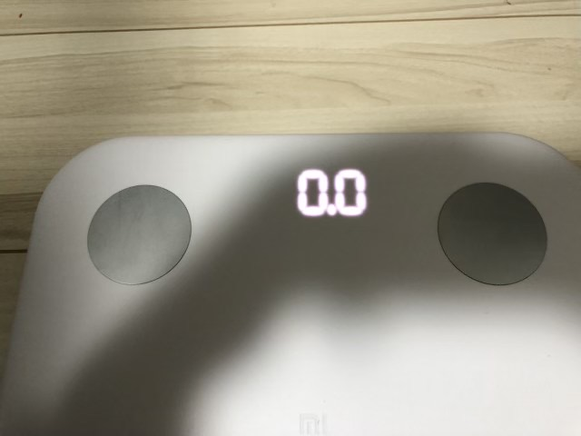

---
categories:
- レビュー
date: Sun, 01 Mar 2020 17:18:47 +0000
slug: post-13177
tags:
- Xiaomi
- ダイエット
title: 【レビュー】Xiaomiの体組成計が安いし、性能もいいし、ちょうどいいからおすすめ
---

リングフィットアドベンチャーでダイエットを始めてから、ほぼ毎日タニタの体組成計に乗っていろんな数字を測っていました。

しかし、安いやつなのでアプリと連携して自動記録してくれたりはしません。毎回iPhoneのヘルスケアアプリを立ち上げて手入力で記録していました。それがめんどくさかったので自動でやってくれる体組成計を買ってみました！そしたらとても良い！これで十分！ということで本日はxiaomiの体組成計のレビューです。

<!--more--> 

<h2>Xiaomiの体組成計</h2>

[itemlink post_id="13183"]

購入の際にタニタの体組成計とどっちを買おうか迷いましたがXiaomiにしました。決めては、以前購入した活動量計もXiaomiだったということと、<strong>金額です。圧倒的に安い。</strong>
しかしながら、機能は十分。体重、体脂肪、筋肉、水分、タンパク質、基礎代謝、骨量の計測ができます。

<h3>Xiaomiの体組成計のいいところ</h3>

圧倒的に安い。そして性能も問題なし。

アプリがMi band4と同じ。そのため、<strong>ただ乗って測るだけで自動でデータが集計されていきます</strong>。活動量計のデータと合わせてデータを見ることができます。

もちろん<strong>iOSのヘルスケアアプリにも自動で集計される</strong>ようにできますので、そっちでまとめて見ることもできます。

購入してからほんど欠かさずに計測しています。変遷が正確に見れるのはダイエットのモチベーションにつながります。

中華製だからといって、性能がおかしいなんてこともありません。ほぼほぼ間違いないデータが取れていると思われます。

<h3>Xiaomiの体組成計のここがちょっとと思うところ</h3>
たまにデータ連携がうまくいかないことがあります。そんな時は、アプリを近くで立ち上げると解消されるようです。通信でエラーがでているものと思われます。

タニタの上位モデルと比べると部位の筋肉量を細かに計測するような機能はありません。

<h2><a href=“https://twitter.com/s_s_p_y”>しんぺー</a>はこう思った。</h2>

なぜでしょうか。順調に減っていた体重が止まりました。止まるどころか、増え始めた。
さらに最近すごい甘いもの、しょっぱいものを食べたくなります。お腹もすっごい減る感じがするし。もっとトレーニングを増やさないと体重も減らなくなってきた感じする。

今が耐えどころか！？

と言ったところで本日は以上です。
おやすみなさい。

[itemlink post_id="13183"]