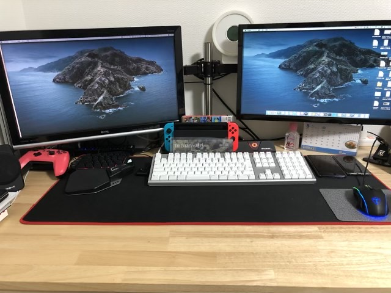

---
categories:
- レビュー
date: Sun, 03 May 2020 11:00:52 +0000
slug: post-13241
tags:
- テレワーク
title: 2020年5月版のデスク環境紹介。参考動画100本見てデスク環境整理した話
---

外出自粛、テレワークにより自宅で仕事をしている人も多いはず。家の中で過ごすことが多くなったため、模様替えや掃除整理をやり始めた人もいることでしょう。かく言うぼくも、デスク周りの散らかりが気になり出して環境を整理し直しました。今のところ、以前よりもだいぶ快適に作業できるようになっております。

ただし、納得したデスク環境になるまで紆余曲折がありました。Youtubeで海外のSetup Tour（＝デスクの環境構築動画）をみまくったり、様々なブログの記事を読み漁りました。その結果得た知見をご紹介させていただければと思います。

<h2>在宅で自室のデスク環境を見直し</h2>
在宅でテレワークを行なっているので、だんだんと自宅のデスク環境が気になり出しました。

<strong>散らかるケーブル
ありすぎる不要なもの
とりあえず積んであるナニカ</strong>

それまで気にも留めなかったデスク環境をどうにかしたいと思い出し、その気持ちがどんどん大きくなりもう止めることができなくなってしまっていました。

<h3>雑然としている理由分析</h3>

何が理由でデスクが散らかっているように感じるのか？上にも書きましたが改めて分析すると理由は3つ。

「物が多い」「ケーブルがグチャグチャ」「スペースが狭い」

つまり、実際的な問題と視覚的な情報量の多さの2点が解決すべき問題点だと認識しました。
そこで、前々から気になっていたモニターアームを導入する検討を行いました。

<h3>モニターアームの導入〜失敗〜</h3>
モニターアームはモニター物理的に持ち上げ、モニターの足を排除してくれるアイテムです。物理的にモニターを持ち上げるわけですから、当然デスクの上のスペースが広くなります。

[itemlink post_id="13243"]

これを期待して購入しました。ただ、昨今のテレワークの影響で同じ様に考えた人が多かったようで、若干品薄な上に少し高くなっていました。

注文から到着まで1週間以上かかりましたが、手元に届いてすぐに設置し問題なく使用することができました。

↓デスクの構造上若干心配だったけどギリギリで設置できた。

ただし、「モニターアーム導入によりデスク周りがすっきり！！こりゃおすすめです！」とはなりませんでした。全く思う様にはいかなかった。

↓ぐちゃぐちゃ

おかしい、何かを間違ったのか？そこで、デスク周りを整理する動画や、海外のSetup Tourと呼ばれるお洒落なデスク紹介動画を見漁りました。100本くらいは見たんじゃないかと思います。

<iframe width="560" height="315" src="https://www.youtube.com/embed/kNB-Irvok5s" frameborder="0" allow="accelerometer; autoplay; encrypted-media; gyroscope; picture-in-picture" allowfullscreen></iframe>

そこで導き出した結論です。

<strong>「モニターアームを使えばデスク環境が綺麗になるのではない。デスク環境を綺麗にできるやつがモニターアームを使うのだ。」</strong>

そして、デスク環境を整備する上で欠かせないスキル、それが「<strong>Cable Management</strong>」です。
<strong>デスク環境の整備は、ケーブルの整理が全て</strong>です。これができながければやっていないのと一緒です。ぼくはこれができていませんでした。

<h2>デスク環境を整備するためには</h2>

<h3>ケーブルマネジメント</h3>
ケーブルの整理に必要な手順は2つだけです。
<strong>「束ねる」そして「隠す」です。</strong>

ケーブルはなんとなく束ねるだけではダメです。きちんとした<strong>道具を使って束ねて、結束させないといけません。</strong>何かの拍子にぐちゃっとなるようではいけません。

また、結束したケーブルは見えない様に工夫する必要があります。<strong>視覚的情報量を減らすことでスッキリしていると脳が認識します。</strong>仕事の作業効率もアップすることでしょう。

↓ケーブルを束ねるやつを使いました。

あと、使用している製品を限りなくバスパワーのものを使う方がいいなと思いました。USBケーブルと電源ケーブルの両方が必要な外付けHDDを2台使用していますが、それだけで4本のケーブルが必要となります。改めてPC周辺機器に対しても気を配る必要があることを学びました。

↓整理後の現在の様子がこちら

<h3>完全なカッコ良さを追求するならば</h3>
ここからは完全な欲望と妄想の世界です。実際にそうすることはなさそうな気がしますが、海外の動画を見ていて感じるセクシーさについてです。

かっこいい人ほど、使用製品の色を統一しています。また、何故かほとんどの人がモニター裏を怪しい光で照らしています。絶対に使用中にそんな色で光らせないでしょという感じで光らせています。

<h3>番外編</h3>
ちなみにケーブル整理の基本は束ねる、隠すと書きましたが、究極的には「見せる」という方法もあります。
Casey Nesitatの以前のスタジオがそうです。

<iframe width="560" height="315" src="https://www.youtube.com/embed/mJY-HhPcFhQ" frameborder="0" allow="accelerometer; autoplay; encrypted-media; gyroscope; picture-in-picture" allowfullscreen></iframe>

壁に敢えて見せる形で固定することで男らしい無骨さを演出しています。また、それ以外にも敢えて整理していなさそうでしているカッコ良さ。

モニター裏を怪しく光らすよりも、ぼくがたどり着きたいのはどちらかというとこっちかなーと思います。

<h2><a href="https://twitter.com/s_s_p_y">しんぺー</a>はこう思った。</h2>
もうしばらくテレワークが続きそうです。

次は部屋の壁紙をいじりたいとかそういう欲望が少しずつ目覚めつつあります。とりあえずは抑えておきたいと思います。

と言ったところで本日は以上です。
おやすみなさい。

[itemlink post_id="13243"]