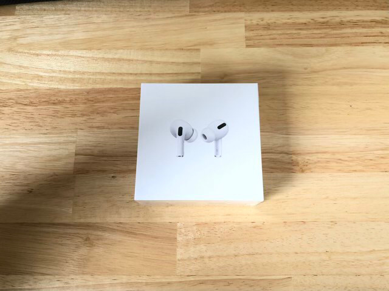
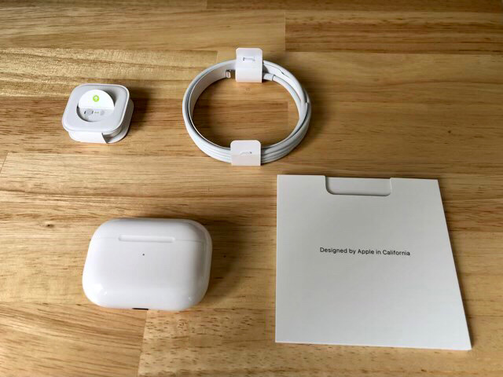
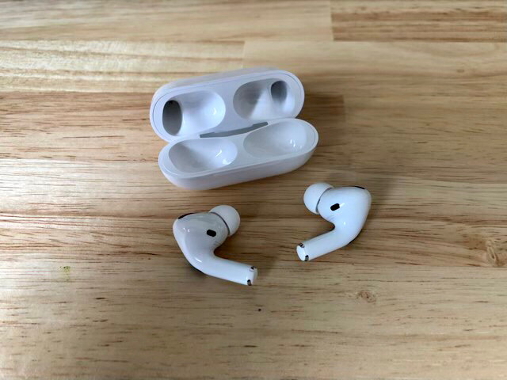
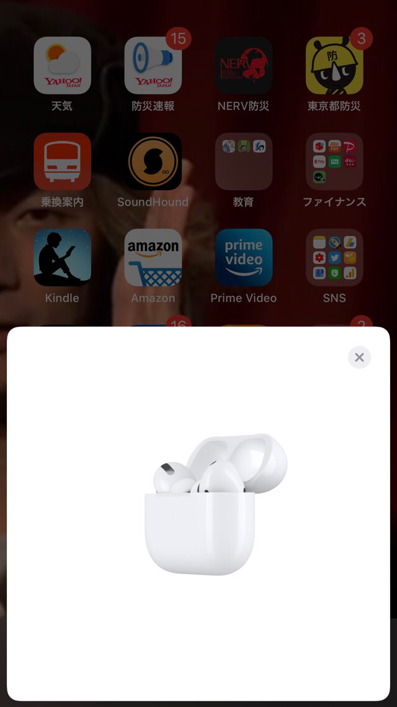
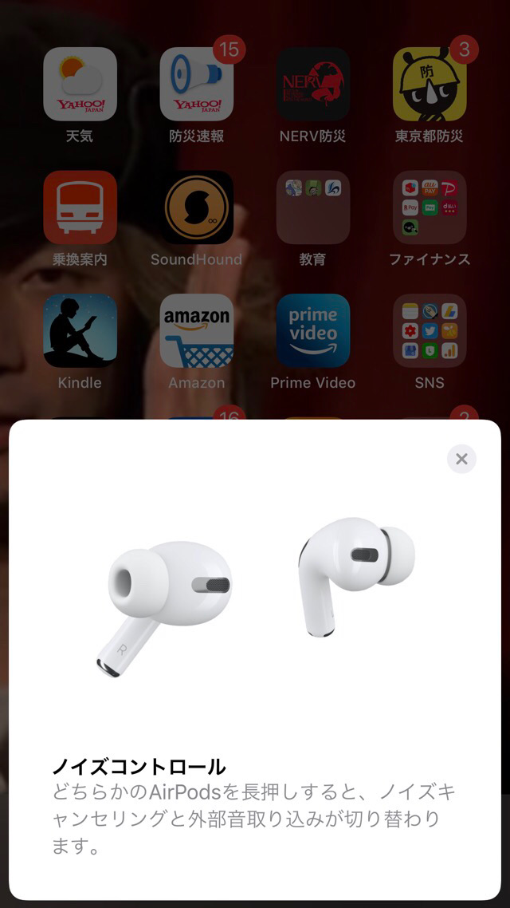
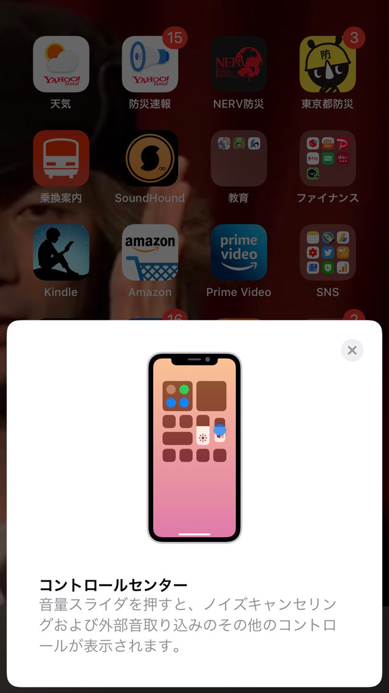
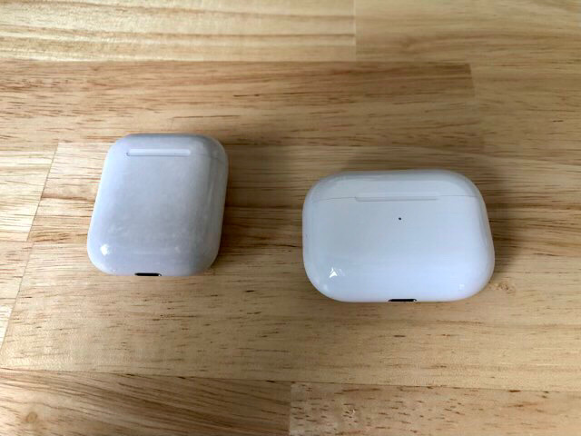
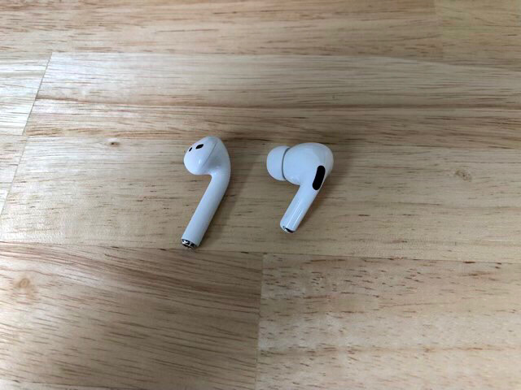
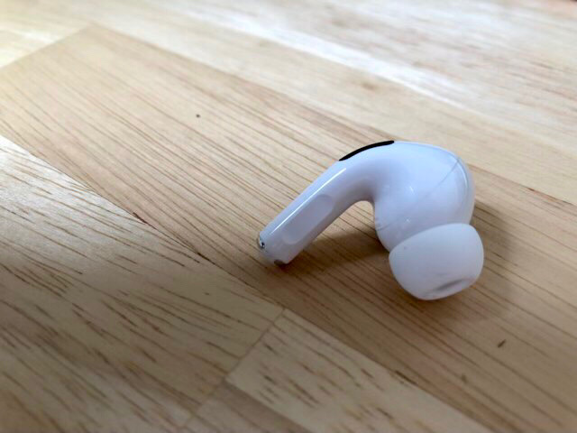

---
categories:
- Airpods
date: Wed, 03 Jun 2020 13:34:00 +0000
slug: post-13381
tags:
- apple
title: Airpods Proレビュー。ノイズキャンセリングがかなり自然！これはおすすめ
---

今までBOSEのノイズキャンセリングヘッドホンを愛用していました。通勤時もそれ以外の外出時もずっと使ってました。

しかし、外の気温が高くなるにつれて、炎天下ではこれはつけていられるようなシロモノじゃないと悟りました。

そこで給付金を当て込んでAirPods Proを購入しました！本日はそのレビューになります。

[itemlink post_id="13422"]
<h2>AirPods Proレビュー</h2>

ここでトラップ！充電用のケーブルがUSB-Cのライトニングケーブルとなっています。電源アダプターは付属してないので、ここでいきなり詰む人もいる気がします。

これ入れるとき右と左どっちかわかりづらい。

すぐ繋がる。

本体単体でも、操作できます。

iPhone本体でも、操作でます。

ちなみに旧バージョンとのケース比較

旧バージョンとの比較

<h3>ノイズキャンセリング機能</h3>
1番重要なノイズキャンセリング機能ですが、かなり良いです。

印象で言うと「かなり自然」と言う感じ。BOSEのヘッドホンはノイズキャンセリング機能をつけるとかなりの密閉感を感じます。そのため当然ノイズキャンセリングの機能自体はかなり強くて、電車で寝てしまうと降りるべき駅を乗り過ごすこともしばしば。

AirPods Proはこれがかなり自然。フワッと周囲の音が静かになる感じです。耳にイヤな密閉感もありません。
<h3>音質</h3>
これに関してはヘッドホンの方が良いです。
ただ、AirPods自体もそこまで悪くないのでそこまで気になりません。

ただ、やはり若干は軽い感じには聞こえますが。
<h3>着け心地</h3>
付けてても疲れない！そして普通にしてても落ちないし、頭ふっても落ちない！

良好！良好！

しまう時に右か左か判りづらいけどまぁ問題無し。

見た印象はかなり小さい。そして実際軽い。

<h3>iPhone以外でも使える</h3>
ノイズキャンセリング機能のオンオフはiPhoneでなくても、本体で操作可能です。

そのため、AndroidやMacに接続しても操作することができます。問題無し。
<h2><a href="https://twitter.com/s_s_p_y">しんぺー</a>はこう思った。</h2>
おそらく現代の人間にはノイズキャンセリング機能は必須だと思います。日常の騒音が少なからず健康を害していたのではないかと思います。

これで3万円はコスパ良いと思います！おすすめです。

と言ったところで本日はいじょうです。
おやすみなさい。

[itemlink post_id="13422"]