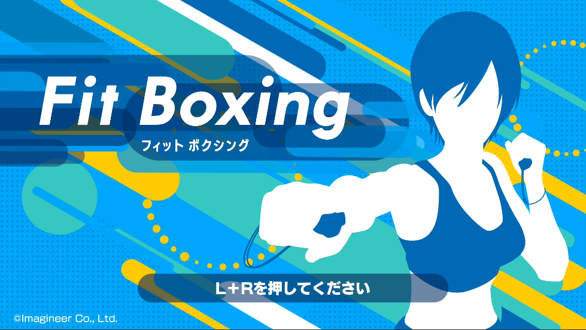
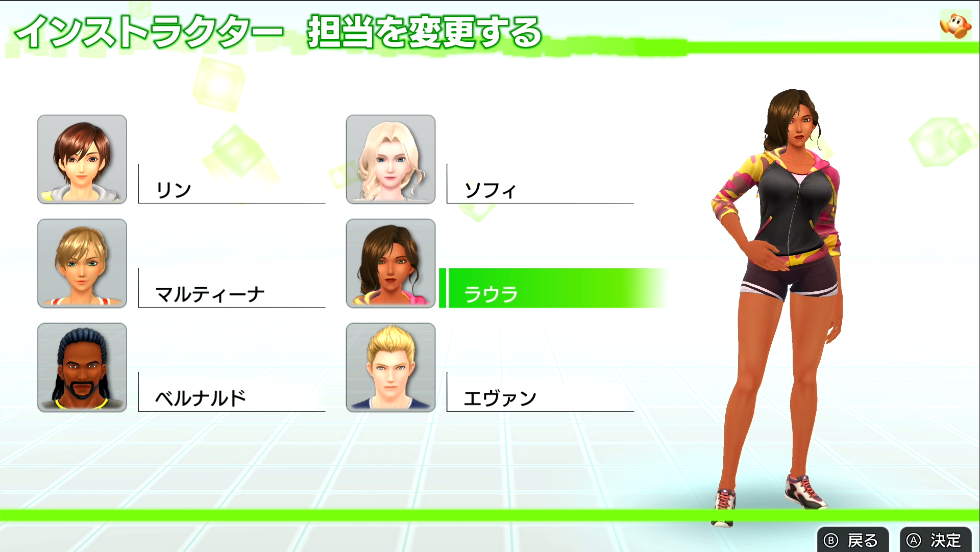

---
categories:
- ゲーム
date: Wed, 05 Aug 2020 05:58:00 +0000
slug: post-13490
tags:
- ゲーム
title: ダイエットにフィットボクシン導入。リングフィットアドベンチャーとの比較
---

日夜体重を減らすためにリングフィットアドベンチャーをやっていますが、どうにも減りが悪い。4月に始めてから最低体重を記録したところまではよかったものの、そこからは一向に増えるばかり。やる時間を増やしたり回数増やしたりしても減りません。そこで新たに導入したのがフィットボクシングです。本日はフォットボクシングのレビューです。
<h2>フィットボクシング</h2>
<strong>ニンテンドースイッチソフトのボクササイズゲームです。</strong>

[itemlink post_id="13491"]

https://youtu.be/Z5cr9_Bd-7Q
<h3>専用コントローラー不要！ソフトだけでプレイできる！</h3>
リングフィットアドベンチャーと違い、<strong>専用コントローラーは不要</strong>です。

<strong>スイッチのコントローラーだけでプレイできます。</strong>

例えば、ダウンロード版を購入すれば、それだけでプレイができます。

ただし、スイッチライトだとコントローラーが本体と一体なのでプレイできないのは一緒です。別途コントローラーが必要となります。
<h3>筋トレというよりもエクササイズ！すぐに筋トレが来たので効果ありそう！</h3>
リングフィットアドベンチャーと違い、筋トレちっくではありません。完全なるボクササイズです。

前、後ろ、前、後ろの軽いフットワークで、音楽と共に流れてくるパンチをタイミングよく繰り出すというものです。

ただ、これが意外とバカにできず、<strong>翌日背中と腕に筋肉痛がしっかりときました。</strong>（さらに次の日は背中全体が筋肉痛に）
<h2>リングフィットアドベンチャーとの比較</h2>
<h3>求める効果はどっち？筋トレ or エクササイズ？</h3>
<strong>リングフィットアドベンチャーは、筋肉増強を目的</strong>としているように思います。
たるんだ体にカツを入れ、叩き直すという感じです。そのためプレイしているとかなりきついです。

それにより、脂肪は減少させ、筋肉を増強します。筋肉量を増やすことで新陳代謝を上げ、黙っていても痩せやすい体になるという寸法です。

一方、数日プレイした感想としてはフィットボクシングは筋トレというよりも完全にエクササイズという印象です。反復運動で脂肪を燃やすというイメージです。
<h3>このゲームのここはちょっとというところ</h3>
<strong>リングフィットアドベンチャーを楽しいと思ってハマっている人が、次のゲームとしてフィットボクシングを手に取ると若干ガッカリするかも</strong>です。

と言いますのも、<strong>フィットボクシングはゲーム性が低く、どちらかというとリズムゲームです。</strong>

リングフィットアドベンチャーと違って密室感が強く、変えられる部分としてはトレーナーの衣装などの見た目くらいです。また、音楽のラインナップも古いです。

変化が乏しく、プレイしていて楽しくありません。

そして個人的に一番強く感じるのは、強くなった感がないことです。

リングフィットアドベンチャーはやり終えた後に、疲労感と共に達成感を感じます。そして数日後に鏡の前で気がつくのです。大きくなった自分に。

フィットボクシングは、どちらかというと程よい疲労感と爽快感です。

このへん、期待しすぎるとガッカリするでしょう。
<h3>フィットボクシングが向いている人</h3>

<ul>
 	<li>リングフィットアドベンチャーで挫折した人</li>
 	<li>単純に体重を落としたい人</li>
 	<li>マンション・アパートの2階以上に住んでて近所迷惑を気にする人</li>
 	<li>リングフィットアドベンチャーだけじゃ物足りない人</li>
</ul>

どちらがキツいかというと間違いなくリングフィットアドベンチャーです。そのため、挫折する人は結構いるんじゃないでしょうか。

上記のような方々には間違いなくおすすめのゲームです。

[itemlink post_id="13491"]
<h2><a href="https://twitter.com/s_s_p_y">しんぺー</a>はこう思った。</h2>
目標体重にはまだ達しませんが、減少傾向にはなんとなくありそうです。

これでその傾斜をさらに急角度にできればと思います！

がんばります。

と言ったところで本日は以上です。おやすみなさい。