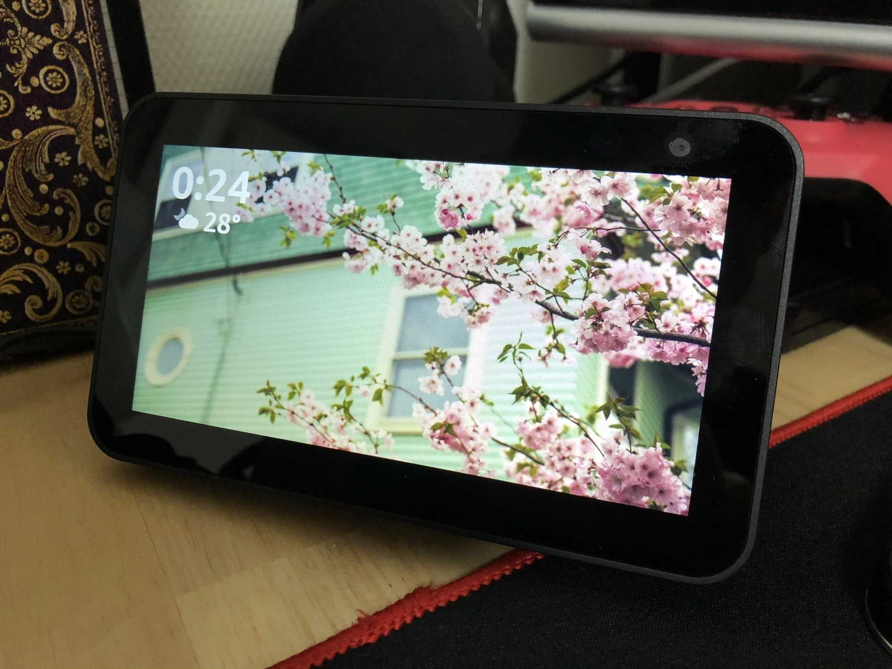
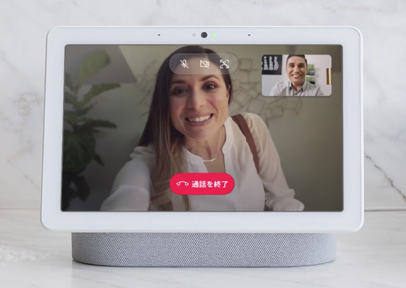
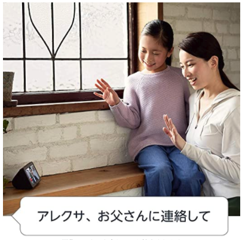
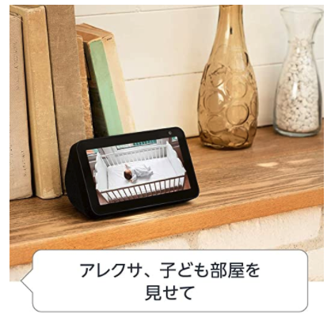
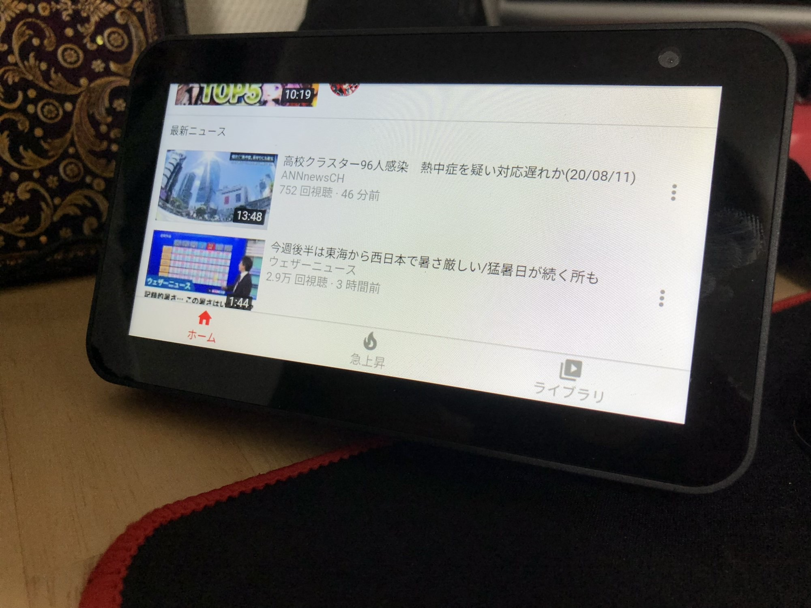
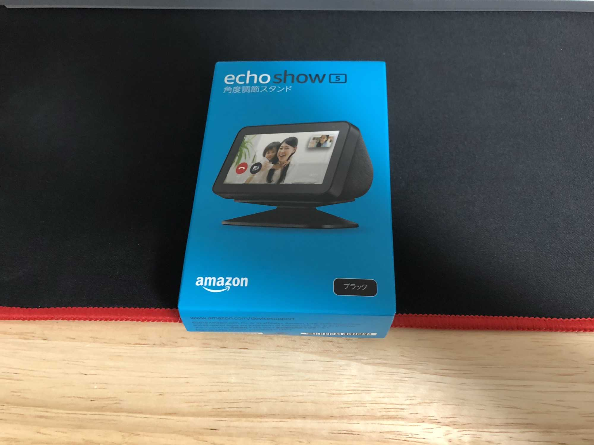
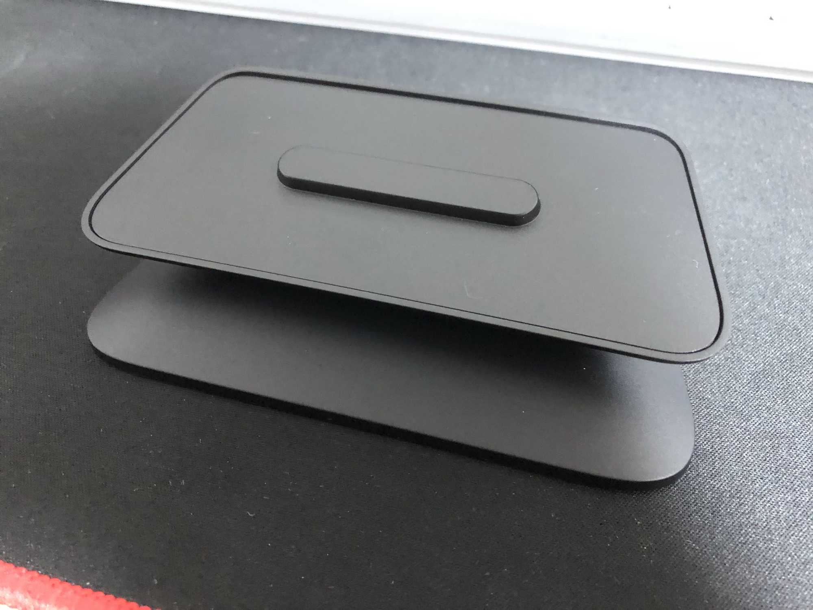
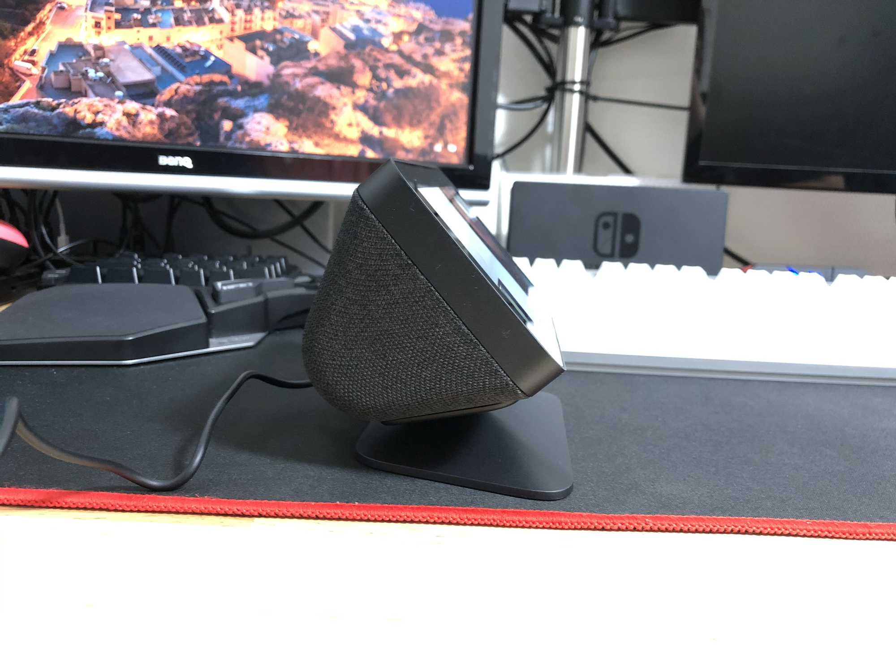
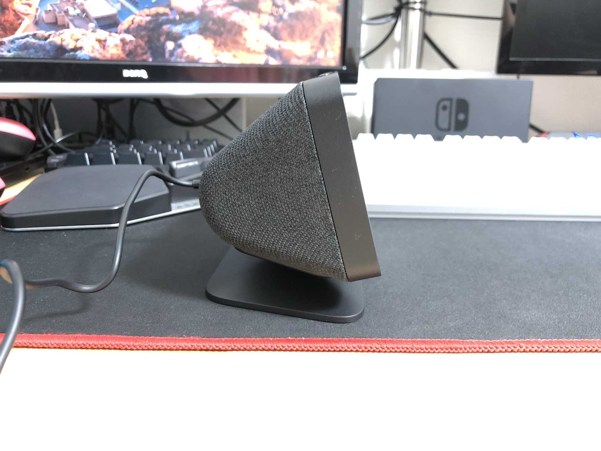

---
categories:
- レビュー
date: Tue, 11 Aug 2020 15:45:36 +0000
slug: post-13501
tags:
- amazon
- ガジェット
title: リモートワークのマストガジェット「Echo Show5」レビュー
---

[caption id="attachment_13503" align="aligncenter" width="2000"] Echo Show5[/caption]

AmazonでEcho Show5が2台で1台の値段で売っていたので買いました！1週間ほど使ってみた感想です。

[itemlink post_id="13505"]

<h2>良いところ</h2>
自宅のスマートスピーカーは全てGoogleを使用しています。ただし<strong>Googleのスマートスピーカーでカメラが搭載しているのは上位機種のNest hub Maxのみ</strong>です。

28,050円と<strong>かなり高額</strong>な印象で、なかなか手が出せません。

一方、<strong>Echo Show5はAmazonのセールの時には大抵半額になります</strong>ので、かなりコスパが良い商品だと言えます。

[itemlink post_id="13505"]

<h3>音声操作で呼び出せるテレビ電話</h3>
まず良いなと思ったところは、音声で「○○に連絡して」などでテレビ電話で相手を呼び出せるところです。

これは在宅ワークを行なっている方向きの機能なんじゃないかなと思いました。
例えば、となりの部屋で子どもが遊んでいるときなど、これを起動させておいて見ておくというような使い方が想定されます。

さらに、遠隔地に両親が住んでいる人などでもこの機能は使えるのではないでしょうか。気軽に連絡を取り合ったり、それこそ帰省がかなわない時など２つ買って１つを実家に送るなどするのもありなのではと思います。

<h3>家の外から確認できる簡易監視カメラ</h3>
外から自宅内のデバイスのカメラを起動することができます。

例えば、外から家にいるペットの様子を確認することもできます。これは呼びかけと呼ばれる機能で、かける相手側のデバイスが電話を取ることをしなくても映像を見ることができます。

そのため、ペットや子どもの確認に適している言えるでしょう。

この画像は、Echo Showから他のEcho Showもしくは対応のカメラに接続して、監視カメラのように使用しているものになります。

もちろん外出時に、スマホのアレクサアプリから家の中のEcho Showに接続して、部屋の中を見ることもできます。

<h2>悪いところ</h2>
Youtubeの使い勝手が悪いことに尽きます。

Amazonのガジェットなので当然と言えば当然です。以前はYoutubeすら見られなかったのが、数年前に対応しました。（両社ともお互いのアプリを拒絶してた）

ただし、Youtubeはブラウザでの視聴となっており、結構見にくいと感じました。

また、Youtube Musicには対応していないみたいなので、Yourube Musicの音楽のみの再生はできません。
<h2>こんな人に多分おすすめ</h2>
<strong>在宅ワークで子どもが別の部屋にいる人</strong>

<strong>遠隔地に両親が住んでてテレビ電話で手軽に連絡をとりたい人</strong>

におすすめのガジェットだと思います。

<h2>Google Nest Hubとの比較</h2>
Nest Hubはスピーカー部分がある分、Echo Show5のサイズ感はひと回り小さいです。

また、Nest Hubに比べると角度が浅いので場合によってはスタンドが必要かもしれません。特に部屋の中を写すために設置する場合は、上むきに映像が写るのでほぼ直角にしないときちんと撮影することができません。

こちらが純正スタンドです。

本体底にくぼみがあって、載せるだけですが割とちゃんと固定してくれます。

ある程度の角度の調節が可能

それでも、<strong>垂直にしてカメラのアングルを良い感じにするには工夫が必要</strong>です。

あと、音声で話したことがテキスト化されて画面にでません。そのためEcho Show側とのコミュニケーションが不安。<strong>喋ったことをどのように認識しているのかが不明瞭です。</strong>

正直それくらいです！ただし、どれも買わない理由にはなりません。

[itemlink post_id="13505"]

<h2><a href="https://twitter.com/s_s_p_y">しんぺー</a>はこう思った。</h2>
机の周りにおいても邪魔にならないサイズ感です。

Youtubeを見る様でなければ小さいサイズは非常にちょうどいいです。

在宅ワーク様に買っておいて損はない製品だと思います！

と言ったところで本日は以上です。
おやすみなさい。