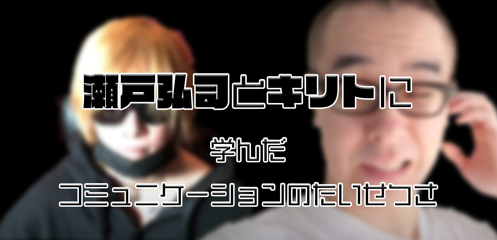

---
categories:
- ブログ
date: Sat, 22 Aug 2020 03:00:17 +0000
slug: post-13520
tags:
- 思ったこと
title: 瀬戸弘司とキリトに学んだコミュニケーションのたいせつさ
---

今の時代しか生きていないのでわからないんだけど、もしかしてコミュニケーションって太古の昔から大事だったりしたの？

大きいところだと昨今の社会情勢、小さいところだと自分の周りのコミュニティなんかを見ていて

コミュニケーションってもしかしてめちゃくちゃ重要なものなんじゃないかと思うようになりました。

なぜそう思ったのかについて、いくつかの事例をご紹介します。

<h2>瀬戸弘司</h2>
コミュニケーションの大切さが確信に変わったのが、Youtuberの瀬戸弘司さんの一件があったからです。

瀬戸弘司はYoutube界の冨樫義博

コンテンツを生み出す変わりに長期間の休養期間が必要になるという制約を負っている能力者だ。

ぼくはYoutubeを見るようになってから瀬戸弘司をずっと見ている。iPhone5Sを買うためにApple Storeに並んだ時、彼も行列に並んでいるということを知り、必死に探して写真を撮ってもらったこともある。

瀬戸弘司は悩んでいた。無理をしている自分に。

Youtubeに上げる動画では、騒ぎ散らし、面白おかしく編集を施す。本来の自分とどこかかけ離れたYoutube上の人格

しかし転機となったのはドリキンさんとの対談

<iframe width="560" height="315" src="https://www.youtube.com/embed/GPPV86Kr4mo" frameborder="0" allow="accelerometer; autoplay; encrypted-media; gyroscope; picture-in-picture" allowfullscreen></iframe>

<iframe width="560" height="315" src="https://www.youtube.com/embed/_kyfuslk-20" frameborder="0" allow="accelerometer; autoplay; encrypted-media; gyroscope; picture-in-picture" allowfullscreen></iframe>

ドリキンさんはサンフランシスコ在住のガジェット系のYoutuberです。エンジニアとして働いていて、散財という名目で日々新しいガジェットを購入しレビューし、使い方を試行錯誤する動画をあげています。

瀬戸弘司さんのあらゆる悩みをこのドリキンさんとの対談を契機に、あらゆる悩みが晴れ始めたようです。

また、個人的に重要だと思うのがこちらの動画。
<iframe width="560" height="315" src="https://www.youtube.com/embed/246nvmy9jYU" frameborder="0" allow="accelerometer; autoplay; encrypted-media; gyroscope; picture-in-picture" allowfullscreen></iframe>

タイトルの「ラジオの身体」という意味を小一時間かけて説明しています。
かなり簡単に要約すると以下の通り。

<ul>
	<li>編集を多様して騒ぎまくる今までのスタイルだと無理が生じてきている</li>
	<li>YouTube視聴スタイルがラジオ感覚に変化してきている</li>
</ul>

そして新たな動画スタイルとして自分の考えや商品紹介を一連の流れで語るvlogとしてアップをしだしました。

これにより瀬戸弘司ネットワークが急激に拡がりを見せ始めました。

チャラン・ポ・ランタンの小春氏や元アリtoキリギリスの石井正則氏などからもメッセージがあり、コラボも行われています。

このながれ全てが瀬戸弘司としてのvlogスタイルに何で移行するのかということを詳細に語っています。

ぼくは、ここにコミュニケーションの重要性をみました。

彼のゲーム実況チャンネルでこのvlogスタイルを導入した結果数字が悪かったそうで、こっちはチューニングをいれていくようです。棲み分けとも言えます。

これこそがコミュニケーション。対話として成立している。

すばらしいなと思いました。

<h2>キリト</h2>
次にAngeloのボーカルのキリトに関してです。

ぼく個人の目に止まる中で、このコロナの状態になってから、最も冷静に情報発信と判断を行っていたのがキリトだったと思います。

Youtubeのチャンネルにおいて、早くから情報発信をし、自身のバンドのツアーなどに関しても早々に中止の判断をくだしていました。また、自粛期間を通して毎日今後のバンドの行方だけではなく、どういう経緯で楽曲をつくったのかやどういう意味なのかなどを事細かに説明をしていました。

さらに、新しい世界に向けてどう覚悟して、どう動いていくのかを明示し、その流れで実際にストリーミングライブを段階的に行い、それを示しました。

キリトは元々PIERROTというバンドをやっていました。しかし過去突如の解散、その後Angeloを結成しました。ぼくはPIERROTのファンでしたが、どうしてもAngeloに向き合うことができませんでした。ずっと曲を聴くことをできませんでした。

しかし、真摯に語るキリトの動画を通して「そういえばこの人こういう人だったな。何も、何１つ変わってないんだ。」ということを知り、Angeloの楽曲を聴き今ではすっかり虜になりました。

ミュージシャンだから楽曲で語ればいいはず。だけど、敢えてその説明を今後の方針に絡めて丁寧に説明を行いました。

この丁寧さこそコミュニケーションの大切さを伺わせます。

楽曲だけで語ればいい、バンドのページにお知らせだけ貼ればいい。多分それだけでいいはずです。

でも、自身の言葉。今、この瞬間に、口から吐かれるその言葉を通して、まことの想いを伝えるということが絶対的に必要だったんだと思います。

なんせ、Angeloのファンじゃなかったぼくが楽曲に触れ、そしてファンになったのだからこの取り組み自体は絶対的に正しかったんだろうと思います。

<iframe width="560" height="315" src="https://www.youtube.com/embed/2BOHPwrcloo" frameborder="0" allow="accelerometer; autoplay; encrypted-media; gyroscope; picture-in-picture" allowfullscreen></iframe>

<iframe width="560" height="315" src="https://www.youtube.com/embed/-H1Z6rdGwrU" frameborder="0" allow="accelerometer; autoplay; encrypted-media; gyroscope; picture-in-picture" allowfullscreen></iframe>

<iframe width="560" height="315" src="https://www.youtube.com/embed/RVi_uUGyHTo" frameborder="0" allow="accelerometer; autoplay; encrypted-media; gyroscope; picture-in-picture" allowfullscreen></iframe>

<h2>コミュニケーションの失敗例</h2>
どこのバンドとは言いませんが、直近でコミュニケーションの失敗と感じた事例がありました。ファンに対してろくに説明もなしに、ツアー開催か中止かの判断も直前までせずに、さらに感染予防対策に対してクラウドファンディングを行い、その振込先がメンバー個人、かつ集まった分の対策しかしないし、ツアーが万が一中止になったとしても返金はしませんというものでした。

百歩譲ってそれがいいとしても、メンバーも毎日Youtubeで配信をしていたにもかかわらず、一切説明がなかったようです。あったのは最後の方で１回だけ。
ぼくもみましたが、大丈夫だと思ったんでやります。国もGoTOキャンペーンとかやってるってことは大丈夫ってことなのでやります。みたいな。

何か、どれもこれもがそこじゃねーだろ感で満載でした。

コミュニケーションの欠如を感じました。

時間をかけてファンに対して情報開示と共有を行っていれば、ハレーションは小さくなっていたはずです。

ぼくの身近なところでもこういうことはありました。会社で大きなプロジェクトが進行していたはずですが、直前まで社員には情報が共有されず、リリースの前になっていきなり駆り出されて、色々やらされる。
情報を共有すらされてこなかった人たちとしては、不満が噴出してまとまらなくなってしまう。

これも時間をかけてコミュニケーションをとっていれば回避できたはずです。

なんのためにコミュニケーションをとるのかというと、それは共通の認識を構築するためだとぼくは思います。

色んな価値観や人格がある中で、意志の統合を図るのはやっぱり、丁寧なコミュニケーションをとるしかないのです。

<h2><a href="https://twitter.com/s_s_p_y">しんぺー</a>はこう思った。</h2>。
コロナの状態になってから、よりはっきりと感じています。

コミュニケーションが以前よりも不自由になったということを。

思い浮かべてみてください。コンビニのレジとお客さんの間にビニールの遮蔽物があるでしょ？しかも、お互いにマスクをしています。
当然声が届きにくいわけです。

あれが正にコミュニケーションが今までよりも不自由になったことの象徴だと思います。

今まで通りでは伝わりにくくなったのです。

だからこそ、今までとは違ったやり方でコミュニケーションをとるべきなのです。コンビニの場合だと少し大きな声をだしたり、うなずく仕草を大きくしたりとか。

ノンバーバルコミュニケーションが使いにくいこんな時代だからこそ、相手のことを思いやって行うコミュニケーションをとるべきです。

と言ったところで本日は以上になります。
おやすみなさい。