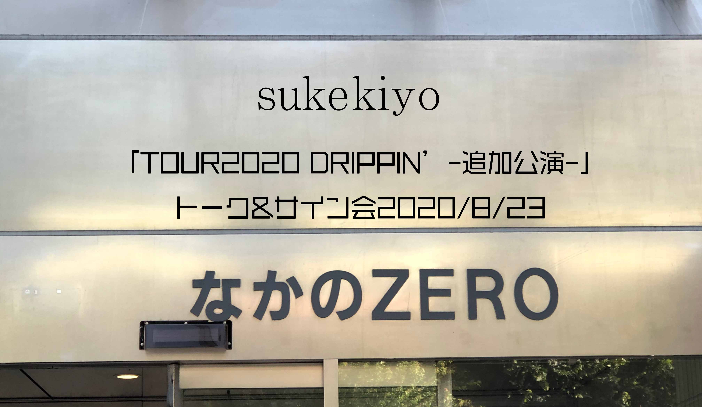

---
categories:
- sukekiyoのイベントレポ
date: Mon, 24 Aug 2020 16:45:24 +0000
slug: post-13530
tags:
- sukekiyo
- イベントレポ
- レポ
title: 【イベントレポ】sukekiyo「TOUR2020 DRIPPIN’-追加公演-」トーク&サイン会2020_8_23＠なかのZERO大ホール
---

3月に予定していたsukekiyo「TOUR2020 DRIPPIN’ -追加公演-」SHIBUYA O-EAST公演がコロナウィルスの影響にて中止となりました。

その振替として開催されたのが、今回のトーク&サイン会です。今回はそのイベントレポートです。

<h2>会場の様子</h2>
O-EASTのキャパが1300人、なかのZERO大ホールのキャパも1300人でチケット持っている全員が来ても収容できる会場でした。ただし、諸事情（後述）により最後の方に入場したので見ていたところ、おそらくですが半分くらいの人数だったでのはないかと思われます。

番号がいつも通り区切って呼ばれていましたが、そこで動く人がほとんどいないなどありました。また、会場内ではほとんどの人が席を１つずつ離して座っていましたので、半分程度の人が来たものと思われます。Twitterを見ていても遠方や都内に関わらず自粛する方も少なくなかったように感じました。

ただ、時間がかなりかかってしまい開演時間が20〜30分くらい押してしまったようです。

<h3>会場の感染予防対策に関して</h3>
<ul>
	<li>入場前に申告フォームへの情報入力</li>

	<li>各所でのアルコール消毒（入場時、列待機時、サイン前）</li>

	<li>入場時検温</li>

	<li>待機中のソーシャルディスタンス</li>

</ul>

おそらく一般的なもので、しっかりとした対策（？）がなされていました。

<h2>トークのレポ</h2>
メンバーは下手から
匠

未架

京

Yuchi

utA

の順番で、机は3つ並べてありました。

匠の服装はこちら
https://twitter.com/sukekiyo_band/status/1297511363711926273?s=20

未架はゆったりしたTシャツに何かプリントされたもの

京は緑っぽい柄シャツで黒髪の多分ツーブロック？ぽい感じでぴっちりした髪型（遠目で分からず）。多分サングラスしてたかなと。

Yuchiは黒Tシャツに何かプリントされてた。未架と同じかなと思ったけど別ものでした。

utAは黒いシャツ。ビビッドな多分赤のソックス。

以下レポートは順番バラバラかつ記憶あいまい

自粛期間中何してましたか？
ウ:TV観てました。録画している番組が常時10個くらいあるのでその消化。
　凄い太った。
ユ:でも誤差レベルでしょ？
ウ:いや歳のせいなのかショック受けるくらい太ったので、筋トレしてた。あと曲作りも

ユ:曲作り。Rock and Readの撮影。
匠:よかった。(電話して感想を言ったらしい。)
未:ぼくも買いました。

京:16、17くらいからずっとライブやってきてて、これだけ開いたことなかったのでなまってしまってすぐ息切れするようになって、急いでタバコやめた。
Fortnite。ずっとやってる。ゲームゲームゲームご飯ゲームゲーム。上手くない。友達4人でやってる。全員すぐやられる。中華マン？のスキン使って、人数が少なくなるまで隠れて、少なくなったら突っ込んですぐやられる。

全員同じスキンで全員で隠れて、見つかったらデコイだして逃げる。
野良で小学生とマッチしてやったり。

未:PCエンジンミニを買った。レトロ好きなので、横スクロールのシューティングが好き。グラディウスとR type(？よく聞き取れなかった)

匠:使ってない機材を某オークションで売ってた。詳細な説明などをつけて出品していた。楽器屋さんに二束三文で売るよりも、必要な人に使ってもらった方がいいと思って。ただ見ていると欲しくなってきちゃって売った分買っちゃいました。

京:16、17くらいからずっとライブやって来てて、これだけ何もないってことがなかったんで、体が鈍ってすぐ息が切れるようになったんで、さすがに慌ててタバコをやめた。

筋トレは一切してない。時間ある時にするよりも、忙しい時にやりたい。今はとにかくゲーム。

ツアーの思い出を聞かれて
ウ：前すぎて何も覚えていない。

京:福岡の記憶はイカ。天ぷらを頼んだら、海老のあとにイカでてきた。普通天ぷらのメインはエだと思ってたから、わかってないなと思ってイラついた。で食べたらびっくりするくらい美味しかった。
名古屋は頼んだドーナツがなくて気分悪かった。ザラメのドーナツにベーコン巻いてあるやつ。
ユ:今日は凄いのあるからって、みんなの期待を背負ってた。
京:渋谷は二郎鍋(?)を頼むつもりだった。

今後
京：音源出したい。2-3曲。デモテープで。でもCD-Rくらいはつけるかも
(この時だったか忘れましたが)ホール公演来たいですか？来る人ー。ほんとに？もし来なかったら2度とやらない。こういう小さいところから人間不信が始まってく

ユ：循環したい。曲作ってライブやって。バンドの変化が緩やかになってる。今まではその場で話してすぐにできてたけど。

ウ:sukekiyoにしか作れない曲をやりたい。全体の流れは京さんが作ってくれるから、自分は変態な曲つくるしかない。自分は不器用なんでそれしかない。
(ヒーローものの新作発表会の主人公役の人がするような発言だった。何となくいつも眠そうなウタさんが、少し気合いというか何となく想いが感じられた。今思えば。)

未:アイデアは溜まってる

匠:サブスク解禁したので、下世話な話になるけど新たな展開としてそっちでも聞いてくれたら。

京:ずっと家にいるとおかしくなってきて、あんまり嬉しいとか思わないんですが、今日はこうやってたくさんの人が来てくれて、求められてるんだなと。嬉しい。

（どのタイミングだったか、高林さんからのLINEに気がついた匠が「あと10分でお願いしますって8分前に来てるんですが」京「今日は久しぶりだから長めにっていってあるから、まだいいんじゃない」その後、ラインの着信が鳴り響き、匠「ぼく絵文字から感情を読み取るのが苦手なんですが。真顔（マダオ？）の絵文字が」未「ダメですね」京「ダメやね」

最後、京
今年が終わるころに何もやらなかったなーってならないように。ちびまるこちゃんみたと思ったらまたちびまるこちゃんやってて、もう！？みたいなのあるでしょ。振り返って、今年何もなかったってなるのが一番悲しい。誰も悪くないし、皆んな正しい（意訳。そんなことを言ってたような）。そうならないように生きて

https://twitter.com/s_s_p_y/status/1297670902146981889?s=21

あと、どこかでもちの食べすぎ注意みたいな話をしてた。砂糖醤油で何度も焼いて食べる。それで顔だけ太ったことがあって、ユ「それカウントダウンジャパン出た時に行ってましたね。もちの食べ過ぎ注意やで」

<h3>サイン会</h3>
その後、メンバーがはけ、会場は順番に退場しホールに整列。ぐるっとソーシャルディスタンスを保ちながら長い列。
どうサインするのか、予め書いたものが配られてメンバーが立ってるだけかなーとか思ったら、まさかの目の前で書いてくれました。
ビニールカーテン越しに一人一人がリレーで回して最後は京がおなじみのイラストorサインなどを書きました。

この時印象的だったのがYuchiで一人一人目をみて会釈してから書いてくれました。が、京のところで一人一人違うサインを書いていたため大渋滞発生し、結果的にYuchiが書いてくれたものは自分のものではないみたいな（多分これほとんどの人がそうだったはずw）感じになっていました。

なお、ぼくは普通のサインでした。

<h2><a href="https://twitter.com/s_s_p_y">しんぺー</a>はこう思った。</h2>
今回のツアーは、ぼくにしてはかなり珍しく遠征の予定を組みまくっていました。全公演とまではいかないまでも、福岡とか行ったことのない地方に行くつもりでいました。

しかし、結局は初日のマイナビBLITZ赤坂のみの参列。マスク着用でのライブは初めてでした。まだコロナが今ほど騒がれる世の中ではなかったものの、中国の状況が伝えられ日本でもだんだんと感染者数が増えていった時期でもありました。
のるにのれず、マスクをしている人もまぁまぁいて、確かノリが悪いため京がブチ切れていた記憶があります。

[st-card id=13168 ]

その後の公演のチケットは全てお譲りし、そしてコロナがいよいよ余談を許さないような感じになり、バタバタしてて追加公演のチケットも郵送されてくるものと思っていました。
しかし！なんとここだけ発券！！！！発券忘れました！！！ってかDIRのぴあアリーナもクレカ払いだと思ってたら、入金で忘れてたし。。。

ということでお問い合わせしたところ、京オンラインでの購入だったためか、入場させていただくこととなりました。よかった。

入場時に係の方々に大変なご迷惑をおかけしたことをお詫びと御礼申し上げます。
あと、サインの手前でチケットの半券？をみんな見せている中、自分持ってないので、高林さんにその旨伝えたところ「あ、聞いてます」みたいな感じで、マネージャーにまで何かのご迷惑をおかけしてしまったのではないかと思い焦った。。。

閑話休題

サインをいただく時、本当は京に伝えたいことがあって。ゲームやってるならラストオブアス2絶対好きだと思うのでおすすめですよ！って。
でも、鳥居ちゃん各位常識人でほとんどの人が口をつぐんで足ばやに去っていってました。当然、ぼくもマスクの中で「ありがとうございます」と行ってすぐに会場を出ました。

出てから、サインを見返して何となくこみ上げるものがありました。
会場に流れる曲、Yuchiの会釈、ぼくにとっての日常だったものが確かにそこにはあって、多分他のファンの方々にとっても同じで、それはメンバーにとっても同じだったんだなと思うと何か泣きそうになりました。

それと今思い返すとutAの雰囲気もいつもと違ってる感じがして、ぽわーっとして眠そうな感じではあったものの、次に向けてのコメントがやっぱりどこか力強く、ヒーローのように感じました。

日常はもう戻らないかもしれない。

でも、ライブがない世界なんて生きていてもしょうがない。音楽があるから生きてこれた。
だから危険でも少しずつ、足を踏み出していかないといけない。

日常を取り戻すために。

そう思いました。

と言ったところで本日は以上です。おやすみなさい。
[itemlink post_id="13429"]