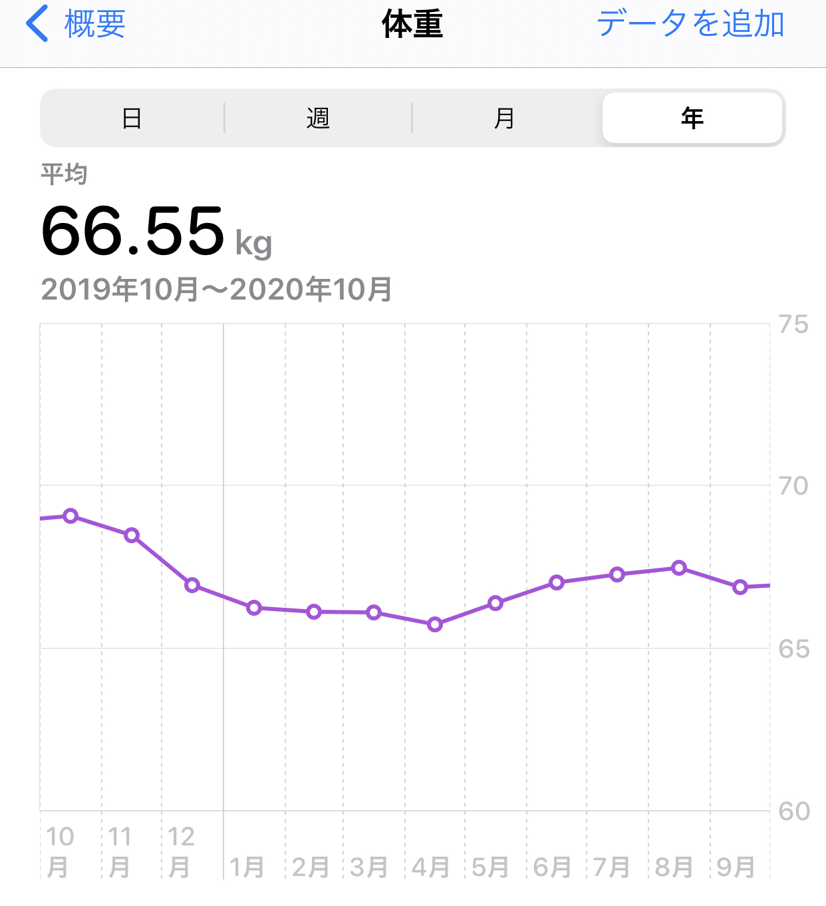
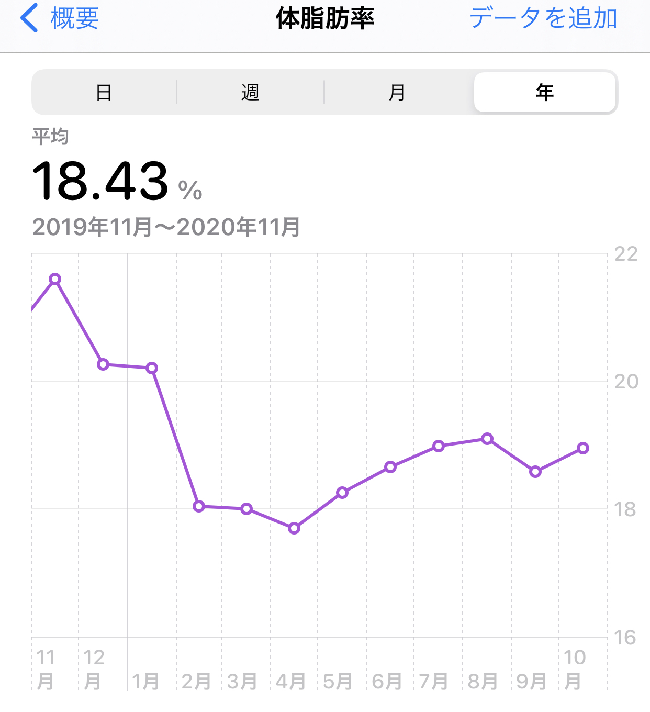
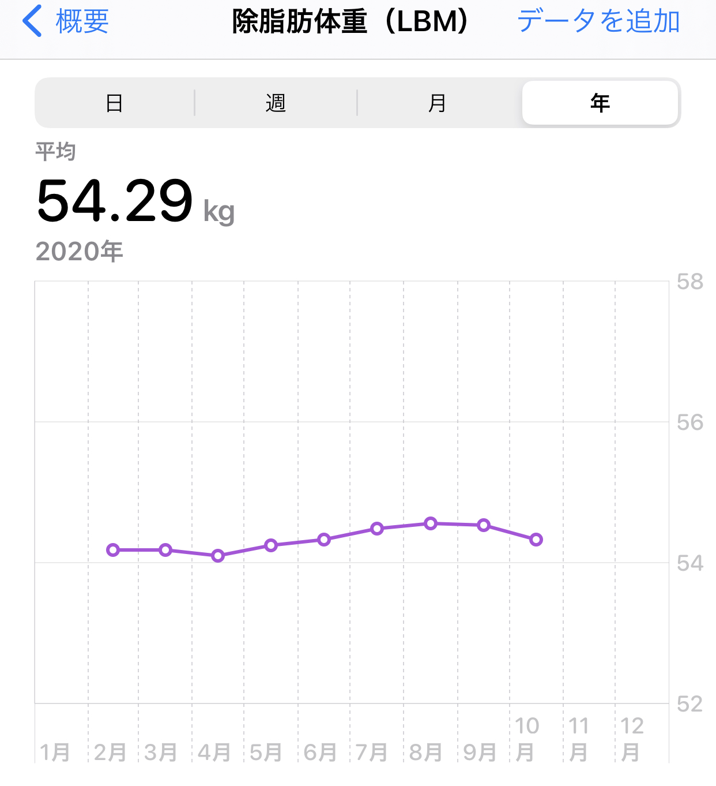

---
categories:
- ゲーム
date: Mon, 19 Oct 2020 02:21:32 +0000
slug: post-13596
tags:
- ゲーム
- ダイエット
title: リングフィットアドベンチャーでダイエット成功（70kg→65kg）
---

まず最初にこの記事の概要です。

	<li>リングフィットアドベンチャーを使ってダイエットをした</li>

	<li>70kgから65kgになった</li>

	<li>取り組んだ期間は1年間</li>

人生で初めてちゃんとダイエットに取り組んだ一年間でした。それではどうぞ。

<h2>ダイエットに取り組もうと思った経緯</h2>
2019年11月、会社の健康診断で体重が人生の未踏領域に到達。

このままだと、どんどん増えていきそうだと悟り、本格的にダイエットを決意しました。

当時発売したばかりで、話題になりはじめていたリングフィットアドベンチャーを購入し、本格的にダイエットスタート。

[itemlink post_id="12937"]

<h2>リングフィットアドベンチャーとは？</h2>
<strong>リングフィットアドベンチャーはニンテンドースイッチ専用ソフトです。専用のリングコントローラーにコントローラーを装着してプレイします。</strong>

そのため、基本的にはニンテンドースイッチ liteでプレイしないことをおすすめします。プレイ自体はコントローラーがあればできるみたいです。

なお、コロナによる世界的なステイホームの影響で品薄の状態が長らく続いていました。みんなお家で体を動かすために購入しているのでしょう。

[st-card id=12930 ]

<h3>ゲーム内容</h3>
このゲームは単純なエクササイズゲームではありません。本格的な筋トレゲームです。

腕、足、腹筋を中心にランニング、スクワット、プランクさらにリングコントローラー(リングコン)を使った腕の筋トレなどを行います。

プレイした後はシャワー必須です。ぼくはチュートリアルで汗だくになりました。

<h3>おもしろいのか？</h3>
おもしろいです。

エクササイズゲームにありがちなミニゲームの寄せ集めではありません。

しっかりとしたストーリーがあります。

ドラゴという敵が世界を混沌に陥れようと企み、それを防ぐために主人公とリング(精霊？)が協力して戦うという感じです。

ストーリーにも起伏があり、様々なキャラクターが出てきて、普通に面白いです。

<h3>クリア後レビュー</h3>
だいたい1ステージを1〜3日に1回くらいのペースでプレイしていました。それで1年くらいかかりました。

しっかりと体重に変化が出るのでやっていて達成感がありました。最終ステージでは、この1年の自分の歩みを振り返り、随分と成長したんじゃないかと感慨深くなりました。

実は最終ステージをプレイするまで恐れていたことがあります。

それは、このゲームをクリアしてしまったら、どこでぼくは筋トレをしたらいいのか？ということです。

幸いにも今はエクストラステージと達成度を100%にするべく新たに取り組んでいますが、それすら終わってしまったら、いよいよゴールドジムあたりに通わねばならないのではないでしょうか。

ぼくの体がたぶんそれを求めている気がします。それよりも早く続編が出てくれることを祈ります。

<h2>で、実際やせられるのか？</h2>
さて、実際の数値の変動について紹介しておきたいと思います。

結論は冒頭でも書いた通り、体重が減りました＝やせました。

ただし、自分の体を数値化する事で色々と気がついたことや知らなかったことに触れたりできました。

<h3>実際の数値変動がこちら</h3>
リングフィットアドベンチャーでダイエットを始めたのが、2019年11月です。約70kgからのスタートです。

（11月はプレイ開始後の数値を含んでいるため、実質10月が一番おもかった）

今思い返すと、これ月単位のグラフで見ているから減っているように見えるだけで、当初は全く体重に変化が現れず、毎日イラだっていました。

その後2020年1月に酷い胃腸炎にかかってしまいます。それにより、体重がガクッと減少しました。

体脂肪率も減少

その後4月に向かってそのまま体重含めその他の数字も減少し続けます。

この頃にはプロテインを飲むようになり、食べるものにも気を使うようになっていました。また、水も意識的に多く摂取するようにしていました。

ところが4月以降どういうわけか体重の減りが鈍くなります。それどころか、増える一方。これには相当焦りました。

コロナによるステイホームのストレス？停滞期？リバウンド？

分かりませんが、筋肉量が増加傾向だったことを鑑みるに筋肉が増えた？のかもしれません。筋肉は脂肪よりも重いそうです。

[st-card id=13152 ]

そして、体重を強制的に減らすべく色々と試行錯誤が始まります。

その一つが炭水化物抜きです。

しかし、これが裏目に出て体重が69kg近くをマーク。元の木阿弥。

この時やっていたあることが体重増加の原因でした。それは自炊。

炭水化物を抜いているため、お腹が減らないようにとお昼自分で肉をたくさん焼いたりして食べたいました。

しかし、料理なぞろくにしたこともそんなにないので、味が濃くなる。塩分過多。

にも関わらず1日に、水を2リットル以上飲むように努めていました。その結果が体重増です。

血中塩分濃度が高まると、それを薄めようとする作用から水分を体内にとどめるようになるらしいです。つまりは水太りというやつですね。

いやー、知らない事を1つ知ることができました。

よくバランスの良い食事をと言われますが、まさにその通りでした。その後は食生活を普通に戻し、リングフィットアドベンチャーに取り組む時間を増やしました。

その甲斐あって、身体測定では目標にしていた65kg台をマークすることに成功します。

こうして1年に及ぶ僕のダイエットは成功をおさめることができました。

<h2>ダイエットをはじめて変わったこと</h2>
ここではダイエットをはじめたことで変わった体以外の変化を紹介します。

<h3>自分の体に興味を持った</h3>
自分の体の内部について今まで以上に関心を持つようになりました。

その結果、活動量計と体組成計を購入しました。

活動量計では心拍数や睡眠のモニタリングなどをして自らの体の変化を数字で観察しました。
[itemlink post_id="13091"]
<a href="https://www.warawareotoko.com/2020/01/22/post-13075/" rel="noopener noreferrer" target="_blank">レビュー記事はこちら</a>

また体組成計に関しては、ダイエットする上では必須だと思いました。自分の努力を数字で把握することはモチベーションに大きく関わります。絶対に必要なアイテムです。
[itemlink post_id="13183"]
<a href="https://www.warawareotoko.com/2020/03/02/post-13177/" rel="noopener noreferrer" target="_blank">レビュー記事はこちら</a>

<h3>料理を始めた</h3>
食べるものに気を使うようになりました。そして、外食するともれなく多くなるのが炭水化物や脂質です。加えて不足しがちなのが野菜

この辺については、もはや自炊していくことで解決を図っていくしかないと思いました。外でバランスの良い食事とろうと思うと高くなるし。

<h2>弱い自分との付き合い方と殺し方</h2>
最後にダイエットを続けるためのテクニックを紹介します。

強い意志やら根性が必要だとぼくは信じています。弱い自分を叩き殺して生まれ変わることでしか成長はありえません。

でも、ずっといつまでも強い自分でいられるわけではない。ふとした瞬間に強かった自分がいなくなることなどザラにあります。

だからこそ、習慣化が大切です。

空気を吸うように筋トレをするのです。空気を吸うようにSwitchの電源を入れて、リングコンにコントローラーを設置するのです。

在宅勤務が始まってから、定時で仕事終わったその瞬間にSwitchの電源を入れ、リングフィットのオープニングの音を聞く、あの瞬間が病みつきになりました。

習慣化することで、やる理由もやらない理由も消滅します。そこにはただやることしかありません。

ただ、習慣化するまでは根性しかないかなと思いますが。

[st-card id=12990 ]
<h2><a href="https://twitter.com/s_s_p_y">しんぺー</a>はこう思った。</h2>
さて、目標体重には達しましたがまだまだぼくのダイエットは続きます。

次は59kgを目指します。できれば年内か年明けくらいまでに。

まだまだ、頑張ります。

といったところで本日は以上です。
おやすみなさい。

[itemlink post_id="12937"]