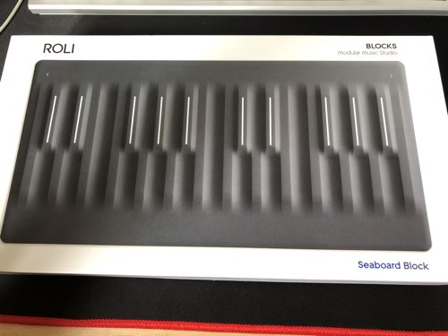

---
categories:
- レビュー
date: Sun, 01 Nov 2020 09:16:52 +0000
slug: post-13610
tags:
- ガジェット
title: ROLIのSEABOARDというキーボードを買いました
---

ROLIというメーカーから出ているSEABOARD BLOCKというMIDIキーボードを買いました。

楽器の経験はほとんどありません。小さい頃にピアノを習っていたのと、学生の頃ギターを持ってたくらいで、コードもわからないし曲も何も弾けません。

そんなぼくがなぜMIDIキーボードを買おうかと思ったのか、そしてこのSEABOARDを買ったのかについて書きたいと思います。

楽器の知識ゼロなので、間違っているところがあるかもしれませんが。

<h2>SEABORADとは？</h2>
[itemlink post_id="13612"]
（買ったのはこのモデルじゃなくて、1番安いモデル。しかもヤフオクで購入しました。）
MIDIキーボードとは単体では動かず、パソコンなどに接続させることで演奏できるキーボードのことです。
鍵盤がピアノのように分かれておらず、全てつながっているかのようなデザインをしています。

https://youtu.be/6SCug5kUsBs

変わっている機能としては、普通に押して弾く他に、指を震わせることでギターのように音を震えさせるようなこともできます。
また、キーボードを押したあとになぞることで、弦楽器のフレットを音を上げたり下げたりしながら指をずらすような音を出すことができます。

海外メーカーなのと楽器の知識がないので、よくわかりませんが、どうやら上記のような感じで5種類の弾き方ができるらしいです。
多分ギターのピアノ版みたいなものだと思えばわかりやすいかも

<h3>iPhoneアプリにつなげて弾く</h3>
https://youtu.be/N1iq9VGkdzk

PC用アプリを使って、有線もしくは無線でつなげて弾くわけですが、iPhoneのアプリに接続させても弾けます。
そのため、持ち歩いて外で弾くこともできます。

また、本体以外に別売のコントローラーみたいなものや、パッドのようなものあるようで、その辺りも買ったら楽しそうです。
おそらく、その辺の機能自体はだいたいアプリでもできるっぽいですが。

なんせ海外メーカーで国内でも情報がほとんどないので、よくわかりませんが。。。

<h2>楽器経験ほぼゼロなのに何で買おうと思ったのか</h2>
Youtubeで見かけた瞬間からずっと気になっていました。楽器を弾きたいなんて思ったわけじゃありません。
ただ、ガジェットとしてかっこいい！ほしい！と純粋に思っただけでした。

まず見た目がかっこいい。シンプルで余計なものが一切ない！それだけでガジェットとして完成されている気がしました。

<h2>弾いてみてびっくり楽しい</h2>
とりあえず楽器を買ったからには練習をしているんですが、これが楽しい！
楽器の演奏ってこんなに楽しかったんですね。生まれて初めて知りました。

とりあえずTwiceの曲を練習しています。

キーボードが小さいので両手で弾くわけじゃないので、多分正式には左手のぶんを先に弾いて録音して、それに合わせて右手を弾くとかって感じなんでしょうね。
瀬戸弘司とかが動画でやってる感じ、リズムとかを作っておいて、あとからメロディを弾くみたいな。

今後、練習していろいろ弾けるようになりたいです。

<h2><a href="https://twitter.com/s_s_p_y">しんぺー</a>はこう思った。</h2>
今練習しているのはTwiceのFeel Specialです。

弾けるようになったら、涼宮ハルヒのGod Knowsを練習したい。そのあとはFinal Fantasy Vのビッグブリッジの死闘。
この辺りを頑張りたいです。

と言ったところで本日は以上です。
おやすみなさい。