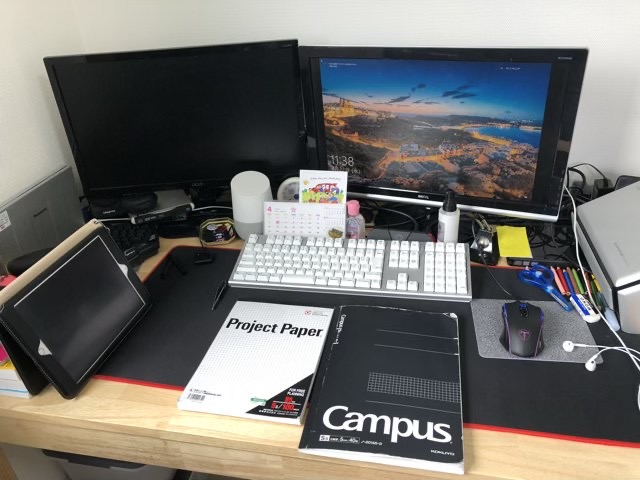
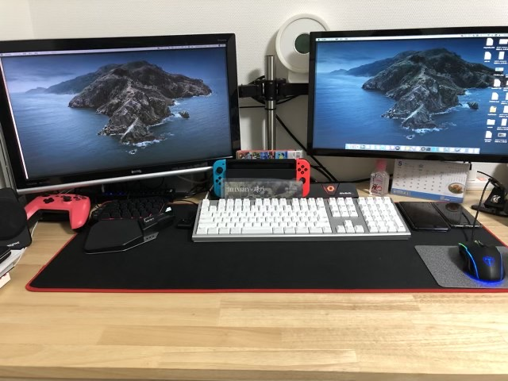
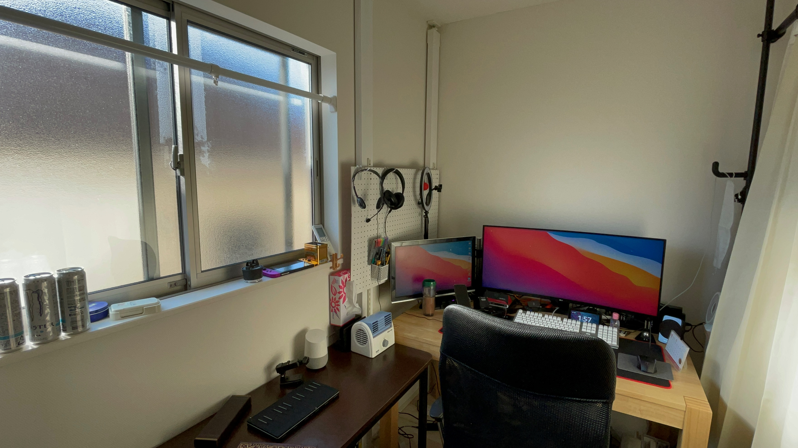

---
categories:
- レビュー
date: Wed, 02 Dec 2020 12:00:00 +0000
slug: post-13695
tags:
- テレワーク
title: 2020年11月版のデスク環境紹介
---

今年の4月くらいから始まったテレワークですが、ぼく自身はまだ継続中です。このまま永遠に続いて欲しいところです。開始当初は、作業環境に関して最低限の費用で構築をしたのですが、今回大幅にアップデートを行なったのでご紹介したいと思います。

<h2>アップデートビフォーアフター</h2>
こちらが4月くらいの状態です。

古いディスプレイを引っ張り出してきてデュアルモニター化しています。片っぽに会社のノートPC、もう一方に自分のMacをつなげて、キーボードとマウスを切り替えながら使っていました。

そのあとモニターアームを導入して少しアップデート

そして、これが2020年11月末時点の状態です。

具体的には、「ウルトラワイドモニターを導入」「壁にボードを取り付け」「サイドテーブルを設置」「カーテンで部屋を間仕切り設置」を行いました。

<h3>ウルトラワイドモニター</h3>
[itemlink post_id="13680"]
LGの35WN75C-Bという曲面うルトラワイドモニターです。

両端が曲がっていて、ゲームなどをやるときに没入感が増すようになっています。写真編集などを行う人にとっては、正確な編集に支障をきたすかもということで嫌われるみたいです。ただ、ぼくは仕事とそのほかゲームなどで使う予定だし、1万円くらいの違いなので、思い切って曲面にしました。

これが設置してみてびっくり。

非常によいです。

デスクの前に座るだけで、なんだかクリエィティブな気分になってモチベーションがあがります。

ゲームはまだやっていませんが、映画とかみてもこれはいいかもしれません。

<h3>ラブリコでDIY</h3>
[itemlink post_id="13699"]

ツーバイフォーと呼ばれる規格の木材を壁に立てる際に使うのがラブリコという製品です。他にもディアウォールという商品も有名です。DIYをやろうと思う人ならおそらく知ってるんじゃないかと思います。

ツーバイフォーは塗装済みのものを楽天で購入。ホームセンターで買うと持って帰ってこなくちゃいけないのが、ちょっとめんどいと思い、通販で買いました。
<!--<table border="0" cellpadding="0" cellspacing="0"><tr><td>
<table><tr><td style="width:240px"></td><td style="vertical-align:top;width:248px;">
<a href="https://hb.afl.rakuten.co.jp/ichiba/1dd7dd06.858e3a13.1dd7dd07.19b0889c/?pc=https%3A%2F%2Fitem.rakuten.co.jp%2Fipcdiylab%2Fww248w%2F&link_type=picttext&ut=eyJwYWdlIjoiaXRlbSIsInR5cGUiOiJwaWN0dGV4dCIsInNpemUiOiIyNDB4MjQwIiwibmFtIjoxLCJuYW1wIjoicmlnaHQiLCJjb20iOjEsImNvbXAiOiJkb3duIiwicHJpY2UiOjEsImJvciI6MSwiY29sIjoxLCJiYnRuIjoxLCJwcm9kIjowLCJhbXAiOmZhbHNlfQ%3D%3D" target="_blank" rel="nofollow sponsored noopener noreferrer" style="word-wrap:break-word;">ホワイト塗装済みツーバイフォー材（2x4）約38ミリ X 89ミリ X 2400ミリ LABRICO（ラブリコ）／ディアウォール／ウォリスト用</a> 価格：4290円（税込、送料別) (2020/12/1時点)

<a href="https://hb.afl.rakuten.co.jp/ichiba/1dd7dd06.858e3a13.1dd7dd07.19b0889c/?pc=https%3A%2F%2Fitem.rakuten.co.jp%2Fipcdiylab%2Fww248w%2F%3Fscid%3Daf_pc_bbtn&link_type=picttext&ut=eyJwYWdlIjoiaXRlbSIsInR5cGUiOiJwaWN0dGV4dCIsInNpemUiOiIyNDB4MjQwIiwibmFtIjoxLCJuYW1wIjoicmlnaHQiLCJjb20iOjEsImNvbXAiOiJkb3duIiwicHJpY2UiOjEsImJvciI6MSwiY29sIjoxLCJiYnRuIjoxLCJwcm9kIjowLCJhbXAiOmZhbHNlfQ==" target="_blank" rel="nofollow sponsored noopener noreferrer" style="word-wrap:break-word;">
楽天で購入
</a>
</td></tr></table>
 

</td></tr></table>-->

壁を傷つけることなく、部屋に柱を立てたり、棚を作ったりすることができます。

これを使って前からやりたかった、有孔ボードに色々ひっかけて、デスクの上を整理するやつをやりました。

実はこの後もまだ追加で手を加えようと思っていて、簡易的な棚を作ろうと思っています。

<h3>サイドテーブル</h3>
本当はこのテーブルをDIYしようと思っていました。しかしYoutubeで参考動画等を見るうちに、その工程の煩雑さを知り、結局買うことにしました。

でも、買って正解。

[itemlink post_id="13696"]

耐荷重も80kgあって、揺れないし、デザインもグッド。

気に入りました。

<h3>室内にカーテンで間仕切り</h3>
ノイズキャンセリングヘッドホンがあるので、防音に関してはそこまで必要性はないのですが、ただ少しでも空間が区切られると気持ちにもメリハリがついて、仕事にも集中できそうなので設置してみました。

また、これからの季節、エアコンによる暖房費がかかってきそうなので少しでも保温効果を高めるためにも、空間を狭くするのは省エネ的にもよろしいんじゃないかと思います。

カーテンレールはこれ。防音カーテンはニトリです。
[itemlink post_id="13697"]

<h2><a href="https://twitter.com/s_s_p_y">しんぺー</a>はこう思った。</h2>
ずっと家にいると刺激がなくなって、マンネリ化してきます。
だからこそ、少しずつ変化を持たせたりすることは重要なんじゃないかと思います。

これからも、手を加えていく予定です。

次は、棚に手を加えるのと、照明関係です。

と言ったところで本日は以上です。
おやすみなさい。