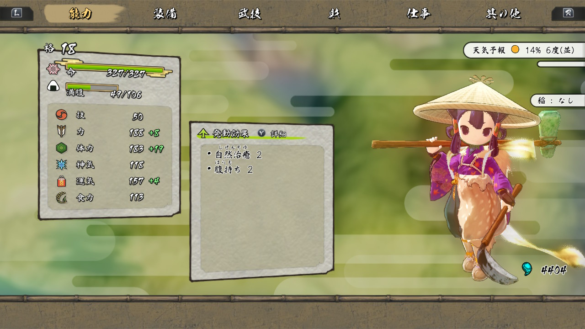
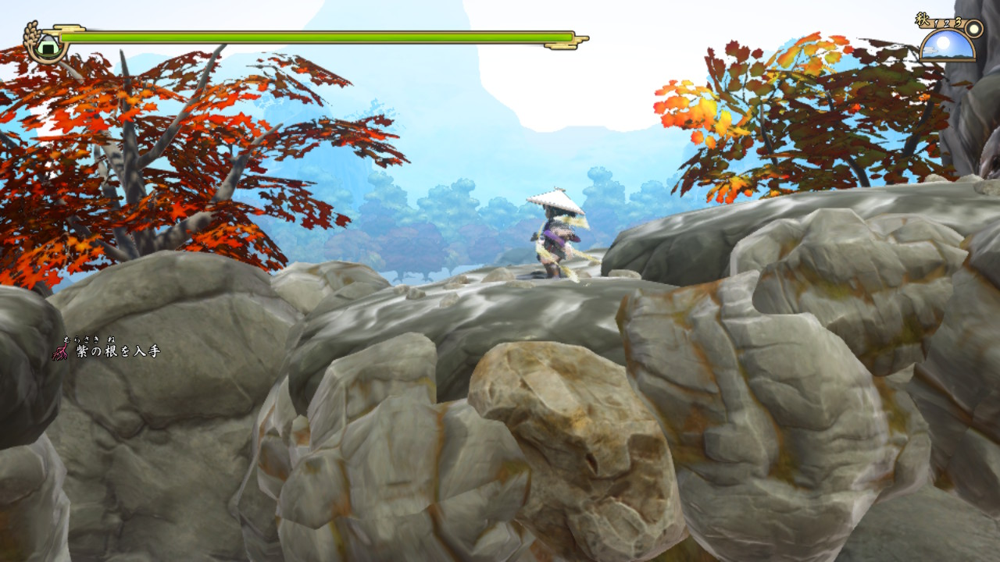
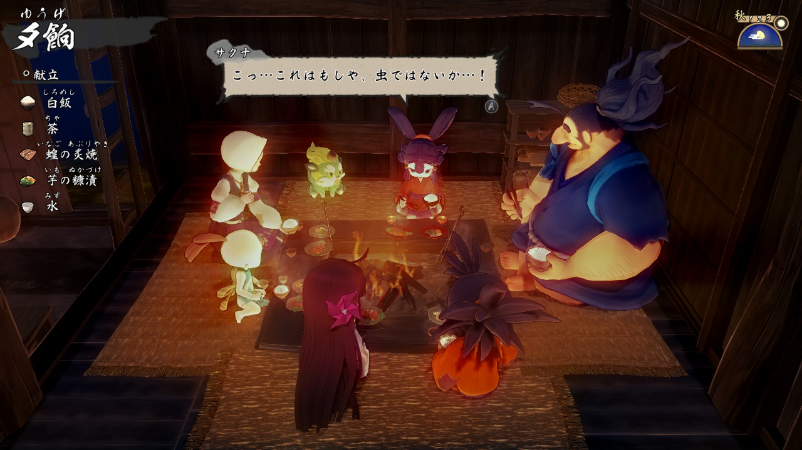

---
categories:
- ゲーム
date: Thu, 03 Dec 2020 12:00:30 +0000
slug: post-13706
tags:
- ゲーム
title: 天穂のサクナヒメ、途中までプレイした感想「稲作面白すぎてストーリー進まん」
---

巷で話題の稲作アクションゲーム「天穂のサクナヒメ」をプレイしています。今回は、途中まで遊んでみた感想を紹介したいと思いますが、結論は「すごく面白いから買った方がいいよ！！」というものです。それではどうぞ

<h2>天穂のサクナヒメとは？</h2>
[itemlink post_id="13691"]

えーでるわいすが開発し、マーベラスより2020年11月12日に発売したゲームソフトです。ニンテンドースイッチ版、PS4版、スチーム版が販売されています。

天界に迷い込んだ人間たちのせいで、失態を犯した主人公サクナヒメが、主神カムヒツキにより放逐され鬼が支配するヒノエ島で鬼退治を命じられるという話です。

ヒノエ島は、サクナの母である豊穣神トヨハナが住んでいたゆかりの場所であり、そこに残されていた家を住まいにし、鬼退治を行います。
また、サクナは米を食べることにより能力がパワーアップし、それにより強い鬼と戦うという設定のもと、田植えを行うという感じです。

<h3>稲作がリアル</h3>
このゲームの要素はアクションと稲作

Twitterなどで、その稲作のリアルさが取り沙汰されているが、これに関してはおそらく間違いがないものと思われます。

外気温や水温、稲の病気や肥料などなどの要素があり、それらの全てがいい米や作れるかどうかに関わってきます。

また、ストーリーを進めていくと稲作に関しての効率的な道具が導入されたりします。
最初は、脱穀作業がこきばしで行われていたのが、途中から千歯こきになったり、この辺は歴史の資料集などに載っていたので、思い出す人も多いことでしょう。
そのうち、ハンドル回して風で稲とゴミとかを選別するやつ（名前忘れた）とかも出てくるのかしら？？とか思います。あと、畑耕す時に牛とかも欲しいなとか。

稲作が本当に楽しいです。

<h3>アクションがスピーディーで楽しい</h3>

稲作だけが取り沙汰されているように見えますが、アクションも面白いです。

ボタンを押しているだけで、つながるコンボ。

そこに技とワイヤーアクションならぬ羽衣アクションで複雑性や変則性が加わり、とてもスピーディーで爽快感のあるプレイが可能です。

また、敵の強さも結構絶妙で、割とサクサク進めるかと思いきや、ボスなんかは少し工夫しないとすんなり倒せなかったりもします。

<h3>キャラクター含めストーリーも面白い</h3>

主人公のサクナヒメが非常に人間ぽい。ダンジョンに出会いを求めるのは間違ってるだろうかのヘスティアっぽさを少しだけ感じました。人間味があるという意味で。

また、他のキャラクターたちも相反するような立場のキャラをそれぞれ配置し、お互いが反発したり、協力したりしながら理解しあっていくという姿が描かれているようです。

見ていて非常に心温まる感じです。

<h2>プレイして変わったこと</h2>
本当に今年はゲームを通して、自分が変わった年でした。自分が成長したと思えるゲームにたくさん出会えました。このゲームも自分が変わっていくのがわかるゲームでした。

<h3>ファックオフ炭水化物抜きダイエット</h3>
何かを育むことの尊さ、大変さを教えてくれるゲームです。こと日本人にとっての米というものの存在を改めて思い知らされました。

豊穣神自らが田植えをする。全能神ですら田植えをする。

そうか、天皇陛下の宮中行事にも確か田植えと稲刈りとかってあったよな。古来から神ですら田植えをしてきた、そしてそれが長らく経済の根幹をなしていたわけで、ライスはジャパニーズのソウルなんだと本能的に確信しました。

一粒の米にもなんとかです。

炭水化物を抜くために、米を残す。これすなわち万死に値する。

[itemlink post_id="13691"]

<h2><a href=“https://twitter.com/s_s_p_y”>しんぺー</a>はこう思った。</h2>
PS5を買える気配が一切しないので、まだまだニンテンドースイッチゲームをプレイする日々が続きそうです。

次は何やろうかなー！

と言ったところで本日は以上です。
おやすみなさい。