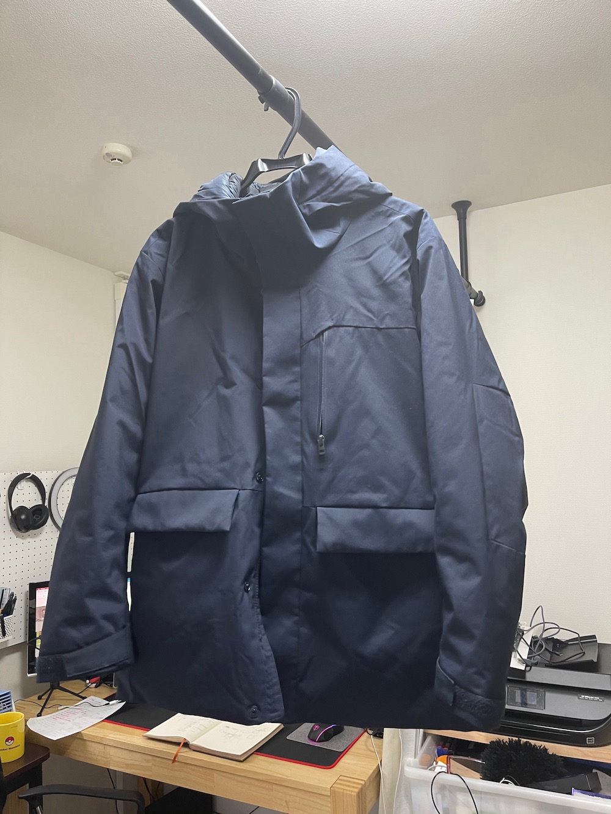
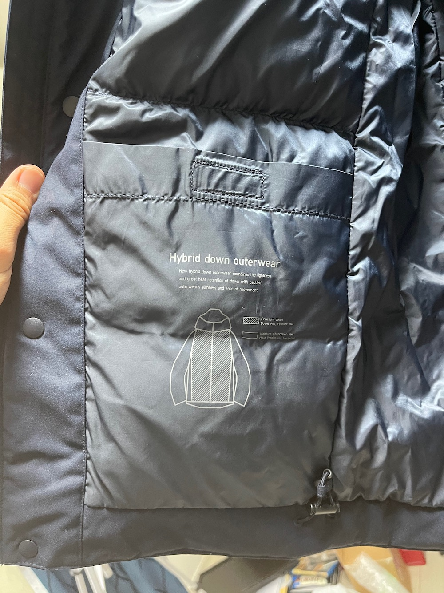
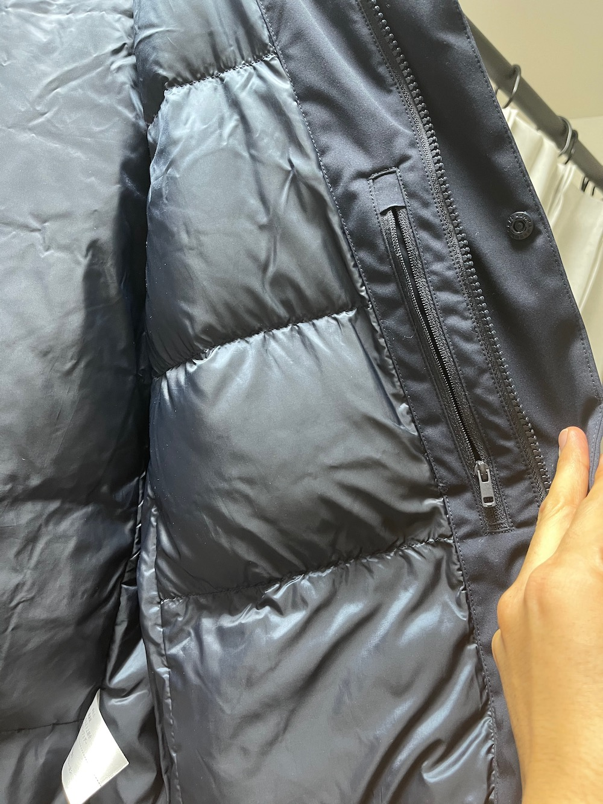
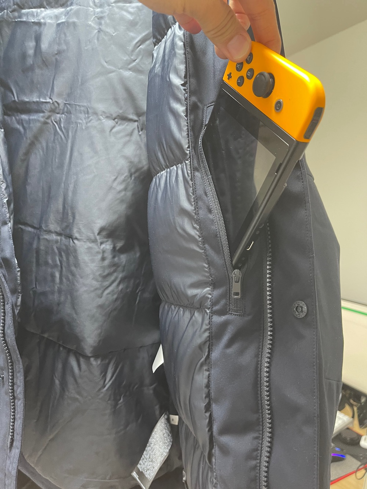
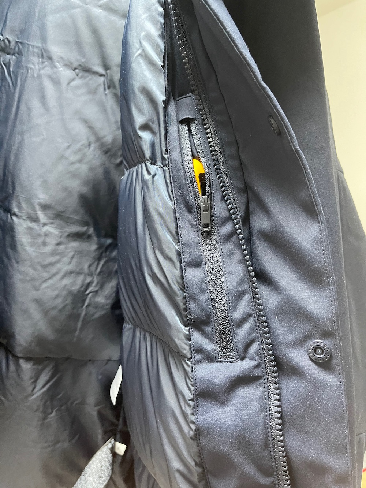

---
categories:
- ブログ
date: Tue, 08 Dec 2020 12:00:41 +0000
slug: post-13717
tags:
- おすすめ
title: UNIQLOハイブリッドダウンパーカはニンテンドースイッチがポケットに入る！
---

もうめっきり外出しなくなって久しいのですが、いつぶりかで洋服を購入しました。買ったのは、UNIQLOの冬物で、コートと上着をいくつか。そのコートがこれまたとても良かったので紹介したいと思います。

<h2>ハイブリッドダウンパーカ</h2>

今のところ値段は8000円となっていますが、セール終わったら値上がりするものと思われます。

<a href="https://www.uniqlo.com/jp/ja/products/E429290-000/00?colorDisplayCode=57">https://www.uniqlo.com/jp/ja/products/E429290-000/00?colorDisplayCode=57</a>

<h3>多分あったかい</h3>
正直、この記事を書いている12月上旬時点でも昼間は暖かく今日はコートを手に持ち半袖で昼ご飯を食べに歩いていました。

だから、実際に寒い時に着てみてどうかがわかりませんが多分暖かいように思います。

おそらくですが、暑すぎず寒すぎず。外では暖かくなるような感じだと思われます。なんせ電車に乗らなくなったので、暑いのかどうか検証しようがない。

書いてて気が付きましたが、多分ハイブリッドというのはダウンとダウンになっていないところに別れているという意味？だから絶妙な暖かさなのでは！？

<h3>ポケットが沢山ある</h3>
何で今回この記事を書こうと思ったかと言うと、コレ。

大容量のポケットが沢山ついてるから！

さらに、ニンテンドースイッチを入れられるポケットつき！

もちろん専用じゃないだろうし、それを見越しての設計ではないでしょう。でも、しっかりすっぽりSwitchが入ります！

なんなら、他のポケットにモバイルバッテリー入れても平気。全部で7個ほどポケットがついています。

ニンテンドースイッチ
鍵(ジャラジャラ)
iPhone12 Pro Max
AirPods Pro
モバイルバッテリー
ケーブル2本
マスク

これにプラスして文庫本を持って出ても近場のカフェに行くくらいならバッグいらずで、スッキリいける。

手ぶらで外出できる！そんくらいのいい感じのコートでした。

<h2><a href="https://twitter.com/s_s_p_y">しんぺー</a>はこう思った。</h2>
今月のDIR EN GREY爆音上映会はこれでいこうかなと思っています。

ライブじゃないから、これでいいでしょう。

と言ったところで本日は以上です。
おやすみなさい。