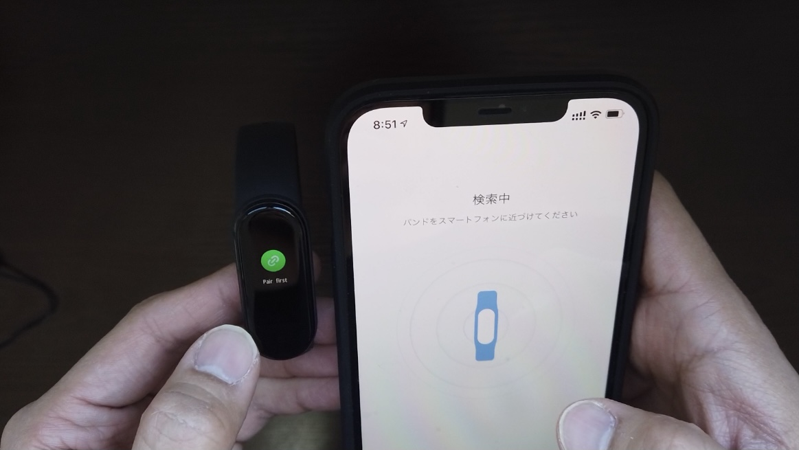
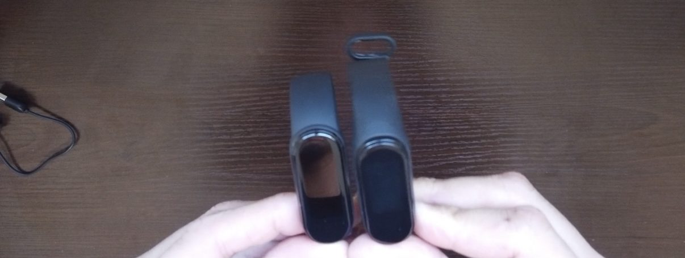
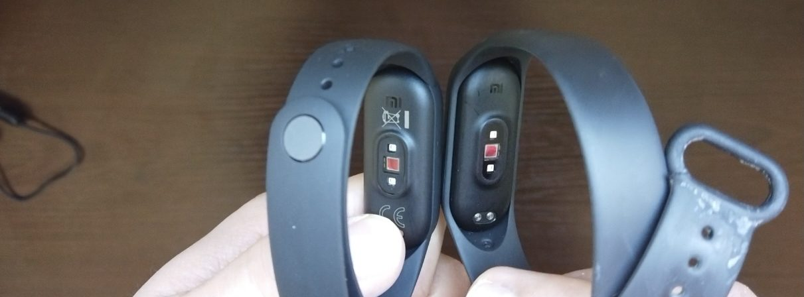
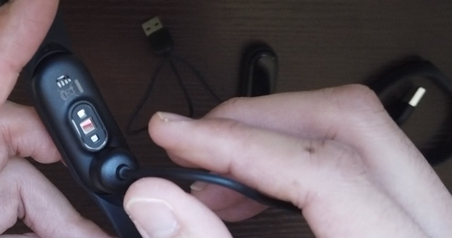

---
categories:
- レビュー
date: Wed, 30 Dec 2020 00:59:00 +0000
slug: post-13756
tags:
- Xiaomi
- ガジェット
title: 【レビュー】Xiaomi Mi band5（グローバル版）普通に使えるからこれでいいや
---

Xiaomiの日本法人から国内発売が発表されたのが秋口というか夏。それが今やもう冬。ずっと待っていたのに、一向に発売される気配がないので、もうグローバル版を購入しちゃいました！ということで本日はXiaomiの活動量計Mi band5のレビューです。

[itemlink post_id="13766"]
<h2>活動量計とは？</h2>
身につけることで、心拍数や消費カロリー等々の体に関する情報を数値化してくれるガジェットです。

Apple Watchなどが有名なところで、このXiami Mi band5も同じく日常生活での数字や運動時の数字を取得してくれるものになっています。
<h2>Xiaomi Mi band5レビュー</h2>
今までぼくはMi band4を使っていましたが、バンドが切れちゃってからは外してずっと使っていませんでした。

ただ、再度ダイエットと筋トレを本格的に再開しようと思ったので、やはり購入しました。

[st-card id= 13075]
<h3>バッテリー、着け心地、防水機能</h3>
バッテリーの持ちが非常に長いのがこのXiami Mi bandの特徴です。1週間はつけっぱなしで全く問題ありません。

着け心地も違和感がなく、バンドもサラサラのゴム性でつけていて嫌になることはありません。

（夏場は汗かくので多少気になる）

また、防水性能もしっかりしていますので、基本的にはこれをつけたままシャワーも浴びれます。が、個人的にはお風呂入るときは外した方がベターだなと思っています。
<h3>計測できる数値（睡眠、心拍、活動量など）</h3>
ストレス、睡眠、心拍数、ワークアウト時の活動、活動量などが計測できます。
<h3>グローバル版でも使えるのか？</h3>
今回日本版が発売されていなかったので、グローバル版を購入しました。

そのため、基本的に日本語表示ができません。英語表示やその他の言語での表示が可能です。

ただし、アプリの方は日本語で表示してあるので基本困ることはありません。

設定も数字もアプリから確認するので全く問題なし

<h2>Mi band4との比較</h2>
若干大きくなっているらしいですが、つけた感じ全く変わりません。バンドが少しサラサラ感が増した気がします。

あと、若干バッテリーの持ちが悪くなった気がします。色々な機能が増えたからか？設定のせいか？わかりませんが、体感で3分の1くらいになった気がします。それでも十分長いですが

充電方法が簡単になりました。今まではいちいちバンドから取り外す必要がありましたが、今回からはそのままでできます。
<h2>Apple Watchとどっちがいい？</h2>
活動量計が目当てなら、Mi band5で全く問題ないでしょう。
ただ、ぼくは当初Apple Watchを買おうと思っていましたし、多分今後買います。

ただ、今ではない。

だから、Mi band5を購入しました。

Apple WatchとMi band5を比べて、できないことが1つあります。そのためだけにApple Watchが欲しいのですが。

それはiOSのショートカット機能です。

それを使えば、部屋のスマート家電を操作したり、リマインダーだったり、GPS連動でアクションしたり、他にも色々できます。可能性は無限大です。

それがやりたいのです。だけど、とりあえず今はまだいいかなという感じでMi band5で満足しています。
<h2><a href="https://twitter.com/s_s_p_y">しんぺー</a>はこう思った。</h2>
やはり、バッテリーのもちは神がかってますね。

一度充電しただけで、あとはずっとつけっぱなし。お風呂に入る時だけ外してます。

テレワークや正月休みで、思いの外からだを動かさない人も増えるんじゃないかと思いますが、数値で見ると、ちょっと運動した方がいいかなとか思うはず。

ぼくはこいつのサポートで目標体重目指します。

と言ったところで本日は以上です。
おやすみなさい。

[itemlink post_id="13766"]