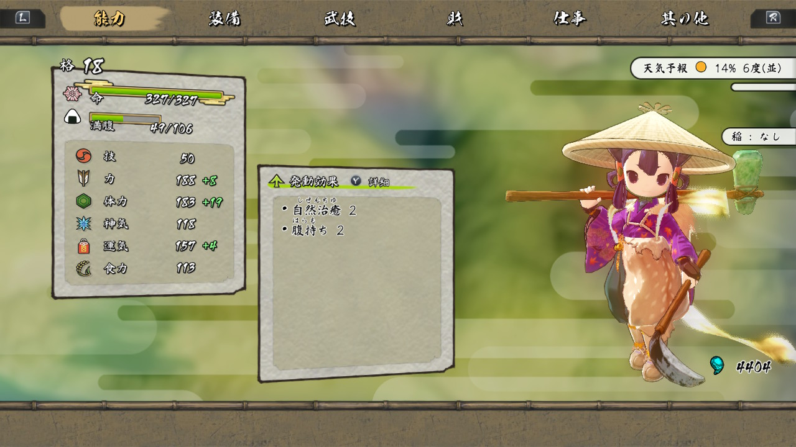
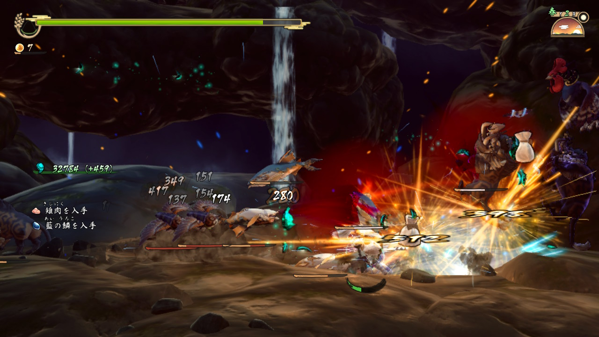
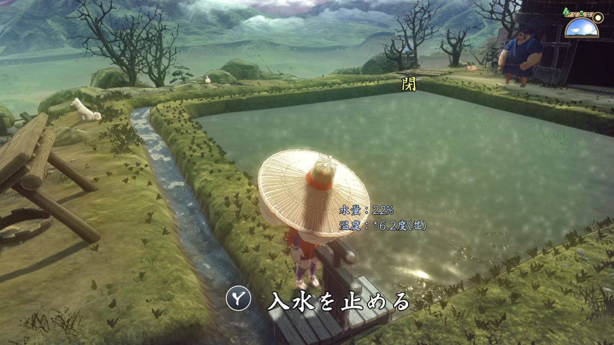
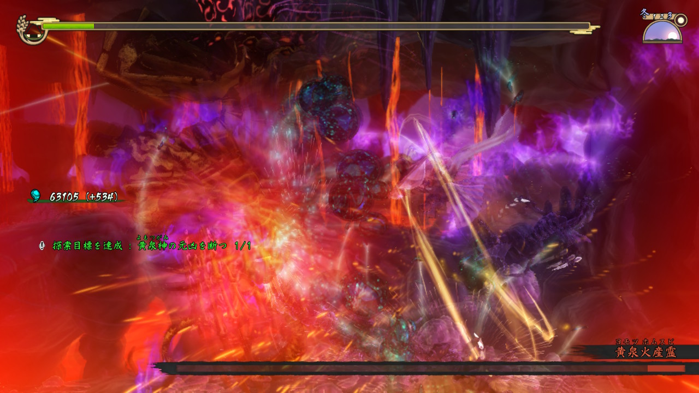
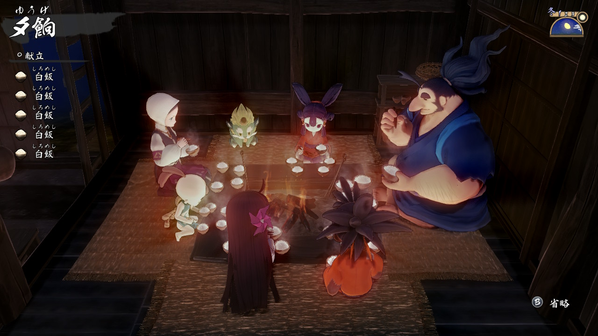
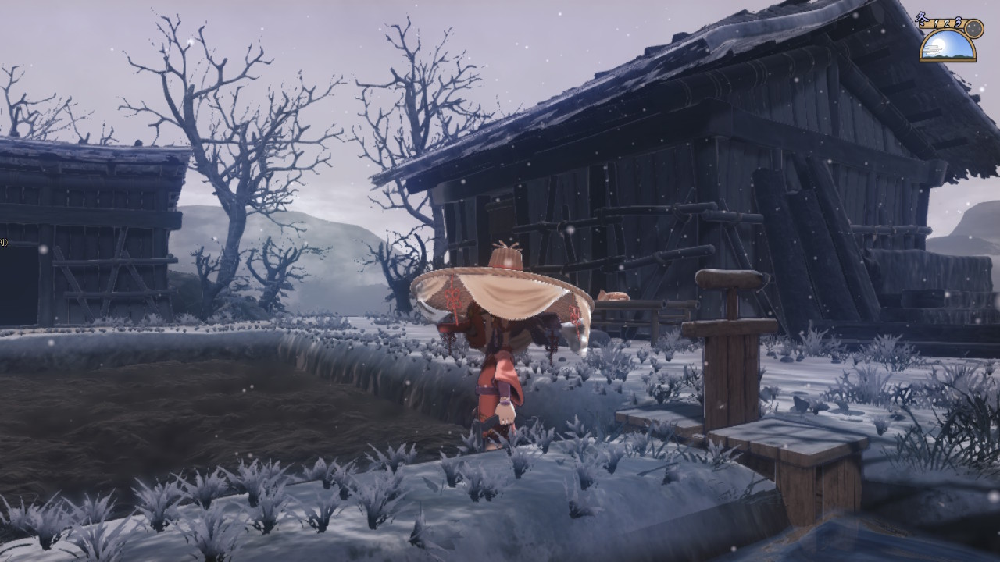

---
categories:
- ゲーム
date: Sun, 03 Jan 2021 16:37:19 +0000
slug: post-13779
tags:
- ゲーム
title: 【クリアレビュー】天穂のサクナヒメやったら米作り尊すぎてご飯残せなくなった
---

天穂のサクナヒメをようやくクリアしました。
素晴らしいゲームでした。プレイして本当に良かった！！心温まるし、それなりに難易度もあるし、爽快だし、楽しい！！

ということで今回は<strong>天穂サクナヒメのレビュー</strong>です。（一応ネタバレなし）

<h2>天穂のサクナヒメとは？</h2>
[itemlink post_id="13691"]

<strong>稲作シミュレーションとコンボアクションゲームをかけた様なゲームです。</strong>

敵を倒してレベルアップするのではなく、米を作り、ご飯を食べてレベルアップします。

<h3>あらすじ</h3>

神の国で亡き親の資産により高い地位についているサクナヒメが主人公です。

傲慢で、他者を顧みない性格で、自分の生まれながらの地位が高いことをは何かけています。

ある日人間が偶然神の国に迷い込んでしまいます。サクナヒメがこれを捕らえようとするも、失敗し、主神カミヒツキの蔵を爆破してしまいます。

その罰として鬼が巣食うヒノエ島にて鬼退治(鬼が生じる原因の調査)を命じられ、実質神の国の都を迷い込んだ人々ともに追放されてしまいます。

しかし、そのヒノエ島は実はサクナヒメの父と母が出会った島であり、縁が深い場所でした。

そこで、鬼退治をするために、まずは食料ということで田んぼを耕し米を育てることになります。

実はこの田んぼは豊穣神であるサクナヒメの力と密接に関わっていて、ここで米を作ることによりサクナヒメは強くなっていくのでした。

そして、鬼を倒し宿敵討伐に向けて、米を作り、食し、力をつけていくのでした。

<h3>ゲーム性</h3>
基本的にはコンボで繋げていくタイプの爽快なスピードのあるアクションゲームです。

ただし、敵を倒してもレベルアップしません。米を作ってレベルアップしていきます。

そのため、アクションを行う探索パートと、家に帰ってきてから稲作をするパートに分かれます。また、3ヶ月＝3日ごとに四季がありそれぞれ朝晩の時間経過が存在します。そのため、朝から探索にでかけ、帰ってきて夜中に稲作、ご飯を食べて寝るというような流れになります。

もちろん、朝から稲作をすることもあり、脱穀や籾摺りをしていると夜中になったりもします。

なお、話題の通り、稲作はかなりリアルで、色々な要素が細かく入ってきており病気や虫の被害などもあります。また、肥料には人糞が使われるため、自分たちが食べた食事の質によりそれも米の生育に関わってくるらしいです。

<h2>このゲームのここが楽しい！</h2>
冒頭でも書きましたが、とても楽しいゲームです。このゲームを通してぼくはこう変わりました。

サクナヒメたちが本当に苦労して、米作りを行います。米作りの大変さを知ると、ご飯を残して炭水化物抜きのダイエットなんかできなくなります。

この日本という国のソウルフードが米であり、開闢以来ずっと米を作って現在に至ることを考えると、お百姓さんって本当にすごいんだなと思うようになりました。

あと、米作りが楽しくて、ストーリーが進まなくなります。本当はもっと早くクリアできたはずなのに、いつの間にか米作りにのめり込んでしまい、探索が疎かになってしまい、時間がかかってしまいました。

また、アクションが爽快でスピード感があり、コンボがつながるととても気持ちいいです。割とゲーム初心者でも楽しめるんじゃないかと思いました。とは言ってもある程度は結構難しい。。。これはほんと

そして、なんといってもキャラクターがいい味を出しています。

それぞれのキャラに感情移入してしまう。全員が違う立場でそれぞれの考え方を持っていて、対立しながらも生活を共にしていく。その中でサクナヒメが成長していく姿は、見ていてワクワクします。

また、感動要素もあり、最終的にはここにいる全員が幸せになって欲しい！と思うようになりました。

そして、それはサクナヒメ自身もそう感じていて、最初は無責任な言動が目立っていたのが、最終的には、犠牲を払う覚悟をもって叶わないであろう敵にも勇敢に立ち向かうまでに成長します。

<h3>ここがちょっとと思ったところ</h3>
サクサクとストーリーを進められない。

探索では、1ステージごとのタスクが決まっていて、その総合クリア度合いによって、次のステージがアンロックされるシステムだからです。

なので、どうしてもクリアできないものが残って、クリアできるものをクリアしてポイントを稼いでいく感じになります。

ここがちょいめんどかったなと思いました。

<h2>それでも、とても楽しいゲームでした！</h2>

天穂のサクナヒメとても楽しいゲームでした！

感動あり、爽快感あり、米作り楽しい！お百姓さん尊い！！

ゆったりとした時間と戦闘のスピーディーさの緩急がよいです。

ゲーム初心者でも楽しめるゲームだと思います。例えば、今年スイッチとあつ森買いましたなんて人にもおすすめできるようなゲームなんじゃないかと思います！

<h2><a href="https://twitter.com/s_s_p_y">しんぺー</a>はこう思った。</h2>
風害や虫、病気、さまざまな災害によって米を作ってきた人たちはきっと苦労してきたことでしょう。

そして、大昔なんて戦や盗賊なんかに家を焼かれたり、略奪されたりなんてこともあったでしょう。

それにも関わらず、諦めず、脈々とずっと米作りを続けてきた。ダメになっても、何度も何度も立ち上がってきたんだろうなと思います。ゲーム中にもそういったことを感じさせるタイミングがありました。

そう考えると、本当に米を無駄に残すなんてことができなくなります。

いやーーーー本当にいいゲームでした！

以前芋とネギを栽培したことがりましたが、見事に失敗。でもまた何かを栽培してみたくなりました。

と言ったところで本日は以上です。
おやすみなさい。

[itemlink post_id="13691"]