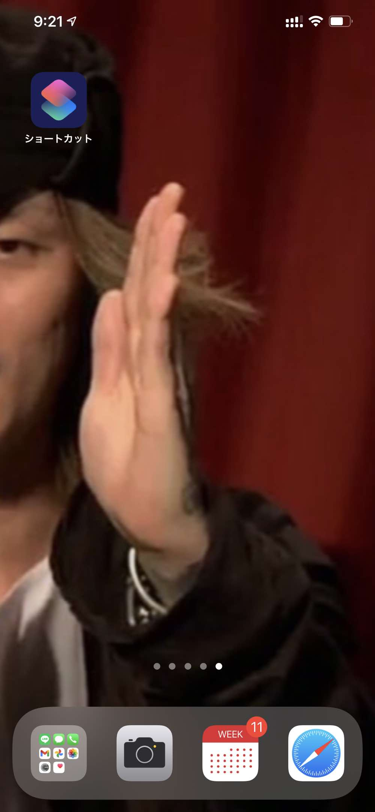
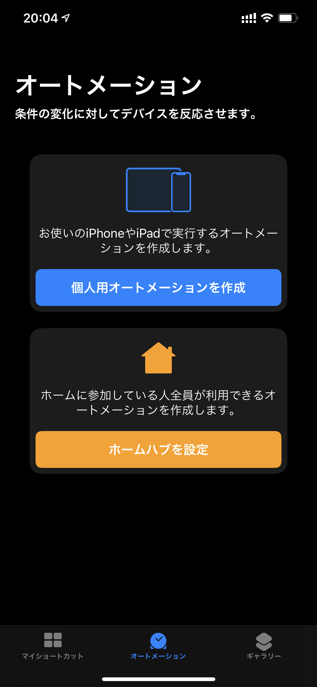
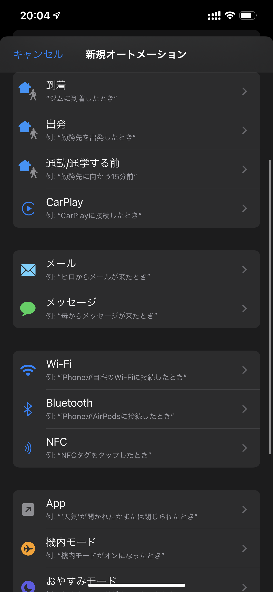
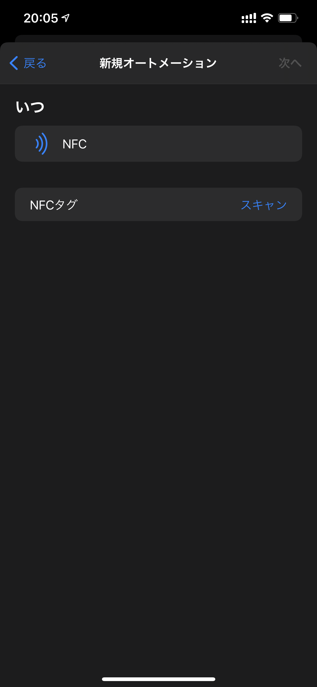
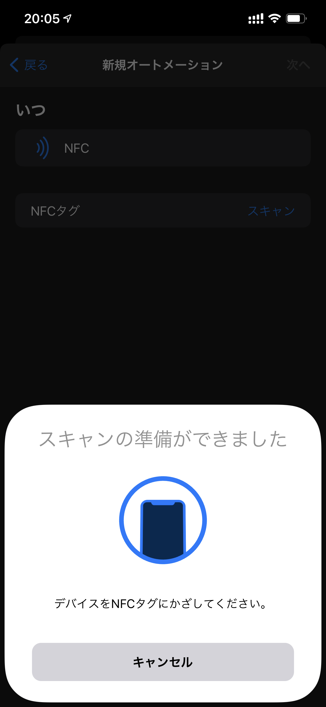
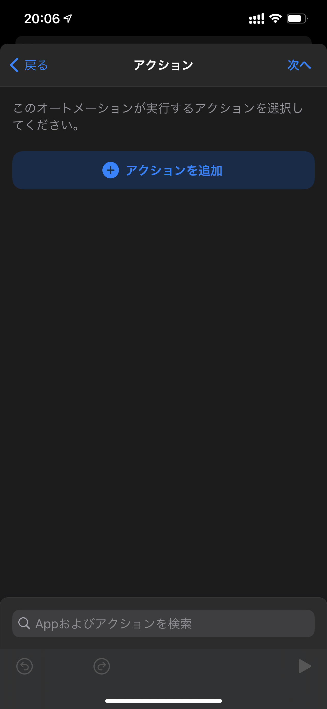
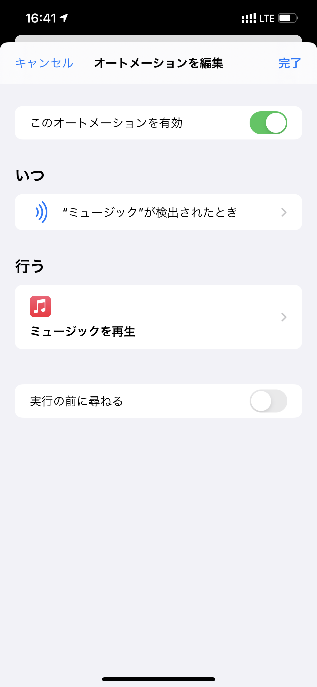
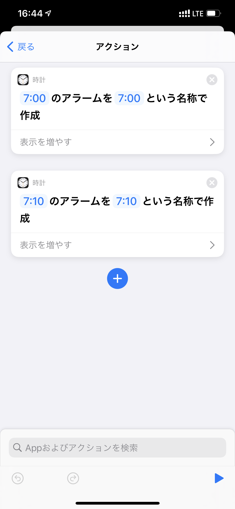
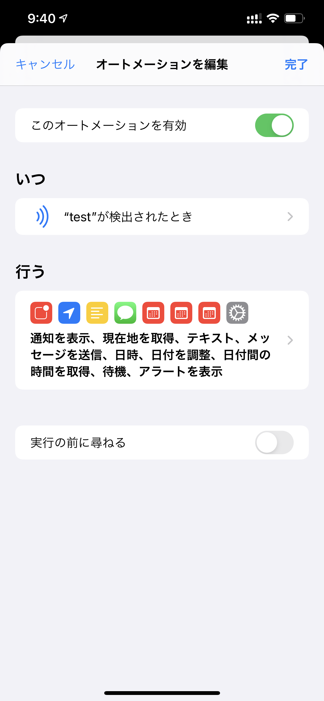

---
categories:
- レビュー
date: Mon, 11 Jan 2021 00:58:00 +0000
slug: post-13829
tags:
- おすすめ
title: NFCタグとiPhoneのショートカットを使ってもっと便利にルーティーンをこなす方法
---

iPhone12 Pro Maxにして1ヶ月以上経ちますが、そういえば使っていなかった機能がありました。NFCタグのスキャンとオートメーションです。知らない人はなんのこっちゃってなるかもしれませんが、これを使うことで日常のちょっとした動作が少しスマートになります。

本日はNFCタグの使い方をご紹介します。

<h2>自己紹介</h2>
しんぺーと申します。このブログでは主にsukekiyoとDIR EN GREYのライブレポを書いているブログです。それ以外にもガジェット関連の情報や、僕が面白いと思ったものを紹介しています。

よろしければTwitterのファローをしていただければ、更新情報をお届けできます。

<h2>NFCタグとは？</h2>
NFCとはNear field communication=近距離無線通信のことです。

めちゃくちゃ簡単にいうとSuicaみたいなピッとかざすことで端末側と通信をする技術のことです。（SuicaはNFCではないけど）

[itemlink post_id="13841"]

こちらがNFCタグです。Amazonではシールタイプのものや、小型のものなんかが売っています。これ自体は電池が電気製品ではありません。これを読み取った側の端末で動かすものなので、これはそのトリガーになるものです。

<h2>NFCタグとiPhoneのショートカットアプリを設定して色々できる</h2>

これがiPhoneのショートカットアプリです。

これを開いてオートメーションをタップ、個人用オートメーションを作成します。

NFCをタップ。タグをスキャンします。

このタグに名前をつけます。ちなみに対応端末はiPhoneXS、iPhone11以降の様です。

次に、これにiPhoneをかざしたときのアクションを決めます。

<h3>お気に入りの音楽をながす</h3>

タグにかざすことで、好きな曲を流してくれるレシピです。

<h3>アラームを設定する</h3>

寝る前なんかにこれにかざして、いっきにアラームをオンにするショートカットです。

<h3>より複雑なことも可能</h3>
割と上級者向け。色々四苦八苦しながら試しに作ってみました。

細かな設定は省きますが、簡単に言うと

タグを読み取るとGPSとともに、それをメールに貼り付けて送信。一定時間経過すると通知も表示。

みたいなことをしています。

ここでレシピを自分で組めればできることは無限大。色々工夫するのも楽しいです。

<h2><a href="https://twitter.com/s_s_p_y">しんぺー</a>はこう思った。</h2>
このショートカットアプリは単体でもかなり便利の色々できます。

それにNFCタグを組み合わせることで、さらに便利になります。費用も安いので、興味があれば試してみてもいいんじゃないでしょうか。

といったところで本日は以上です。
おやすみなさい。

[itemlink post_id="13841"]