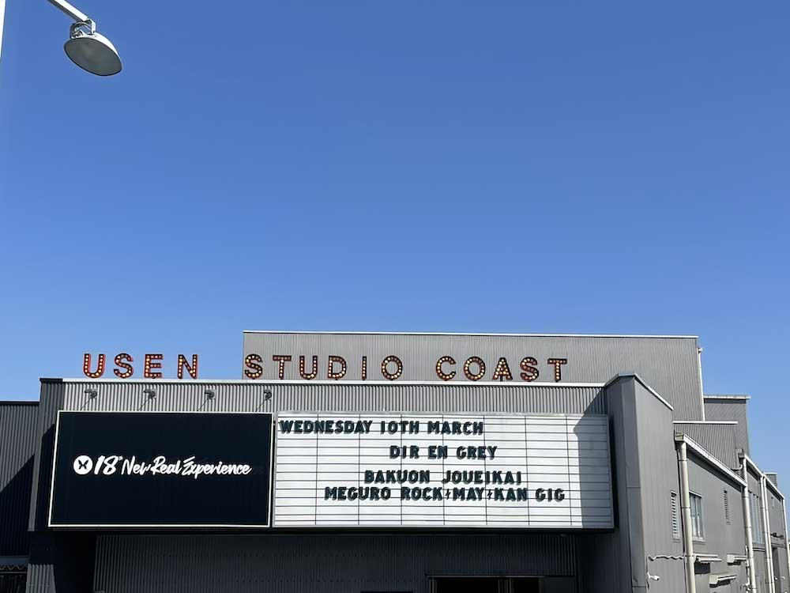

---
categories:
- 爆音上映会『目黒鹿鳴館GIG』
date: Thu, 11 Mar 2021 12:00:13 +0000
slug: post-13888
tags:
- DIR EN GREY
- イベントレポ
title: 【レポ】DIR EN GREY爆音上映会『目黒鹿鳴館GIG』2021_03_10（第１部）＠USEN STUDIO COAST
---

今日は個人的に、2月の時と違って色んな胸のつかえがなくて、楽しむことができました。

よりライブ感を感じられて、自分が刹那に生きていたのを思い出しました。

あとコーストの名称が変更され、USEN STUDIO COASTとなったみたいですね。

<h2>目黒鹿鳴館GIG</h2>
横浜の時と違って、肺に響くような爆音、本当の爆音を体感することができた気がします。座席のせいでしょうか。今日は前方の最善だったし。
<h2>トークイベント</h2>
京とToshiyaでした。

Toshiyaは
サングラス、シルキーなゆったりとした白いお召し物。パールっぽい首飾りにdirtのチョーカー。黒スキニー

京は
緑の七三、デカい金縁丸メガネ
灰色かベージュっぽいオーバーサイズのコート、ハーフパンツに赤黒のソックスに運動靴
ハーフパンツから見えるおみ足は、刺青だらけで右にはLOOPの文字、左にはAXの文字だけ見えました。左にはお面の絵も。
<h3>「鹿鳴館はどうでたしか？」</h3>
Toshiya「狭い、不思議な。でもスタッフ含めて皆んな元気でよかった。」

京「覚えてない」
<h3>「新アー写はどうでしたか？」</h3>
Toshiya「いいと思う」

藤枝マネ「集合写真は数分でしたね」

京「爽やかでしょ。涼しいって言ったでしょ。夏。めでたい！生まれてるし。嘘ついてない」

藤枝マネ「どんな曲ですか？」

Toshiya「聴いてもらえばわかる。アー写は関係してると言えば関係してるし、してないと言えばしてないし、感じてもらえれば」

藤枝マネ「TDFFは」

京「クリームソーダ。マイルド」

藤枝マネ「バニラとか」

京「バニラとは限らない」

藤枝マネ「Toshiyaさんは？」

Toshiya「じゃあ、爽やか」
<h3>「1年3ヶ月ぶりのライブですが、ガーデンシアターの意気込みは」</h3>
Toshiya「とても楽しみ。DIR EN GREYは動くと決めました。来れる人は来てください。」

京「久しぶりなのに、ごりんごりんの平日。いじわる。うちっぽい。みんな仕事してるんだろうなと思いながら、やる。」
<h3>グッズ紹介</h3>
藤枝マネ「気になるグッズありますか？」

Toshiya「ぜんぶぜんぶ」

藤枝マネ「これトートです。Shinyaさんはプライベートでも使ってるということで」

京「それ見たの？」

藤枝マネ「見ました。昨日これで来てました。」

高林マネ「それはプライベートではないのでは」

藤枝マネ「こちらはマフラータオルです。」

京「もうちょっと綺麗なのなかったの」

藤枝マネ「すいません、使い回しなので」

藤枝マネ「こちらトラベルポーチです。色んなところにひっかけられるので、ツアーの時とかに使っていただければ。」

京「ホテルって入って右側とかにかけるところあるけど、そっちまで取りに行くの？」

藤枝マネ「そうですね、ひっかけられるので」

京「机とかに広げる方が使いやすくない？」

藤枝マネ「それでもいいですけど、ひっかけられるんで」

Toshiya「それってシャワーとかで使うんじゃないの？」

藤枝マネ「そう、なんですかね、、、」

京「パーカーの後ろのイラストは、普段僕の刺青入れてくれてる人に描いてもらった。」

藤枝マネ「ラバーキーホルダー、精巧にできてます。ランダムで」
<h3>「最近見た映画は？」</h3>
京「エヴァ、ネタバレになるから言えないけど。大きい画面で見てください。」

Toshiya「エヴァみたい。見に行った方がいいって（京）言われたから」

藤枝マネ「高林さんは見たことは？」

高林マネ「TVのしか。DieさんShinyaさんは興味なさそうですね」
<h3>「ハマっているアイスは？」</h3>
京「サクレコーラ味。メロンパンの中にアイス入ってるやつ。見かけたら3個以上は絶対買う。」

Toshiya「（寒いから）最近は買ってないな〜。（夏の配信の時は）柑橘系とか食べてたけど・・・ラムレーズン」
<h3>「出会ったころの第一印象、変わったところ、変わってないところ」</h3>
京「名古屋のファームじゃなかった？」

Toshiya「ん？いや、（市川の）ジオに見に行ったのが最初」

Toshiya「（京は）屈託のない笑顔の人」

京「（Toshiya）結構ごっちゃになってて・・・ギターを弾いているイメージ。サポートでギター弾いてるのを見て、暴れてるイメージ」

Toshiya「（薫は）挨拶くらいで、そんなに離してない。Dieくんは、すごいよくしゃべる人。人懐っこい。Shinyaは、スルーみたいな、いつもの感じ」

京「薫くんは対バンで見た。charmっていうバンド。チラシで上らから撮ってて、服がすごい広がっているイメージ。落ち着いてる感じ。今の方がおもしろい、当時はクールで。Dieくんもチラシでみて。カザリっていうバンドで、対バンした。Shinyaは、ボブでぱっつんで、片耳だけピアスしてて、それが鎖ので、髪の毛からそれだけが見えてる感じ。で、（喋らずうなづくだけだから）それがすごい揺れてるイメージしかない。人間的に一番かわってない。どんどん変になっていってる、卑屈になっていってる。それなのに、交友関係が広い。SNSで知ることが多い、デヴィ夫人と写真撮ってたり。でも、メンバーの前ではそんな感じ。多分過去を知ってる人に突かれたくないんだと思う。人間好きだけど、メンバーだけ嫌いなんだと思う。」
<h3>「自分たちのグッズを使うか？」</h3>
Toshiya「日常で使えそうなものはいただく。今回のだとポーチとか電源タップとか」

京「タオルとかパーカー系とか」

藤枝マネ「僕は普段着ですね。全然着てます。」
<h3>「好きなお肉の部位は？」</h3>
京「はらみ」

Toshiya「そうね・・・ハラミ、ホルモン」

藤枝マネ「ぼくもハラミ大好きです。ちょうどいいんですよね」
<h3>「お風呂はどれくらい入りますか？シャワー派ですか？湯船派ですか？」</h3>
京「湯船。でも刺青入れた時は、入れないからシャワー」

藤枝マネ「それって痛いんですか？」

京「痛くないと思ってんの？怪我と同じ、まさかハンコでできるとか思ってんの？」

藤枝マネ「はい、」

高林マネ「入れないの？うちの会社はオッケー」

藤枝マネ「いや、何度か言われたことあるんですけど、痛いのは」

京「そのために、マシン買ってもいい。入れてやる。キリンとか。そういう落書きみたいなのを入れてる人が一番怖い。一生背負うものをそんな適当なものにしている人が一番怖い。般若とかそういうのも怖いけど、それが一番こわい。（だから）そういうのを入れたい。黄色いの買ってきて。」

Toshiya「湯船。入る時もあるし、入らない時もある。シャワーの時も」
<h3>「お菓子食べますか？」</h3>
Toshiya「あんまり食べない。チョコはたまに食べる。霧の方舟？」

京「大人っぽいやつ」

京「僕は体の半分がお菓子でできているんで。最近だとチョコクッキー」

藤枝マネ「カントリーマァムとか？」

京「やわらかいのは嫌い。チョコチップのクッキーが（好き）。最近だと、原宿の駅前にあるもふもふのキャラのクッキー。ガチャピンの前歯が出てるみたいなやつをいただいて。」

藤枝マネ「全然わからないです。ステラおばさんのクッキーしかわからない」

京の興味消失により、会場に笑いが起きる。
<h3>「最後に、ライブの意気込みなど」</h3>
Toshiya「（最初噛む）僕たちは動くことを決めました。来れる人は来てください。自分たちで考えて決めてください。」

京「何もない」

藤枝マネ「（無理矢理な代弁）」

京「いや、何もない。勝手に代弁しないで。Tシャツが増えて大変だなと。他はなんもない」
<h2>新曲「朧」</h2>
2021年4月28日発売

収録曲は
<ul>
 	<li>朧</li>
 	<li>T.D.F.F</li>
 	<li>未定（LIVE）</li>
</ul>
通常盤、目黒鹿鳴館GIGの映像が収録されたBlu-ray or DVD付きの完全生産限定盤（10曲収録）と、DVD付きの初回生産限定盤（3曲収録）の3パターンが発売されます。

また、発売記念のオンラインソロイベントが開催予定。

≪4月28日(水)開催≫ オンラインソロイベント【応募者全員招待】
≪4月29日(木・祝)開催≫ オンラインソロイベント【応募者全員招待】
≪4月30日(金)開催≫ オンラインソロイベント【応募者全員招待】
≪5月1日(土)開催≫ オンラインソロイベント【応募者全員招待】
≪5月2日(日)開催≫ オンラインソロイベント【応募者全員招待】

各メンバーのTwitterアカウントが期間限定で開設されました。
<blockquote class="twitter-tweet">

最新シングル『朧』発売記念期間限定アカウント開設！Twitterキャンペーン(～2/24迄)開催決定！ <a href="https://twitter.com/DIRENGREY_JP?ref_src=twsrc%5Etfw">@DIRENGREY_JP</a> と <a href="https://twitter.com/Kyo_Oboro?ref_src=twsrc%5Etfw">@Kyo_Oboro</a> <a href="https://twitter.com/Kaoru_Oboro?ref_src=twsrc%5Etfw">@Kaoru_Oboro</a> <a href="https://twitter.com/Die_Oboro?ref_src=twsrc%5Etfw">@Die_Oboro</a> <a href="https://twitter.com/Toshiya_Oboro?ref_src=twsrc%5Etfw">@Toshiya_Oboro</a> <a href="https://twitter.com/Shinya_Oboro?ref_src=twsrc%5Etfw">@Shinya_Oboro</a> をフォロー＆以下の投稿RTで応募！ 抽選で10名様にオリジナル限定パーカープレゼント！ ▼キャンペーン対象投稿 <a href="https://t.co/0w4v5MdCNQ">https://t.co/0w4v5MdCNQ</a>

— DIR EN GREY (@DIRENGREY_JP) <a href="https://twitter.com/DIRENGREY_JP/status/1361520726956597252?ref_src=twsrc%5Etfw">February 16, 2021</a></blockquote>

[itemlink post_id="13878"]
<h2>疎外</h2>
2021年5月6日(木)東京ガーデンシアターで開催されます。

全席指定　9,800円
Exclusive Ticket　17,600円

OFFICIAL FAN CLUB ｢a knot｣1次先行受付
2021/3/11(木)12:00～3/21(日)23:59

OFFICIAL FAN CLUB ｢a knot｣2次先行受付
2021/4/1(木)12:00〜4/5(月)23:59

DIR EN GREY ONLINE先行受付
2021/4/12(月)12:00〜4/15(木)23:59

詳細は各ページをご覧ください。（間違ってるかもなので、そっちで正確な情報をご確認ください。）

中止されたツアーが蘇る的な感じなので、是非とも行きたい。

席あり、声援なしとなるでしょう。
<blockquote>※座席は1席毎の販売とし、客席の距離を確保した上でイベントを実施致します。</blockquote>
<h2><a href="https://twitter.com/s_s_p_y">しんぺー</a>はこう思った。</h2>
やっぱり、楽しい。

やっぱり、ライブがないと色んなものが吹っ切れない。

そういうことを思い出しました。はやく・・・

と言ったところで本日は以上です。
おやすみなさい。