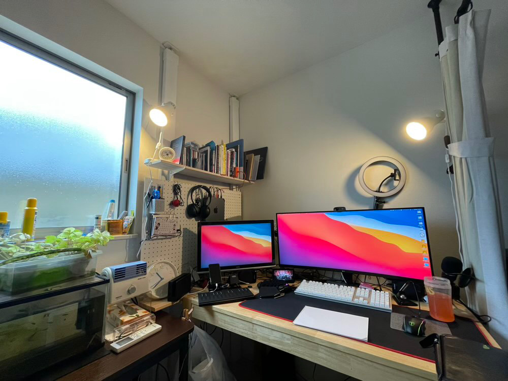

---
categories:
- レビュー
date: Fri, 02 Jul 2021 11:48:00 +0000
slug: post-13965
tags:
- テレワーク
title: 2021年7月版のデスク環境紹介
---

そういえば今のデスク環境になってから記事を書いてなかったと思うので、この機会に紹介しようと思います。4月以降会社に出社するようになってから自室に入る時間がめっきり少なくなったのですが、最近子どもがRSウィルスで保育園をお休みしているので、在宅勤務にしています。

自分のデスクに座っていると改めて色々と気がついて手を加えたくなったり、整理したくなったりしてきます。多分ですが、そのうちまた手を加えるかもしれませんので、今時点の環境となります。（あと整理整頓できてないからゴミとか写ってるのでご容赦を。）

前回からの変更点まとめ

<ul>
	<li>有孔ボードの上下に棚設置</li>

	<li>Macを有孔ボードに貼り付け</li>

	<li>配線周り見直し</li>

</ul>

<h2>ウルトラワイドモニター</h2>
前回からかわりありませんがあらためて。

この環境のポイントはウルトラワイドモニターです。
以前は普通サイズのモニターを２枚並べて使っていました。片っぽに会社のPCを繋げ、もう片方は自分のMacを繋げていました。会社でもデュアルモニターだったので、自宅でテレワークになって単純にモニター面積が半分くらいになったので、どうしたものかと思っていました。

そこで、思い切ってウルトラワイドモニターを導入しました。継ぎ目がない1枚のモニターは集中力も上昇する気がします。さらに、このモニターはUSBハブ機能も備えており、デスク常のケーブル整理に一役買ってくれることを期待しました。
<h2>有孔ボード</h2>
デスクの横の有孔ボードは、ツーバイフォー材を立てて、そこにレールフックをつけて引っ掛けています。さらにその上下に板をつけて棚にしています。

この有孔ボードにMac miniの本体を専用のステーで貼り付け、配線各種も全部この裏を通す形で目立たなくしています。ここが前回からの変更点です。

Macを空中に上げたことで配線類を多少隠すことに成功。
若干ケーブルマネージメントが甘いところが課題。それは電源コードの長さが足りないためで、現状改善できずにいます。
<h2>その他の設備</h2>
一番気に入ってて、多分壊れるまで一生使うであろうアイテムがRealforceのキーボードです。

これを使い出してから他のキーボードが使えません。会社に行って安いキーボードを触った時「？？？？？」となりました。キーが軽すぎる。

次に気に入ってるのが、地味だけどスマホホルダーです。2台立たせられるようになっています。会社用とプライベートを並べて立てられるし、電話会議の時にヘッドセットを繋げたり、充電できたりするし便利です。

あと何気にヘッドセットはとても重宝しています。
コンデンサマイクも買ってみましたが、それよりも良いみたいです。

自分の声を相手に的確に伝えられ、かつ他の音はあんまり届かない。しかもめちゃくちゃコスパがいい。会議用に高いマイク買うよりも、こっちおすすめします。
<h2>次にいじりたいところ</h2>
なんと言っても配線。

ケーブルマネジメントをもっとしっかりとやりたい。
そのために、口数が多くて長い電源コードを見つけないと。

あとモニター裏の壁を有効利用したい。

シャレオツな色の壁紙を貼って、怪しい灯りで照らしたい。
そんでもって、ポスターを貼るか簡易的な棚を作るかしたいと思っています。
<h2><a href="https://twitter.com/s_s_p_y">しんぺー</a>はこう思った。</h2>
テレワークが解除になったので、次の課題は外で家でできていたことと同じ様なことをどれだけできるかの環境構築が課題かなと思っています。

そのためにiPadを買いました。（正確には外用として割安になっていた型落ちの整備品をゲット）

iPadをベースに外でも作業できるように色々と考えたいと思います。

と言ったところで本日は以上です。
おやすみなさい。