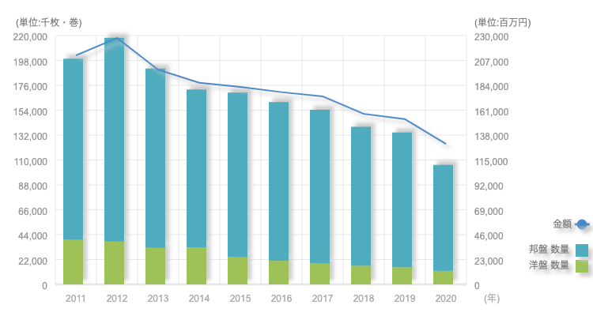
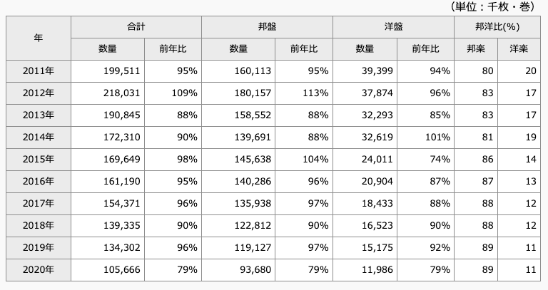
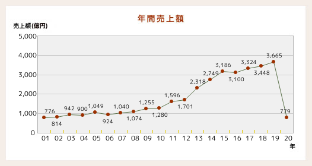
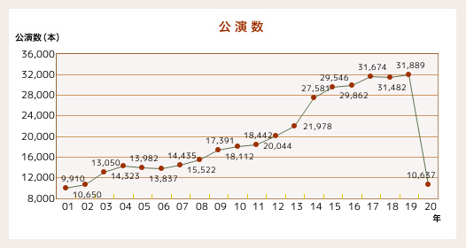
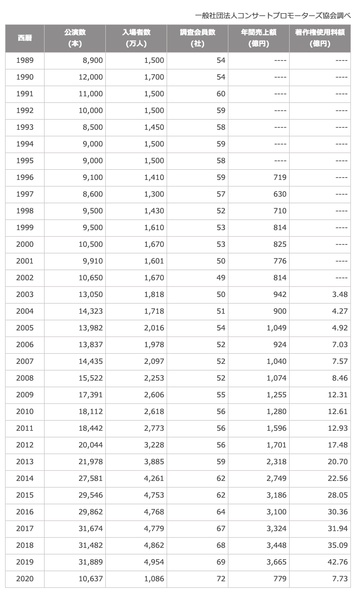
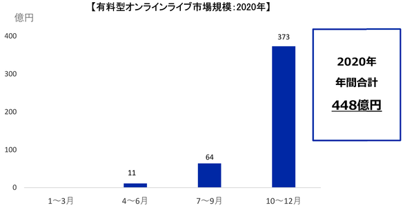
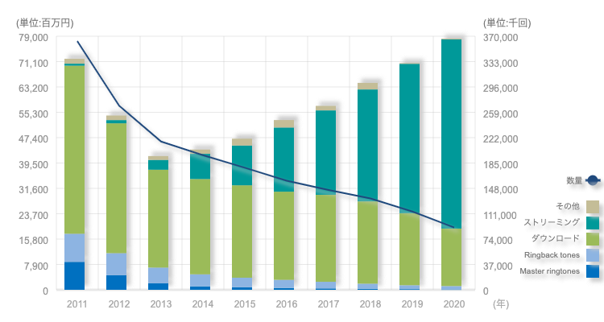
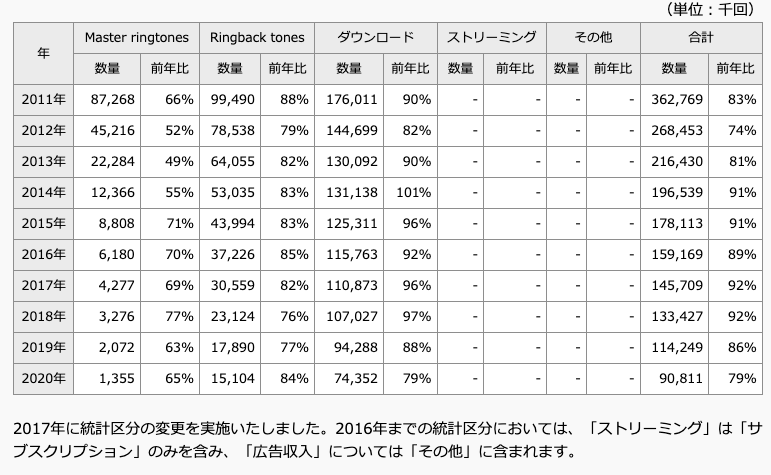

---
categories:
- music
date: Fri, 16 Jul 2021 22:07:38 +0000
slug: post-13981
tags:
- 音楽
title: コロナは音楽を殺したか？音楽業界の売上減少調べてみた
---

ライブ、コンサートの中止延期が相次いで久しく。昔のように大勢で集まり、歌い叫び声をあげ、気がつけばアザができて、それでいて終わったあとの虚脱感と爽快感の中に明日を生きる糧を見いだす。

そんなライブはもう二度と出来ないんじゃないのか？

今までライブに参戦していた人には、どこかそんな想いが少なからずあるのではないでしょうか。
ぼくもその1人です。

今回は、コロナ禍で音楽業界がどれほどの状況になったのかを、色々と調べましたので紹介したいと思います。

<h2>音楽業界のこれまで</h2>
CDが売れなくなったということは、もはや常識でしょう。

こちらがCD・音楽配信の売上推移です。

引用元：<a href="https://www.riaj.or.jp/f/data/annual/ar_all.html">一般社団法人日本レコード協会</a>

そして、それまではCDの販売促進活動という位置付けだったコンサートが、その売上減少にとって代わるように売上を伸ばしていったのが2020年までです。

2017〜2019年くらいまでは、オリンピックを目前に老朽化による取り壊しや、建て替えなどがあり公演数は横ばい、もしくは微増していました。
<h3>そして、20年間の積み上げが消えた</h3>
しかし、ご存知の通り新型コロナウィルス感染拡大により緊急事態宣言が発令され、大勢の人間が集まるコンサートなどは多くが中止となりました。その後も、厳しいガイドラインが決められ、公演数も20年前のそれとほぼ同じくらいとなってしまったようです。

緊急事態宣言以降、小さなライブハウスでのクラスター発生などにより、コンサートやライブの印象は一気に悪いものとなりました。

それにより、多くの興行が延期や中止となりました。また、キャパシティの半分などの厳しいガイドラインも設定され、会場もアーティストもコンサートに付随する業界は苦境に立たされています。

落ち込みの数字はこの20年間成長し続けてきたコンサート市場の売上を消失させるほどでした。

引用元：<a href="https://www.acpc.or.jp/marketing/transition/ ">一般社団法人コンサートプロモーターズ協会</a>

<h3>オンラインコンサート市場の台頭</h3>
コンサートが出来ないなら、ということでオンラインコンサートや無観客ライブを配信するという動きが広がりました。

市場規模も一気に広がり、オンラインコンサートの設備やサービスを提供する企業も増えてきました。

引用元：<a href="https://corporate.pia.jp/news/detail_live_enta_20210212.html">ぴあ</a>

今後オンラインコンサートが主流になるかはわかりませんが、一定の成長は見込めるのではないでしょうか？リアルライブが今までと同じように開催できるのか、そして一度変容した人間が、今までと同じライブを許容できるのか？

それはまだわかりません。

<h3>サブスクの普及</h3>
コンサートによる売上が消滅する一方で、好調なものもあるようです。

それが音楽配信、いわゆるサブスクリプションサービスです。
サブスクリプションの普及により、身近に手軽に音楽に触れることができるようになり、今では一般的な視聴スタイルとなりました。

売上推移はこちら

引用元：<a href="https://www.riaj.or.jp/f/data/annual/ar_all.html">一般社団法人日本レコード協会</a>

<h2>音楽は不要不急なのか？</h2>
緊急事態宣言発出当初、コンサートは不要不急と言われました。
不要不急とは？

それに対し、SEXX GEORGE氏が言っていました。
https://twitter.com/abikoshinonkai/status/1239730214566899714?s=20

<blockquote>音楽は断じて余暇なんかでは無い
人間に最も必要なもののひとつだ
世界にひとりになってしまった時、鼻唄も歌わない奴
なんか絶対に存在しない
お祭りにしてもそうだ
人間の有史以前から打楽器による音楽は存在していた
音楽ってのはそれだけ大切なもの
人間に隣にいつも居る存在
無くても生きていける…なんてそんな適当に扱うよう
なモノなんかじゃない</blockquote>
原文ママ

個人的にコロナ禍になってから最も印象に残っている言葉です。

音楽は人間の本能。

だから人は音楽を止められない。

<h3>サブスクでの視聴がアーティストの支援になる</h3>
とは言え、音楽ビジネスの中心であったコンサート収益が消失したことは事実ですし、それに変わる売上がなければ今までの形態での活動は難しく、業界全体の維持は不可能と言えるでしょう。

コンサートがなければアーティストや会場はもちろん、グッズ制作をしていた会社やコンサートを作り上げていた会社なども打撃を受けています。

そう言ったコンサート関連企業含めて支援するにはどうしたらいいのか？我々リスナーに出来ることはなんなのか？

それは、アーティストを支援することが手っ取り早いのではないかと考えています。
そして、毎日できて最も簡単なことが１つあります。

それはサブスクリプションサービスで楽曲を視聴することです。

Spotify、Apple Music、YouTube Music、Amazon music、LINE music

さまざまなサービスがありますが、サブスクで音楽を聴くことでアーティスト側に収益が発生します。そして、最もアーティストへの還元が高いと言われるのがApple Musicです。

Apple Music：0.0059ポンド（約0.89円）
Spotify：0.002〜0.0038ポンド（約0.30〜0.58円）
YouTube：0.00052ポンド（約0.079円）

参考：<a href="https://www.bbc.com/news/entertainment-arts-54551342">BBC News</a>

CDで購入してスマホに入れている楽曲とサブスクで配信されている楽曲が同一なのであれば、サブスクで意識的に視聴してみてはいかがでしょうか。

<h2><a href="https://twitter.com/s_s_p_y">しんぺー</a>はこう思った。</h2>
記事のタイトルへの自分の回答がまだでした。

コロナは音楽を殺したか？

答えは否です。

殺せるわけがないし、殺させない。

音楽はいつも心の中に響いていると、ぼくはそう思っています。
一度でもライブに参戦したことがある人なら、ライブのあの光景を思い出すことは容易だろうと思います。

DIR EN GREYがKT Zepp Yokohamaにて行なった無観客ライブ「The World You Live In」
いるはずのないオーディエンスの声が、明らかに聞こえた。

音楽とは、CDにパッケージされた楽曲だけを指すものではない。
それをとりまく全ての体験こそが音楽だと信じています。

その"音楽"が再び鳴り出す日が、1日も早く来ることを切に願っています。

と言ったところで本日は以上です。
おやすみなさい。