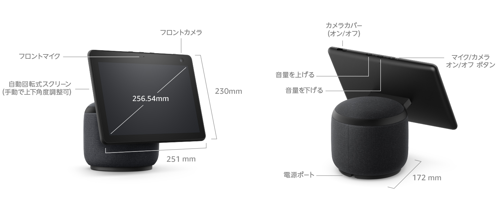

---
categories:
- レビュー
date: Fri, 23 Jul 2021 21:09:23 +0000
slug: post-14000
title: 【レビュー】Echo Show10は、子どもがいるテレワーク環境におすすめ
---

プライムデーで半額になっていたEcho Shwo10を買いました。これが想像以上によかったので本日はレビューです。

<h2>子どもが家にいる状態でテレワークやる人は買うべし</h2>
まず最初におすすめしたいのが、子どもが家にいる状態でテレワークやる人はぜったいに買った方がいいでしょう。

夏休みで、子どもが別の部屋にいて、何をしているのかを常に見ていたいとかという人は2台買って繋ぎっぱなしにしておけば安心です。
通信量はかかりませんし、マイクのオンオフも簡単です。

その場合、自分が使うのはEcho Show5で子どもがいる部屋にはEcho Show10とかという組み合わせでもいいかと思います。

以下詳細のレビューです。

<h2>Amazon Echo Showシリーズ</h2>
Amazonは製造販売するスマートディスプレイがEcho Showです。
音声アシスタントのアレクサを搭載しており、あらゆるスキルをインストールすることで様々な挙動をしてくれます。

例えば、天気予報や本の音読だったり、家電の操作だったりです。
操作はタッチスクリーンで行います。

<h3>ラインナップ</h3>
基本的にはディスプレイサイズの違いのみで、できることは大体おなじです。

<strong>Echo Show 5</strong>
<ul>
<li>画面サイズ 5.5インチ</li>
<li>解像度960 × 480</li>
</ul>
[itemlink post_id="13682"]

<strong>Echo Show 8</strong>
<ul>
<li>画面サイズ 8.0インチ</li>
<li>解像度 1280 x 800</li>
<li>自動色彩調整機能</li>
</ul>
[itemlink post_id="14001"]

<strong>Echo Show 10</strong>
<ul>
<li>画面サイズ 10.1インチ</li>
<li>解像度 1280 x 800</li>
<li>自動色彩調整機能</li>
</ul>
[itemlink post_id="13950"]

ちなみに以下のものはディスプレイがついていないスマートスピーカーです。
Echo dot新旧
Echo
Echo Studio

<h2>Echo Show 10</h2>
現在Amazonが日本で販売している中では一番大きなディスプレイ付きのEcho Showです。

一番の特徴は、画面が動くこと！

<h3>回転するディスプレイ</h3>
ディスプレイが水平方向に360°近く回転します。

例えば、本体の後ろから声をかけると、回転してこちらを向いてくれます。

これが1番の特徴です。

また、カメラが顔認識をしてくれて話しかけた人が動くと自動で追尾してくれます。
ちなみに回転時に、何かと接触すると停止しますので、その点は安全な設計といえるでしょう。

<h3>ディスプレイの大きさ</h3>

引用：<a href="https://amzn.to/3x7xpfW">https://amzn.to/3x7xpfW</a>

ディスプレイはiPadとほぼ同じくらいの大きさです。(10.2インチ)

10.1インチ（230mm × 250mm）

<h3>通話じゃなくても監視カメラ的にも使える</h3>
カメラ機能は外出時に外からも使えます。

ディスプレイの向きも変えられますし、こちらのマイクをオンにして話すこともできます。
その場合、こちらの映像はディスプレイには表示されません。

<h3>小さい子どもが家にいる人のテレワークにおすすめ</h3>
ぼくは、昨年の8月は在宅勤務で自宅にいました。

子どもの夏休みとちょうど重なっていたいので、他の部屋で子どもが遊んでいたりして、自分の部屋からは直接見ることができませんでした。

そこで、Echo Show 5を2つ購入して画面を通話状態にしながら子どもの様子を見ていました。通話の費用もかからず、設定も簡単なので、その点非常に重宝しました。

ただ、難点が１つだけ。それはEcho Show5のカメラの画角が狭いことです。

子どもが画面外に行ってしまうと見えなくなってしまうので、応答がないと見に行かないといけません。あとは、わからないことがあったりするときに画面を見てほしいみたいだけど、カメラに映せないから見に行かないといけないとかよくありました。

なので、カメラを動かせるという機能がどうしても欲しかった！

それを解決してくれるのがEcho Show 10です。

[itemlink post_id="14001"]

<h3>取扱に気をつけたい</h3>
かなりの重量（2560g）があります。

あとディスプレイが大きいため破損には気をつけたいです。（念の為、画面保護フィルム買いました。）

落下には気をつけたいところです。

さらに、回転するので周囲には物を置かないようにしないといけません。

<h2><a href="https://twitter.com/s_s_p_y">しんぺー</a>はこう思った。</h2>
結構高額なのでそこだけがネックな気がします。
ちなみにぼくはプライムデーで半額になっている時に購入しました。

Amazonが自社で製造販売しているので、セールでは大幅な値引きをよくしています。
そういったタイミングに買うのもいいかもしれません。

と言ったところで本日は以上です。
おやすみなさい。

[itemlink post_id="13950"]