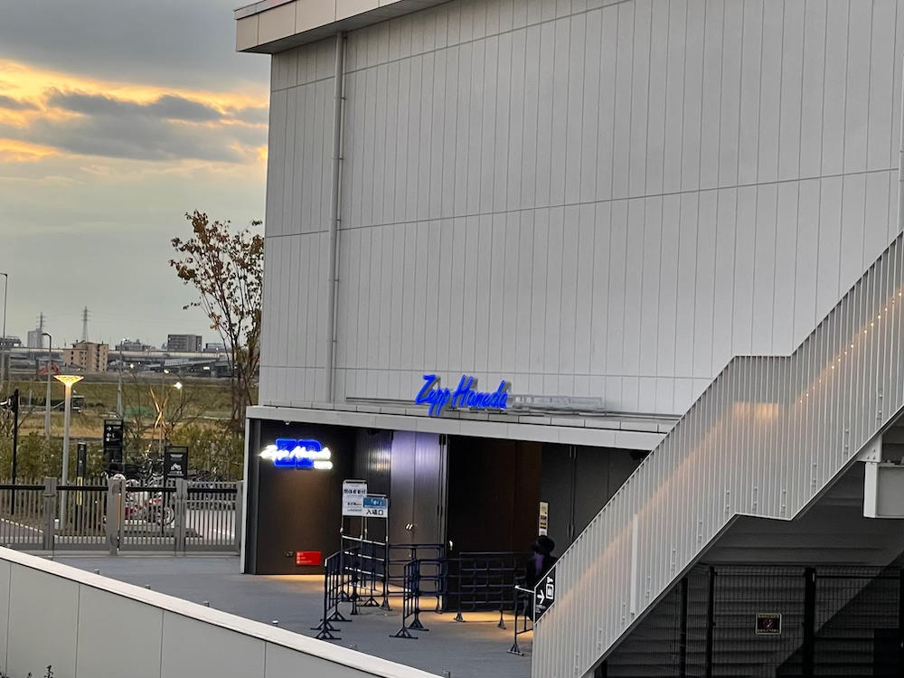
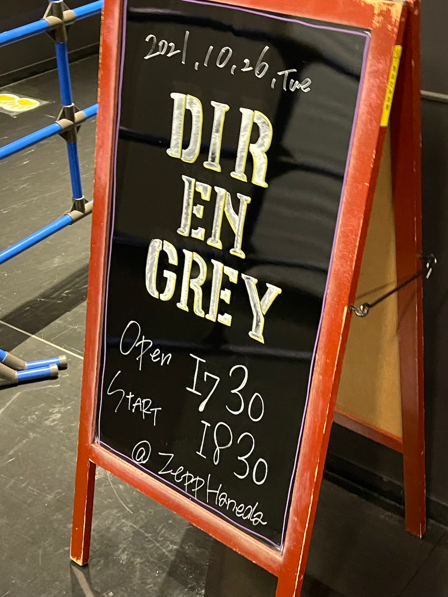
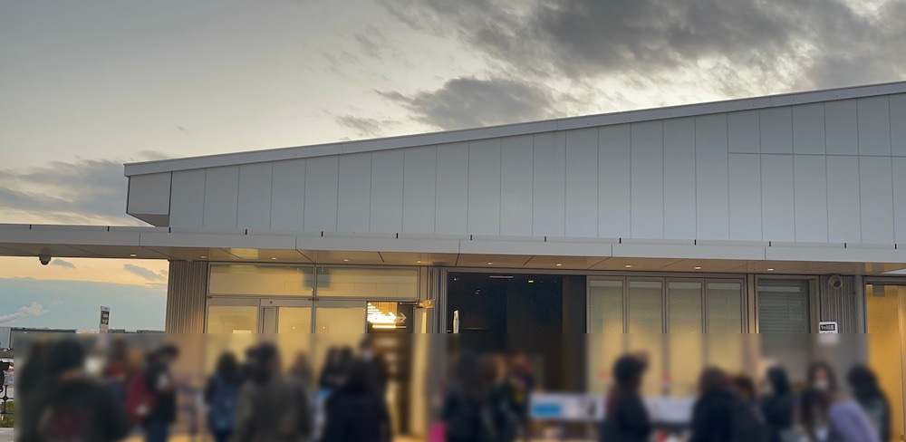
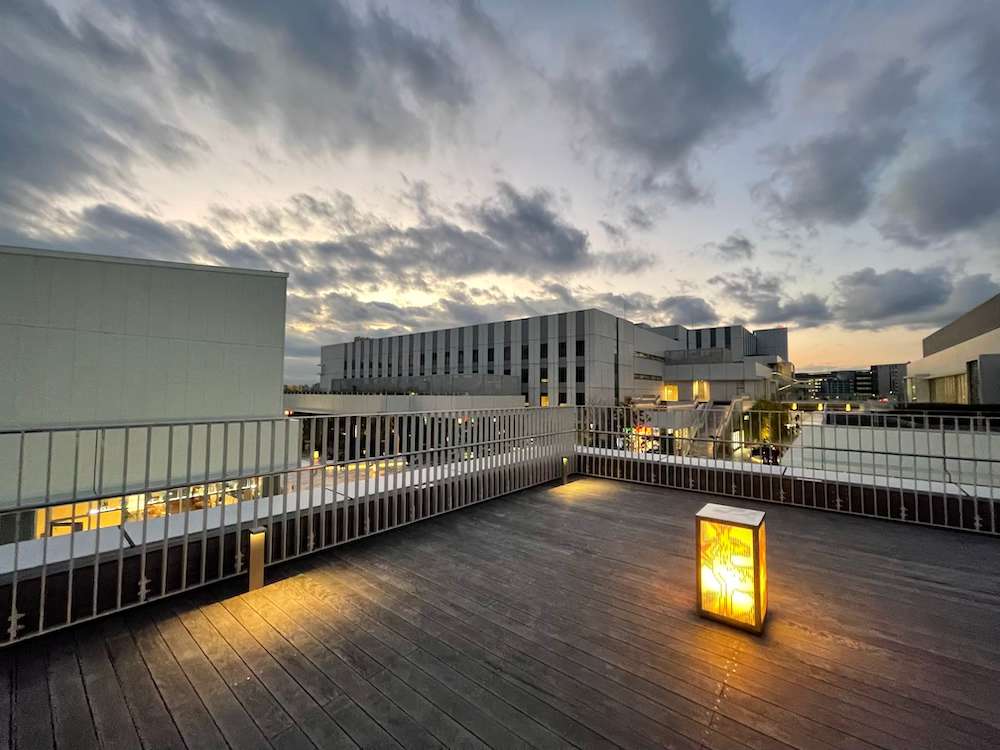
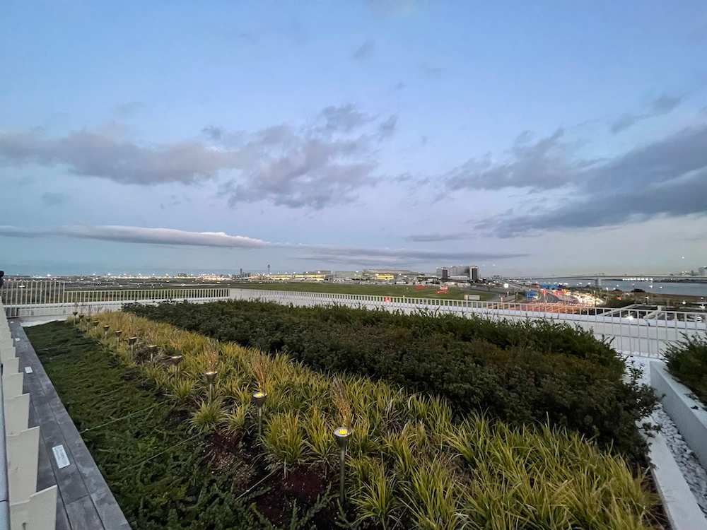
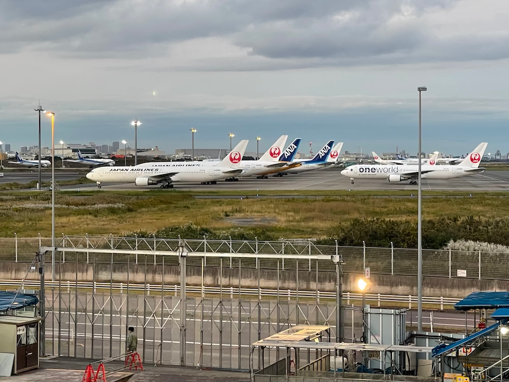
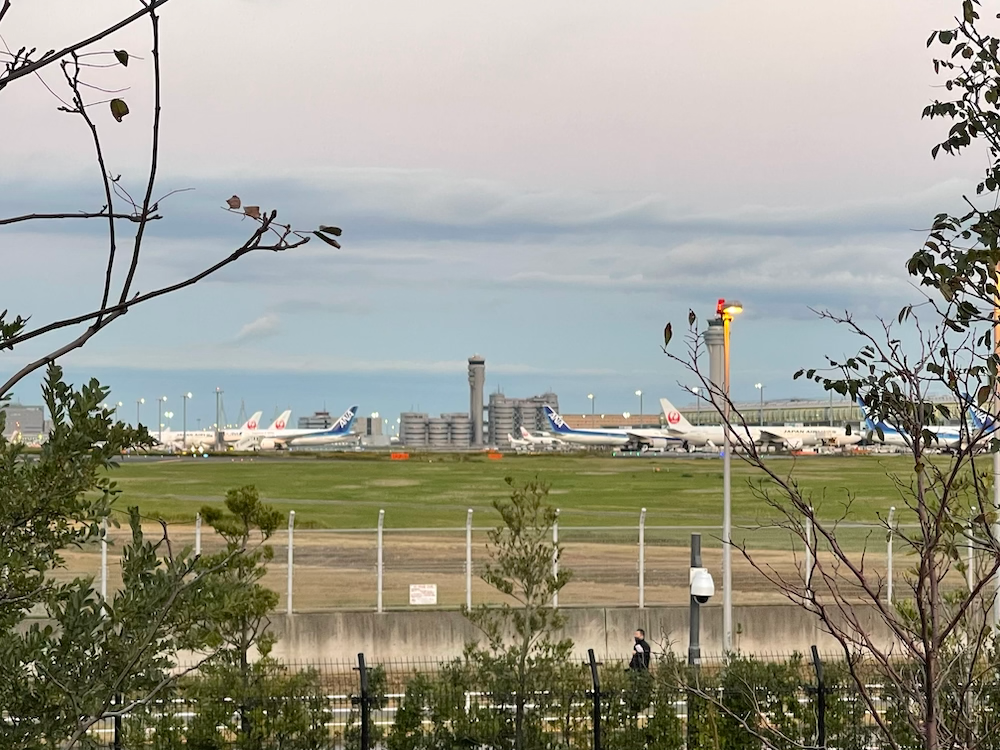
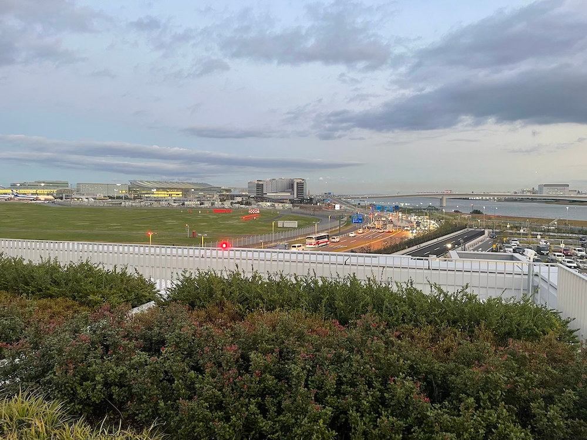
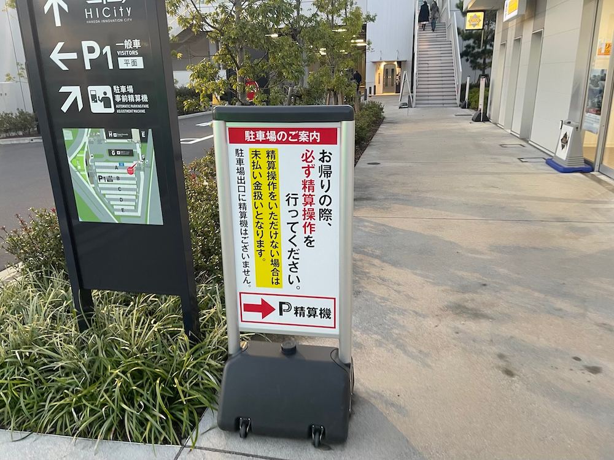
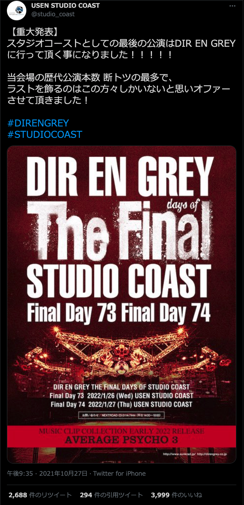

---
categories:
- DIR EN GREYのLIVEレポ
- TOUR21 DESPERATE
date: Fri, 29 Oct 2021 20:55:15 +0000
slug: post-14033
tags:
- DIR EN GREY
- LIVEレポ
title: 【ライブレポ】DIR EN GREY TOUR21「DESPERATE」2021_10_26@Zepp Haneda
---

DIR EN GREYのTOUR21「DESPERATE」の2021/10/26 Zepp Haneda公演のライブレポです。

今思うとこの日が、ぼくの今年最後のライブだったようです。緊急事態宣言も解除されたとは言え、未だ不透明な情勢ですが、次回のライブでは以前の様に心の声ではなく、魂の入った発声が出来るようになっていたらと願います。

<h2>ライブレポ</h2>
まずは感想から。

発声なしのライブも慣れてきました。ただ、やはり今までのスタンディングに比べると言わずもがな。

思ったことは、とにかく「朧」、とんでもねぇということ。
それまでの空気感がはっきりと変わって、おどろおどろしさが溢れてた。それがとんでもないものを見せらている感覚に陥る。DIR EN GREYのライブを見たことがある人ならわかると思うけど、本当にみてはいけないモノを見てしまっている様な、それでいて目を逸らせず、呼吸の仕方すら忘れてしまう様な緊張感。それが感じられた。

曲が終わった余韻で、子を失った親の様に「許して許して、返して返して」の声が耳から離れなかった。
<h3>メンバー衣装</h3>
薫
割とタイトめな黒ジャケットにスキニー。髪型はオールバックに近いデコ丸出しスタイル。カッコ良いのでマネしたい。

Toshiyaも黒いジャケットだった気がする。いつも通りの長い脚が映えるスキニー

京は暗闇に目立つ傾向に近い緑色の髪の毛
ジャケット？だったかな。記憶が曖昧

Shinyaは白いいつも通りの服だったと思われる。

Dieは黒？？だったかしら。。。思い出せない
<h3>セットリスト</h3>
Spilled Milk
朔
REPETITION OF HATRED
「欲巣にDREAMBOX」あるいは成熟の理念と冷たい雨
滴る朦朧
落ちた事のある空
てふてふ
谿壑の欲
赫
朧
Devote My Life
CLEVER SLEAZOID
T.D.F.F.
人間を被る

EN.
THE FINAL
THE FATAL BELIEVER
Rubbish Heap
SUSTAIN THE UNTRUTH
詩踏み
<h2>Zepp Haneda</h2>

あまり地方遠征をしないので、関東限定の話にはなりますが

ここまで何もない会場も珍しくね？？というくらい何もない。
コーヒーチェーンはなさげだし、飲食店あっても時間を潰すために入る感じでもなさげ

何より交通の便が悪すぎ！！

違う方向からきちゃって最寄りから歩きますとかだと多分かなり遠い。しかも、マジであってる？？？という不安感多分ハンパなさそう

車で行ける人は車で行った方が絶対いい！

一応24時間入れる無料の足湯があるけど、割と狭いし、1人で浸かるなんて到底無理。（足湯自体が正方形で対面になるから。あと濡れた足どうすんのだろうか）

景色は割といいんだけど、肝心の飛行機は割と遠目！そこまでして飛行機みたいなら飛行場行ったほうが良い！

あと車で行った方が良いと書きましたが、精算の仕方がちょっと特殊で、出口では料金払えません。そのまま素通りで出られちゃう。仕組みとしては、入り口から入るときに写真取られてて、帰る時に精算機で自分の車のナンバーを入力して料金を払う感じです。

支払い忘れた場合どうなるんでしょうか。ちなみに帰りは支払いで多少並びました。

会場としては音質も悪くなさそうだし、よろしい感じがしました！
<h2>THE FINAL DAYS OF STUDIO COAST</h2>
この発表自体があったのは、27日のライブ終演後です。

来年で閉館してしまう新木場スタジオコーストのラストライブに、DIR EN GREYがオファーされた様で2daysでの開催が告知されました。

DIR EN GREYの関東のホームとして今までに、72回ものライブを行ってきた様です。この数字は他のアーティストより群を抜いた数字だそうです。そのうちぼくは何回通ったんでしょうか。

何としてもこのライブには参戦したいところですが、チケットはおそらく激戦でしょう。

ただ、緊急事態宣言解除後の動きとして、ライブやコンサートでの規制が緩和されるというニュースも出ています。ある程度は、チケットの枚数も多めにでるのではないでしょうか。

楽しみです。
<blockquote class="twitter-tweet">

【重大発表】
スタジオコーストとしての最後の公演はDIR EN GREYに行って頂く事になりました！！！！！

当会場の歴代公演本数 断トツの最多で、
ラストを飾るのはこの方々しかいないと思いオファーさせて頂きました！<a href="https://twitter.com/hashtag/DIRENGREY?src=hash&amp;ref_src=twsrc%5Etfw">#DIRENGREY</a> <a href="https://twitter.com/hashtag/STUDIOCOAST?src=hash&amp;ref_src=twsrc%5Etfw">#STUDIOCOAST</a> <a href="https://t.co/w75qvZ83qv">pic.twitter.com/w75qvZ83qv</a>

— USEN STUDIO COAST (@studio_coast) <a href="https://twitter.com/studio_coast/status/1453339689570615303?ref_src=twsrc%5Etfw">October 27, 2021</a></blockquote>

<h2>AVERAGE PSYCHO 3</h2>
これ上の告知と併せて、27日の会場ではどんな風なテンションだったのか気になるところ。

収録曲は後日発表とのことですが、最新の朧まで含んだ詩踏み以降のヤバそうなのが収録されるんでしょうかね。
<h2><a href="https://twitter.com/s_s_p_y">しんぺー</a>はこう思った。</h2>
そろそろ本格的に、今までのライブに戻れそうな気がしています。

冬になってまた感染者数が増えてきそうな気もするけど、規制の緩和が拡大されればいずれは元のライブに戻れるのでは、、、と淡い希望を抱いています。

年末のsukekiyoは（コロナ感染したこともあって）有給がもう足りなさそうなので行けない。なので、今年最後のライブとなりました！

来年はたくさんライブにいぎたい！

思ったけど、激しい曲激しい曲激しい曲からのダウナーな曲というアップダウンの時に、ふと訪れるあの悟り感がないのよね、、、今のライブスタイルだと
恍惚感と言っても良い

痛い、辛い、苦しい

その果てにあるモノ

それが今のライブだとなかなか感じられない

だから、早く今までのライブスタイルがあああああ！！！いいよなああああ！！！！？

と言ったところで本日は以上です。
おやすみなさい。

DIR EN GREYのライブレポを継続で更新しています。
東京公演中心で、たまに遠征します。よかったらまた見にきてください。

<a href="https://www.warawareotoko.com/category/direngrey/" title="https://www.warawareotoko.com/category/direngrey/">https://www.warawareotoko.com/category/direngrey/</a>