---
categories:
- レビュー
date: Sat, 06 Nov 2021 05:21:23 +0000
slug: post-14057
tags:
- apple
- ガジェット
title: iPad 6→iPad 7に買い換えて、メカニカルキーボードも買った。外での勉強環境をアップデートしました。
---

iPad 6世代から7世代に買い替えました。

加えて、外出先でも快適な文字入力をしたいと考え、持ち運びできるメカニカルキーボード（NuType F1）を購入しました。

本日ははそのレビューです。

<h2>iPad 6とiPad 7の違い</h2>
大きな違いは画面のサイズです。

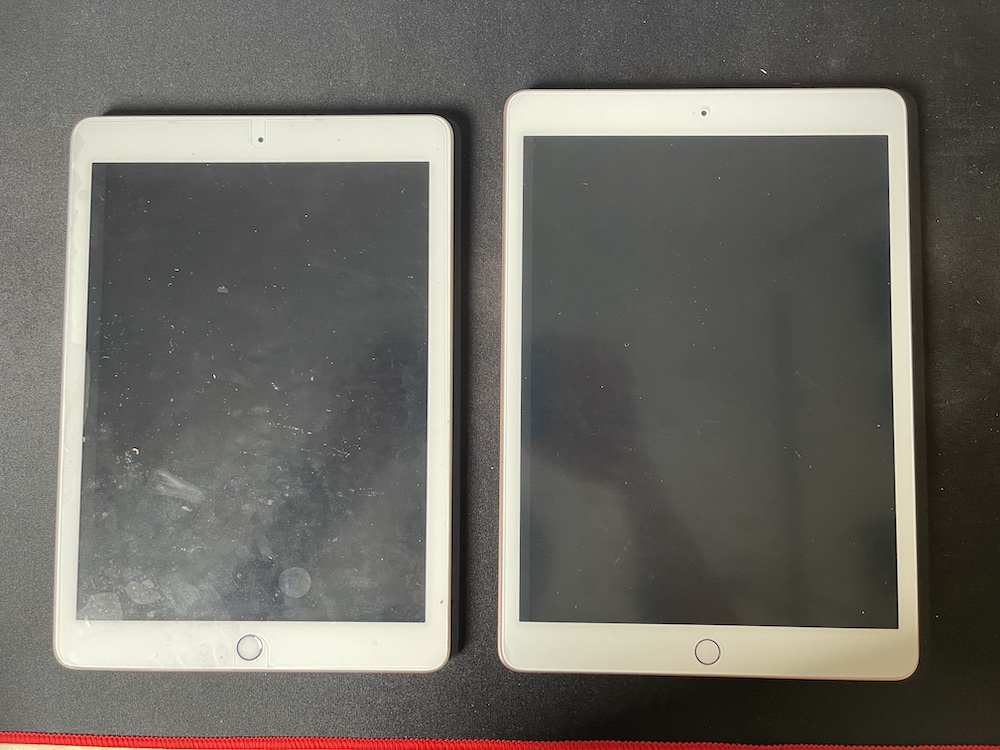

iPad 6は9.7インチ
iPad 7から10.2インチになりました。

現在、Amazonなどに出回っているケースやそのほかのアクセサリも10.2インチ用の方が多く、その点でも10.2インチに買い換えるメリットがありました。

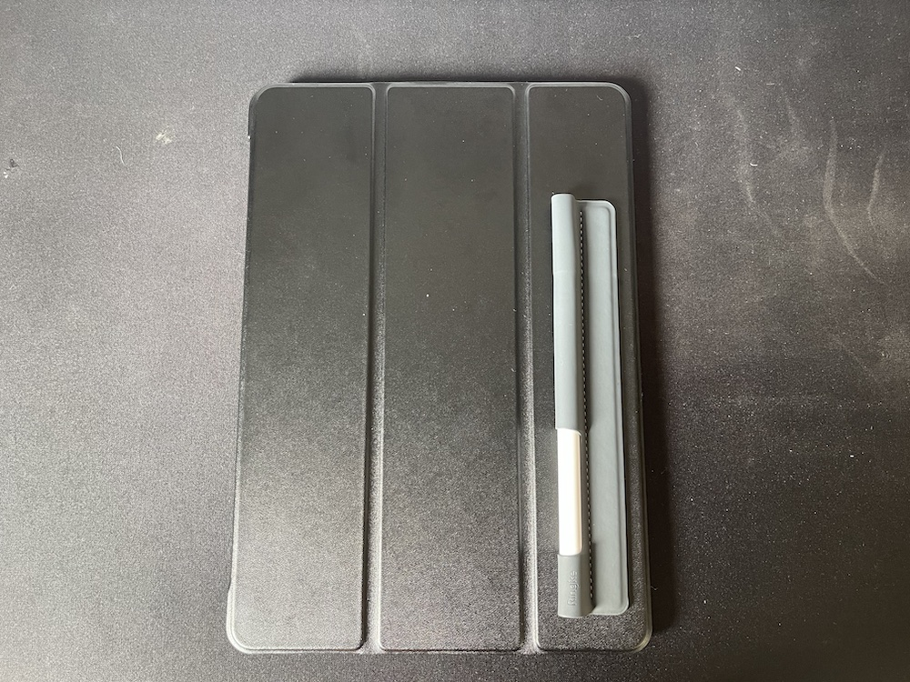

ケースにApple Pencilのホルダーを貼り付けています。

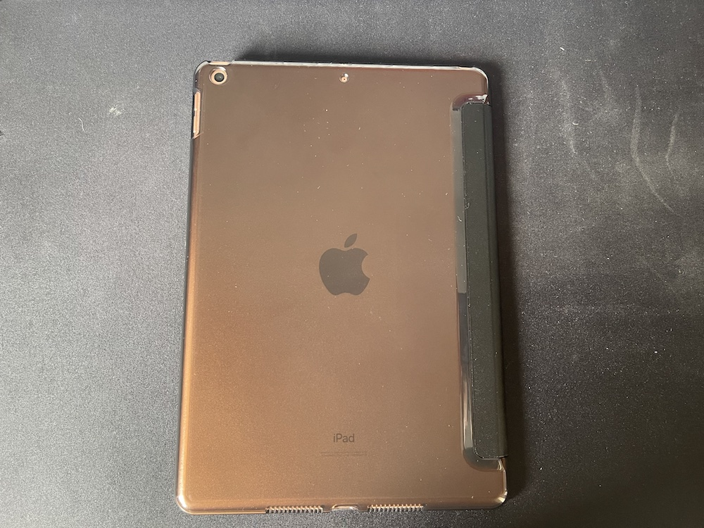

ケースを立てても、Apple Pencilのホルダーが干渉しないので良いです。
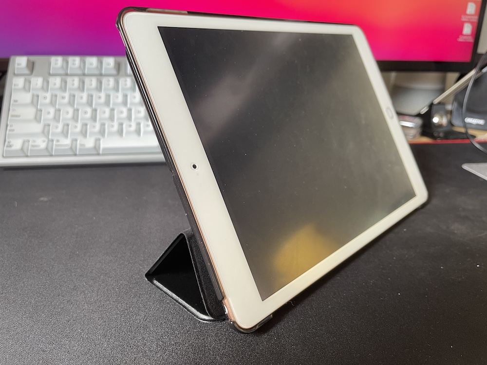

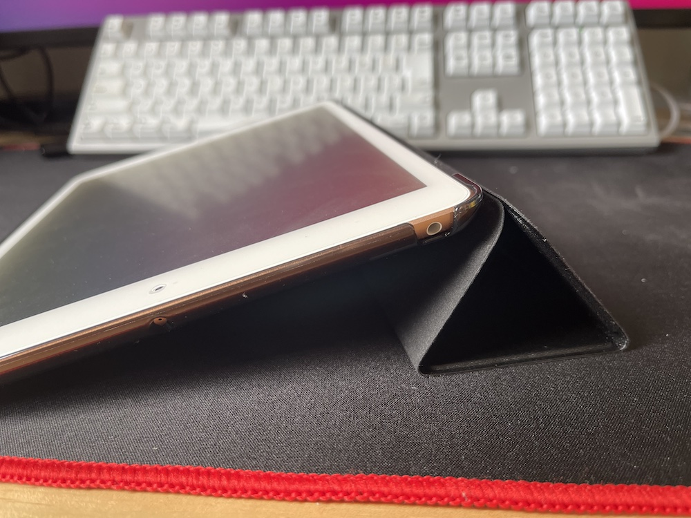

今回整備品で購入しましたが、24000円という値段でした。iPad 6を下取りに出し16000円だったので実質8000円程度でアップデートできたことになります。

6と7の性能差はほとんどなさそうな気がしますが、7の方が新しいチップを使っていると思うので、多少動作は軽い気がしなくもありません。

[itemlink post_id="14072"]

[itemlink post_id="14073"]

[itemlink post_id="14074"]

<h3>整備品購入時は会計金額からの下取り価格相当の割引はできない</h3>
整備品の場合、購入時に今使っている物を下取りに出して購入金額から割り引くということができません。

購入した後で、使っている物を下取りに出して、その金額は後日使えるApple Storeギフトカードとして付与される形となります。

<h2>iPad用に使うためのキーボードについて</h2>
<h3>iPadのキーボード付きケースのデメリット</h3>
文字入力が課題だったため、最初はキーボード付きのケースを検討しました。
しかし、文字が打ちづらかったり、US配列しかなかったりで、快適な文字入力を数ことができませんでした。

基本的に、ケースについている様なキーボードは、携行性をあげるために薄くなっておりストロークが浅いのが特徴です。

傾向性を高めるために、快適性を犠牲にしているとも言えるでしょう。

<h3>メカニカルキーボード「NuType F1」</h3>
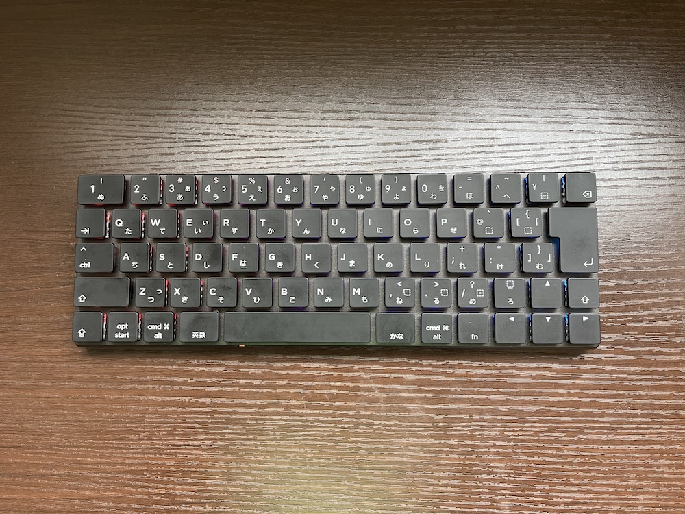

そこで携帯できるメカニカルキーボードを探し、購入したのが「NuType F1」です。

Nutype F1を購入するに至った決め手はこちら
<ol>
<li>JIS配列</li>
<li>軸が選べる</li>
<li> Bluetoothの接続先が3つ</li>
<li>有線でも無線でも接続可能</li>
</ol>

正直買って大正解でした。生産性が上がっている実感があります。

[itemlink post_id="14075"]

<h2>NuType F1について</h2>

<h3>特徴「尊師スタイル」前提の設計</h3>
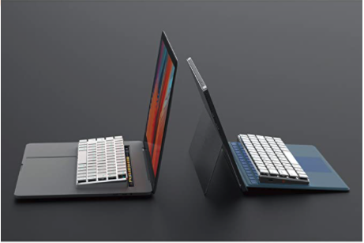
尊師スタイルとは、主にMac Book Proのキーボードの上に、<a href="https://amzn.to/3o5FfDZ" rel="noopener noreferrer" target="_blank">HHKBなどのキーボード</a>を載っけて作業するスタイルのことらしいです。

Mac Book Proについてはぼくも使っていたことがありますが、キーボードがとにかく使いづらかったのを覚えています。バタフライキーボードという機構を採用しており、それがミスタッチの原因として、かなり不評でした。

その使いにくいキーボードの代わりにこれを使えと言わんばかりの設計になっているのが、このNuType F1です。

なんと背面の足部分がMac Book Proに載せるのにちょうどいいようになっています。
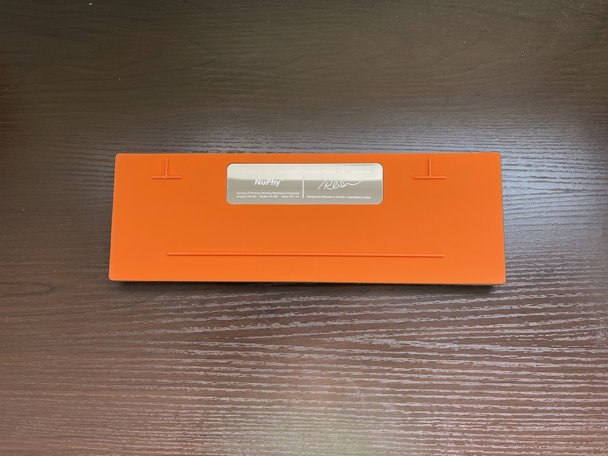

もちろんMac Book Proに載せなくても、使うことができます。
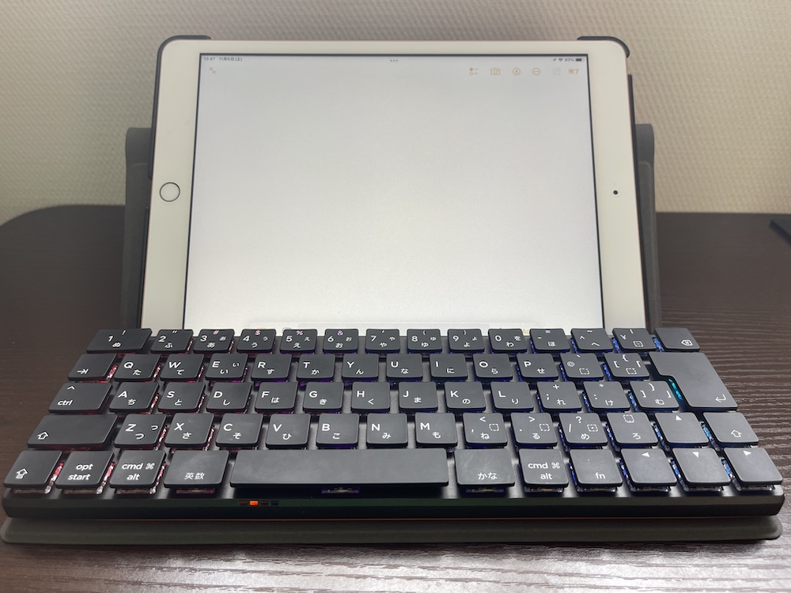

<h3>いいところ</h3>
ぼくが探しているキーボードの条件にピッタリと当てはまっていました。

<ol>
<li>JIS配列</li>
<li>軸が選べる</li>
<li> Bluetoothの接続先が3つ</li>
<li>有線でも無線でも接続可能</li>
</ol>

軸に関しては、カフェデ使うことを前提にしていますので、赤軸の静音タイプにしました。とは言っても、メカニカルキーボードなので完全に静かというとそんなことはなく、メカニカルキーボードの「あの音」はします。

また、Bluetoothの接続先が3つあって、すぐに切り替えできるというのも魅力です。例えばですが、会社で使ってても、Bluetoothを切り替えて自分のスマホにきたLINEなんかをスマホを手に取らずに返信できたりなんかもするわけです。

在宅ワークの昨今、自宅で使うシーンでもこの機能は利用価値が高いと思います。

例えば、会社用のノートPCとプライベートのPCに対し両方Bluetooth接続しておいて、切り替えて使うとかってこともできるわけです。

また、海外のメーカーであるにも関わらずJIS配列を選択できるという点も良かったです。iPadのキーボードケースのLogicoolのCOMBO TOUCHはiPad用だとUS配列しかありません。

この点もNuType F1を選んだ理由です。

<h3>ここはちょっとというところ</h3>

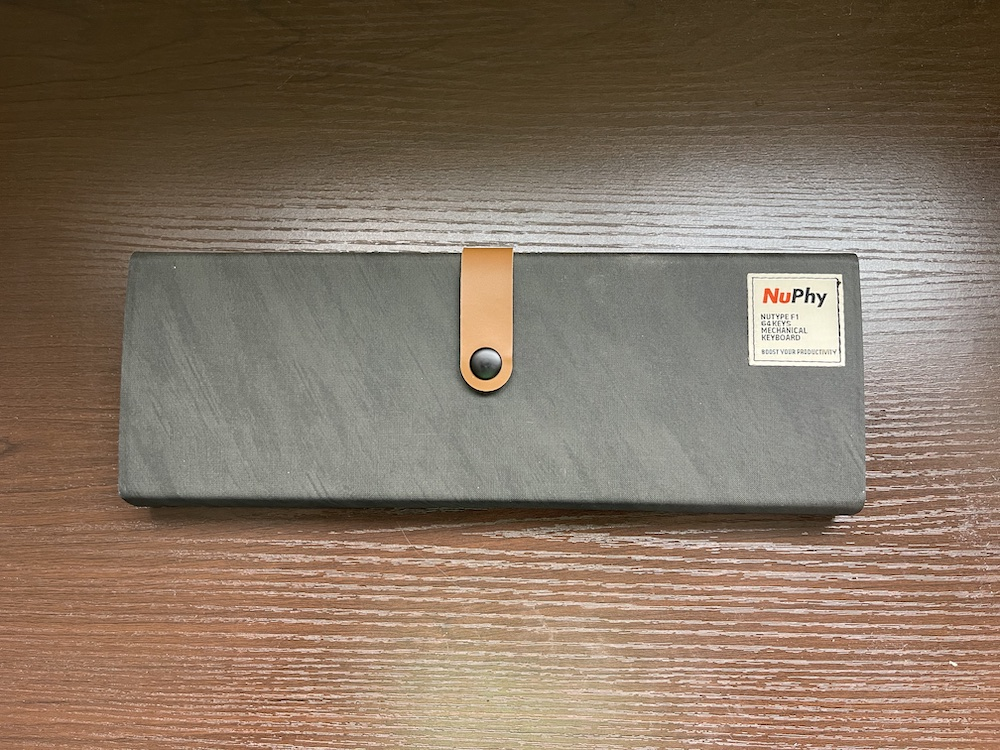

敢えてあげるとすると、メカニカルキーボードなので想定よりかは重かった。持ち運ぶ前提なのでケース付きで、それがおしゃれなのはいいところですが。

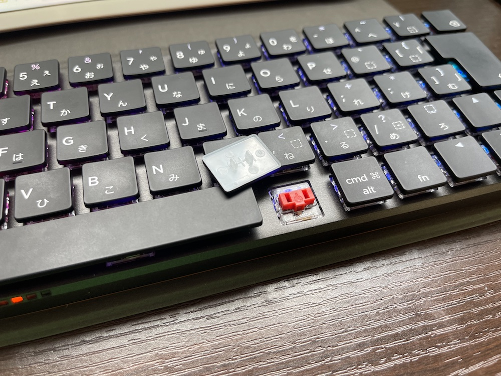

あとキートップが若干外れやすい気がします。

しかも割と壊れやすそうな形状をしているので、持ち運び用とはいえ、取り扱いには注意を払う必要があるでしょう。

それ以外のところに関しては満足しております。

打鍵音も軽快で、うるさすぎずいい感じです。

<h2><a href="https://twitter.com/s_s_p_y">しんぺー</a>はこう思った。</h2>
これで、外でやりたかったことが大体できる様になりました！

大きな出費を払わずに済みました。年末になるとどうしても気持ちが大きくなって無駄にお金をかけてしまう傾向があるので、気をつけないと。

今回いっそのことM1 Mac Book Airにメイン機ごと乗り換えること、色々解決しようかとも考えましたが、結局はキーボード問題に行き着くことに気が付きiPadのアップデート、しかも古いモデルでということで落ち着きました。

Appleの整備品なので、一応は新品と言えます。

次回外で3Dモデリングをやらなくちゃいけない欲求にかられたらメイン機の買い替えを再度検討しようと思います。

と言ったところで本日は以上です。
おやすみなさい。