---
categories:
- レビュー
date: Fri, 12 Nov 2021 22:58:39 +0000
slug: post-14109
tags:
- ガジェット
title: 「Seven&Me（セブンミー）」直火式コーヒーメーカーとミルクウォーマーが一体化した電気式自動エスプレッソマシンがすごい良い
---

昨年のステイホーム期間以降、スタバに行ってスチームされたミルクのドリンクを飲む機会が減りました。そこで、ミルクを泡立てる小型のものを購入し、直火のマキネッタでコーヒーを淹れて、ラテを作って飲んでいました。ただ、店の味には遠く及ばず、薄いし焦げた味がするしという感じでした。

そこで、ネットでたまたま発見した「Seven&Me（セブンミー）」を購入しました！

[itemlink post_id="14016"]

今では、これを使って自宅で簡単にスタバのラテを超える美味しさのラテを飲んでいます！！本日はSeven＆Me（セブンミー）のレビューです。

<h2>「Seven&Me（セブンミー）」とはどのようなマシンか？</h2>

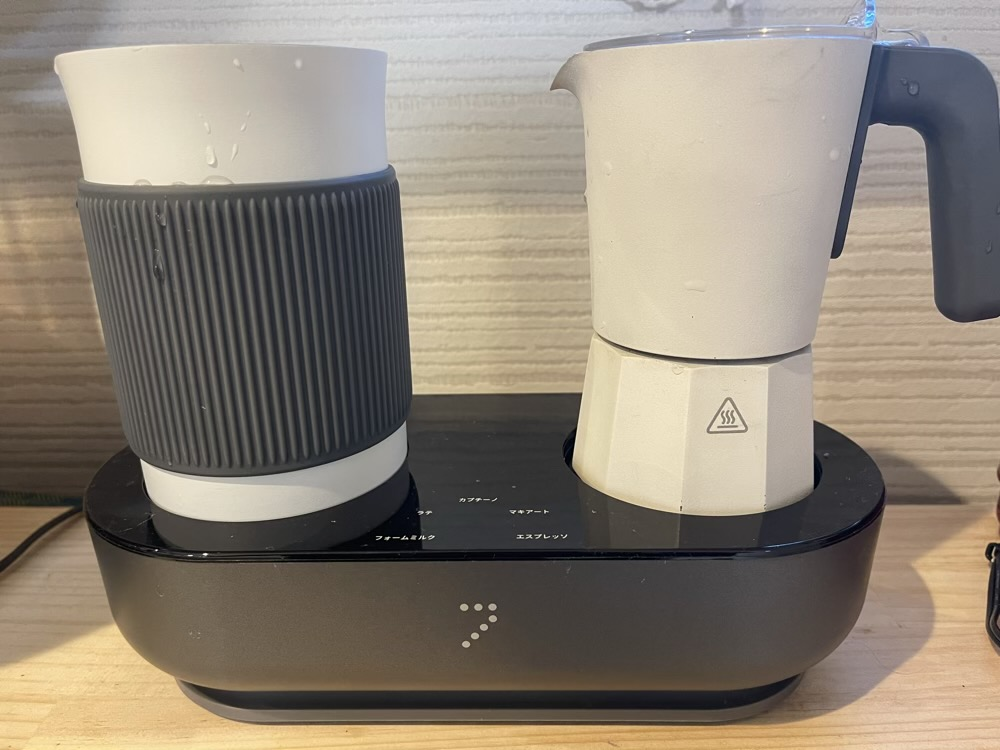

簡単にラテやカプチームが作れるマシンです。しかもオシャレで割とかわいい見た目≒ゴツくない。

<h3> 「Seven&Me（セブンミー）」のいいところ</h3>
<ol>
<li>操作簡単</li>
<li>掃除簡単</li>
<li>電気式なので安全</li>
</ol>

ちなみに、作れるドリンクはフォームミルク、ラテ、マキアート、カプチーノ、エスプレッソとなっています。

<h3> 「Seven&Me（セブンミー）」の使い方</h3>
使い方は簡単です。

ピッチャーにミルクを入れます。
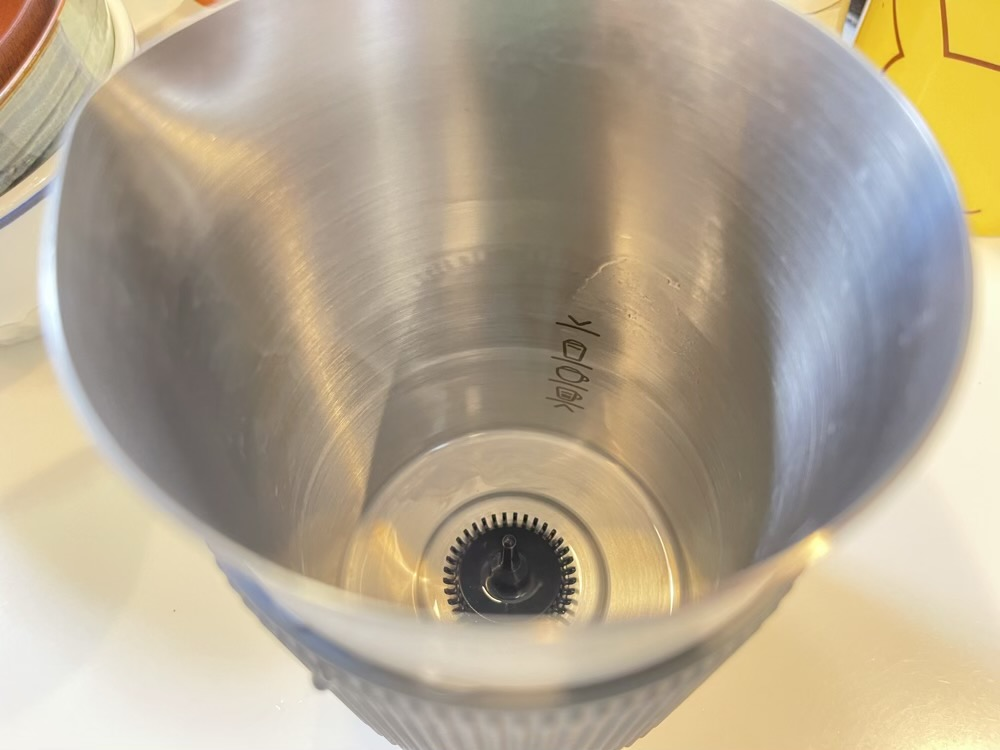

右側のマキネッタの方に挽いたコーヒー豆と水を入れてセットします。
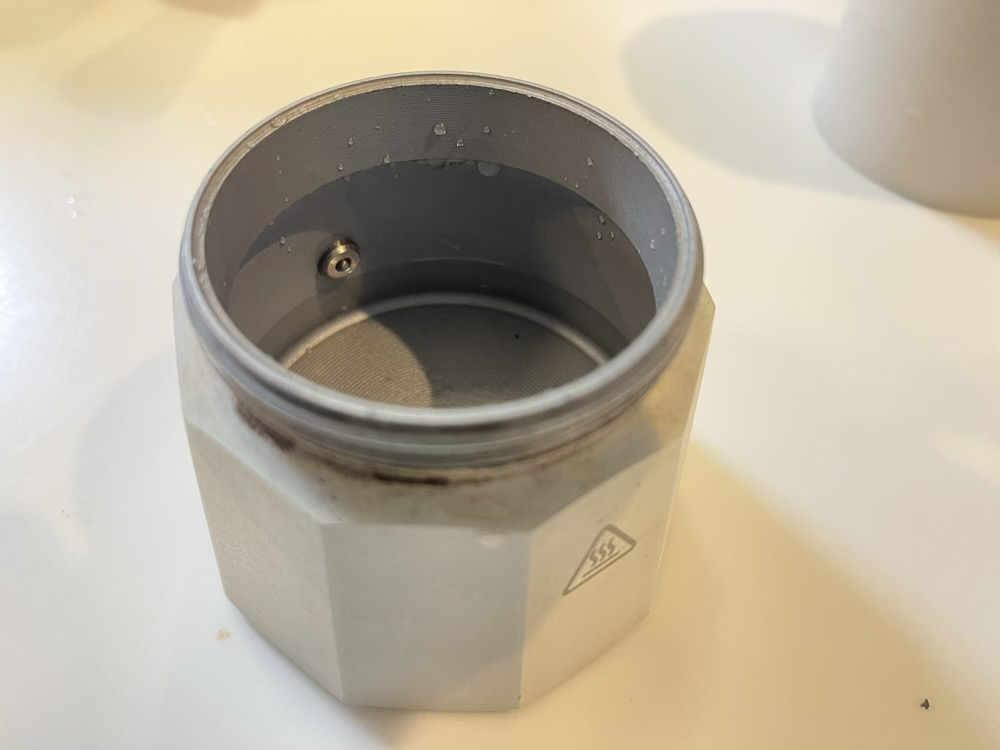

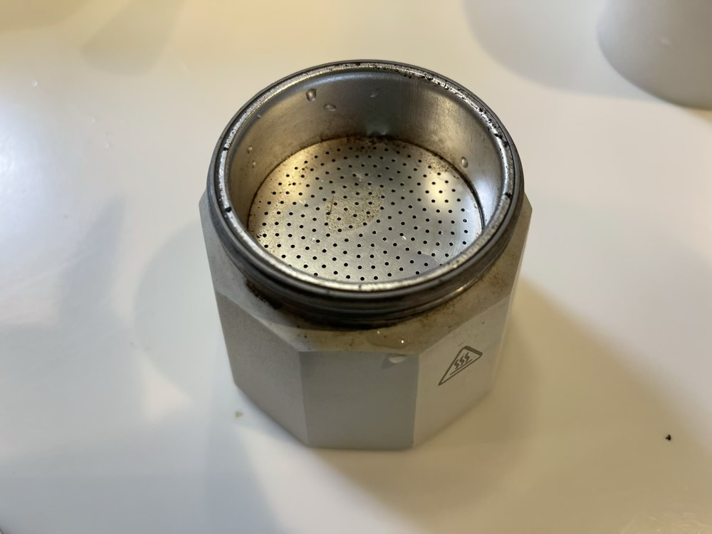

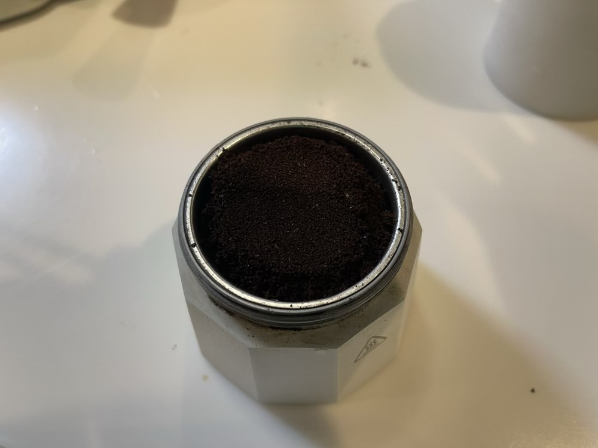

セットして飲みたいドリンクのボタンを2回押すだけ
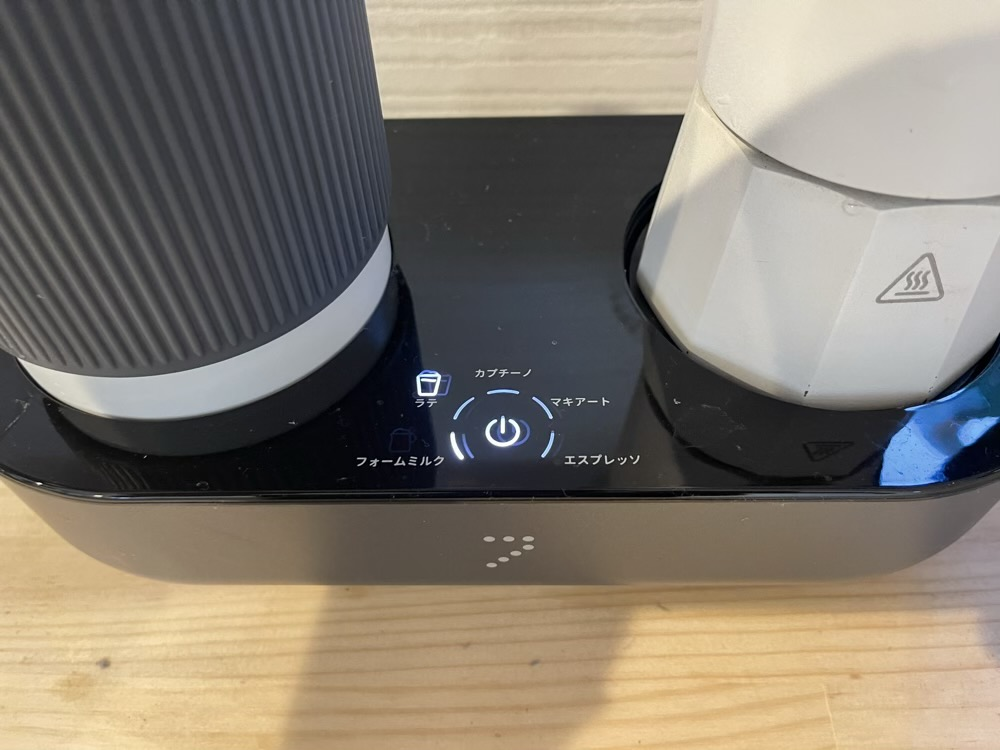

これで、すぐにドリンクができ上がります。

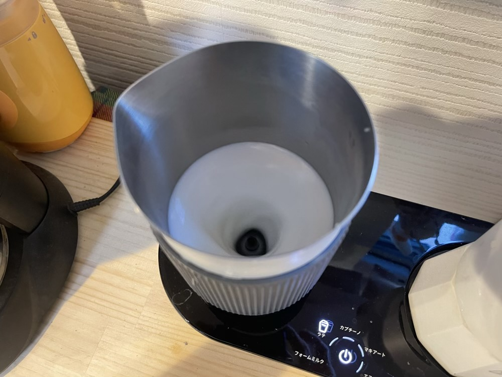

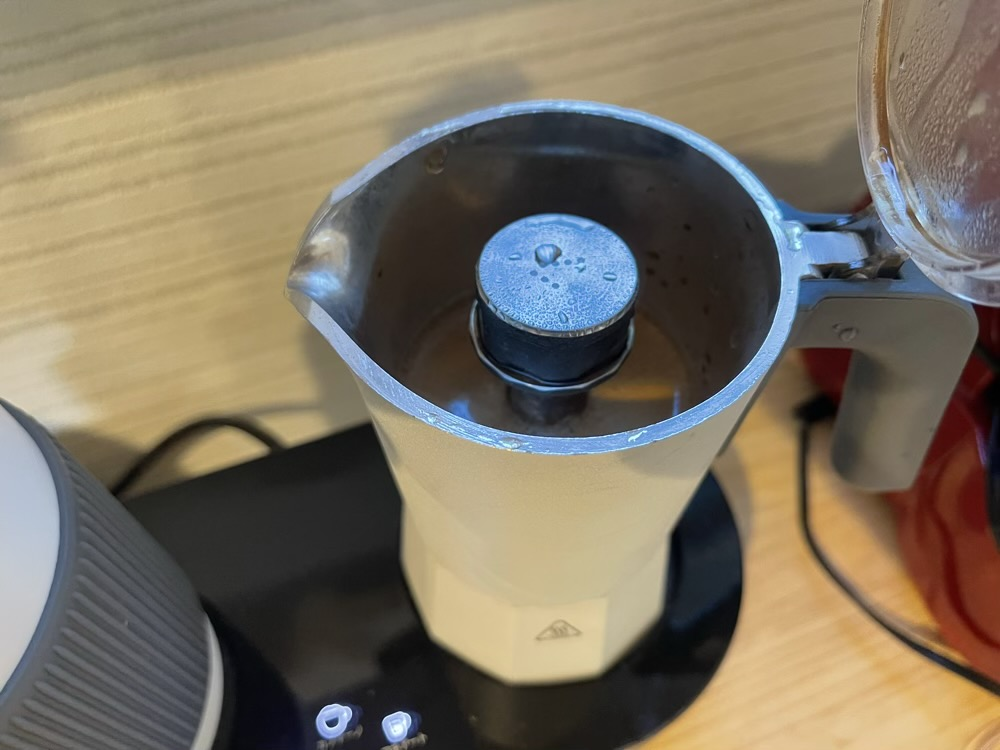

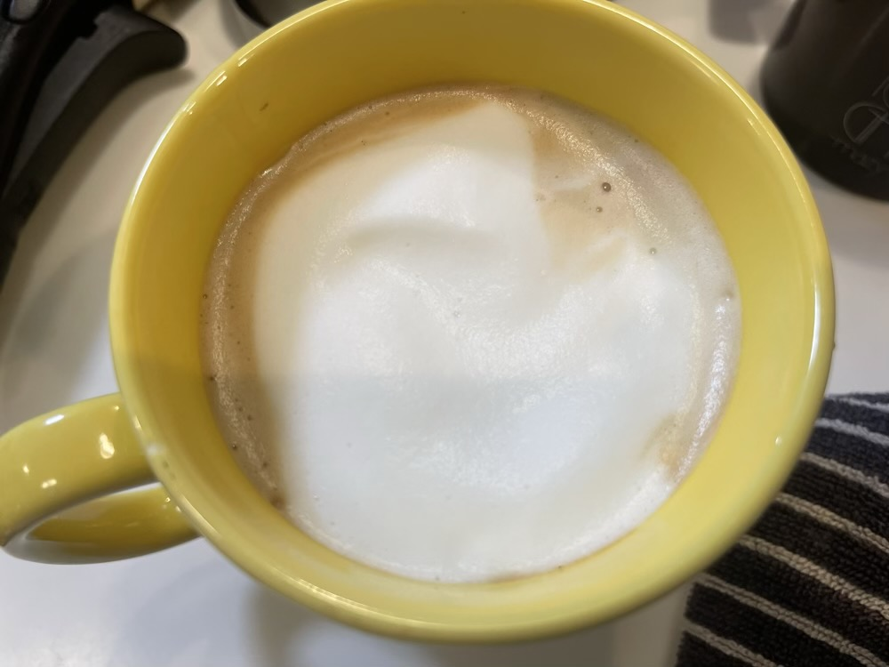
電気式とはいえ、一応直火式なので、マキネッタの方は冷めるまで待つ必要がありますが豆捨てて、水洗いするだけで終わり。ピッチャーの方は、泡立てるための部品も簡単に取り外せるので、普通に洗うだけ。

「Seven&Me（セブンミー）」を購入するまでは、ガスコンロで直火にマキネッタをかけて、コーヒーを作っていたので、吹きこぼれたり出来上がるまでずっと見て待っていました。しかも、沸騰したら火を止めたり、火がつきっぱなしになっていないかとかの安全確認も何度も行っていました。特に朝の時間は、家を出てからも、「あれ、火ちゃんと消したっけ」とか心配になることもしばしば。

でも、セブンミーは電気式なので、その辺りの心配がなくなりました。
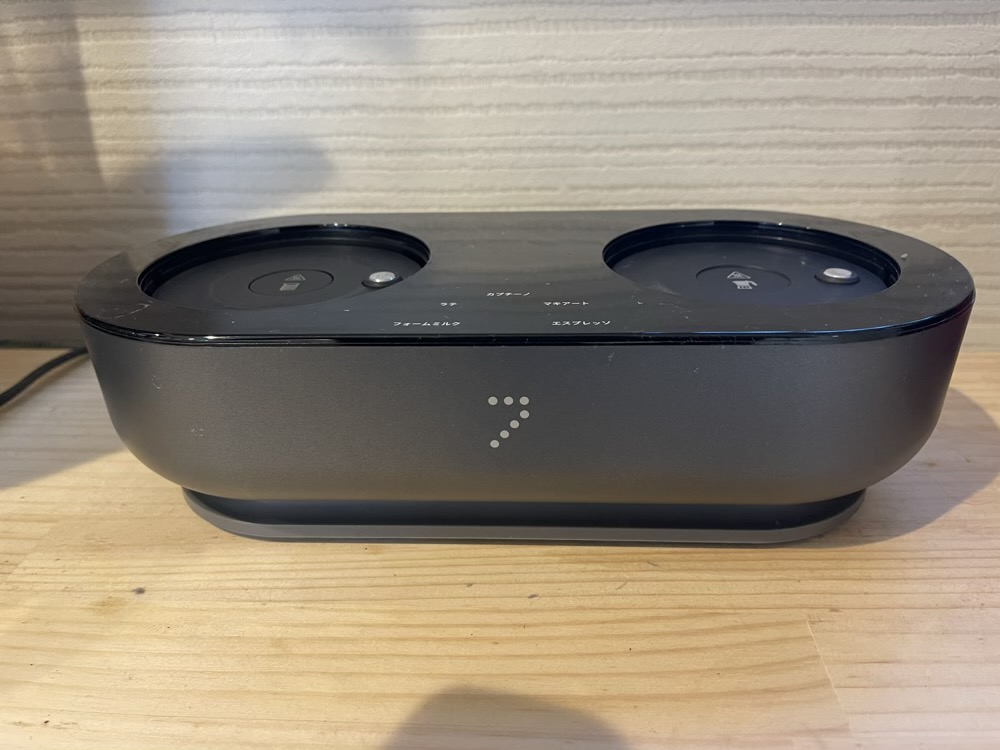

<h2> 「Seven&Me（セブンミー）」でスタバみたいなラテを作るためのレシピ</h2>

最近、セブンミーを使って作る最適のレシピに辿り着くついたのでご紹介します。

豆はスタバのスマトラを使います。粗さは5番。

それまでエスプレッソローストを限りなく細かく挽いてもらっていました。（3番）ただ、それだとマキネッタが詰まってしまい、正常に抽出ができません。直火式だとすごいパワーがあるので、無理矢理抽出できますが、セブンミーは電気式なので、水の温度もある程度以上は上がらない様です。

そこで、ちゃんと抽出ができて、かつしっかりと味も出る5番が最適という結論に至りました。そもそもマキネッタに使う豆は細挽き〜中挽きと言われているので、最初使っていたのは細かすぎだったのでよくなかった様です。

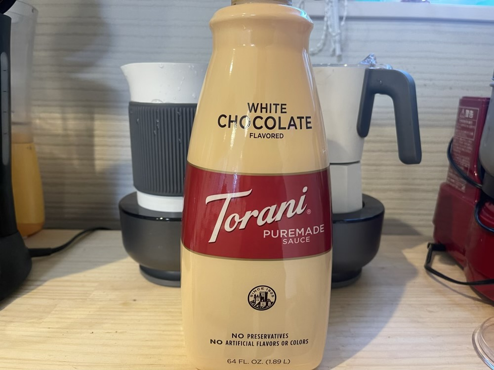

また、味の変化を楽しみたい場合は、ホワイトモカシロップを入れたりしています。最初は小さいのを買っていましたが、大きいサイズのものを買いました。

[itemlink post_id="14125"]

<h2><a href="https://twitter.com/s_s_p_y">しんぺー</a>はこう思った。</h2>

本当に簡単で、かつ安全なので見た瞬間すぐにポチりました。
まさに探し求めて理想の形でした。

今はラテアートがこれで作れないか色々と試してみています。

スタバで飲むよりも美味しくできるし、安上がりなので、かなり助かっています。

と言ったところで本日は以上です。
おやすみなさい。

[itemlink post_id="14016"]