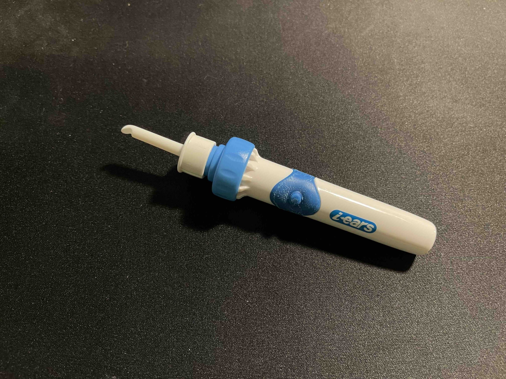

---
categories:
- Airpods
date: Mon, 06 Dec 2021 09:00:00 +0000
slug: post-14131
title: AirPods Proのイヤーチップ変えたら耳垂れしなくなったので、同じように悩んでる人試してみて。
---

それまでは大丈夫だったんですが、気がつけばある時からAirPods Proをつけ終わると耳の中が痒くなり、耳の奥から液体が湧き出る様になってしまいました。

調べてみるとAirPods Proをつけたことで同じ様な症状が出ている人が他にもいるみたいで、どうやらイヤーチップのシリコンによってアレルギーが起きてしまっているのではということでした。

この記事はAirPods Proのシリコンイヤーチップによる耳垂れの対策です。
<h2>耳だれとは？</h2>
<strong>Airpods Proを着けると耳が痒くなる。</strong>

<strong>痒くなるから指突っ込んで掻いてしまう。</strong>

<strong>悪化してさらに耳だれが出る。</strong>

ひどい時は、横になってると耳の奥に液体が垂れていくのがわかるくらい耳の中が濡れてしまっていました。
<h2>Airpods Proのイヤーチップを変えてみた</h2>
Airpods Proのシリコンが耳に合わない可能性が高いっぽいので、ウレタン製のものに変えてみました。
<h3>ウレタン製に変えてみた</h3>
調べてみるとコンプライというメーカーが有名らしい。

[itemlink post_id="14152"]

スポンジの様な手触りになっていて、ぎゅっと小さくしてから、耳の中に入れること中で膨らみ密閉度が高まるという仕組みの様です。シリコン製よりも若干遮音性は下がる気がしますが、個人的にはそこまで気にはなりませんでした。

これに変えたことで耳だれはほとんどでなくなりました！
<h3>効果薄かったけど、小さいサイズの純正イヤーチップに変えてみる</h3>
ちなみに、ネットで調べてみるとAirpods Pro付属のイヤーチップの小さいサイズのを使って改善したという人もいるみたいです。

試してみ多ところ、確かに耳だれの頻度は減りました。ただし、長時間つけているとやはりダメでした。

根本的にシリコンがぼくの耳に合わなくなってしまった様です。
<h2>耳掃除した方が良さげ</h2>
耳だれはしなくなりましたが、ウレタンに耳かすがつくのが気になるのと、耳垢が出やすくなった気がするので、耳掃除の頻度が増えました。

ただ、ここでも指などでやってしまうと傷付けてしまい、耳だれが出る原因になります。綿棒も、頻度が高いと結局は耳に傷がつく原因になります。
<h3>耳掃除機を使ってる</h3>
そこで今使っているのがこれ。耳垢を吸い出してくれる掃除機です。

これが驚くほど取れます。さらに耳をこすらなければダメージもありません。

ただ、先端がプラスチックで硬いし、耳の奥まで届く様に長くなっているので、気をつけないと痛い。

[itemlink post_id="14154"]
<h2><a href="https://twitter.com/s_s_p_y">しんぺー</a>はこう思った。</h2>
ヘッドホンを使えば、特に色々と気にすることはないのですが、気温が高かったり、鞄を持たないちょっとした外出の時に持っていくのは面倒臭いので色々と工夫してみました。

テレワークで終始イヤホンをつけている関係から、同じく外耳炎になる人が多いらしいので、自分の耳にあった素材のものを使うことをお勧めします。

と言ったところで本日は以上です。
おやすみなさい。

[itemlink post_id="14152"]