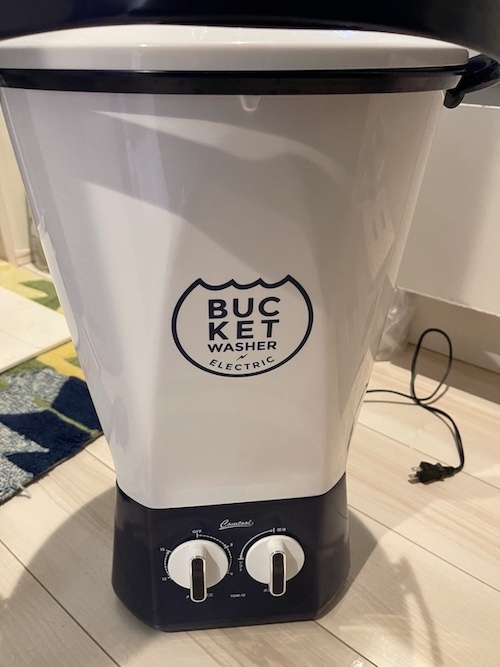
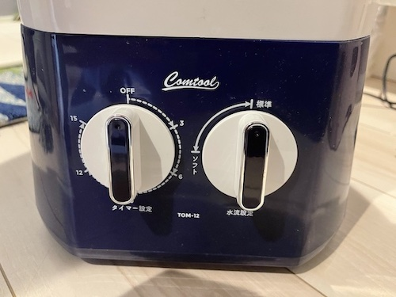

---
categories:
- レビュー
date: Thu, 06 Jan 2022 00:32:40 +0000
slug: post-14180
tags:
- おすすめ
- ガジェット
title: Amazonで売ってる小型洗濯機レビュー「靴とか洗うのにちょうど良い」
---

子どもの靴を洗うためにコインランドリーに毎週末通っていましたがついつい忘れちゃったりするので、Amazonで小型洗濯機を購入してみました。本日は小型洗濯機のレビューです。

ちなみに結論から言うと

<strong>洗浄力に全く問題なし！買ってよかった！</strong>

<h2>小型洗濯機の使い方</h2>
今回購入した小型洗濯機はこちら

[itemlink post_id="14136"]

基本的な使い方としては

洗うものと水と洗剤入れて標準かソフトかを選び、タイマーを5〜15分で設定するだけ

ただし、注水・すすぎ・排水機能はないので、全部自分でやる必要があります。

[st-mybox title="" webicon="" color="#757575" bordercolor="#BDBDBD" bgcolor="#f3f3f3" borderwidth="0" borderradius="5" titleweight="bold" fontsize="" myclass="st-mybox-class" margin="25px 0 25px 0"]
<ol>
 	<li>洗い物と洗剤を入れ、規定量まで水を入れる</li>
 	<li>洗い方とタイマーを回す</li>
 	<li>終わったら水を捨てて、再度水を入れる</li>
 	<li>すすぎのために再度タイマーを回す</li>
 	<li>終わったら水を捨てて、出来上がり</li>
</ol>
[/st-mybox]

あとは乾かすだけ。
<h2>小型洗濯機とコインランドリーとの比較</h2>
[table id=26 /]

ちなみに小型洗濯機の洗浄力に関しては全く問題ありませんでした。

1週間遊び倒して、埃だらけの子どもの靴もしっかりと綺麗になりました。

<h2>結論「買ってよかった」</h2>
洗浄力に関しては全く問題ありません。

「洗濯機で洗うのはちょっと・・・」というような物を専用で洗うのにちょうど良い！

耐久度に関しては、まだちょっとしか使っていないのでわかりませんが、半年くらいもってくれたら元が取れたことになるので、大切に使っていきたいと思います。

結論、買ってよかった！

[itemlink post_id="14136"]

<h2><a href="https://twitter.com/s_s_p_y">しんぺー</a>はこう思った。</h2>
これで洗いたいときに、洗いたいタイミングで洗える！！
浴室乾燥に当ててれば一晩で乾くし。外に洗いに行くのが億劫でも、家の中で洗える！

といったところで本日は以上です。
おやすみなさい。