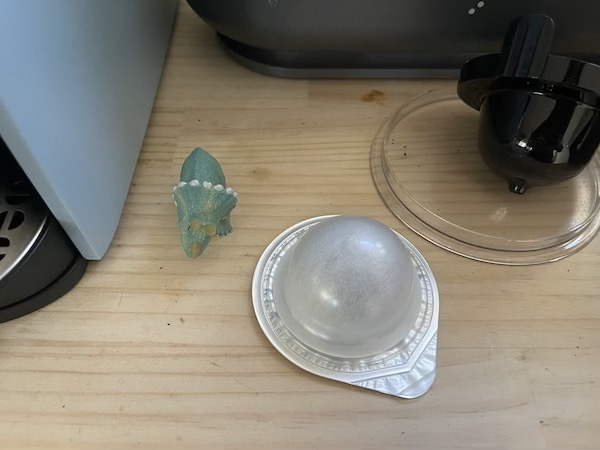
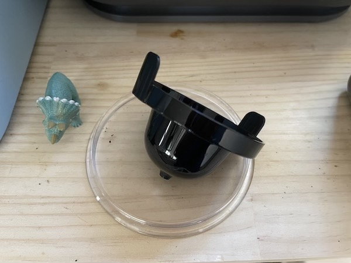
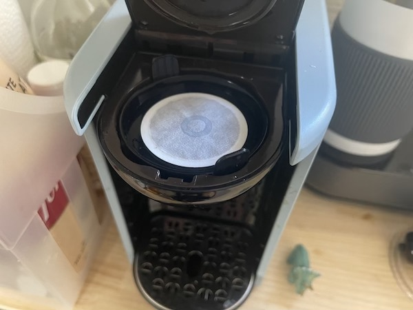
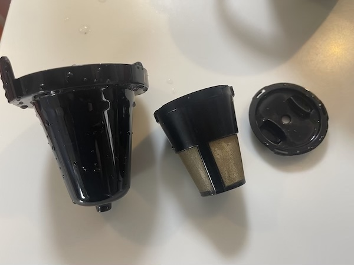
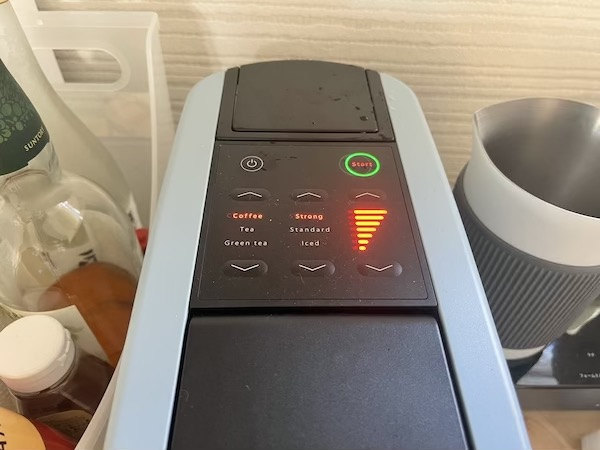
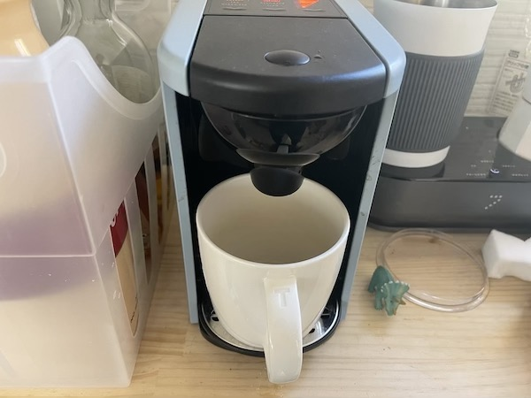

---
categories:
- レビュー
date: Tue, 11 Jan 2022 03:00:07 +0000
slug: post-14196
tags:
- おすすめ
- ガジェット
title: 【レビュー】UCCのドリップポッドが普通のコーヒー豆も使えて手軽で使いやすい
---

UCCドリップポッドカプセル式コーヒーマシン EC DP03というのをAmazonで購入したので本日はそのレビューとなります。

ネスプレッソなどの他社製品との比較は行っていません。使ったことないし、そもそもこのページに辿りついた人は、多分おおかたこの商品の購入検討をしている人たちだと思うので。

[itemlink post_id="14197"]
<h2>UCCドリップポッドとは</h2>
とは言え、チラッと他社製品にも触れておきます。

この製品は自宅で簡単に飲めるカプセルタイプのコーヒーマシンの１つです。デロンギやネスプレッソでも同じような製品がでています。注意すべき点としては、コーヒーのカプセルは他社との互換性がないということです。

そのため、買ったら実質その会社でのサブスクみたいな感じで、そこのコーヒーしか飲めなくなります。
※実際はそんなこともない。後述。
<h2>レビュー</h2>
結論から書きます。「UCCドリップポッドカプセル式コーヒーマシン EC DP03」の良いところは

良いところは、この1点です。

普通のコーヒー豆も使える！

ネスプレッソでも他のコーヒー豆が使えるキットはあるみたいですが、使い捨てのフィルターが必要だったりするみたいなので、比較してよくみた方がいいかもです。

ただ、ぼくはこの1点で即購入を決定してポチりました。

それ以外は、掃除しやすいシンプル構造だったり、すっきりとした本体デザインだったりが挙げられます。
<h3>使ってみた感想</h3>
「UCCドリップポッドカプセル式コーヒーマシン EC DP03」を使ってみた感想です。

まず、カプセルの場合は極めて簡単。

これがカプセル。

カプセル専用のカップをセットして

タンクに水を入れて、蓋をやぶいてカプセルをセットしてボタン押すだけ

1分程で出来上がります。

コーヒー豆も使えます。スタバで買ってきた豆を、コーヒー豆専用のフィルターに規定量入れて、同じように水入れてボタン押すだけ。ちなみにフィルターは使い捨てではなく、洗って何度も使える金属タイプのものです。

これまた1分程で出来上がります。

出来上がり具合の調整もボタンでわかりやすい。

<h3>良いところ</h3>
「UCCドリップポッドカプセル式コーヒーマシン EC DP03」の良いところ

他社の市販のコーヒー豆が使えるところ！

掃除しやすいシンプル構造

スッキリとしたスリムなデザイン
<h3>悪いところ</h3>
「UCCドリップポッドカプセル式コーヒーマシン EC DP03」の悪いところ

カプセルが普通の店でほとんど売ってない！

Amazonで買えるし、コーヒー豆の方目当てで買ったのにそんなに気にならないけど。

ネスプレッソとかの方はスーパーとかでも売ってるところがあるみたいです。

UCCのサイトで定期購入ができるようになっているので、その戦略のために敢えて買いにくくなってるのかもしれません。

[itemlink post_id="14199"]
<h2><a href="https://twitter.com/s_s_p_y">しんぺー</a>はこう思った。</h2>
ただ、めちゃくちゃ手軽に1杯分のコーヒーが飲めるという点はとてもいいです。

そして繰り返しになりますが、普通のコーヒー豆が使える！

紙フィルターもいらいないので、飲めない！という状況がない！いつでも飲める！（豆さえあれば）

なので、おすすめです。

といったところで本日は以上です。
おやすみなさい。

[itemlink post_id="14197"]