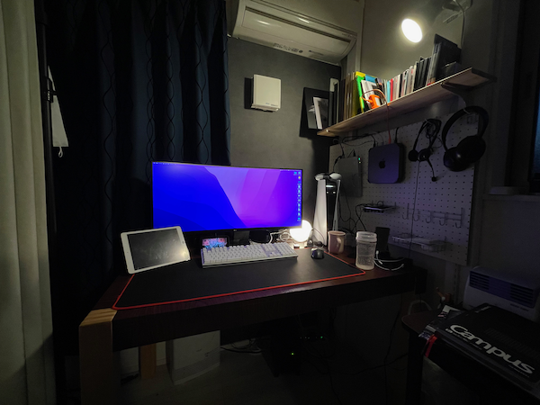
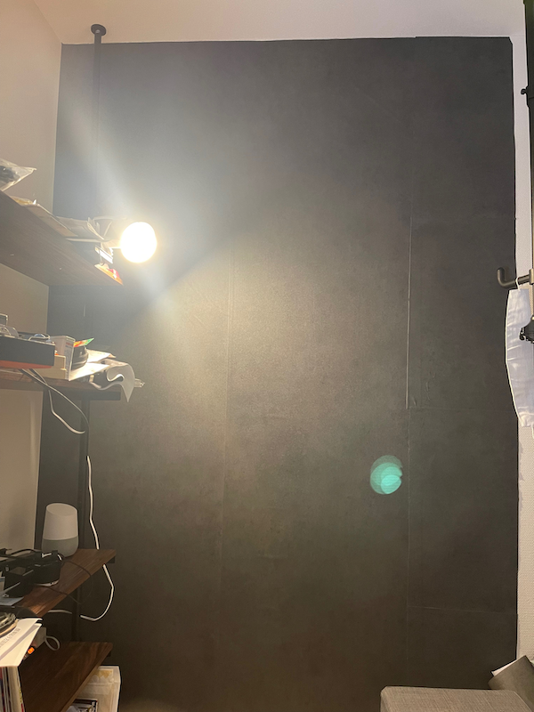
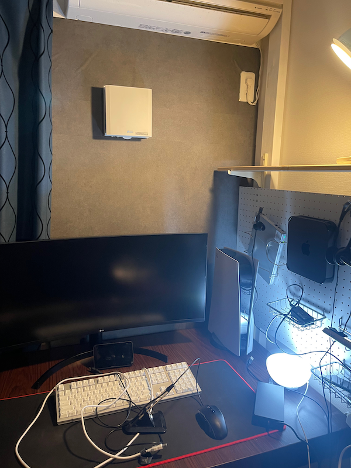
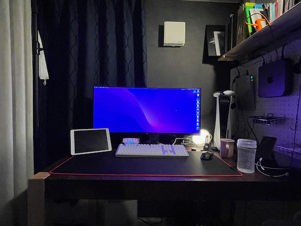
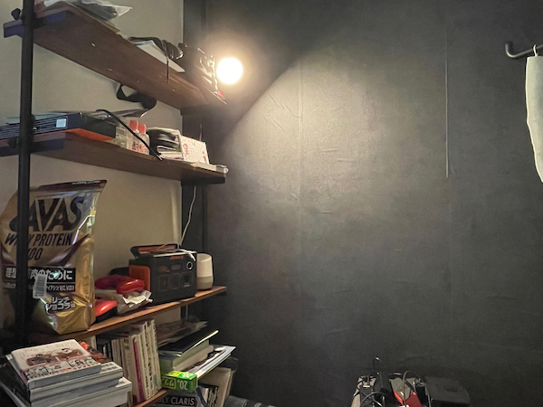

---
categories:
- レビュー
date: Wed, 12 Jan 2022 09:00:46 +0000
slug: post-14219
tags:
- テレワーク
title: 2022年1月デスク環境紹介
---

2021年12月よりまたテレワークになりましたので、自宅環境に大きく手を加えました。本日はデスク環境の紹介です。

今まで

<strong>「持ってるガジェットMAXで手の届く範囲に整理して配置してある」</strong>

という感じでした。

[st-cmemo myclass="st-text-guide st-text-guide-memo" webicon="st-svg-pencil" iconcolor="#919191" bgcolor="#fafafa" color="#000000" bordercolor="" borderwidth="" iconsize=""]<a title="2021年7月版のデスク環境紹介" href="https://www.warawareotoko.com/2021/07/02/post-13965/">2021年7月版のデスク環境紹介</a>[/st-cmemo]

ただ、物が多いので収納が必要になりました。

そのため、棚を設置。さらに物が多くなりました。

物が多いのでケーブルも多くなり、結局雑然としていました。
<h2>2022年1月のデスク環境</h2>
今回のコンセプトは、「落ち着いた感じ」です。
またまた、YouTubeで色んな海外セットアップツアーを漁ったり、Instagramでおしゃれなのを探したりしました。

やったこと
[st-cmemo myclass="st-text-guide st-text-guide-point" webicon="st-svg-check" iconcolor="#FF8F00" bgcolor="#FFF8E1" color="#000000" bordercolor="#FFE082" borderwidth="" iconsize="150"]
<ul>
 	<li>デスクの移動</li>
 	<li>壁・テーブルの色変更</li>
 	<li>不要設備の撤去</li>
</ul>
[/st-cmemo]

<h3>デスクの移動</h3>
デスクの位置を部屋の反対側に持っていきました。これで西日対策万全。
窓側に持っていったので、お外の様子も見れるようになりました。
<h3>壁・テーブルの色変更</h3>
続いて壁紙
落ち着いた雰囲気にするために、部屋の最も大きい面積をしてるも、何も機能していない壁に変化をもたらしました。
貼って剥がせる壁紙シートを貼りました。ダークな落ち着いた雰囲気となりました。

デスクの色
最初はデスクに色を塗ろうかと思っていましたが、色々めんどくさそうだったので、これまたカッティングシートを貼りました。これで部屋がだいぶ落ち着いた感じになりました。

<h3>不要設備の撤去</h3>
デスクの上から不要なものを撤去

<ul>
 	<li>片手キーボード</li>
 	<li>マイク</li>
 	<li>照明</li>
 	<li>デュアルモニター</li>
 	<li>ニンテンドースイッチのスタンド</li>
 	<li>棚（移動）</li>
</ul>
PCゲームをやらないことに気がついたのでゲームに使うものを撤去しました。
デュアルモニターも撤去。iPadのサイドカーでOK（YouTube見るだけだし）
スイッチも自分の部屋では、モニターでやらないし、キャプチャーすることもないのでスタンドは不要。

棚は移動して、小物を置いていますが、まだここは整理しきれてない。不要なものを捨てないと

<h2><a href="https://twitter.com/s_s_p_y">しんぺー</a>はこう思った。</h2>
今後やりたいこと

Mac miniを使っていますが、動画編集中にカクツクカクツク。テキスト入力が間に合わない。そろそろM1 Macに買い替えたい。
Mac Book Airにしてデュアルモニターとして使ってもいい。

年末Mac miniにトラブルがあり、初期化する時にBootcampのWindowsも消してしまいました。
なので、家にWindowsがないので、そのうちゲーミングPCでWindowsを導入したいと思っています。

といったところで本日は以上です。
おやすみなさい。