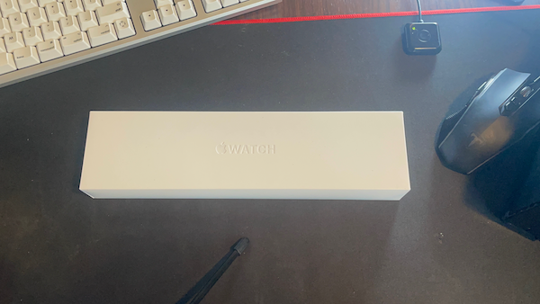
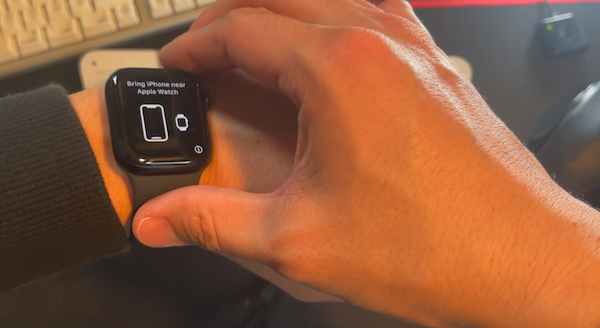

---
categories:
- Apple Watch
date: Thu, 13 Jan 2022 09:00:02 +0000
slug: post-14244
tags:
- apple
title: 【レビュー】Apple Watch series7買ってみた
---

 Apple Watchseries7の41mmを購入しました。買う価値があるのかどうか、それについて書いていきたいと思います。

まず結論

買う価値あった。壊れるまで使う予定。
<h2>買う前に抱いていた心配</h2>
Apple Watchなんていらないのでは？

コレ。4,5万も出して時計を買う必要なんてあるのか？
決済なんてスマホでできるし、時間を見る必要があるなら今まで使ってた激安中華製ウェアラブルガジェットMi Bandで事足りるでしょ。睡眠ログも取ってくれてるし、充電も1週間以上しなくていいし。

買う必要があるのか？

結果、買ってしまったわけですが、買って良かった。
<h2>買って良かったと思えるところ</h2>
Apple Watchを買って良かったと思えるところ

[st-cmemo myclass="st-text-guide st-text-guide-point" webicon="st-svg-check" iconcolor="#FF8F00" bgcolor="#FFF8E1" color="#000000" bordercolor="#FFE082" borderwidth="" iconsize="150"]
<ul>
<li>ショートカット機能</li>
<li>チェックインアプリ</li>
<li>Siri</li>
<li>Paypayのコード決済</li>
</ul>
[/st-cmemo]

コレらが全部できるのが非常に強い

Apple Watchだから手軽に簡単にできるので、めちゃくちゃ便利。

睡眠ログの精度もMi Bandとは全然違う。高精度でちゃんと計測してくれてます。

今では、買う前に抱いていた心配をおおむね覆して非常に重宝しております。体の一部のように、全く違和感がないつけ心地です。

バッテリーの持ちは、確かによくはないけれども、充電速度が早いのですぐ満充電になります。基本お風呂に入っている間に充電して、出たらつけると言う感じにしています。ただ、さらに細切れの時間も充電したいと思うので、急速充電器を買おうと思っています。
<h2><a href="https://twitter.com/s_s_p_y">しんぺー</a>はこう思った。</h2>
ここがちょっとと言うところは一つだけ。

睡眠アプリの設定がよくわからない。使い方がよくわかっていません。
そして、目覚ましが弱くて、起きれない。

ここの部分はまだ個人的に研究が必要そうだと感じています。

と言ったところで本日は以上です。
おやすみなさい。