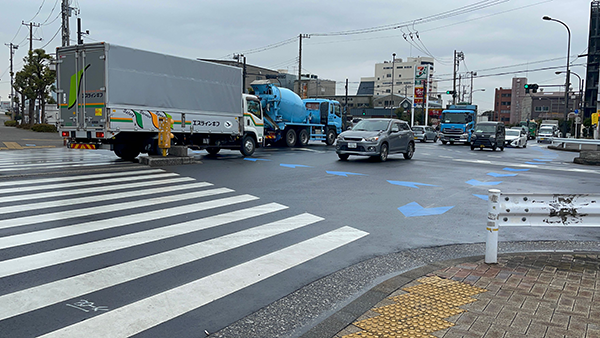
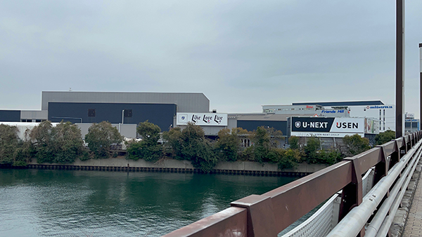
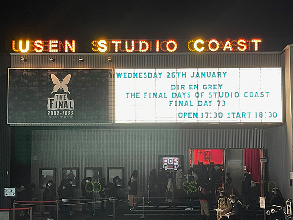

---
categories:
- DIR EN GREYのLIVEレポ
date: Sat, 29 Jan 2022 16:43:28 +0000
slug: post-14272
tags:
- DIR EN GREY
- LIVEレポ
title: 【ライブレポ】DIR EN GREY「The Final days of STUDIO COAST Final Day 73 Final」-2022_1_26@USEN
  STUDIO COAST
---

久しぶりのDIR EN GREYにして、最後のコースト
もしかしたら生涯2度とこの駅で降りることはないのかもしれないとか思いつつ噛み締めました。

きっとこの交差点も下手すりゃ障害渡ることはないのだろう

この景色はもう見ることはない

最後のコースト

<h2>感想</h2>
徹頭徹尾、全てがDIR EN GREYでした。
いつものDIR EN GREYであり、コーストが終わろうが、その姿はこの場所で幾度となく目に焼き付けたままの姿でした。
<blockquote class="twitter-tweet">

コーストよ、
私は帰ってきた！
⁡<a href="https://twitter.com/hashtag/DIRENGREY?src=hash&amp;ref_src=twsrc%5Etfw">#DIRENGREY</a><a href="https://twitter.com/hashtag/TheFinal?src=hash&amp;ref_src=twsrc%5Etfw">#TheFinal</a><a href="https://twitter.com/hashtag/StudioCoast?src=hash&amp;ref_src=twsrc%5Etfw">#StudioCoast</a><a href="https://twitter.com/hashtag/%E3%82%AB%E3%82%AA%E3%83%99%E3%83%AB%E3%82%AC%E3%83%88%E3%83%BC?src=hash&amp;ref_src=twsrc%5Etfw">#カオベルガトー</a> <a href="https://t.co/6tFITd7bi9">pic.twitter.com/6tFITd7bi9</a>

— 薫 (@kaorugeee) <a href="https://twitter.com/kaorugeee/status/1486190288486170626?ref_src=twsrc%5Etfw">January 26, 2022</a></blockquote>

<h2>セトリ</h2>
久しぶりにDIR EN GREYを、しかも久しぶりのスタンディングで、このセトリは完全にころしにきてる。

GDS
THE III D EMPIRE
朔
Merciless Cult
人間を被る
落ちた事のある空
腐海
CONCEIVED SORROW
audience killer loop
赫
朧
TDFF
CLEVER SLEAZOID
詩踏み
THE FINAL

EN.
The Deeper Vileness
C
冷血なりせば
SUSTAIN THE UNTRUTH
激しさとこの胸の中で絡みついた灼熱の闇
<h2>メンバー衣装</h2>
まずはToshiya
もうToshiyaの登場からToshiyaの記憶しかないくらいの過去1のインパクト
<blockquote class="instagram-media" style="background: #FFF; border: 0; border-radius: 3px; box-shadow: 0 0 1px 0 rgba(0,0,0,0.5),0 1px 10px 0 rgba(0,0,0,0.15); margin: 1px; max-width: 540px; min-width: 326px; padding: 0; width: calc(100% - 2px);" data-instgrm-captioned="" data-instgrm-permalink="https://www.instagram.com/p/CZUETYUpSZ-/?utm_source=ig_embed&amp;utm_campaign=loading" data-instgrm-version="14">

&nbsp;

この投稿をInstagramで見る

&nbsp;

<a style="color: #c9c8cd; font-family: Arial,sans-serif; font-size: 14px; font-style: normal; font-weight: normal; line-height: 17px; text-decoration: none;" href="https://www.instagram.com/p/CZUETYUpSZ-/?utm_source=ig_embed&amp;utm_campaign=loading" target="_blank" rel="noopener">Toshiya(@toshiya_direngrey)がシェアした投稿</a>

</blockquote>

この背中に全ての記憶がもっていかれた

ミスユニバースかのような青のドレスとたすき？白くそしてとてつもなく長いタスキ。さらに当然のごとくキラッキラしたナニカが散りばめられていた。イヤリングもキラッキラ。
<blockquote class="instagram-media" style="background: #FFF; border: 0; border-radius: 3px; box-shadow: 0 0 1px 0 rgba(0,0,0,0.5),0 1px 10px 0 rgba(0,0,0,0.15); margin: 1px; max-width: 540px; min-width: 326px; padding: 0; width: calc(100% - 2px);" data-instgrm-captioned="" data-instgrm-permalink="https://www.instagram.com/p/CZQ49Iqpzjo/?utm_source=ig_embed&amp;utm_campaign=loading" data-instgrm-version="14">

&nbsp;

この投稿をInstagramで見る

&nbsp;

<a style="color: #c9c8cd; font-family: Arial,sans-serif; font-size: 14px; font-style: normal; font-weight: normal; line-height: 17px; text-decoration: none;" href="https://www.instagram.com/p/CZQ49Iqpzjo/?utm_source=ig_embed&amp;utm_campaign=loading" target="_blank" rel="noopener">Toshiya(@toshiya_direngrey)がシェアした投稿</a>

</blockquote>

薫は謎の陶芸家のようなシルエット。謎柄。

京は緑短髪のツンツン。上下黒。唇は赤く塗りたくられ、目の周り黒くはいつも通り。

Shinyaは白いお召し物。

Dieは胸元がはだけ、ゆったりとしたお召し物。

アンコールは
Toshiyaはうってかわってジャケット！オフィスカジュアルかというくらいのジャケットで、長身イケメン。

薫はツアー今日の限定Tシャツだった気がする。京は上が白いシャツに変わってた。

ShinyaもTシャツ

DieもTシャツだけど袖を大きく切り落としてた。
<h2>演出</h2>
至ってシンプルでいつも通りではあるが、それでも最後のコーストのムービーは歴史を感じるとともに琴線に触れるものがあった。

Thank you for the best place

で締め括られたそのムービーを見ながら、きっとみんなここは参戦したとか、何かの理由でできなかったとか、自分の歴史も振り返ってたんじゃないかと思う。

場所、人と結びついた記憶

それを思い出と呼ぶとして

場所がなくなったとしてもこの思い出はずっと色褪せず残っていくことを、参戦した人全員が確信したんじゃないかと思う。
<blockquote class="twitter-tweet">

新木場STUDIO COAST
本当に長い間お疲れ様でした。

京 <a href="https://t.co/pKSgTwUuse">pic.twitter.com/pKSgTwUuse</a>

— 京 (@kyo_official) <a href="https://twitter.com/kyo_official/status/1486677826543632384?ref_src=twsrc%5Etfw">January 27, 2022</a></blockquote>

<blockquote class="instagram-media" style="background: #FFF; border: 0; border-radius: 3px; box-shadow: 0 0 1px 0 rgba(0,0,0,0.5),0 1px 10px 0 rgba(0,0,0,0.15); margin: 1px; max-width: 540px; min-width: 326px; padding: 0; width: calc(100% - 2px);" data-instgrm-captioned="" data-instgrm-permalink="https://www.instagram.com/p/CZO8UrhhO-s/?utm_source=ig_embed&amp;utm_campaign=loading" data-instgrm-version="14">

&nbsp;

この投稿をInstagramで見る

&nbsp;

<a style="color: #c9c8cd; font-family: Arial,sans-serif; font-size: 14px; font-style: normal; font-weight: normal; line-height: 17px; text-decoration: none;" href="https://www.instagram.com/p/CZO8UrhhO-s/?utm_source=ig_embed&amp;utm_campaign=loading" target="_blank" rel="noopener">Shinya/DIR EN GREY/SERAPH(@shinya_official)がシェアした投稿</a>

</blockquote>

<h2>新情報</h2>
この日に情報解禁くるかと思ったけど、次の日が解禁でした。

かねてより製作中とのことだったアルバムと、それを引っさげて？なのかわからないけどツアーが発表となりました。

前回のアルバムが3年前というのは、何かの間違えなのでは？？？と思ってしまうくらい最近な気がする。。。
<blockquote class="twitter-tweet">

NEW ALBUM『PHALARIS』(ファラリス)の発売が決定致しました。

DIR EN GREY
11th ALBUM
『PHALARIS』
EARLY SUMMER 2022 RELEASE

併せて、2022年6月より全国ツアーの開催も決定致しました。

NEW ALBUM＆全国ツアーの詳細は後日発表致します。<a href="https://t.co/HeV3TpzkEx">https://t.co/HeV3TpzkEx</a><a href="https://twitter.com/hashtag/DIRENGREY?src=hash&amp;ref_src=twsrc%5Etfw">#DIRENGREY</a> <a href="https://twitter.com/hashtag/PHALARIS?src=hash&amp;ref_src=twsrc%5Etfw">#PHALARIS</a> <a href="https://t.co/qs0Q6BTV12">pic.twitter.com/qs0Q6BTV12</a>

— DIR EN GREY (@DIRENGREY_JP) <a href="https://twitter.com/DIRENGREY_JP/status/1486672042879434764?ref_src=twsrc%5Etfw">January 27, 2022</a></blockquote>

<blockquote class="twitter-tweet">

新木場StudioCoast
いつも居てくれてありがとう
そしてお疲れ様

ツアー発表したけど
東京どこでやるんだよ！？<a href="https://twitter.com/hashtag/StudioCoast%E9%9B%A3%E6%B0%91?src=hash&amp;ref_src=twsrc%5Etfw">#StudioCoast難民</a> <a href="https://t.co/xldGDiHNMG">pic.twitter.com/xldGDiHNMG</a>

— 薫 (@kaorugeee) <a href="https://twitter.com/kaorugeee/status/1486733380326543369?ref_src=twsrc%5Etfw">January 27, 2022</a></blockquote>

そしてこちらも
<blockquote class="twitter-tweet">

「詩踏み」から最新作「朧」までのMusic Clipを収録した『AVERAGE PSYCHO 3』の発売が2022年3月30日(水)に決定致しました。

DIR EN GREY
Music Clip Collection Blu-ray &amp; DVD
『AVERAGE PSYCHO 3』
2022.3.30 RELEASE

▼詳しくはコチラ<a href="https://t.co/EcOFvY0BX9">https://t.co/EcOFvY0BX9</a><a href="https://twitter.com/hashtag/DIRENGREY?src=hash&amp;ref_src=twsrc%5Etfw">#DIRENGREY</a> <a href="https://t.co/I7aFURQr3a">pic.twitter.com/I7aFURQr3a</a>

— DIR EN GREY (@DIRENGREY_JP) <a href="https://twitter.com/DIRENGREY_JP/status/1486671792580087814?ref_src=twsrc%5Etfw">January 27, 2022</a></blockquote>

<h2><a href="https://twitter.com/s_s_p_y">しんぺー</a>はこう思った。</h2>
コーストがなくなったら、次はどこがホームになるのか。。。

川崎か

とりあえず楽しみにまってます。

ちなみに、今まで参戦したDIR EN GREYの新木場公演はこちらのようでした。

2005/4/29It withers and withers-「a knot」only-
2006/12/10 INWARD SCREAM
2007/12/19 THE MARROW OF A BONE
2009/5/4 FEAST OF V SENSES
2009/8/26 ALL VISIBLE THINGS
2009/9/14 ALL VISIBLE THINGS
2009/12/26DORJE-「a knot」only-
2010/6/29THE UNWAVERING FACT OF TOMORROW
2010/10/25THE UNWAVERING FACT OF TOMORROW
2012/12/4IN SITU
2013/2/1IN SITU-The Depiction of Reality-
2013/5/15TABULA RASA
2013/5/16TABULA RASA
2013/10/19GHOUL-mazy-
2014/8/5 PSYCONHONNECT-mode of “GAUZE”-
2014/8/6 PSYCONHONNECT-mode of “GAUZE”-
2015/1/11BY THE GRACE OF GOD
2015/5/12THE UNSTOPPABLE LIFE
2016/7/2FROM DEPRESSION TO_[mode of VULGAR]
2016/12/6FROM DEPRESSION TO_[mode of 鬼葬]
2017/4/21FROM DEPRESSION TO_[mode of THE MARROW OF A BONE]
2017/10/3FROM DEPRESSION TO_[mode of Withering to death.]
2017/10/4FROM DEPRESSION TO_[mode of Withering to death.]
2018/4/18真世界
2018/6/29真世界
2019/4/15THE INSULATED WORLD
2019/4/16THE INSULATED WORLD
2019/11/19This Way to Self-Destruction
2019/11/20This Way to Self-Destruction
2022/1/26The Final days of STUDIO COAST Final Day 73 Final

といったところで本日は以上です。
おやすみなさい。