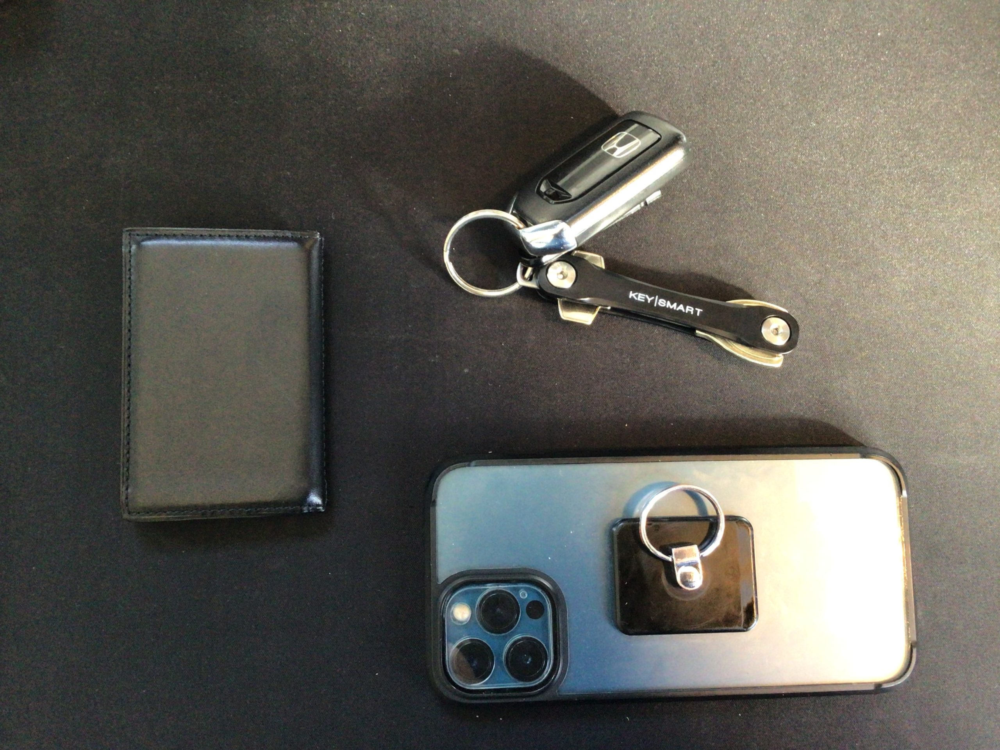

---
categories:
- レビュー
date: Sun, 30 Jan 2022 00:47:33 +0000
slug: post-14285
tags:
- ガジェット
title: 図らずもミニマリスト化「最低限しか入らない財布“PRESSo”とKEYSMART導入」
---

一張羅のユニクロのジーンズが破けました。お尻のポケットに、長財布とiPhone12Pro Maxを合わせて入れてたせいだと思いますが、あり得ない部分が縦に断裂していました。

そこで、財布のサイズを小さくしようと決意。その結果、ミニマリストっぽくなってしまったので本日はそのお話です。
<h2>PRESSoとKEYSMART</h2>
結論からの紹介となりますが、これ両方導入してよかったです。

これが今まで

それがこう

ジーンズの両側のポケットに、一日中一つずつ入れてても全く違和感なく問題ありません。

財布に至っては持って出かけたか心配になって、ハッとするほどです。

今までどれだけ必要以上の物を持ち歩いていたのかを思い知らされます。
<h2>PRESSoとは？</h2>
そもそもPRESSoとは？

YouTuberのmonographの堀口英剛氏とDRESS CODEの平岡雄太氏の会社「株式会社 ドリップ」が販売するキャッシュレス時代の理想の財布です。

主にキャッシュレスを決済を使う人用に、基本現金がほとんど入らず、カードも最低限しか入らないミニマリスト的なサイズとなっています。

[itemlink post_id="14291"]
<h3>なぜPRESSoを買ったのか？</h3>
なぜPRESSoを買ったのか？

答えは簡単です。
<ol>
 	<li>ズボンが破けた</li>
 	<li>現金使わないしカードも不要</li>
 	<li>太ってきた</li>
</ol>
年末にiPhone12Pro Maxと長財布をジーンズのお尻のポケットに合わせて入れて、座ったがために破けてしまった様です。

ジーンズを新しいのを買おうかとも思いましたが、実際に履いてみたりとか買いに行くのがめんどくさかったので、考え方を変えました。太ってきたし。

ズボンは同じもの買うので耐久値が変えられない
体型もすぐに変えられない
財布のサイズは変えられる！

そこで選出したのが、最低限で最小限の財布「PRESSo」というわけです。

YouTubeで毎日見てる人たちが出している商品だし。

ちなみに使ってみてわかりましたが、カードは各ポケットに1枚ずつしか入りません。コイン入れるところも一応ついているけど、100円が3枚くらいしか入りません。さらにお札入れるところも一応はありますが、1枚か2枚くらいしか入りません。

コレに関しては公式にも文言が書いてありますが、本革なので2〜3ヶ月くらいかけながら伸ばしていってねということらしいです。

最終的にはカードは2枚ずつくらい入れられるようになるみたいです。

なので、気長に使っていきたいと思います。
<h2>KEYSMARTとは</h2>
財布はスッキリしたけど、鍵がジャラジャラしてたので鍵もどうにかしたいなと思っていました。そこで、色々と探していたらキーオーガナイザーというものがあることを知りました。

そして、キーオーガナイザーで有名そうなものとしてたどり着いたのが「KEYSMART」です。

鍵を十徳ナイフ的にしまえるものです。鍵本体の穴の部分をネジで止めて、重ねて収納するような機構になっています。

これでキーケースよりもさらにスッキリと最小限のスペースで整理ができるわけです。

キーオーガナイザーにも色々とあるみたいで、他にも価格帯さまざまでいろんなものがありました。

[itemlink post_id="14293"]
<h3>KEYSMART買ってどうだったか</h3>
KEYSMARTはその中でも一番安くて、評価の数も多かったので決めました。

ただ、買ってみてわかったのが、鍵の穴の大きさによっては、そのままつけられない場合があります。手持ちの鍵が一つ、穴が小さくて入りませんでした。そこで、ヤスリでちょっと削ったところ無事装着できました。

また、ネジで止まっていますので、緩むことがたまにあります。数日に一回は閉めないと外れてしまうのではないかと不安になります。

ここは気をつけた方がいいでしょう。

それでも、買って鍵自体がスッキリ持ち運べるので満足しています。
<h2>iPhoneケースもアップデート</h2>
そして、この記事を書いている最中ですが、ふといつものようにiPhoneのケースに取り付けているバンカーリングに指を通そうとすると、いつものように指が通らず、ひっかかってしまいました。

さらに、指を無理やりいれると、サイズが小さい指輪のように外れにくくなってしまいました。

なぜか形が湾曲してしまって、潰れてしまい楕円形になっていました。

ということでバンカーリングもアップデートします。

購入したのがこれ。iring pocket2

カードも入れられて、かつリングもついているというものです。

iPhone側の磁気読み取りと干渉して、Suicaなどやクレカを読み取って誤動作しそうなのが心配です。

ということで、対策。磁気を遮蔽するシートをケース側に接着しました。これで、誤動作も起きないでしょう。

[itemlink post_id="14290"]
<h2><a href="https://twitter.com/s_s_p_y">しんぺー</a>はこう思った。</h2>
色々スッキリさせたら、他の持ち物もどうしようかと考えが至る様になりました。

例えば、通勤時にリュックを使っていますが、これも中身をほぼ使っていないものが入っています。iPadとキーボードだけで十分なのではとか。

で、ちらっと探してみたら、なんと折りたためるメカニカルキーボードというものもあるみたいです。US配列しかないみたいなので、いずれJIS配列のものとかが出たら買うかもです。

と言ったところで本日は以上です。
おやすみなさい。