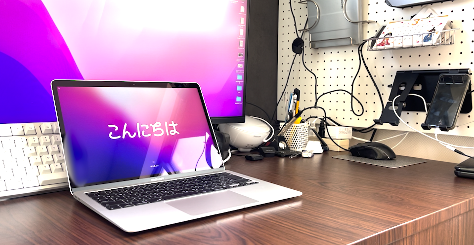
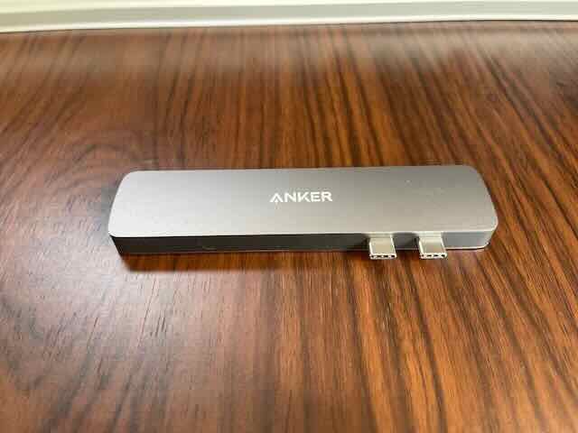
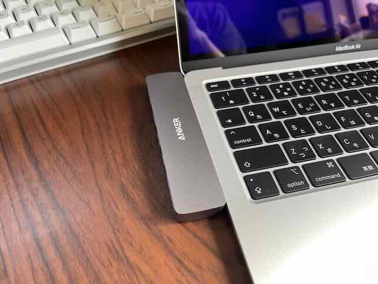

---
categories:
- Mac
date: Sat, 02 Apr 2022 02:08:00 +0000
slug: post-14353
tags:
- mac
title: 【レビュー】M1 MacBook Air「円安だし買うなら今このタイミング」
---

M1 MacBook Airを購入しました。
<h2>なぜ「今」MacBook Airを購入したのか？</h2>

<ul>
 	<li>

理由
</li>
 	<li>

円安
</li>
 	<li>

半導体不足
</li>
</ul>

昨今の円安の影響によるApple製品の価格改定があるんじゃないだろかと予測し、安いうちに買ってしまおうとの決断し、購入に踏み切りました。

価格改定について覚えているのは、過去にアプリが一斉に値上がりしたことがありました。

半導体不足も世界的に深刻なので、数ヶ月後に新型が出ると噂されていますが、それを待たずに購入にいたりました。
<h2>購入したMacのスペック</h2>

今回購入したのは13インチM1 MacBook Air シルバーです。

スペック256GBストレージ
8コアCPU、7コアGPU、16コアNeural Engineを搭載したApple M1チップ
8GBユニファイドメモリ
256GB SSDストレージ¹
True Toneを採用したRetinaディスプレイ
Magic Keyboard Touch ID
感圧タッチトラックパッド
Thunderbolt / USB 4ポート x 2

115,280円（税込）

動画編集とかも十分できるスペックだと聞きましたので、そのまま最低スペックで購入しました。
<h2>【レビュー】本当にM1 MacBook Airは凄いのか？</h2>

結論

M1の凄さを未だ実感するに至っていない
何がすごいのかは具体的にはあまりわかっていない
動画編集とかアプリの切り替えで固まる時は固まる

主な用途はブログ書いたり、動画編集したりです。

ブログ執筆（テキスト入力、画像加工）
Photoshop、Illustratorが動くか？→動く！問題なし

動画編集
Premiere Proが動くか？→動く！問題なし。今までのMac miniだとテキスト入力ですらカクカクしてたのに、ストレスなく軽快に動作する。ただ、ごくたまにカクカクしたり、固まることがあった。

コーディング
DreamWeaverが動くか？→検証はそこまでできていないけど、問題なさそう。

USB-Cが２つだけしかついてないので、USBハブを新しく買いました。噂によると、安いハブを使うと本体が壊れるらしいので、ちゃんとした信頼できるメーカーのものを買うのがいいみたいです。

それ以外にもカバーやケース、充電器などのアクセサリ類も購入検討をしています。その点お金がかかる。

ただ、本体自体は安いし、良い買い物ができたのではないかと思います。

今後長期で使ってみた感想も、書いていきたいと思います。
<h2><a href="https://twitter.com/s_s_p_y">しんぺー</a>はこう思った。</h2>
新しいものはワクワクします。

Mac miniを買った時は壊れるまで使うって思ってましたが、起動ディスク消してしまって起動できなくなったけど、価値があるうちに下取りに出し、新しいものを買うというのも手かなと思いました。

とりあえず元が取れるくらいには使い倒したいと思います。

と言ったところで本日は以上です。
おやすみなさい。