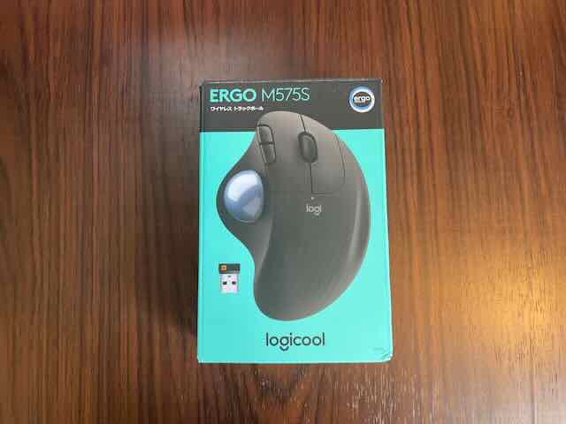
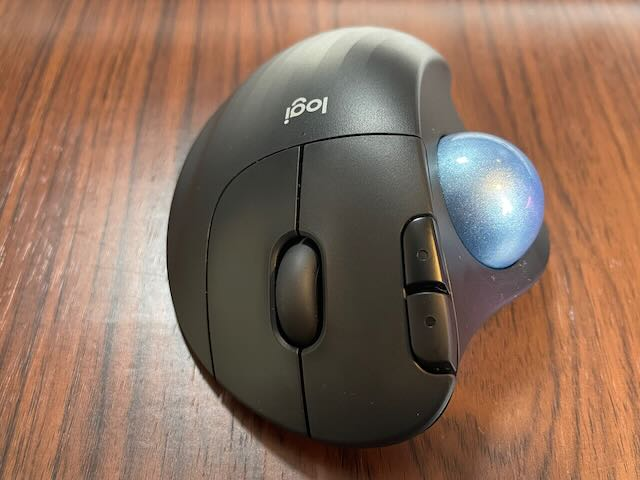
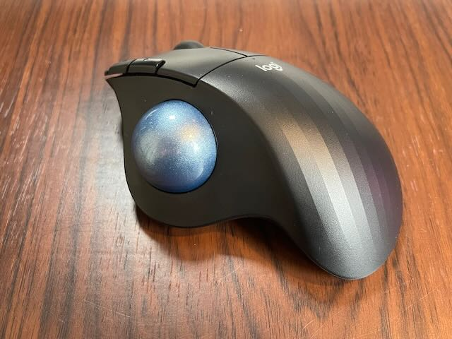
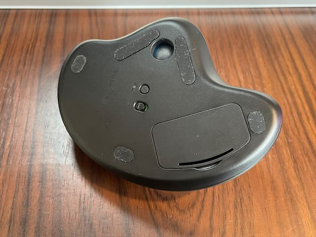
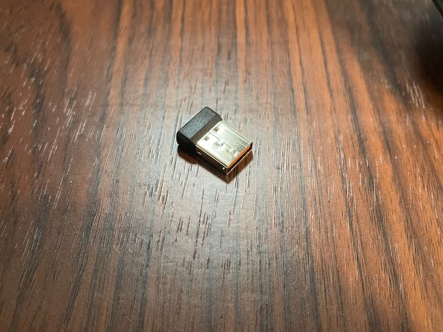

---
categories:
- ガジェット
date: Mon, 04 Apr 2022 02:08:23 +0000
slug: post-14372
tags:
- ガジェット
title: 【レビュー】トラックボールエントリーモデル「M575S」が思ってた以上に使いやすかった
---

Macの新調に伴い、思い切ってトラックボールを導入してみました。

[itemlink post_id="14373"]
<h2>トラックボール導入に際して聞いていたメリット</h2>
トラックボールを愛用している人はこぞって「トラックボールはいいぞ〜」の様なテンションで勧誘してきます。

ネットでもリアルでもそう。

調べてみるとトラックボールには以下の様なメリットがあるらしい。

<ul>
 	<li>手首が疲れにくく、腱鞘炎の改善になる</li>
 	<li>細かい作業をするのに最適</li>
 	<li>範囲指定系の作業は向いてない</li>
 	<li>ゲームには向いてない</li>
</ul>

ということで、トラックボールといえばこれと言われたLogicoolのMX ERGOの下位機種M575Sを購入してみました。メルカリで。
<h2>M575Sはトラックボール導入に最適？</h2>
最初に触ってみた印象です。

慣れるまで時間かかりそう
本当に使いやすいか？

ところが1日ずっと触ってみて

細かい作業に適してるの意味がわかってきた！
使い方わかってきた！慣れたら使いやすいかもしれない！

そう感じる様になりました。

普通のマウスよりも大きいです。

USBのレシーバーがついている

トラックボールで困ることは今のところ何もありません。ゲームもPCじゃやらないし。

マウスパッドやケーブルハンガーみたいなのもいらないし、何よりマウスの場合は動かす余地をデスク上に作らないといけませんが、トラックボールならそれを考慮する必要がありません。

MX ERGOの方がきっと、もっと使いやすいんじゃないかと思いますが、エントリーモデルとしてはM575Sで良かったんじゃないかと思います。

今年もAmazonのプライムデーが来ると思うので、安かったらMX ERGO買っちゃうと思います。

[itemlink post_id="14374"]
<h2>こんな人におすすめ</h2>
割と誰にでもおすすめできるし、慣れれば問題ないんじゃないかなーという気はしますが、パソコンにあまり詳しくないのって人や子どもには向いていないんじゃないかなと漠然と思いました。

そういう人には普通のマウスの方が効率的じゃないかと感じました。

PCの利用頻度が高いような人にはおすすめ！
あとウルトラワイドモニターのように、マウスのポインタの移動距離が長いという時も、トラックボールを使う理由のひとつになるんじゃないかと思います！
<h2><a href="https://twitter.com/s_s_p_y">しんぺー</a>はこう思った。</h2>
デスク上のケーブルが少なくなったし、スペースの削減もできたのでスッキリしました！

と言ったところで本日は以上です。
おやすみなさい。
[itemlink post_id="14373"]